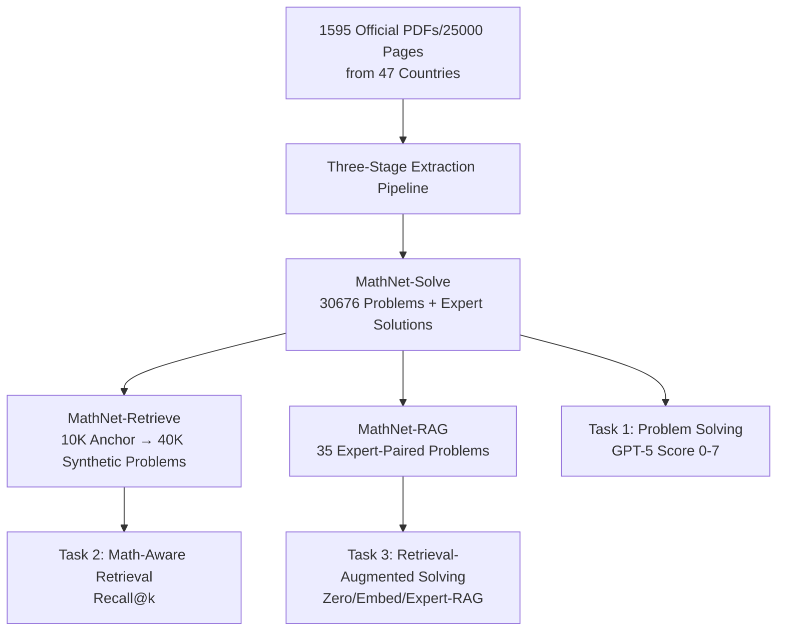

# MathNet: A Global Multimodal Benchmark for Mathematical Reasoning and Retrieval

**Conference**: ICLR 2026  
**OpenReview**: [https://openreview.net/forum?id=zPvdG1Va5Q](https://openreview.net/forum?id=zPvdG1Va5Q)  
**Code**: [mathnet.mit.edu](https://mathnet.mit.edu)  
**Area**: Multimodal Mathematical Reasoning / Mathematical Retrieval / Evaluation Benchmark  
**Keywords**: Olympiad Math, Multilingual, Math-Aware Retrieval, RAG, Benchmark  

## TL;DR
MathNet constructs the largest Olympiad-level math problem database to date (30K+ problems, 47 countries, 17 languages, spanning 40 years of official exams). It introduces "math-aware retrieval" as an independent task and provides benchmarks for problem-solving, retrieval, and retrieval-augmented generation (RAG), revealing that frontier models remain severely limited in geometry, discrete mathematics, and identifying mathematical equivalence.

## Background & Motivation
**Background**: LLMs/LMMs have progressed rapidly in mathematical reasoning, advancing from primary school arithmetic to achieving IMO gold medal levels. However, the benchmarks used to measure these advancements significantly lag behind.

**Limitations of Prior Work**: Existing Olympiad-level datasets (e.g., OlympiadBench, Omni-Math, IneqMath) are mostly scraped from community platforms like AoPS, covering only a few competitions from the US and China. They suffer from three main flaws: (i) scarcity of expert solutions, (ii) lack of high-difficulty multilingual/multimodal content, and (iii) almost no research on "mathematical problem retrieval."

**Key Challenge**: Progress in mathematics often relies on "identifying shared structures across different problems." Current retrieval systems only perform semantic paraphrase matching and are insensitive to symbolic equivalence. For example, $x^2+y^2=1$ is essentially equivalent to $\sqrt{a^2+b^2}=1$ and the unit vector set $|u|^2=1$, but not to $x+y=1$. Existing embeddings often judge $x+y=1$ as closer due to surface lexical overlap. This "math-aware retrieval" is a critical pain point for identifying duplicate IMO problems and a necessity for mathematicians retrieving by concept rather than specific formulas.

**Goal**: To provide a large-scale, multilingual, multimodal Olympiad problem database with expert solutions and expand it into an evaluation platform for three types of tasks, systematically quantifying the gap between "solving problems" and "identifying relevant problems."

**Core Idea**: **[Dataset]** Uses only official competition booklets (not community scraping) to ensure expert-level quality. **[New Task]** Proposes "math-aware retrieval," requiring models to identify symbolic equivalence rather than surface similarity. **[Three-Task Closed Loop]** Integrates "Solving $\to$ Retrieval $\to$ RAG" using the same database to verify how retrieval quality benefits reasoning.

## Method

### Overall Architecture
MathNet consists of a data construction pipeline and three evaluation datasets. The pipeline converts 1,595 official competition PDFs (25,000+ pages) from 47 countries into aligned "problem-solution" pairs. From this, three datasets are derived: MathNet-Solve (solving), MathNet-Retrieve (retrieval), and MathNet-RAG (retrieval-augmented solving), corresponding to three tasks and evaluation metrics.

### Key Designs

**1. Three-Stage LLM Extraction Pipeline: From Heterogeneous PDFs to Aligned Pairs.** Competition booklets from different countries vary wildly in format—some separate problems and solutions into different chapters, while others interleave them. Rule-based parsing is fragile. MathNet designed a three-stage pipeline: First, dots-ocr converts all booklets to Markdown. Stage 1 uses Gemini-2.5-Flash for document segmentation and boundary detection, outputting only line numbers while recording source page numbers for traceability. Stage 2 extracts corresponding segments and uses GPT-4.1 for LaTeX formatting to resolve cross-chapter problem-solution linking. Stage 3 performs triple verification: normalized text similarity (ensuring no hallucinations), GPT-4.1 as a judge against page screenshots (checking for OCR errors or incomplete solutions), and manual review of low-confidence samples. Only samples with consensus from all three are kept, resulting in 30,676 high-quality pairs.

**2. Fine-grained Taxonomy for Mathematical Similarity.** This is the conceptual foundation of the retrieval task. MathNet categorizes problem relevance into three levels: **Invariance** refers to strict equivalence under transformation (syntax renaming, algebraic rewriting, geometric re-characterization, cross-domain isomorphism); **Resonance** refers to partial similarity where different problems share the same reasoning logic, proof strategy, or structural analogy (generalization, shared lemmas, structural reduction); **Affinity** refers to broad thematic associations without structural equivalence (e.g., both belonging to number theory or geometry).

**3. Constructing Retrieval Benchmarks with Adversarial Samples.** MathNet-Retrieve selects 10,000 anchor problems from MathNet-Solve. For each, GPT-5 generates **1 equivalent positive example + 3 difficult negative examples**, totaling 40,000 synthetic problems. Equivalent positives are created via variable renaming ($x \to a$) or algebraic transformations (e.g., $f(x)+f(y)=f(x+y)$ rewritten as $g(a)-g(a+b)=-g(b)$). Difficult negatives maintain most surface forms but change the underlying mathematics (e.g., changing it to $f(x^2)+f(y)=f(x-y)$). These "proximal distractors" target the limitations of models relying on lexical overlap.

**4. Evaluating RAG via Expert-Paired Real Problems.** MathNet-RAG uses 35 pairs of "Structural Resonance" problems manually matched by experts from real Olympiads (e.g., a China TST problem and a Russian problem sharing the same lemma about products of consecutive integers). Evaluation includes: Zero-Shot (target problem only), Embed-RAG (retrieving one related problem using gemini-embedding-001 with its solution as context), and Expert-RAG (using the expert-paired problem). The gap between Zero and Embed measures "gain from embedding retrieval," while the gap between Embed and Expert measures "performance limited by retrieval error."

## Key Experimental Results
Evaluation covers 27 SOTA models. Problem solving is scored 0–7 by GPT-5 ($\ge 6$ is correct), retrieval uses Recall@k, and RAG uses joint Human+LLM evaluation.

### Main Results: Problem Solving (MathNet-Solve-Test, 6400 Problems)

| Model | Algebra | Number Theory | Geometry | Discrete | Macro Avg |
|---|---|---|---|---|---|
| gemini-3.1-pro-preview | 83.7 | 82.2 | 74.6 | 75.6 | **78.4** |
| gemini-3-flash-preview | 77.7 | 73.3 | 67.0 | 64.0 | 70.4 |
| gpt-5 | 80.3 | 73.6 | 61.1 | 65.3 | 69.3 |
| claude-opus-4.6 | 53.2 | 44.6 | 44.3 | 36.4 | 45.7 |
| gemini-2.5-flash | 50.5 | 42.6 | 36.8 | 31.0 | 41.1 |
| DeepSeek-V3.2 | 51.6 | 45.3 | 32.2 | 32.7 | 40.1 |
| DeepSeek-R1 | 46.1 | 39.5 | 31.2 | 27.3 | 36.3 |
| ministral-3B | 6.4 | 2.9 | 4.3 | 1.7 | 4.4 |

Algebra is the easiest (top models 80%+), while geometry and discrete math are the most difficult (GPT-5 achieves only 56.3% in geometry). The gap between top and bottom models is as high as 72.7 points.

### Retrieval Experiments (MathNet-Retrieve, 10,000 Anchors)

| Embedding Model | R@1(All) | R@5(All) |
|---|---|---|
| gemini-embedding-001 | 4.83 | **68.88** |
| qwen3-embedding-4B | 4.96 | 64.95 |
| all-mpnet-base-v2 | 3.78 | 57.70 |
| text-embedding-3-large | 2.74 | 54.23 |
| text-embedding-3-small | 1.98 | 35.49 |

Even for the strongest embeddings, Recall@1 is only approximately 5%. Counter-intuitively, **cosine similarity for non-equivalent pairs is often higher than for equivalent pairs**, indicating that embeddings capture surface lexical/symbolic overlap rather than true structural relationships.

### Retrieval-Augmented Solving (MathNet-RAG, Human Scoring)

| Model | Zero-shot | Embed-RAG | Expert-RAG |
|---|---|---|---|
| DeepSeek-V3.2-Speciale | 84.8 | 89.5 | **97.3** |
| GPT-5 | 76.8 | — | 86.6 |
| Claude-4.5-Opus | 46.8 | 55.5 | 52.4 |
| oLMO-3-Think | 45.2 | 54.6 | 47.6 |

### Key Findings
- **Solving $\gg$ Retrieval**: Models achieve up to 78% in solving, yet the R@1 for identifying equivalent problems is only 5%. "Knowing how to solve" is not equivalent to "identifying related structures."
- **RAG Gain Highly Depends on Retrieval Quality**: RAG is only effective when retrieved samples are truly structurally aligned; Embed-RAG underperforms because embeddings often return "proximal distractors" that introduce noise. Expert-RAG pushes DeepSeek-V3.2 to 97.3%.
- **Geometry and Discrete Math represent significant weaknesses** even for frontier reasoning models.

## Highlights & Insights
- **Data Purity**: Using only official booklets and avoiding community scraping ensures expert-level quality and reduces the risk of online data contamination.
- **Formalizing Math-Aware Retrieval**: The discovery that "similarity of non-equivalent pairs is higher than equivalent pairs" highlights a fundamental blind spot in current embeddings—they understand semantic paraphrasing but not symbolic equivalence.
- **Closed-loop Design**: Integrating solving, retrieval, and RAG isolates the relationship between retrieval quality and reasoning gains.
- **Global and Multimodal**: Encompassing 47 countries, 17 languages, and diagram-based problems, it far exceeds previous benchmarks focused on English and Chinese.

## Limitations & Future Work
- **Small Scale of MathNet-RAG**: Limited to 35 expert-paired problems (70 total), leading to high statistical standard errors in manual scoring (~±8%).
- **Reliance on GPT-5 for Synthetic Samples**: Retrieval samples are generated by a single model, which may introduce model-specific biases; identifying equivalence/non-equivalence has not been fully manually verified.
- **LLM-as-a-Judge**: Relying on GPT-5 for scoring problem solving may favor solutions similar to the judge's style.
- **Lack of Pre-trained "Math Structure Embeddings"**: The paper identifies the gap but leaves the training of math-aware embeddings to future work.

## Related Work & Insights
- **Textual Math Benchmarks**: GSM8K, MATH, Omni-MATH—limited in scale, language, or structural labeling.
- **Multimodal Math Benchmarks**: MATH-Vision and MathVista introduce diagrams but are not at the Olympiad level.
- **Formula-aware Retrieval**: Earlier work (Zanibbi, Das) focused on formula-level matching before the LLM era, missing high-level conceptual/structural similarity. MathNet's insight is to use "taxonomy + adversarial negatives" as a yardstick for structural understanding, applicable to code or theorem bank retrieval.

## Rating
- **Novelty**: ⭐⭐⭐⭐⭐ First to establish "math-aware retrieval" as a formal task with benchmarks; the finding on embedding similarity is highly insightful.
- **Experimental Thoroughness**: ⭐⭐⭐⭐ Covers 27 models across three tasks and multiple languages/modalities; the RAG subset is somewhat small.
- **Writing Quality**: ⭐⭐⭐⭐ Clear motivation, design, and conclusions; well-illustrated pipeline.
- **Value**: ⭐⭐⭐⭐⭐ Provides the largest high-quality Olympiad database and the first math retrieval benchmark, offering long-term value for reasoning, retrieval, and RAG.

<!-- RELATED:START -->

## Related Papers

- [\[CVPR 2026\] RMIR: A Benchmark Dataset for Reasoning-Intensive Multimodal Image Retrieval](../../CVPR2026/vlm_reasoning/rmir_a_benchmark_dataset_for_reasoning-intensive_multimodal_image_retrieval.md)
- [\[ICLR 2026\] We-Math 2.0: A Versatile MathBook System for Incentivizing Visual Mathematical Reasoning](we-math_20_a_versatile_mathbook_system_for_incentivizing_visual_mathematical_rea.md)
- [\[ICLR 2026\] PuzzleWorld: A Benchmark for Multimodal, Open-Ended Reasoning in Puzzlehunts](puzzleworld_a_benchmark_for_multimodal_open-ended_reasoning_in_puzzlehunts.md)
- [\[ICLR 2026\] GIR-Bench: Versatile Benchmark for Generating Images with Reasoning](gir-bench_versatile_benchmark_for_generating_images_with_reasoning.md)
- [\[ICLR 2026\] JointAVBench: A Benchmark for Joint Audio-Visual Reasoning Evaluation](jointavbench_a_benchmark_for_joint_audio-visual_reasoning_evaluation.md)

<!-- RELATED:END -->
