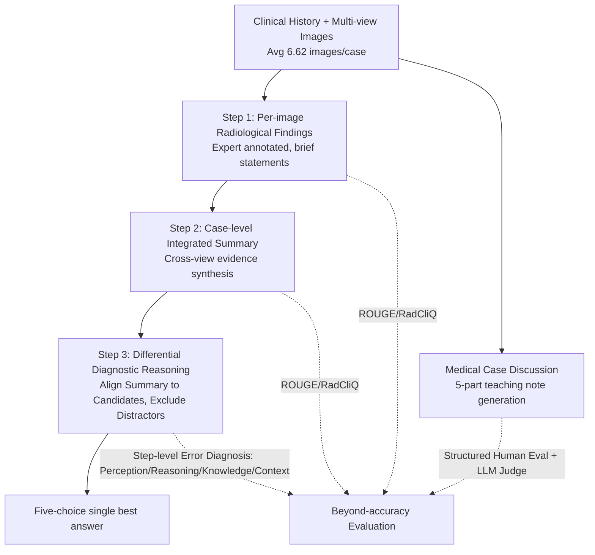

# Medical Thinking with Multiple Images

**Conference**: ICLR 2026  
**OpenReview**: [https://openreview.net/forum?id=h2p5eOFpcF](https://openreview.net/forum?id=h2p5eOFpcF)  
**Code**: [https://github.com/benluwang/MedThinkVQA](https://github.com/benluwang/MedThinkVQA)  
**Dataset**: [https://huggingface.co/datasets/bio-nlp-umass/MedThinkVQA](https://huggingface.co/datasets/bio-nlp-umass/MedThinkVQA)  
**Area**: Multimodal Reasoning / Medical VLM / Benchmark  
**Keywords**: Multi-image diagnostic reasoning, think-with-images, medical VQA, cross-view evidence fusion, beyond-accuracy evaluation  

## TL;DR
This paper introduces MedThinkVQA—the first expert-annotated multi-image medical diagnostic reasoning benchmark, averaging 6.62 images per case. Through a three-step "Think-with-Images" supervision and beyond-accuracy step-level evaluation, it reveals that the true bottleneck for current top-tier multimodal large models is not the length of the reasoning chain, but the ability to "extract-align-compose" visual evidence across multiple views.

## Background & Motivation
**Background**: Scores of LLMs/VLMs on various medical QA benchmarks have been rising steadily, with many exam-style settings nearing saturation. However, existing medical multimodal benchmarks are almost exclusively "single-image, single-question"—benchmarks like VQA-Rad, PMC-VQA, OmniMedVQA, and even the latest MedXpertQA-MM have an average of $\le 1.43$ images per case.

**Limitations of Prior Work**: Real-world clinical diagnosis never involves looking at a single image to answer a single question. Doctors first read clinical histories and then examine multiple views (e.g., X-ray + CT + MRI) to integrate evidence across images before converging on a differential diagnosis. High-accuracy "final answers" may mask frequent failures in image understanding and cross-view integration—essentially being "right for the wrong reasons."

**Key Challenge**: Existing benchmarks neither force models to perform true cross-view evidence aggregation (due to too few images or text shortcuts) nor can they pinpoint whether a failure occurred during "image reading," "cross-view fusion," or "high-level reasoning" (providing only a single accuracy metric).

**Goal**: Construct a benchmark that evaluates diagnosis in a clinically authentic manner—utilizing multiple informative views, explicit intermediate reasoning supervision, and step-level localizable evaluation—to make the diagnostic process **observable** rather than just focusing on the endgame.

**Core Idea**: **[Think-with-Images Three-step Supervision]** Decomposes diagnosis into three explicitly supervised steps: "finding per image → case-level integrated summary → differential diagnostic reasoning"; **[Beyond-accuracy Evaluation]** Uses automatic metrics (ROUGE/RadCliQ) + structured step-level error diagnosis + educational value scoring to localize failures; **[Image-dense + Expert-annotated Corpus]** 8,067 cases with an average of 6.62 images/case, all sourced from expert-reviewed real radiology teaching cases.

## Method

### Overall Architecture
MedThinkVQA is adapted from **Eurorad**, a peer-reviewed teaching library of the European Society of Radiology. Each case includes clinical history, a collection of multiple images (avg. 6.62), radiologist annotations per image, case-level integrated findings summaries, expert reasoning and teaching notes, and a list of final and differential diagnoses. The data is designed around "Think-with-Images (TwI)": explicitly decomposing diagnosis into three supervised steps paired with a diagnostic evaluation system that goes beyond mere accuracy.

### Key Designs

**1. Think-with-Images Three-step Diagnostic Supervision: Unpacking the "Black-box Diagnosis" into a Supervised Evidence Chain.** Models are required to first produce radiological findings per image (detecting and naming key signs), then integrate cross-view evidence into a single case-level summary, and finally perform differential reasoning—aligning the summary with candidate diagnoses and excluding distractors using image-based arguments. This decomposition shifts the focus from "only evaluating the final answer" to "inspecting every step," allowing bottlenecks to be precisely attributed to the "image reading" phase. Each case is presented as a five-choice Multiple Choice Question (MCQ), where the ground truth is the final clinical diagnosis.

**2. Shortcut-resistant Test Set Construction: Forcing Models to Use Images Rather Than Textual Gaps.** To ensure images are necessary, the test set underwent multiple filtering stages: (i) Only cases with $\ge 5$ expert differential diagnoses were retained; (ii) Leakage detection removed 137 cases where the diagnosis or synonyms appeared in the clinical history; (iii) Text-solvability filtering—1,074 cases solvable by four large text models were removed, followed by a secondary check using four SFT small models (removing 180 more); (iv) Surface bias elimination—addressing the "longest option" bias and rebalancing ICD disease categories and imaging modality distributions.

**3. Beyond-accuracy Diagnostic Evaluation: Localizing Failures to Specific Stages.** Steps 1 and 2 utilize ROUGE (lexical overlap) and RadCliQ (radiologist preference-aligned) against expert findings/summaries. Step 3 uses GPT-5-mini to decompose model explanations into atomic steps, with GPT-5 acting as a judge to label "Factual Correctness," "Criticality," and "Error Category (Clinical Context, Image Understanding, Medical Knowledge, Reasoning)." Human evaluation by two medical experts on 202 steps across 50 cases showed Image Understanding Errors dominate (Cohen's $\kappa=0.82$), with high human-LLM judge consistency ($\kappa=0.70\sim0.84$).

**4. Controlled Input Ablation: Directly Proving the Bottleneck is "Perception" Not "Thinking."** Control experiments were designed: feeding models expert-written radiological text (per-image hints / integrated summaries) vs. having models generate them before use. Providing expert integrated summaries caused accuracy to surge by +41.5 to +50.5 points (1.92× to 2.60× baseline); conversely, using model-generated intermediate text generally led to score drops (up to -12.5). This confirms that once visual evidence is correctly verbalized, remaining linguistic reasoning is largely sufficient, identifying the core obstacle as extracting and structuring pixel-level radiological evidence.

## Key Experimental Results

### Main Results (Test set of 720 cases, five-choice, 20% random baseline)

| Model | Accuracy | Type |
|------|--------|------|
| Claude-4.6-Opus | **57.2%** | Closed-source thinking |
| Gemini-3-Pro | 55.3% | Closed-source thinking |
| GPT-5.2-xhigh | 54.9% | Closed-source thinking |
| GPT-5.2 (non-think) | 49.9% | Closed-source |
| Qwen3.5-397B-A17B | 52.2% | Strongest Open-source MoE |
| Qwen3.5-27B | 50.6% | Open-source |
| Lingshu-32B | 43.2% | Open-source Medical |
| InternVL3.5-38B | 40.7% | Open-source |
| GPT-5-mini | 39.7% | Closed-source small |
| MedGemma-27B | 31.8% | Open-source Medical |
| GPT-5-nano | 30.8% | Closed-source small |
| Phi-4 | 22.2% | Open-source |

The strongest models reach only ~57%, far below clinician levels on the expert-reviewed subset, indicating significant headroom.

### Ablation Study (Expert Radiological Text vs. Self-generated)

| Setting | Impact on Accuracy | Meaning |
|------|--------------|------|
| + Expert Integrated Summary | +41.5 to +50.5 pts (Up to 2.60×) | Reasoning is sufficient if perception is verbalized |
| + Expert Per-image Hints (with Summary) | Only +0.5 to 5.0 pts | Structured summary > caption-style descriptions |
| Self-produced Hint/Summary usage | −3.0 to −12.5 pts | Low ROUGE-L (≈0.13–0.16) for self-gen; noise misleads |
| Inference-time thinking | +5 to 7 pts (GPT-5.2 49.9→54.9) | Helpful but does not eliminate core difficulty |

### Key Findings
- **The bottleneck is "Perception" not "Thinking"**: Step-level analysis shows $>70\%$ of errors stem from image reading and cross-view integration; image understanding errors account for 69.23% of critical step failures.
- **Reasoning is a Conditional Gain**: Accuracy increases monotonically with image count and reasoning tokens, but extra reasoning budget only helps when the "visual evidence base" is reliable—noisy perception can cause longer reasoning to amplify misinterpretations.
- **Benchmark Truly Tests Multi-image Utility**: Expert audits show 88.05% of images support the final diagnosis. The test set averages 2.30 modalities per case, and 30.4% are longitudinal follow-up cases.

## Highlights & Insights
- **Qualitative Shift in Image Density**: Jumping from $\le 1.43$ images/case to 6.62 images/case ($\ge 4.5\times$) transforms the task from "finding a clue in one image" to "integrating distributed evidence across views, modalities, and time"—a true clinical paradigm shift.
- **Precise Diagnostic Claims**: Using controlled input ablation and step-level error diagnosis, the paper narrows the vague notion of "weak medical diagnosis in LLMs" into a falsifiable, actionable diagnosis: models are weak at grounding, not necessarily at reasoning length.
- **Observability Design**: The three-step supervision and step-level attribution upgrade the benchmark from a "scorer" to a "diagnostic tool," informing researchers exactly where models fail.
- **Completeness**: MedThinkVQA is the only benchmark in its comparison table to satisfy all criteria: expert annotation, real clinical scenarios, multi-modal imaging, longitudinal follow-up, TwI supervision, and beyond-accuracy evaluation.

## Limitations & Future Work
- **Single Data Source**: All data comes from the Eurorad library; cases may lean toward "pedagogically valuable/classic/difficult," potentially deviating from routine clinical distributions.
- **LLM Judge Dependency**: Step-level error diagnosis relies on GPT-5 series; while calibrated with human eval, the judge's own biases may affect error attribution.
- **Lack of a Solution**: The paper focuses on diagnosing the bottleneck rather than solving it; how to improve cross-view grounding remains for future work.
- **MCQ Constraints**: While convenient for evaluation, the five-choice format is still a step removed from open-ended clinical diagnosis.

## Related Work & Insights
- **Comparison with Medical Multimodal Benchmarks**: Unlike single-image benchmarks like PMC-VQA or OmniMedVQA, this work redefines task difficulty via multi-image integration. It advances beyond MedFrameQA (3.24 images) in both image density and supervision.
- **Alignment with Beyond-accuracy Evaluation**: Follows the evolution of radiology report evaluation (e.g., RadCliQ), emphasizing that answer-level scoring masks clinical reasoning failures.
- **Inspiration**: (1) For any "think-with-images" task, verify visual evidence extraction before extending reasoning chains—inference-time scaling is a secondary lever. (2) Self-generated intermediate representations are a liability when grounding is unreliable. (3) Benchmark design must actively eliminate surface shortcuts (option length bias, text-only solvability).

## Rating
- **Novelty**: ⭐⭐⭐⭐⭐ First truly image-dense (6.62 images/case), expert-annotated benchmark with three-step TwI supervision and beyond-accuracy metrics.
- **Experimental Thoroughness**: ⭐⭐⭐⭐⭐ Covers 20+ models with controlled input ablations, human-verified step-level analysis ($\kappa=0.82$), and cross-axis scaling analysis.
- **Writing Quality**: ⭐⭐⭐⭐ Logical argumentation with falsifiable claims; information-dense tables.
- **Value**: ⭐⭐⭐⭐⭐ Precisely diagnoses the grounding bottleneck for the medical VLM community and provides an open, highly reusable infrastructure.

<!-- RELATED:START -->

## Related Papers

- [\[ICLR 2026\] DeepEyes: Incentivizing "Thinking with Images" via Reinforcement Learning](deepeyes_incentivizing_thinking_with_images_via_reinforcement_learning.md)
- [\[CVPR 2026\] Thinking with Programming Vision: Towards a Unified View for Thinking with Images](../../CVPR2026/vlm_reasoning/thinking_with_programming_vision_towards_a_unified_view_for_thinking_with_images.md)
- [\[ICLR 2026\] Thyme: Think Beyond Images](thyme_think_beyond_images.md)
- [\[ICLR 2026\] MedVR: Annotation-Free Medical Visual Reasoning via Agentic Reinforcement Learning](medvr_annotation-free_medical_visual_reasoning_via_agentic_reinforcement_learnin.md)
- [\[ICLR 2026\] GIR-Bench: Versatile Benchmark for Generating Images with Reasoning](gir-bench_versatile_benchmark_for_generating_images_with_reasoning.md)

<!-- RELATED:END -->
