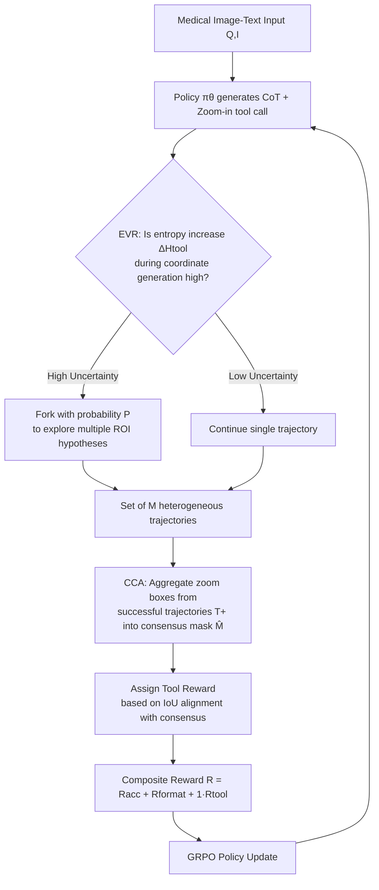

# MedVR: Annotation-Free Medical Visual Reasoning via Agentic Reinforcement Learning

**Conference**: ICLR 2026  
**OpenReview**: [https://openreview.net/forum?id=cK35kNVm5r](https://openreview.net/forum?id=cK35kNVm5r)  
**Code**: To be confirmed  
**Area**: Multimodal VLM / Medical Visual Reasoning  
**Keywords**: Medical VLM, Visual Reasoning, Tool Calling, Reinforcement Learning, GRPO, Annotation-Free Supervision, Entropy-Guided Exploration  

## TL;DR
MedVR trains medical VLMs as agents capable of "zooming in" to examine images. It utilizes Entropy-guided Visual Relocation (EVR) to identify moments for re-examining images and Consensus-guided Credit Assignment (CCA) to automatically generate pseudo-labels for visual grounding from multiple successful trajectories. **Without requiring any manual annotation for intermediate steps**, it achieves SOTA performance on 6 medical VQA benchmarks.

## Background & Motivation
- **Background**: Reinforcement Learning from Verifiable Rewards (RLVR) has significantly enhanced the reasoning capabilities of general VLMs. Naturally, the medical community seeks to adapt this to empower medical VLMs (e.g., Med-R1, MedVLM-R1).
- **Limitations of Prior Work**: Most existing medical RLVR methods operate almost entirely in the **pure text domain** for chain-of-thought (CoT) reasoning. However, clinical diagnosis—such as localizing small lesions, comparing tissue densities, interpreting blood flow, or quantifying anatomical structures—inherently requires fine-grained visual grounding, which pure text CoT cannot provide. Furthermore, text-only reasoning is prone to **visual hallucinations**, where models fabricate answers based on linguistic priors while ignoring the image—a risk that is unacceptable in safety-critical medical scenarios.
- **Key Challenge**: While the general domain has tool-augmented reasoning frameworks like DeepEyes or Pixel-Reasoner that can "zoom in," adapting them to medicine faces two challenges: (1) General VLMs lack medical domain knowledge, making zero-shot localization of subtle lesions unreliable; (2) Learning meaningful visual grounding typically requires **fine-grained supervision of intermediate steps**, but medical bounding box (bbox) annotations are extremely expensive and scarce, creating a paradox: "supervision is needed to learn, but supervision is unavailable."
- **Goal**: To achieve **annotation-free medical visual reasoning**—enabling models to naturally interleave textual deliberation with image operations (zooming, setting ROI) like a clinician, where every critical step of analysis is supported by verifiable visual evidence, without relying on any intermediate step annotations.
- **Core Idea**: **Use the model's own uncertainty as an exploration signal for "where to look," and use the consensus among multiple successful trajectories as a supervision signal for "whether it looked at the right place."** These two mechanisms form a fully self-supervised visual reasoning curriculum, bypassing the need for expensive manual grounding annotations.

## Method

### Overall Architecture
MedVR treats the VLM as an agent following a policy $\pi_\theta$, optimized using GRPO for expected cumulative rewards (with KL constraints). The agent's action space includes generating CoT tokens and invoking a `Zoom-in` tool to crop specific image regions. The cropped visual evidence is encoded into special tokens and fed back into the context to condition subsequent reasoning. Training is driven by two annotation-free mechanisms: **EVR** (Prior Explorer) identifies when the model is uncertain about where to look based on token entropy spikes during tool coordinate generation, branching into multiple parallel trajectories. **CCA** (Posterior Distiller) aggregates zoom-in boxes from successful trajectories into a consensus heatmap, serving as a self-generated pseudo-label to reward trajectories that "looked at the right place."

### Key Designs

**1. Composite Terminal Reward: Decoupling "Correct Answer" from "Correct Look" while keeping them linked.** In the absence of step-by-step supervision, the reward must provide a global evaluation at the end of the trajectory. MedVR designs $R(T) = R_{\text{acc}}(T) + R_{\text{format}}(T) + \mathbb{1}(R_{\text{acc}}(T) > 0) \cdot R_{\text{tool}}(T)$. The primary reward focuses on the final answer, while a small format penalty constrains output validity. Crucially, the tool reward $R_{\text{tool}}$ is gated by an indicator function—**only trajectories with correct answers are eligible for tool rewards.** This conditional structure forces the model to discover causal relationships between "visual actions" and "successful outcomes," thereby suppressing speculative tool calls that zoom in randomly without benefit.

**2. Entropy-guided Visual Relocation (EVR): Letting uncertainty signal the need to "re-examine the image."** The core premise is that an entropy spike when generating `Zoom-in` coordinate tokens indicates the model knows it needs to look at the image but is uncertain about which ROI to select. MedVR monitors token-level entropy $H_t = -\sum_j p_{t,j}\log p_{t,j}$. It calculates a baseline entropy $H_{\text{base}}$ on the starting tokens and rolling entropy $H_{\text{tool}}$ over a window of tool-related tokens, tracking the entropy increase $\Delta H_{\text{tool}} = H_{\text{tool}} - H_{\text{base}}$. When $\Delta H_{\text{tool}}$ is significantly positive, **adaptive branching** is triggered with probability $P = P_{\text{base}} + \gamma \Delta H_{\text{tool}}$. This forks the generation state to explore multiple visual hypotheses where the model is least confident. Half of the rollout budget is allocated to the base set and the other half to this targeted exploration, resulting in $M$ heterogeneous trajectories.

**3. Consensus Credit Assignment (CCA): Generating pseudo-labels through "Wisdom of the Crowd."** After EVR produces diverse trajectories, the challenge is rewarding beneficial intermediate visual actions without Ground Truth (GT) spatial annotations. CCA assumes that if multiple distinct reasoning paths arrive at the correct answer and repeatedly examine the same image region, that region is likely the causally relevant evidence. It takes the subset of successful trajectories $T^+$, rasterizes the union of all `Zoom-in` boxes in each trajectory into a binary mask $M_i$, and aggregates them into a consensus heatmap $C = \sum_{T_i \in T^+} M_i$. A consensus mask is derived via majority vote $\hat{M}(u,v) = \mathbb{1}(C(u,v) > |T^+|/2)$. Each successful trajectory is then rewarded based on its IoU with the consensus: $R_{\text{tool}}(T_j) = 1.0$ if $\text{IoU}(M_j, \hat{M}) > \eta$, else $0.5$. This hierarchical structure gives a base score for being "correct" and an extra reward for "correctness with alignment to the collective consensus"—rewarding not just the result, but the **verifiability and consistency** of the visual process.

## Key Experimental Results

### Main Results
Using Qwen2.5-VL-7B as the backbone and GRPO training for 64 rounds (32×H20), tested on 6 medical VQA benchmarks (†/⋄ indicate OOD zero-shot):

| Model | OMVQA | PMC-VQA⋄ | MedXQA⋄ | General Avg. | VQA-RAD | SLAKE | PathVQA⋄ | Modality Avg. |
|------|-------|----------|---------|-----------|---------|-------|----------|-----------|
| Qwen2.5-VL-7B | 59.0 | 51.2 | 22.3 | 44.2 | 64.5 | 67.2 | 44.1 | 58.6 |
| InternVL3-14B | 81.9 | 54.1 | 23.1 | 53.0 | 66.3 | 72.8 | 48.0 | 62.4 |
| MedGemma-4B | 70.5 | 49.9 | 15.4 | 45.3 | 72.5 | 76.4 | 48.8 | 65.9 |
| Lingshu-7B | 84.2 | 54.3 | 26.5 | 55.0 | 67.9 | 83.1 | 61.9 | 70.3 |
| **MedVR (Ours)** | **96.8** | 54.3 | 26.4 | **59.2** | **74.4** | **85.3** | **62.3** | **74.0** |

MedVR achieves SOTA or competitive performance across both multiple-choice and free-text tasks, with notable OOD generalization. At 7B scale, it outperforms domain-specific large-scale pretrained models like Lingshu-7B and larger models like InternVL3-14B.

### Ablation Study
Stepwise addition of the three core components (starting from a text RL baseline):

| Zoom-in | EVR | CCA | OmniMedVQA | PMC-VQA | MedXpertQA |
|---------|-----|-----|-----------|---------|------------|
| — | — | — | 94.50 | 53.40 | 21.38 |
| ✓ | — | — | 94.31 | 52.62 | 22.26 |
| ✓ | ✓ | — | 95.38 | 53.81 | 24.73 |
| ✓ | — | ✓ | 96.55 | 53.30 | 23.09 |
| ✓ | ✓ | ✓ | **96.77** | **54.31** | **26.38** |

### Key Findings
- **Raw Tool Usage can degrade performance**: Adding Zoom-in without EVR/CCA leads to slight performance drops on OmniMedVQA/PMC-VQA, indicating that VLMs lack the zero-shot ability to effectively use new tools; without reward/exploration signals, tools introduce noisy search paths.
- **EVR targets OOD, CCA targets in-domain**: EVR provides the largest gain on OOD benchmarks (improving robust generalization), while CCA contributes most to the in-domain OmniMedVQA (strengthening reliable grounding). Their synergy yields the best overall performance.
- **Entropy Weight $\gamma$ Sweet Spot**: When $\gamma=0$, the system degrades to random sampling. Performance rises monotonically until $\gamma=0.5$, then declines as excessive greediness suppresses exploration diversity.
- **Clear Reward Hierarchy**: w/o Tool Reward < Unconditional < Default (linked to accuracy) < CCA (cross-trajectory consensus reward). This confirms that rewarding a reproducible visual process is more effective than rewarding results alone.
- **Scalability**: Higher rollout counts allow CCA to distill more reliable pseudo-supervision, leading to continuous accuracy improvements.

## Highlights & Insights
- **Complementary Uncertainty and Consensus**: Using "uncertainty" for exploration and "group consensus" for supervision is naturally complementary—one solves "where to look" (prior), the other solves "did it look correctly" (posterior). Together, they elegantly replace missing intermediate step annotations.
- **Truly Annotation-Free**: Scarcity of medical bbox annotations is a major industry pain point. MedVR bypasses this bottleneck by generating pseudo-labels from the model's own successful trajectories, significantly increasing clinical feasibility.
- **Gated Tool Rewards + Hierarchical IoU Rewards**: These mechanisms suppress speculative tool use and encourage verifiable visual processes, proving more sophisticated than "blindly rewarding tool usage."
- **7B Model Outperforms Large Pretrained Models**: This suggests that "improving the reasoning process" is more cost-effective than "stacking pretraining data" for medical reasoning.

## Limitations & Future Work
- **Single Visual Operation**: The tool space is narrow, currently limited to Zoom-in. Real clinical workflows include windowing, measurements, and multi-slice comparisons.
- **Fragility of Consensus Assumption**: If multiple trajectories "consistently look at the wrong place" yet reach the correct answer, consensus pseudo-labels might reinforce incorrect grounding. The paper lacks a deep analysis of alignment between consensus and real lesions.
- **Benchmark Dependency**: RELies on benchmarks like OmniMedVQA, which are mostly multiple-choice or short-answer, still distant from the complexity of real medical report generation.
- **Computational Cost**: EVR's branched exploration and large rollout budgets (16 trajectories/prompt, 32 GPUs) are expensive, creating a high entry barrier despite good scalability.

## Related Work & Insights
- **Medical VLM Reasoning**: LLaVA-Med, Med-Flamingo, and HuatuoGPT-Vision follow SFT paths. Med-R1 and MedVLM-R1 introduce RL but remain in the pure text CoT domain. MedVR is the first work to inject explicit, executable visual operation reasoning into medical VLMs.
- **General Domain Visual Reasoning**: DeepEyes, Pixel-Reasoner, and Chain-of-Focus implement iterative visual operations like zooming/ROI selection but assume the availability of grounding annotations for cold-starting. MedVR directly challenges this assumption.
- **Insight**: The idea of replacing manual intermediate supervision with "model intrinsic entropy + multi-trajectory consensus" can be transferred to any agent task where annotations are expensive but terminal answers can be batch-verified (e.g., scientific chart reasoning, remote sensing).

## Rating
- **Novelty**: ⭐⭐⭐⭐ First annotation-free medical visual reasoning framework; the combination of EVR+CCA using entropy and consensus is original.
- **Experimental Thoroughness**: ⭐⭐⭐⭐ Covers 6 benchmarks including OOD; comprehensive ablations on components/hyperparameters/rewards. However, visual tools are limited, and quantitative verification of pseudo-label alignment with ground truth is missing.
- **Writing Quality**: ⭐⭐⭐⭐ Logic from motivation to method is clear. The prior/posterior analogy is well-explained with good synergy between diagrams and formulas.
- **Value**: ⭐⭐⭐⭐ Directly addresses the scarcity of medical annotations. The 7B model surpassing larger ones and the emphasis on clinical verifiability offer high practical value.

<!-- RELATED:START -->

## Related Papers

- [\[ICLR 2026\] VisionReasoner: Unified Reasoning-Integrated Visual Perception via Reinforcement Learning](visionreasoner_unified_reasoning-integrated_visual_perception_via_reinforcement_.md)
- [\[ICLR 2026\] DeepEyes: Incentivizing "Thinking with Images" via Reinforcement Learning](deepeyes_incentivizing_thinking_with_images_via_reinforcement_learning.md)
- [\[ICLR 2026\] ReVisual-R1: Advancing Multimodal Reasoning from Optimized Cold Start to Staged Reinforcement Learning](revisual-r1_advancing_multimodal_reasoning_from_optimized_cold_start_to_staged_r.md)
- [\[ICLR 2026\] Agentic Jigsaw Interaction Learning for Enhancing Visual Perception and Reasoning in Vision-Language Models](agentic_jigsaw_interaction_learning_for_enhancing_visual_perception_and_reasonin.md)
- [\[ICML 2026\] iVGR: Internalizing Visually Grounded Reasoning for MLLMs with Reinforcement Learning](../../ICML2026/vlm_reasoning/ivgr_internalizing_visually_grounded_reasoning_for_mllms_with_reinforcement_lear.md)

<!-- RELATED:END -->
