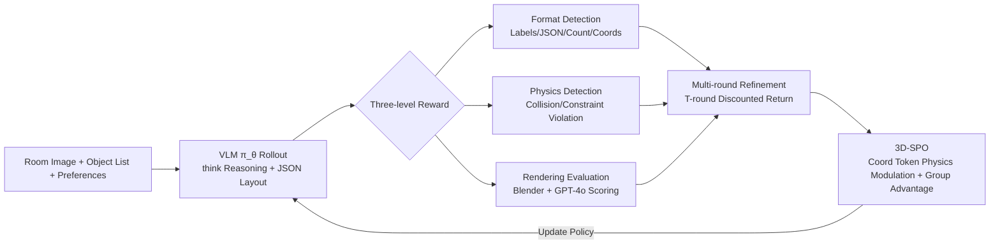

# MetaSpatial: Reinforcing 3D Spatial Reasoning in VLMs for the Metaverse

**Conference**: ICLR 2026  
**OpenReview**: [https://openreview.net/forum?id=EdQzLC0Zra](https://openreview.net/forum?id=EdQzLC0Zra)  
**Code**: To be confirmed  
**Area**: VLM Reasoning / 3D Scene Layout Generation / Reinforcement Learning  
**Keywords**: 3D Spatial Reasoning, VLM, Reinforcement Learning, GRPO, Scene Layout Generation, Physical Constraints, Multi-round Refinement  

## TL;DR
MetaSpatial models 3D indoor scene layout generation as an RL policy learning problem. It proposes the 3D-SPO algorithm, which injects physics-aware advantage modulation into coordinate tokens based on GRPO and stacks discounted returns from multi-round refinement trajectories during training. This enables the VLM to directly generate physically plausible and format-stable (x,y,z) layouts without any ground-truth annotations or post-processing.

## Background & Motivation
**Background**: Using VLMs/LLMs for 3D scene layout generation (outputting (x,y,z) coordinates for each object given a room image, object list, and user preferences) is a core requirement for the Metaverse, AR/VR, and game design. Current approaches mainly fall into two categories: inference-time multi-agent/multi-round search refinement (e.g., LayoutGPT, I-Design) or VLM multimodal reasoning coupled with differentiable optimization for post-processing (e.g., LayoutVLM).

**Limitations of Prior Work**: First, VLMs lack internalized 3D spatial reasoning capabilities; generated layouts often suffer from floating objects, interpenetration, or boundary violations, necessitating heavy post-processing (differentiable optimization, rule-based fixes) that is slow and prone to non-convergence. Second, attempts to use SFT to teach layout generation encounter the fundamental issue of "no unique correct answer."

**Key Challenge**: Layout generation is an **ill-posed problem**. Given the same room and user instructions, placing a sofa by the window or against the wall may both be reasonable, and coordinates are continuous—small offsets are acceptable as long as no collisions occur. SFT relies on single-target annotations, failing to cover the "distribution of reasonable layouts," which restricts generalization to the annotated samples.

**Goal**: To eliminate the need for ground-truth annotations and post-processing, allowing the VLM to learn from evaluative rewards through interaction with a "spatial feedback environment" to internalize physical constraints and layout principles for real-time generation of coherent 3D layouts.

**Core Idea**: **Replace SFT with RL**—treating layout generation as policy optimization where rewards are derived from format, physics, and rendering checks rather than fixed labels. Two key modifications are made to the GRPO framework: **physics-aware advantage modulation for coordinate tokens** and **discounted returns for training-time multi-round refinement trajectories**, collectively termed the 3D-SPO algorithm.

## Method

### Overall Architecture
Given a room image $r$, a set of object candidates $O=\{o_1,\dots,o_n\}$ (with labels/sizes/materials), and optional user preferences $u$, the VLM policy $\pi_\theta$ generates a `<think>` reasoning trajectory followed by a JSON layout $l=\{(o_i,x_i,y_i,z_i)\}$ within `<answer>`. This layout undergoes three-level reward evaluation (format, physics, and rendering), forming trajectories through multi-round refinement during training. Finally, 3D-SPO aggregates these grouped trajectories to optimize the policy. The entire pipeline requires no ground-truth coordinates and is driven by interaction feedback.

### Key Designs
**1. Three-level Reward Design: Providing hierarchical learnable gradients without annotations.** The total reward is a weighted sum: $R(l_t)=\lambda_1 R_{\text{format}}+\lambda_2 R_{\text{physics}}+\lambda_3 R_{\text{render}}$. The format reward is tiered rather than binary: $R_{\text{format}}\in\{0,0.1,0.5,1.0\}$. It awards 0 for structural mismatch, 0.1 for JSON parsing failure, 0.5 for mismatched object counts/IDs or incomplete coordinates, and 1.0 for full compliance. This ensures meaningful gradients even for partially correct outputs. The physics reward converts JSON into a scene graph for rule-based detection: $R_{\text{physics}}=-\alpha\cdot\text{CollisionRatio}-\beta\cdot\text{ConstraintRatio}$ (default $\alpha=\beta=0.2$), punishing object interpenetration and out-of-bounds/floating states. The rendering reward uses Blender to render the layout, which is then judged by GPT-4o across five dimensions: realism, functionality, layout rationality, color coordination, and overall aesthetics (1–10 scale), normalized as $R_{\text{render}}=\frac{1}{50}\sum_{i=1}^5 \text{Grade}_i$. Training employs a **phased scheduling**: early stages prioritize format rewards; once format accuracy exceeds 0.9, physics rewards are increased, while rendering rewards are introduced later due to high computational cost.

**2. Training-time Multi-round Refinement Trajectories: Converting single-step rollouts into comparable discounted trajectories.** Unlike inference-time search, MetaSpatial generates $T$ rounds of refinement trajectories $\mathcal{T}=\{rol_1,\dots,rol_T\}$ for each sample during **training**. The first round generates an initial layout on an empty room canvas; subsequent rounds feed the rendered scene from the previous round back as new visual context, allowing the model to reflect and improve. The total return follows a **discounted accumulation** $R_g=\sum_{i=1}^T \gamma^t R(l_{g,t})$, where $\gamma\in(0,1)$ gives higher weight to earlier rounds. This design encourages the model to "achieve good layouts as early as possible" rather than relying on long iterations, avoiding natural preference for long sequences. Multi-round trajectories expose diverse revisions to enhance robustness and support reward comparison within trajectories (not just between samples), accelerating convergence.

**3. 3D-SPO Dual-level Advantage Estimation: Physics-aware modulation for coordinate tokens in GRPO.** This is the core contribution. $G$ trajectories are sampled in parallel for each sample for intra-group relative comparison (following the GRPO approach of using group means as a baseline without a value model). The innovation lies in advantage estimation: a **3D masking** mechanism locates x/y/z coordinate tokens for all objects. For each object, a physics penalty is calculated from its collision and constraint violation rates, then multiplied with the original reward to derive an adjusted trajectory reward $\hat R_g$. Specifically, Final Reward $=$ Original Reward $\times(\text{3D Masking}\times\text{Physics Penalty}+(1-\text{3D Masking}))$. This ensures that learning at coordinate positions is directly driven by physical feedback. Normalization using the original group mean $\mu$ and standard deviation $\sigma$ yields the advantage $\hat A^{3D}_{i,k}=(\hat R_{i,k}-\mu)/\sigma$. The final objective function replaces the standard advantage in the GRPO clip objective with this physics-aware advantage:
$$J_{\text{3D-SPO}}(\theta)=\mathbb{E}\Big[\frac{1}{G}\sum_{i=1}^G\frac{1}{|T_i|}\sum_{k=1}^{|T_i|}\min\big(r_{i,k}\hat A^{3D}_{i,k},\,\text{clip}(r_{i,k},1-\epsilon,1+\epsilon)\hat A^{3D}_{i,k}\big)-\beta D_{KL}[\pi_\theta\|\pi_{\text{ref}}]\Big]$$
where $r_{i,k}$ is the likelihood ratio of the new and old policies. This methodology focuses local spatial constraints on specific tokens while maintaining global reward stability, achieving dual-level spatial reasoning.

## Key Experimental Results
The base models are Qwen2.5-VL 3B / 7B, trained on a self-constructed indoor 3D scene dataset (**room descriptions and asset libraries only, no ground-truth coordinates**), using Blender rendering and GPT-4o perception scoring.

### Main Results

| Model | Format ↑ | GPT-4o Score ↑ | Collision ↓ | Constraint ↓ | Overall |
|---|---|---|---|---|---|
| Qwen 3B | 0.12 | 0.03 | 79.0% | 100% | -0.27 |
| Qwen 3B + MetaSpatial | 0.49 | 0.18 | 68.5% | 100% | -0.09 |
| Qwen 7B | 0.85 | 0.35 | 38.2% | 95.5% | 0.51 |
| **Qwen 7B + MetaSpatial** | **0.98** | **0.62** | **11.5%** | **70.8%** | **0.95** |
| GPT-4o | 0.95 | 0.58 | 26.3% | 79.4% | 0.87 |
| I-Design | - | 0.64 | 22.5% | 83.3% | 0.92 |
| LayoutGPT | - | 0.55 | 20.7% | 80.2% | 0.85 |

MetaSpatial reduces the collision rate for the 7B model from 38.2% to 11.5% and increases the overall score from 0.51 to 0.95, **outperforming GPT-4o and multi-round systems like I-Design/LayoutGPT** (particularly in physical feasibility). Larger models show more significant gains.

### Ablation Study
Reward component ablation (Qwen2.5-VL 7B):

| Reward Setting | Format ↑ | GPT-4o ↑ | Collision ↓ | Constraint ↓ |
|---|---|---|---|---|
| Full Reward (Ours) | 0.98 | 0.62 | 11.5% | 70.8% |
| w/o Rendering | 0.96 | 0.45 | 14.5% | 80.5% |
| w/o Physics | 0.97 | 0.40 | 35.0% | 89.6% |
| w/o Format | 0.72 | 0.41 | 16.3% | 84.8% |

Algorithm and refinement depth comparison (Selection):

| Method | Format ↑ | GPT-4o ↑ | Collision ↓ | Constraint ↓ |
|---|---|---|---|---|
| One-step RL (PPO) | 0.97 | 0.44 | 26.6% | 83.0% |
| GRPO w/ T=5 | 0.98 | 0.58 | 13.7% | 76.2% |
| **3D-SPO w/ T=5** | **0.98** | **0.62** | **11.5%** | **70.8%** |
| 3D-SPO w/ T=7 | 0.99 | 0.59 | 13.9% | 75.2% |

### Key Findings
- Omitting physical rewards causes collision rates to spike to 35%; omitting rendering rewards causes the largest drop in GPT-4o scores. All three components are indispensable, with rendering rewards being critical for perceived quality.
- 3D-SPO consistently outperforms GRPO at the same $T$, validating the effectiveness of coordinate token physics modulation; $T=5$ is identified as the optimal point, while $T=7$ shows slightly decreased performance, suggesting diminishing marginal returns for excessive refinement.
- Multi-round refinement significantly outperforms one-step PPO and converges faster due to multiple learning signals per sample.

## Highlights & Insights
- **Turning "No Unique Ground Truth" into a Natural Match for RL**: The authors frame layout generation as an ill-posed problem, making evaluative rewards more suitable than fixed annotations—a compelling problem reframing.
- **Token-level Physics Modulation** is a refined approach: Unlike most RL methods that treat all tokens equally, 3D-SPO uses 3D masking to precisely apply physical penalties to coordinate tokens, focusing the learning where it matters most.
- **Training-time Multi-round Refinement + Discounted Return** decouples the training value of "multi-round" from inference overhead, while the discount factor prevents the model from delaying success to accumulate rewards.
- Achieving performance superior to GPT-4o without annotations or post-processing has significant engineering implications for real-time Metaverse/AR-VR layouts.

## Limitations & Future Work
- Rendering rewards rely on GPT-4o as a judge, introducing bias and costs associated with closed-source models; slow rendering speeds also create training bottlenecks.
- Physical detection is limited to rule-based collision/boundary checks and does not model more complex physics such as stability, support relationships, or human reachability.
- The dataset is restricted to indoor scenes with fixed asset sets; generalization to open assets, outdoor, or large-scale scenes remains unverified (zero-shot validation is limited to the appendix for Open3DVQA).
- Dimension scores for color/material are essentially locked due to fixed objects, meaning some dimensions of the rendering reward do not fully participate in optimization.

## Related Work & Insights
- **GRPO (Shao et al., 2024)**: 3D-SPO inherits the "intra-group relative advantage, no value model" framework, innovating through dual-level (coordinate token + trajectory) advantages and physical modulation.
- **LayoutVLM / LayoutGPT / I-Design**: Representative of the "VLM reasoning + post-processing/multi-round search" path; MetaSpatial internalizes these capabilities via training-time RL, eliminating heavy inference-time overhead.
- **Insight**: For any generation task involving structured numerical coordinates or parameters (e.g., CAD, UI layout, molecular conformation), one can adopt the paradigm of "masking critical numerical tokens + task-specific penalty to modulate advantage" rather than applying uniform rewards across the sequence.

## Rating
- **Novelty**: ⭐⭐⭐⭐ First RL framework for 3D spatial reasoning; token-level physics-aware advantage modulation is a genuine innovation, though the skeleton remains a modification of GRPO.
- **Experimental Thoroughness**: ⭐⭐⭐⭐ Comprehensive coverage across main experiments, ablations, algorithm comparisons, and refinement depth scans. Includes comparisons with GPT-4o and multi-round systems; scale is limited to 3B/7B and single indoor datasets.
- **Writing Quality**: ⭐⭐⭐⭐ Motivation (ill-posed problem → RL suitability) is clearly articulated; technical illustrations are sufficient.
- **Value**: ⭐⭐⭐⭐ Surpassing GPT-4o without annotations or post-processing provides direct value for real-time layout generation in Metaverse/AR-VR; the paradigm is highly transferable.

<!-- RELATED:START -->

## Related Papers

- [\[ICLR 2026\] SpinBench: Perspective and Rotation as a Lens on Spatial Reasoning in VLMs](spinbench_perspective_and_rotation_as_a_lens_on_spatial_reasoning_in_vlms.md)
- [\[NeurIPS 2025\] SpatialThinker: Reinforcing 3D Reasoning in Multimodal LLMs via Spatial Rewards](../../NeurIPS2025/vlm_reasoning/spatialthinker_reinforcing_3d_reasoning_in_multimodal_llms_via_spatial_rewards.md)
- [\[ICLR 2026\] Game-RL: Synthesizing Multimodal Verifiable Game Data to Boost VLMs' General Reasoning](game-rl_synthesizing_multimodal_verifiable_game_data_to_boost_vlms_general_reaso.md)
- [\[CVPR 2026\] SpatialStack: Layered Geometry-Language Fusion for 3D VLM Spatial Reasoning](../../CVPR2026/vlm_reasoning/spatialstack_layered_geometry-language_fusion_for_3d_vlm_spatial_reasoning.md)
- [\[ICLR 2026\] VideoAnchor: Reinforcing Subspace-Structured Visual Cues for Coherent Visual-Spatial Reasoning](videoanchor_reinforcing_subspace-structured_visual_cues_for_coherent_visual-spat.md)

<!-- RELATED:END -->
