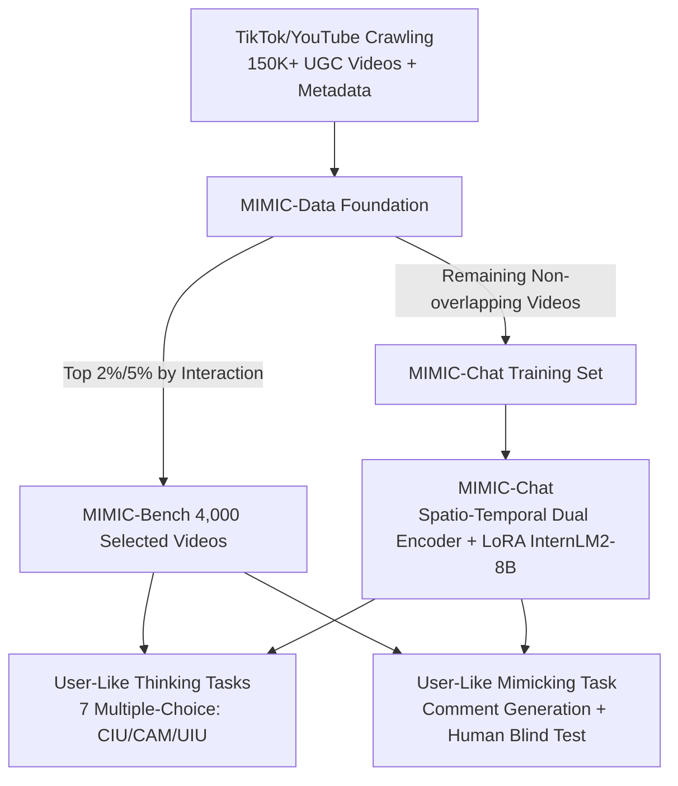

# MIMIC-Bench: Exploring the User-Like Thinking and Mimicking Capabilities of Multimodal Large Language Models

**Conference**: ICLR 2026  
**OpenReview**: [https://openreview.net/forum?id=J7wc4G6woS](https://openreview.net/forum?id=J7wc4G6woS)  
**Code**: To be released (MIMIC-Data / MIMIC-Bench / MIMIC-Chat released post-publication)  
**Area**: Multimodal Video Understanding / Human-aligned MLLM Benchmark  
**Keywords**: Multimodal Large Language Models, Video Understanding, User Generated Content, Comment Mimicking, Human Alignment, Benchmark  

## TL;DR
This paper crawls 150K+ user videos from real social platforms to construct MIMIC-Data, selects 4,000 high-interaction videos for MIMIC-Bench, and shifts MLLM evaluation from "what happens in the video" to "how humans think and comment." It also trains MIMIC-Chat, which can generate realistic human-like comments.

## Background & Motivation
- **Background**: MLLMs have progressed rapidly in video understanding, with numerous benchmarks (MVBench, VideoMME, EgoSchema, etc.) evaluating video description, action recognition, and temporal reasoning. However, these benchmarks are almost entirely built on **manually curated purely visual data** and **designer-defined questions**, focusing on "objective facts in the video."
- **Limitations of Prior Work**: Real-world social media scenarios require a different capability—models must understand and react to User Generated Content (UGC) like a **platform user**. A user video naturally carries rich metadata such as titles, tags, topics, descriptions, categories, comments, and likes, reflecting "how humans perceive, interpret, and respond" to content. Such **human-centric signals have been largely ignored in evaluating machine intelligence**. While works like EmoLLM touch on emotion, they fail to cover human-style commenting, social interaction, and expressive realism.
- **Key Challenge**: A systematic gap exists between measuring **perceptual/factual "what happens"** and **socio-cognitive "how humans think/feel/react"** in practical applications.
- **Goal**: Construct a human-aligned video understanding benchmark rooted in real UGC to evaluate whether MLLMs can perform **user-like thinking** and **user-like mimicking**, while exploring the feasibility of training models that truly resonate with humans.
- **Core Idea**: **[Shift from Fact-based QA to Human-centric Cognitive Tasks]** Inverse cognitive tasks (creative intent, content attributes, user interaction) are derived from platform metadata. The paper introduces the **first "Comment Mimicking" task**, requiring models to generate comments evaluated by humans in blind tests to determine "if it's human or AI," transforming subjective "human-likeness" into a reproducible evaluation dimension.

## Method

### Overall Architecture
The work consists of three components: the data foundation **MIMIC-Data** (150K+ videos + full metadata) → the evaluation benchmark **MIMIC-Bench** (4,000 curated videos across 7 "user-like thinking" multiple-choice tasks + 1 "user-like mimicking" generation task) → the model **MIMIC-Chat** (spatial-temporal dual-branch encoder + LoRA fine-tuned InternLM2-8B). There is strictly no overlap at the video level between these components to avoid data leakage.

### Key Designs

**1. Three-Axis Seven-Task "User-Like Thinking" Evaluation: Transforming Metadata into Cognitive Tests.** Rather than having annotators create questions from scratch, the authors use real metadata as ground-truth. Distractors are sampled from irrelevant videos to ensure semantic contrast and avoid style leakage. The three cognitive axes are: **Creative Intent Understanding (CIU)** including title and description selection (inferring creator intent); **Content Attribute Matching (CAM)** including tag, topic, and category matching (content-level semantic classification); and **User Interaction Understanding (UIU)** including comment matching (selecting the most likely real audience feedback) and comment popularity (selecting the most liked among top-1/10/50/100 comments). The latter requires delicate reasoning regarding linguistic appeal and collective preference, representing the most difficult category.

**2. First "Comment Mimicking" Task and Generation-Judgment-Scoring Loop.** This is the most innovative design. For each video, the top-5 most liked real comments are collected, and 24 MLLMs generate 1 comment each. The 5 human and 24 machine comments are **anonymously shuffled** and presented to human annotators, who determine "Human/AI" and assign a realism score (0–5). The primary metric is **mimicry quality**—the proportion judged as "human" and the average realism score. This `Generation → Human Judgment → Scoring` loop systematizes subjective "human-likeness" and yields a reusable evaluation protocol. Inter-annotator agreement reached 91.95%, indicating evaluation stability.

**3. MIMIC-Chat Spatial-Temporal Dual-Branch Unified Interface.** The model encodes video $V$ and task instruction $T$ into a unified interface: $Y = \mathrm{LM}([\text{VID}],\, \phi(V)',\, [\text{SEP}],\, T)$. Both multiple-choice classification and open-ended comment generation share this interface. On the visual side, a **dual-branch** approach is used: a spatial branch samples 8 frames for scene-level cues, while a temporal branch consumes the full sequence for temporal dynamics. Features are processed via TimeSformer-style encoding to get $\phi(V)=\{v_1,\dots,v_N\}$, aligned to the language space through spatial and temporal projectors $v_i' = \mathrm{MLP}(v_i)$, and fused via gated mechanisms inside the LLM. The backbone is InternLM2-Chat-8B, with LoRA applied only to attention layers while visual backbones remain frozen.

**4. Training-Evaluation Isomorphic Instruction Tuning.** Each video in the training set MIMIC-Data is paired with QA structured identically to MIMIC-Bench tasks. The seven multiple-choice tasks use standardized prompts ("Select the most appropriate tag/title/comment based on the video") with four options. The comment generation task uses unified prompts with top-5 liked comments as references to guide the model toward emotional nuance, associative thinking, and stylistic variation. All samples are cast as QA pairs and optimized using a language modeling loss:
$$\mathcal{L}_{LM} = -\sum_{t=1}^{|Y|} \log P(y_t \mid X, y_{<t})$$
Both multiple-choice (output "A") and open-ended generation (output full text) are learned end-to-end under the same decoding objective without task-specific heads.

## Key Experimental Results

### Main Results Table (User-Like Thinking Tasks, Accuracy %, Selected)

| Model | CIU-Title | CIU-Desc | CAM-Tag | CAM-Topic | CAM-Cat | UIU-Match | UIU-Pop | Overall↑ |
|------|------|------|------|------|------|------|------|------|
| Video-LLaVA | 27.0 | 41.2 | 68.3 | 32.4 | 17.0 | 24.6 | 25.8 | 31.6 |
| Qwen2.5-VL-72B | 85.6 | 79.3 | 79.8 | 93.3 | 50.6 | 67.3 | 33.1 | 66.7 |
| InternVL3-78B | 87.4 | 75.1 | 80.1 | 90.5 | 51.5 | 70.2 | 33.3 | 67.5 |
| ChatGPT-4o | 87.9 | 80.3 | 83.6 | 88.7 | 51.3 | 70.9 | 33.5 | 68.2 |
| Gemini2.5-pro | 92.6 | 89.5 | 82.9 | 92.3 | 56.1 | 82.9 | 43.5 | **75.1** |
| o3 | 93.2 | 86.1 | 85.7 | 92.1 | 55.2 | 77.4 | 45.5 | 74.6 |
| **Human (Upper Bound)** | 85.1 | 77.2 | 78.7 | 90.6 | 60.0 | 85.9 | 51.1 | 73.1 |
| **MIMIC-Chat (8B, Ours)** | 90.4 | 87.1 | 86.7 | 92.5 | 55.7 | 78.3 | 43.6 | **74.1** |

### Comment Mimicking Results (Human Blind Test, Selected)

| Comment Source | Judged as Human (%)↑ | Avg Realism Score↑ |
|------|------|------|
| Video-LLaVA | 6.30 | 0.58 |
| VideoChatGPT | 18.65 | 1.06 |
| **MIMIC-Chat (Ours)** | **64.24** | **2.88** |
| Human (Real Comments) | 87.57 | — |

### Key Findings
- **8B Small Model Rivals Closed-Source SOTA**: MIMIC-Chat achieved 74.1% in thinking tasks, ranking third—only behind Gemini2.5-pro (75.1%) and o3 (74.6%)—and **outperformed all open-source models** (including Qwen2.5-VL-72B and InternVL3-78B), proving that task-aligned tuning is more effective than scaling parameters.
- **Bottlenecks Lie in Social Cognition, Not Perception**: Most models perform well on perception-related or surface-alignment tasks but fail collectively on tasks requiring inference of human intent, emotion, or socio-cultural cues (CaM, CoP). In Comment Popularity (CoP), MIMIC-Chat reached only 43.6% (vs. Human 51.1%), indicating failures stem from a **lack of human-centric commonsense reasoning** rather than visual misunderstanding.
- **Significant Gap in Comment Mimicking**: Baseline models had only 6–19% of comments judged as human because they favored descriptive "re-stating the visual" comments. MIMIC-Chat reached 64.24%, over triple most models, trailing only real human comments (87.57%) by learning divergent, associative, and emotionally reflective human expression.

## Highlights & Insights
- **Valuable Shift in Evaluation Paradigm**: Moving from "objective video content QA" to "subjective human cognition and expression" provides a long-overlooked but practically relevant evaluation dimension for video understanding.
- **Comment Mimicking as a Masterstroke**: The `Generation → Human Judgment → Scoring` loop elegantly converts the hard-to-quantify goal of "human-likeness" into reproducible metrics, applicable to other multimodal generative tasks.
- **Metadata as Free Supervision**: Using platform titles/tags/comments as ground-truth bypasses expensive manual question generation while ensuring ecological validity (task distribution reflecting real user behavior rather than artificial balance).

## Limitations & Future Work
- **Subjectivity and Cultural Bias**: Comment realism is inherently subjective. Although human blind test consistency was high (91.95%), cross-cultural/linguistic generalization remains unproven. Platforms (TikTok/YouTube) and taste preferences might introduce bias.
- **Data Redistribution Challenges**: Due to copyright, only annotations and metadata are released. Reproducing requires self-crawling, with risks of broken links over time.
- **Model as a "Capability Probe" rather than Universal Solution**: MIMIC-Chat demonstrates the potential of alignment tuning, but high-level social reasoning tasks (e.g., CoP) remain significantly below human levels. Mimicking "to fool" humans is not equivalent to true understanding.

## Related Work & Insights
- **Video MLLMs**: Series like Video-LLaMA, InternVL, and Qwen-VL excel in description/localization/QA via spatio-temporal pooling and dense alignment but lack human-style cognitive modeling—the core entry point of this paper.
- **Video Benchmarks**: MVBench, VideoMME, and EgoSchema expanded multi-round dialogue and long-range modeling but stayed at the "content level." EmoLLM touched on emotion but missed social interaction. This paper uses real user content and feedback to push evaluation toward "human alignment."
- **Insight**: Using "UGC metadata + human feedback" as evaluation and training signals is a pragmatic path to connect academic benchmarks with real social platform applications, benefiting recommendation, content moderation, and social agents.

## Rating
- **Novelty**: ⭐⭐⭐⭐☆ — The "Comment Mimicking + Human Blind Test" loop and "User-Like Thinking" paradigm are genuinely novel, pushing video MLLM evaluation from facts to social cognition.
- **Experimental Thoroughness**: ⭐⭐⭐⭐ — Covers 24 MLLMs (21 open-source + 3 closed-source) plus human baselines with high inter-annotator agreement; however, ablation details are shifted to the appendix rather than fully expanded in the main text.
- **Writing Quality**: ⭐⭐⭐⭐ — Clear motivation, logical charts, and intuitive categorization of tasks. Minor typos exist in the abstract and elsewhere.
- **Value**: ⭐⭐⭐⭐ — Provides a human-aligned video understanding benchmark and data foundation for real social scenarios, offering practical significance for developing "user-aware" multimodal models.

<!-- RELATED:START -->

## Related Papers

- [\[ICLR 2026\] GTR-Bench: Evaluating Geo-Temporal Reasoning in Vision-Language Models](gtr-bench_evaluating_geo-temporal_reasoning_in_vision-language_mod.md)
- [\[ICLR 2026\] LENS: Multi-level Evaluation of Multimodal Reasoning with Large Language Models](lens_multi-level_evaluation_of_multimodal_reasoning_with_large_language_models.md)
- [\[ACL 2026\] Thinking Like a Botanist: Challenging Multimodal Language Models with Intent-Driven Chain-of-Inquiry](../../ACL2026/vlm_reasoning/thinking_like_a_botanist_challenging_multimodal_language_models_with_intent-driv.md)
- [\[ICML 2026\] Active Exploring like a Pigeon: Reinforcing Spatial Reasoning via Agentic Vision-Language Models](../../ICML2026/vlm_reasoning/active_exploring_like_a_pigeon_reinforcing_spatial_reasoning_via_agentic_vision-.md)
- [\[CVPR 2026\] VisRes Bench: On Evaluating the Visual Reasoning Capabilities of VLMs](../../CVPR2026/vlm_reasoning/visres_bench_on_evaluating_the_visual_reasoning_capabilities_of_vlms.md)

<!-- RELATED:END -->
