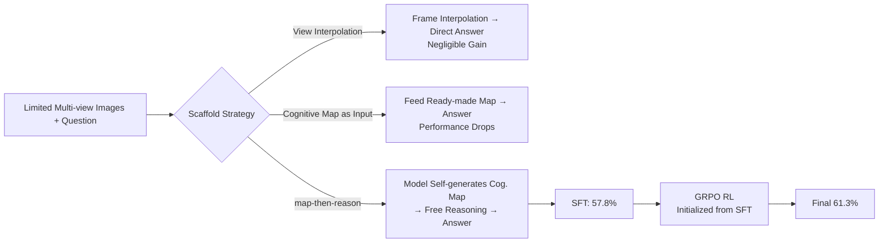

# MindCube: Spatial Mental Modeling from Limited Views

**Conference**: ICLR 2026  
**OpenReview**: [https://openreview.net/forum?id=0FhrtdKLtD](https://openreview.net/forum?id=0FhrtdKLtD)  
**Code**: [Project Page / Code / Dataset Released](https://openreview.net/forum?id=0FhrtdKLtD)  
**Area**: Multimodal VLM / Spatial Reasoning / Benchmark + Training  
**Keywords**: Spatial Mental Model, Cognitive Map, View Interpolation, map-then-reason, GRPO, VLM Spatial Reasoning  

## TL;DR
The MindCube benchmark (21,154 questions / 3,268 images) is proposed to systematically expose the deficiency of VLMs in "reconstructing unseen spaces from limited views," where they perform near random guessing. A "map-then-reason" (SFT + RL) scheme is introduced, where the model first draws a cognitive map and then reasons upon it, improving the accuracy of Qwen2.5-VL-3B from 37.8% to 61.3%.

## Background & Motivation
- **Background**: VLMs have progressed rapidly in passive perception (Visual Question Answering), but they still lack the human-like ability to "imagine" the layout of an entire room, the positions of occluded objects, or "what would I see if I turned/moved forward" from a few first-person observations. Cognitive science defines this capability as a **spatial mental model**—an internal, manipulable spatial representation independent of the current viewpoint.
- **Limitations of Prior Work**: There is a lack of specialized evaluation to distinguish whether a model has truly established cross-view consistent spatial representations or is merely performing surface matching on a single image. most existing spatial evaluations assume objects are visible and viewpoints are fixed, avoiding the three core difficulties: **occlusion, cross-view consistency, and mental simulation**.
- **Key Challenge**: Humans can integrate fragmented local observations into a global space, whereas VLMs fail immediately upon viewpoint switching or when objects become invisible. Even directly providing ready-made cognitive maps as input can decrease performance—indicating the problem is not a "lack of information" but the "lack of a mechanism to actively construct and utilize internal spatial representations."
- **Goal**: ① Create a benchmark for precise diagnosis of spatial mental modeling; ② Systematically answer "what kind of scaffold can help VLMs approximate spatial mental models" and train it into the model.
- **Core Idea**: **[Active Construction + Reasoning > Passive Feeding]** What is truly effective is not providing the model with more views or pre-made maps, but having the model **first generate a cognitive map itself and then perform free-form reasoning on that map**, and using RL to further solidify this "map-then-reason" habit into the policy.

## Method

### Overall Architecture
The MindCube work consists of two layers: the **Evaluation layer** first constructs a benchmark covering three camera motion patterns (ROTATION / AROUND / AMONG) and a four-dimensional question classification, revealing that 17 SOTA VLMs are only slightly better than random; the **Method layer** systematically searches for scaffolds to approximate spatial mental models across two orthogonal axes: input structure (raw views / view interpolation / cognitive maps) × output format (direct answer / free-form reasoning / map-then-reason). Effective configurations are first tested on frozen models, then trained via SFT, and finally optimized using GRPO reinforcement learning initialized from the best SFT checkpoint.

### Key Designs

**1. MindCube Benchmark: Probing "Unseen Space" via Camera Motion Patterns** — Data are constructed around 976 multi-view groups and three motion modes: ROTATION (rotation at a static point, forcing the model to piece together a panorama from incremental visibility), AROUND (moving around an object, utilizing occlusion to force "object permanence" and converting left-right relations in front views to front-back depth in side views), and AMONG (framing around a central object where each image shows the center + one neighbor, forcing the model to infer the global arrangement by sharing information across views). Questions focus deliberately on **objects invisible in the current query view** and are systematically labeled by dimensions such as "what-if dynamic simulation / perspective-taking / relational query" to locate whether the failure lies in location (cognitive mapping), orientation (perspective-taking), or dynamics (mental simulation).

**2. Diagnostic Comparison of Three Cognitive Scaffolds** — The paper systematically compares three types of data structures corresponding to three attributes of human spatial cognition on a frozen Qwen2.5-VL-3B: **View Interpolation** (filling frames between sparse views to simulate continuous rotation like "mental animation," corresponding to dynamic updating), **Augmented Cognitive Maps** (bird's-eye 2D layout labeling not only object positions but also the position and orientation of each view, corresponding to relational consistency), and **Free-Form Reasoning** (step-by-step natural language, corresponding to inference under incomplete observations). The key finding is that interpolation is nearly useless (↑0.09%), and feeding ready-made augmented maps as input actually drops performance to 32.0%. Only introducing reasoning (FFR) increases it to 40+%, suggesting that **structure itself is insufficient; reasoning must be present to "activate" spatial clues.**

**3. map-then-reason: Generating a Map then Reasoning Upon It** — The cognitive map is changed from an "input" to an "intermediate output": the model first generates a cognitive map, then performs free reasoning on the map, and finally provides an answer (Plain-CGMap-FFR-Out). This forces the model to first form a global scene understanding before structured reasoning. However, while maps generated by frozen models are syntactically valid, their isomorphism rate with ground truth is extremely low (<10%; augmented maps are nearly zero due to view-level details), exposing an **internal capability bottleneck** of VLMs that cannot be breached by prompting alone.

**4. SFT + GRPO for Training "Constructing while Reasoning" into the Policy** — SFT is performed using 10,000 ground-truth cognitive maps and artificially constructed reasoning chains: pure Raw-QA fine-tuning improves accuracy from 37.8% to 52.7%, while Plain-CGMap-FFR-Out (map-then-reason) achieves the best SFT result of 57.8%, while increasing map isomorphism from single digits to 35.5%. Building on this, RL is performed using the **VAGEN framework + GRPO**: training RL from scratch leads to degradation, but **initializing from the best SFT checkpoint** and injecting the "map-reason" structured thinking before RL pushes the accuracy to 61.3% (+23.5%). This curve confirms the core argument—**autonomous generation and utilization of internal structured spatial representations is far superior to view interpolation or externally fed maps.**

## Key Experimental Results

### Main Results (Frozen SOTA VLMs on MindCube, Overall Accuracy %)

| Model | Overall | Rotation | Among | Around |
|---|---|---|---|---|
| Random (chance) | 32.35 | 36.36 | 32.29 | 30.66 |
| DeepSeek-VL2-Small | **47.62** | 37.00 | 50.38 | 26.91 |
| GPT-5 (2025-08) | 47.59 | 93.33 | 34.17 | 41.63 |
| Gemini-2.5-pro | 47.05 | 85.50 | 25.95 | 38.40 |
| Claude-4-Sonnet | 44.75 | 48.42 | 44.21 | 47.62 |
| Gemma-3-12B-it | 46.67 | 38.39 | 48.38 | 34.63 |
| Best Spatial-specific RoboBrain | 37.38 | 35.80 | 38.28 | 29.53 |

> Even the strongest models are only about 15 points above random, and no single model leads across all three settings; models specifically fine-tuned for spatial tasks do not show a stable advantage.

### Ablation Study (Qwen2.5-VL-3B on MindCube-Tiny, 1050 Questions)

| Configuration | Frozen (%) | SFT (%) |
|---|---|---|
| Raw-QA (Baseline) | 37.81 | 52.67 |
| View Interpolation VI-1 | 37.90 | – |
| Aug-CGMap-In (Map as input) | 32.00 | – |
| Free-Form Reasoning (FFR) | 40.48 | 55.43 |
| Plain-CGMap-FFR-Out (map-then-reason) | 41.33 | **57.81** |
| RL-Plain/Aug-CGMap-FFR-Out (from SFT) | – | **~61.3** |

### Key Findings
- **View interpolation is useless**: Adding more frames yields almost no gain, showing the bottleneck is the reasoning mechanism, not the amount of input information.
- **Maps as input are harmful**: Directly feeding ready-made augmented maps results in a 5.8-point drop; only "active generation and reasoning upon it" is effective.
- **Reasoning is the activation switch**: In frozen settings, any configuration introducing explicit reasoning significantly outperforms direct answering.
- **RL must stand on the shoulders of SFT**: RL from scratch degrades to 49.5%; only initialization from SFT enables reaching 61.3%.
- **Map quality is an internal bottleneck**: The isomorphism of maps generated by frozen models is <10%, rising to 35–45% only after SFT.

## Highlights & Insights
- **Operationalizing the cognitive science concept of "Spatial Mental Model"**: Using camera motion patterns + invisible object labeling to precisely isolate position, orientation, and dynamics, rather than generic "spatial QA."
- **A counter-intuitive but highly valuable conclusion**: Providing the model with more information (interpolated views, ready-made maps) is useless or even harmful; what truly works is letting the model **actively construct intermediate representations and reason upon them**—providing strong empirical evidence for the "external tools vs. internal representation" debate.
- **map-then-reason is a transferable paradigm**: Generating a structured intermediate product (map) before reasoning is essentially homologous to chain-of-thought or program-of-thought, but applied to the spatial modality and equipped with quantifiable intermediate metrics such as isomorphism and similarity.

## Limitations & Future Work
- **Limited Scale**: Core training and ablations were completed on Qwen2.5-VL-3B + MindCube-Tiny (1050 questions); whether the gains of map-then-reason are equally significant on larger models has not been fully verified.
- **2D Template for Cognitive Maps**: The template-based bird's-eye maps (with "front image as up") struggle to represent real 3D height or complex topologies, making generalization to open scenes questionable.
- **Low Isomorphism**: Even after SFT, map isomorphism is only 35–45%, meaning the model's internal spatial representation is still far from "correct," and improvements in accuracy partly stem from the reasoning's fault tolerance toward imperfect maps.
- **Future Work**: Upgrading cognitive maps to 3D/differentiable representations, introducing real video and active exploration, and closing the loop between map-then-reason and embodied navigation/manipulation are natural next steps.

## Related Work & Insights
- **VLM Spatial Intelligence** (Cognitive maps by Yang et al. 2024, Spatial-MLLM, SpaceQwen, etc.): Most use "plain bird's-eye views of object positions" as inputs. This paper serves as an important correction, pointing out that **maps are detrimental as inputs and only effective when generated as intermediate outputs.**
- **Cognitive Science Spatial Mental Models** (Johnson-Laird 1983, Tversky's cognitive collage): These provide the theoretical basis for "schematic, manipulable, incomplete but functionally effective" representations, inspiring the three scaffold designs.
- **RL for reasoning** (GRPO / DeepSeek series): This paper applies GRPO + VAGEN to multimodal spatial policy optimization and provides practical experience that "RL must be initialized from SFT."
- **Insight**: For any task requiring inference of global structure from local observations (navigation, manipulation, 3D reconstruction QA), "letting the model output an evaluable structured intermediate representation, reasoning upon it, and finally solidifying it with RL" may be a more efficient path than simply scaling data or views.

## Rating
- **Novelty**: ⭐⭐⭐⭐ —— Operationalizes the cognitive science "spatial mental model" into a diagnostic benchmark and provides the counter-intuitive conclusion of "active mapping > passive feeding."
- **Experimental Thoroughness**: ⭐⭐⭐⭐ —— Cross-evaluation of 17 SOTA models + 10 input/output configurations + 6 SFT/RL configurations + multi-metrics like map isomorphism/similarity. Comprehensive coverage, though training is limited to a single 3B model.
- **Writing Quality**: ⭐⭐⭐⭐ —— Clear motivation, systematic naming of configurations (-In/-Out/Aug/Plain), and figures that clearly explain which scaffolds are effective.
- **Value**: ⭐⭐⭐⭐ —— Contributes both a high-quality spatial reasoning benchmark and a reusable map-then-reason training paradigm, providing a tangible push for the embodied/multimodal spatial intelligence community.

<!-- RELATED:START -->

## Related Papers

- [\[CVPR 2026\] Think with 3D: Geometric Imagination Grounded Spatial Reasoning from Limited Views](../../CVPR2026/vlm_reasoning/think_with_3d_geometric_imagination_grounded_spatial_reasoning_from_limited_view.md)
- [\[ICML 2026\] 3ViewSense: Spatial and Mental Perspective Reasoning from Orthographic Views in Vision-Language Models](../../ICML2026/vlm_reasoning/3viewsense_spatial_and_mental_perspective_reasoning_from_orthographic_views_in_v.md)
- [\[ICLR 2026\] Seeing Across Views: Benchmarking Spatial Reasoning of Vision-Language Models in Robotic Scenes](seeing_across_views_benchmarking_spatial_reasoning_of_vision-language_models_in_.md)
- [\[ICLR 2026\] Read the Room: Video Social Reasoning with Mental-Physical Causal Chains](read_the_room_video_social_reasoning_with_mental-physical_causal_chains.md)
- [\[ICLR 2026\] SpatialLadder: Building Spatial Reasoning Capabilities for Vision-Language Models via Progressive Training](spatialladder_progressive_training_for_spatial_reasoning_in_vision-language_mode.md)

<!-- RELATED:END -->
