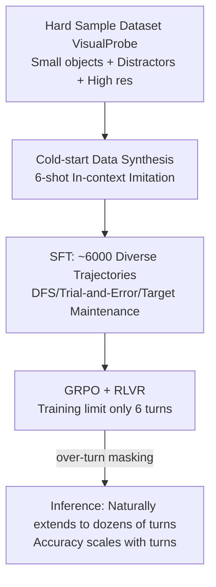

# Mini-o3: Scaling Up Reasoning Patterns and Interaction Turns for Visual Search

**Conference**: ICLR 2026  
**OpenReview**: [https://openreview.net/forum?id=Zp2y9O3wEj](https://openreview.net/forum?id=Zp2y9O3wEj)  
**Code**: To be open-sourced (Paper promises code/data/model release)  
**Area**: Multimodal Visual Reasoning / Tool-Augmented Agent  
**Keywords**: Visual Search, thinking-with-image, Multi-turn tool use, Reinforcement Learning, GRPO, test-time scaling  

## TL;DR
Mini-o3 employs a triplet of "hard-sample dataset + diverse cold-start trajectories + over-turn masking" to enable a VLM trained on only 6 interaction turns to naturally extend to dozens of trial-and-error exploration turns during inference, reproducing OpenAI o3-style deep visual search capabilities and achieving new SOTA results.

## Background & Motivation
**Background**: Enabling VLMs to "think with images" (invoking cropping/zooming tools for fine-grained reasoning) has become a popular path for enhancing visual understanding. Open-source works like DeepEyes, Pixel Reasoner, and Chain-of-Focus have equipped models with iterative zoom-in and RoI selection capabilities, performing well on simple visual search benchmarks like V* Bench and HR-Bench.

**Limitations of Prior Work**: Existing open-source models remain weak on truly difficult tasks requiring repeated trial-and-error—DeepEyes achieves only 35.1% on the author-constructed VisualProbe-Hard. Two root causes exist: **monotonous reasoning patterns** (lacking diverse strategies like depth-first search, trial-and-error, or self-reflection) and **limited interaction turns** (DeepEyes averages only ~1 image tool call per question on HR-Bench-4K).

**Key Challenge**: Solving difficult problems requires deep and long multi-turn exploration. However, training with unconstrained turn limits (e.g., 16 turns) is extremely expensive (10 days per run). Conversely, if trained directly with RL, models often collapse into "answering prematurely within a few turns" due to the lack of cold-start trajectories, failing to support test-time turn scaling.

**Goal**: Provide a complete, reproducible training recipe for OpenAI o3-style behavior, allowing models to naturally extend to dozens of turns during inference—with accuracy rising monotonically with turn count—under a **low training turn budget**.

**Core Idea**: **(1) Forcing exploration behavior with hard samples** + **(2) Synthesizing diverse cold-start trajectories via in-context imitation** + **(3) Decoupling "turn-efficient training" from "turn-expansive testing" via over-turn masking**.

## Method

### Overall Architecture
Mini-o3 is a multi-turn agentic image tool-calling system: given a question and image, the policy model iteratively produces "Thought $T_i$ → Action $A_i$ → Observation $O_i$". Observations are appended to the history and fed back into the model until a final answer is provided or context/turn limits are reached. Training consists of two stages: cold-start SFT to activate multi-turn tool use, followed by GRPO reinforcement learning with verifiable rewards (using Qwen2.5-VL-7B-Instruct as the base).

### Key Designs

**1. VisualProbe Hard-Sample Dataset: Forcing Exploration Through Task Difficulty**. The authors found that without sufficiently hard samples, RL cannot stimulate reflective or trial-and-error reasoning; targets in simple benchmarks (V* Bench, HR-Bench) are often locatable at a glance, leading models to answer correctly in one or two turns. Thus, VisualProbe (4000 train + 500 test, split into easy/medium/hard) was constructed with three features: **small targets, massive distractors, and high-resolution images**, naturally requiring iterative exploration. Ablations show a drop of ~8.6 points on VisualProbe-Hard without hard RL data, proving it is essential fuel for complex trajectories.

**2. Diverse Cold-start Data Synthesis: Trajectory Generation via In-context Imitation**. Pure RL without SFT resulted in short, low-turn responses because the base model lacks exposure to long-range agentic trajectories. The solution is cold-start SFT: 6 hand-written examples (each covering turn-by-turn observation/thought/action with DFS, self-reflection, and target maintenance strategies) are used to **prompt an off-the-shelf VLM via few-shot imitation**. This VLM generates trajectories on new problems until reaching a correct answer or budget; only successful trajectories are kept. A key insight is that the synthesizer VLM **does not need native thinking-with-image capabilities; it only needs to "follow the pattern."** ~6000 trajectories were collected.

**3. Over-turn Masking: Decoupling "Turn-efficient Training" from "Turn-expansive Testing"**. This is the core contribution. In vanilla GRPO, a query samples a set of outputs $\{o_i\}_{i=1}^G$. "Over-turn" responses (those hitting the max turn limit $C_{\text{turn}}$ or context limit $C_{\text{context}}$) are normally given a reward of 0 and used in group normalization for advantage:

$$A_i = \frac{r_i - \mathrm{mean}(\{r_1,\dots,r_G\})}{\mathrm{std}(\{r_1,\dots,r_G\})}$$

The issue: the correctness of over-turn responses is unknown. Assigning a 0 reward makes them appear as **negative advantages** after normalization, effectively punishing them. Since training limits are kept low for efficiency (usually <10 turns), over-turn responses can exceed 20% of samples early on. Naive punishment forces the model into an "early-answering" strategy, killing test-time scaling potential. The solution introduces a completion mask $M_i$ (set to 1 only for successfully terminated trajectories) to mask out advantages of over-turn trajectories and adjusts the normalization denominator to the number of completed samples $\sum_i M_i$:

$$M_i = \mathbb{1}\{|o_i| \le C_{\text{context}}\} \cdot \mathbb{1}\{\text{turn}(o_i) \le C_{\text{turn}}\}$$

Over-turn trajectories neither contribute gradients nor face punishment, preventing collapse into "early-answering" and allowing trajectories to scale during inference.

**4. Reducing Max Pixels for More Turns**. The base context is 32K tokens. Defaulting to 12M pixels per image consumes massive context per turn, severely limiting total turns. Reducing max pixels to 2M (or lower) allows more interaction turns within the same budget. This is a trade-off: oversized pixels cause "premature early stopping" (turns drop to 1.0), while undersized pixels increase hallucinations. 2M was found optimal for VisualProbe-Hard.

## Key Experimental Results

### Main Results

All models are 7B. VisualProbe and V* report Avg@32, HR-Bench reports Avg@8, MME-Realworld reports Avg@1.

| Model | VP-hard | VP-med | VP-easy | V\* | HR-4K | HR-8K | MME-Real |
|------|---------|--------|---------|-----|-------|-------|----------|
| GPT-4o | 11.2 | 15.4 | 47.5 | 65.2 | 62.0 | 58.3 | 45.2 |
| Qwen2.5-VL-Instruct | 23.9 | 26.0 | 39.1 | 75.5 | 68.2 | 62.7 | 57.3 |
| Pixel Reasoner | 28.8 | 29.6 | 58.4 | 86.3 | 74.0 | 66.9 | 64.4 |
| DeepEyes | 35.1 | 29.8 | 60.1 | 83.3 | 73.2 | 69.5 | 64.0 |
| **Mini-o3 (Ours)** | **48.0** | **50.4** | **67.0** | **88.2** | **77.5** | **73.3** | **65.5** |

Mini-o3 achieves SOTA across all datasets, notably outperforming DeepEyes by ~13 points on the most difficult VisualProbe-Hard.

### Ablation Study

Ablation of three components (VisualProbe test set, max pixels=1M, training turn limit 6):

| ID | hard RL data | cold-start | over-turn | Hard | Medium | Easy | Avg Turns (Correct) |
|----|:---:|:---:|:---:|------|--------|------|---------|
| 1 | ✓ | ✓ | ✗ | 35.8 | 46.4 | 66.7 | 4.8 |
| 2 | ✓ | ✗ | ✓ | 25.4 | 18.7 | 57.3 | 1.0 |
| 3 | ✗ | ✓ | ✓ | 32.2 | 45.7 | 61.1 | 3.0 |
| 4 | ✓ | ✓ | ✓ | **44.4** | **47.9** | **67.4** | **5.5** |

Removing over-turn masking results in an 8.6-point drop (1 vs 4); removing cold-start leads to near-collapse (turns drop to 1.0, 2 vs 4); removing hard RL data drops ~12 points (3 vs 4). All three are essential.

Max pixels ablation: 0.5M→44.4, 1M→44.4, 2M→**48.0**, 12M→36.1 (turns collapsed to 1.0), validating the pixel-turn trade-off.

### Key Findings
- **Test-time turn scaling**: Although the training limit is only 6 turns, increasing the inference turn limit from 4 to 32 leads to consistent accuracy gains on VisualProbe-Hard—a feature unlocked by over-turn masking.
- **Turn distribution shift**: With masking, the proportion of correct trajectories in the [8,16) and [16,24) intervals increases significantly (e.g., [8,16) from 1.1% to 12.2%), proving the model learned deep exploration.
- **Training efficiency**: Reducing the training turn budget from 16 to 6 cuts training time from 10 days to ~3 days with almost no loss in test accuracy.

## Highlights & Insights
- **A minimalist yet surgical RL modification**: Over-turn masking simply applies a completion mask to the advantage and adjusts the normalization denominator, precisely resolving the conflict between training cost and testing depth.
- **"Difficulty as Curriculum"**: Responsibility for stimulating exploration is shifted to data difficulty rather than complex reward design. VisualProbe’s trio (small objects + distractors + high resolution) is an excellent template for engineering "necessary trial-and-error."
- **Model-agnostic synthesis**: Cold-start trajectories can be obtained through in-context imitation; the VLM used for synthesis does not need native thinking-with-image capabilities, lowering the reproduction threshold.

## Limitations & Future Work
- Task scope is focused on visual search (locating small objects); transferability to broader visual reasoning or embodied decision-making is unverified.
- Tool space is limited to grounding (cropping/zooming) and answering, excluding image editing or external retrieval tools.
- Max pixels require manual tuning to reach the "sweet spot" (2M); the trade-off between perception precision and interaction depth remains empirical.
- Cold-start data relies on filtering for correct trajectories, potentially introducing survivor bias and ignoring valuable but unsuccessful exploration paths.

## Related Work & Insights
This work sits at the intersection of **tool-integrated agents + RL** and **thinking-with-image VLMs**. Compared to DeepEyes, Pixel Reasoner, and Chain-of-Focus which also use iterative zoom-in, Mini-o3 differentiates itself by **explicitly pursuing interaction depth and diversity in reasoning patterns**, achieving test-time scaling through over-turn masking. For RL, it follows GRPO while adopting ideas from DAPO. The insight for future research: rather than fine-tuning reward functions, one should **focus on data difficulty and training signals that "do not punish the unknown"** to allow long-range exploration behaviors to emerge spontaneously.

## Rating
- **Novelty**: ⭐⭐⭐⭐ — Over-turn masking is a simple yet insightful RL modification; the recipe (Hard Data + Cold-start + Masking) is systematic.
- **Experimental Thoroughness**: ⭐⭐⭐⭐ — Comprehensive SOTA results, three-component ablations, and scaling analysis; Avg@K used for variance reduction.
- **Writing Quality**: ⭐⭐⭐⭐ — Logical flow from motivation to challenge to method; figures (turn distribution, scaling curves) strongly support the claims.
- **Value**: ⭐⭐⭐⭐ — Provides a complete, low-cost recipe for o3-style visual search (3-day training), offering high utility for the open-source community.

<!-- RELATED:START -->

## Related Papers

- [\[ICLR 2026\] Agentic Jigsaw Interaction Learning for Enhancing Visual Perception and Reasoning in Vision-Language Models](agentic_jigsaw_interaction_learning_for_enhancing_visual_perception_and_reasonin.md)
- [\[ICLR 2026\] Unleashing Perception-Time Scaling to Multimodal Reasoning Models](unleashing_perception-time_scaling_to_multimodal_reasoning_models.md)
- [\[CVPR 2026\] Thinking in 360°: Humanoid Visual Search in the Wild](../../CVPR2026/vlm_reasoning/thinking_in_360deg_humanoid_visual_search_in_the_wild.md)
- [\[ICLR 2026\] TimeSearch-R: Adaptive Temporal Search for Long-Form Video Understanding via Self-Verification Reinforcement Learning](timesearch-r_adaptive_temporal_search_for_long-form_video_understanding_via_self.md)
- [\[ICLR 2026\] Mixture-of-Visual-Thoughts: Exploring Context-Adaptive Reasoning Mode Selection for General Visual Reasoning](mixture-of-visual-thoughts_exploring_context-adaptive_reasoning_mode_selection_f.md)

<!-- RELATED:END -->
