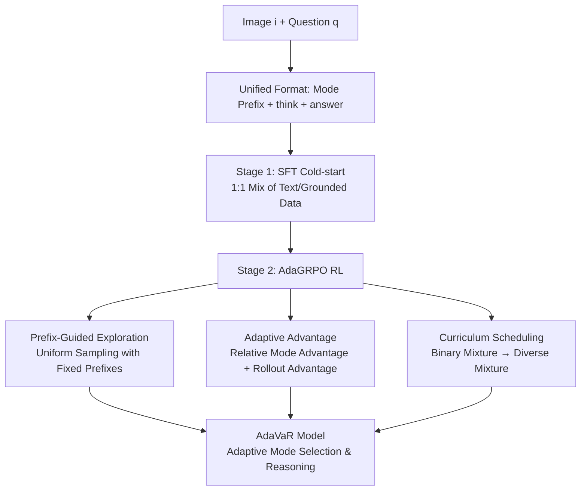

# Mixture-of-Visual-Thoughts: Exploring Context-Adaptive Reasoning Mode Selection for General Visual Reasoning

**Conference**: ICLR 2026  
**OpenReview**: [https://openreview.net/forum?id=8qk6eUnvbH](https://openreview.net/forum?id=8qk6eUnvbH)  
**Code**: [https://github.com/Future-Living-Lab/mixture-of-visual-thoughts](https://github.com/Future-Living-Lab/mixture-of-visual-thoughts)  
**Area**: Vision-Language Reasoning / Multimodal Reinforcement Learning  
**Keywords**: Visual Reasoning, Reasoning Mode Selection, GRPO, Reinforcement Learning, LVLM, Adaptive Reasoning  

## TL;DR
The paper proposes the MoVT paradigm and AdaVaR framework, unifying "text-based reasoning" and "visually-grounded reasoning" into a single LVLM. By employing an improved AdaGRPO algorithm, the model learns to **adaptively select the appropriate reasoning mode based on the problem context**, leading to simultaneous improvements across tasks such as mathematics, visual search, hallucination reduction, and spatial reasoning.

## Background & Motivation
**Background**: Multimodal reasoning typically follows the CoT approach of LLMs, but CoT formats (referred to as "reasoning modes" in this paper) are categorized into two types: **Text-based reasoning**, which uses natural language for the entire thinking process (consistent with LLMs); and **Visually-grounded reasoning**, which generates structured outputs (e.g., `object [x1,y1,x2,y2]` bounding box coordinates) during thinking to anchor textual concepts to image regions.

**Limitations of Prior Work**: Different modes bring different inductive biases, with distinct strengths and weaknesses. Text-based reasoning excels at abstract reasoning (math) but is prone to hallucinations due to "overthinking" and linguistic biases. Visually-grounded reasoning is adept at utilizing visual information and suppressing hallucinations for object-centric problems but offers almost no gain in math (where abstract concepts like length or size cannot be grounded by coordinates). Figure 1b illustrates that existing models specialized in a single mode show significant gains in their expertise but sharp declines in other areas (e.g., a text-based model dropping 18.3 on V*, and a grounded model dropping 15.5 on WeMath). **No single mode dominates all tasks.**

**Key Challenge**: To build a "general" visual reasoning model, multiple complementary modes must be fused. This fusion faces two main hurdles: (i) how to **uniformly represent** heterogeneous reasoning modes and have a single model learn them simultaneously; (ii) how to equip the model with **context-adaptive mode selection** capabilities.

**Goal**: To build a general visual reasoning model capable of reasoning across multiple modes and automatically choosing the optimal mode based on the context.

**Core Idea (MoVT + AdaVaR)**: The framework uses **mode prefix tokens** to unify multi-mode reasoning into a single autoregressive sequence. It starts with SFT for cold-start learning of each mode, followed by **customized AdaGRPO reinforcement learning** to induce mode selection capabilities. The key lies in decoupling "which mode to select" and "how to reason" into two separately optimizable layers.

## Method

### Overall Architecture
AdaVaR is a two-stage adaptive visual reasoning framework. It decomposes the autoregressive generation of the reasoning process into two steps: $P(a,t,m\,|\,i,q)=P(m\,|\,i,q)\times P(a,t\,|\,m,i,q)$. This means the model "first selects mode $m$ based on image $i$ and question $q$ (generating a mode prefix), then generates thoughts $t$ and answer $a$ based on the selected mode." Both steps are completed sequentially within the same sequence. **Stage 1 (SFT Cold-start)** mixes expert trajectories from both modes into the same model to learn basic reasoning. **Stage 2 (AdaGRPO RL)** induces context-adaptive mode selection while enhancing reasoning capabilities.

### Key Designs

**1. Reasoning Mode Unification: Fitting heterogeneous CoT into an autoregressive sequence via prefix tokens.** The paper assigns a unique prefix token for each mode—`<text>` for text-based and `<ground>` for grounded mode—placed at the start of the thought path as a "context indicator." The system prompt informs the model of the two available modes, and the response format is unified as `<mode prefix> <think> reasoning process </think> <answer> answer </answer>`. This allows data from different modes to be mixed for training with a unified SFT objective, where the model distinguishes the reasoning path by the prefix. This also sets the stage for "prefix-guided uniform exploration" in subsequent RL. For SFT data, text reasoning is constructed using DeepSeek-R1-style distillation and rejection sampling, while grounded reasoning reuses existing high-quality data, keeping the ratio strictly **1:1** to avoid bias in mode selection.

**2. Diagnosis of AdaGRPO: Standard GRPO fails in mode selection scenarios.** The standard GRPO optimization objective uses rollout-level advantage $A_j=\frac{r_j-\mathrm{mean}(\{r\})}{\mathrm{std}(\{r\})}$, treating all tokens equally. The paper identifies two issues: first, the post-SFT policy model might favor one mode, resulting in all $2n$ rollouts coming from the same mode (**insufficient exploration of different modes**); second, GRPO only calculates advantages between rollouts without **explicitly modeling preferences between modes**, failing to guide mode selection. AdaGRPO is designed to address these limitations.

**3. Prefix-Guided Mode Exploration + Relative Mode Advantage: Isolating "mode selection" for optimization.** For exploration, AdaGRPO forces the $2n$ rollouts into two sub-groups: $n$ text rollouts with a fixed `<text>` prefix and $n$ grounded rollouts with a fixed `<ground>` prefix, ensuring uniform exploration of both modes. Regarding advantage calculation, the rewards of the two sub-groups are fitted into Gaussian distributions $P_t$ and $P_v$. The **relative mode advantage** is defined by the probability that a rollout sampled from one mode outperforms the other: $A_v=\Phi\!\left(\frac{\mu_v-\mu_t}{\sqrt{\sigma_v^2+\sigma_t^2}}\right)=1-A_t$ (where $\Phi$ is the standard normal CDF). Crucially, the **token-level advantage assignment** applies the relative mode advantages $A_t, A_v$ only to the **mode prefix tokens** (to guide optimal mode selection), while the rollout-level advantage $A_j$ is applied to the **thought tokens** (to enhance reasoning capability), formulated as:
$$A'_{j,t}=\begin{cases}\mathbb{1}\{o_j\in\text{grd}\}A_v+\mathbb{1}\{o_j\in\text{txt}\}A_t & o_{j,t}\in m\\[2pt] A_j & \text{otherwise}\end{cases}$$
This decouples "which mode to select" and "how to perform reasoning within that mode" across different tokens.

**4. Curriculum Data Scheduling: From coarse-grained differentiation to fine-grained selection.** RL data consists of two parts: existing datasets with verifiable answers (Geo170K, OmniCount, MM-Eureka) and a subset filtered from LLaVA-OneVision/InternVL SFT data based on verifiability and difficulty, balanced across tasks. The curriculum starts with a **binary mixture** (containing OmniCount and simpler Geo170K geometry problems) to let the model learn **coarse-grained differentiation** between modes, then moves to a **diverse mixture** (covering math, OCR, counting, science, grounding, document, etc.) to learn **fine-grained mode selection**, increasing difficulty and task variety over time.

## Key Experimental Results

### Main Results Table (Average Accuracy across 8 benchmarks, excerpt)

| Model | MathVista | MathVision | WeMath | MMStar | V* | POPE | SpatialScore | Average |
|---|---|---|---|---|---|---|---|---|
| GPT-4o | 63.8 | 30.4 | 42.9 | 64.7 | 66.0 | 86.9 | 30.6 | 53.20 |
| Qwen2.5-VL-7B (Base) | 68.2 | 25.1 | 31.2 | 60.3 | 78.0 | 87.8 | 15.2 | 50.90 |
| MM-Eureka (Text) | 72.6 | 28.1 | 36.9 | 64.0 | 59.7 | 86.3 | 27.1 | 52.52 |
| DeepEyes (Grounded) | 70.1 | 26.6 | 32.7 | 61.3 | **90.1** | 87.9 | 20.3 | 53.72 |
| **AdaVaR-7B (Ours)** | **74.4** | 28.5 | **44.8** | 63.0 | 83.4 | **89.0** | 20.4 | **55.82** |
| **AdaVaR-3B (Ours)** | 69.8 | 24.5 | 33.8 | 59.3 | 77.0 | 88.2 | 18.9 | 50.84 |

Key Conclusion: **AdaVaR is the only model that does not perform worse than the Qwen2.5-VL base across all datasets.** AdaVaR-7B surpasses GPT-4o in average score (55.82 vs 53.20), and AdaVaR-3B approaches the 7B base model (50.84 vs 50.90). Single-mode models generally show "biases"—the text model drops significantly on V*, and the grounded model shows almost no gain in math.

### Ablation Study Table (AdaVaR-3B)

| Configuration | MathVista | WeMath | MMStar | V* | POPE | Average |
|---|---|---|---|---|---|---|
| AdaVaR-3B (Full) | 69.8 | 33.8 | 59.3 | 77.1 | 88.2 | **50.8** |
| w/o Ada-Adv + PG-Exp | 66.3 | 31.3 | 56.6 | 75.4 | 89.1 | 49.6 |
| w/o Ada-Adv | 68.4 | 33.7 | 58.9 | 77.4 | 88.0 | 50.3 |
| w/o Diverse Mixed Data | 67.4 | 33.4 | 57.3 | 76.4 | 82.1 | 49.0 |
| w/o Curriculum Learning | 66.8 | 33.4 | 57.8 | 76.9 | 88.2 | 50.1 |

Removing any component leads to a performance drop, with **Adaptive Advantage + Prefix-Guided Exploration** and **Diverse Mixed Data** contributing the most. Single-mode baselines—Grounded-SFT-RL (48.7), Text-SFT-RL (48.8), and Mix-SFT-RL (48.5, which removes prefixes and simply mixes data)—all perform worse than AdaVaR (50.8).

### Key Findings
- **Modes show clear division of labor**: Text mode selection is high for math problems, while grounded mode selection is high for object-centric tasks (e.g., GRD% reaches 99% on V* but approaches 0% on math).
- **Unification does not hurt individual modes**: The performance gap between single-mode baselines and the corresponding modes in AdaVaR is minimal, indicating that integrating both modes into one model does not degrade either.
- **Complementarity has a high upper bound**: If the model is considered correct if "either mode is correct," the upper bound (56.8) far exceeds the base and single-mode models. Even in math, the grounded mode can occasionally rescue samples failed by the text mode, confirming the potential of the MoVT paradigm.
- **Prefixes are indispensable**: Mix-SFT-RL without prefixes performs worse than single-mode baselines, proving that prefix tokens are crucial for mode differentiation and uniform exploration.

## Highlights & Insights
- **Modeling mode selection as a learnable decision layer**: By decomposing the generation into $P(m|i,q)\times P(a,t|m,i,q)$, mode selection is explicitly modeled as the first step of the sequence. Using token-level advantage assignment to decouple selection from reasoning is the most elegant design of the paper.
- **AdaGRPO's relative mode advantage uses Gaussian CDF to estimate "win rate"**, quantifying "whether mode A is better than mode B" as a probability attached to the prefix token. This more directly guides selection than GRPO's rollout-level scalar rewards.
- **"Generalist" rather than "Specialist" evaluation stance**: Evaluating across 8 benchmarks covering math, visual search, hallucination, and spatial reasoning avoids the limitations of single-domain optimization. AdaVaR is the only model achieving comprehensive non-regression, which is highly persuasive.
- Inference includes a **mode-switching fallback**: If a mode gets stuck in repetitive logic without an answer, it automatically switches to the other mode and retries.

## Limitations & Future Work
- **Only two modes integrated**: The current work only considers text and bounding box grounding. More modes (e.g., segmentation masks, tool calls, visual prompts) have not yet been included; scalability remains to be verified.
- **Single grounding format**: Visual grounding is limited to `object [x1,y1,x2,y2]` bounding boxes, which may lack expressiveness for tasks requiring fine-grained regions (e.g., segmentation masks, key points).
- **Gap to upper bound**: AdaVaR-3B's 50.8 vs. the 56.8 upper bound suggests that mode selection is not yet optimal and adaptive capabilities can be further improved.
- **Dependency on verifiable rewards**: The RL stage relies on rule-based answer verification, making it difficult to apply to open-ended or subjective visual reasoning tasks.

## Related Work & Insights
- **Language Reasoning Models**: From CoT prompts, ToT/GoT structures, and majority voting to DeepSeek-R1 using scalable RL to incentivize reasoning—MoVT transfers this RL approach to the dimension of "mode selection."
- **Text-based Reasoning LVLMs** (VLAA-Thinker, MM-Eureka, OVR, etc.) excel in math but are prone to hallucination; **Visually-grounded LVLMs** (DeepEyes, ViGoRL, Chain-of-Focus, etc.) excel in object tasks but struggle with math. Unifying these two lines is the core differentiator of this work.
- **Insight**: When different methods have complementary inductive biases, rather than simple data mixing (which performed worst in Mix-SFT-RL), it is better to explicitly model a decision layer for "when to use which method" and use relative advantages in RL to supervise this selection. This approach can be generalized to broader "multi-strategy fusion" scenarios like tool selection, modality selection, or choosing between retrieval and parametric knowledge.

## Rating
- **Novelty**: ⭐⭐⭐⭐ — Explicitly modeling "reasoning mode selection" as a learnable decision layer and customizing AdaGRPO (prefix-guided exploration + Gaussian CDF relative advantage + token-level advantage decoupling) shows algorithmic originality.
- **Experimental Thoroughness**: ⭐⭐⭐⭐ — Solid across 8 cross-domain benchmarks, two scales (3B/7B), multiple baselines (single-mode, mixed, prefix-free), and ablation studies including upper-bound analysis and visualization of mode selection rates.
- **Writing Quality**: ⭐⭐⭐⭐ — The motivation is clearly illustrated by Figure 1b's "no single mode is king" concept. Methodological derivation is clear, with good coordination between formulas and diagrams.
- **Value**: ⭐⭐⭐⭐ — Provides a feasible paradigm for "general visual reasoning models" and releases code, models, and data, offering methodological value for research on multi-strategy fusion.

<!-- RELATED:START -->

## Related Papers

- [\[CVPR 2026\] R-4B: Incentivizing General-Purpose Auto-Thinking in MLLMs via Bi-Mode Annealing and Reinforce Learning](../../CVPR2026/vlm_reasoning/r-4b_incentivizing_general-purpose_auto-thinking_in_mllms_via_bi-mode_annealing_.md)
- [\[CVPR 2026\] POINTS-Long: Adaptive Dual-Mode Visual Reasoning in MLLMs](../../CVPR2026/vlm_reasoning/points-long_adaptive_dual-mode_visual_reasoning_in_mllms.md)
- [\[ICLR 2026\] MedVR: Annotation-Free Medical Visual Reasoning via Agentic Reinforcement Learning](medvr_annotation-free_medical_visual_reasoning_via_agentic_reinforcement_learnin.md)
- [\[ICLR 2026\] VisionReasoner: Unified Reasoning-Integrated Visual Perception via Reinforcement Learning](visionreasoner_unified_reasoning-integrated_visual_perception_via_reinforcement_.md)
- [\[ICLR 2026\] Ref-Adv: Exploring MLLM Visual Reasoning in Referring Expression Tasks](ref-adv_exploring_mllm_visual_reasoning_in_referring_expression_tasks.md)

<!-- RELATED:END -->
