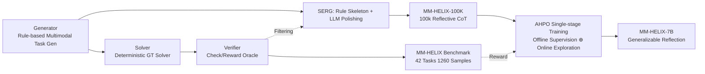

# MM-HELIX: Boosting Multimodal Long-Chain Reflective Reasoning with Holistic Platform and Adaptive Hybrid Policy Optimization

**Conference**: ICLR 2026  
**OpenReview**: [https://openreview.net/forum?id=ORCZ0wcPLm](https://openreview.net/forum?id=ORCZ0wcPLm)  
**Project Page**: [https://mm-helix.github.io/](https://mm-helix.github.io/)  
**Area**: Multimodal Reasoning / Reflective Reasoning / Reinforcement Learning  
**Keywords**: MLLM, Long-Chain Reflective Reasoning, Benchmark, Data Synthesis, Offline-Online Hybrid RL  

## TL;DR
This paper introduces MM-HELIX, an integrated "Evaluation-Data-Training" platform. It features a benchmark of 42 multimodal puzzles requiring iterative trial-and-error generated programmatically, a SERG pipeline that synthesizes 100k high-quality reflective CoT samples, and a single-stage AHPO algorithm that dynamically fuses offline expert supervision with online RL exploration. This approach boosts Qwen2.5-VL-7B by +18.6% on MM-HELIX and +5.7% on general math/logic tasks.

## Background & Motivation
**Background**: Current MLLMs have achieved proficiency in reasoning tasks like mathematics and logic. However, they mostly rely on a "single direct pass," lacking inherent mechanisms for self-correction and iterative refinement. In contrast, human cognition centers on reflection and backtracking—approaching correct solutions through repeated trial and error.

**Limitations of Prior Work**: ① Existing evaluations (e.g., Enigmata, VGRP-Bench, Code2Logic) focus primarily on text-only puzzles or multiple-choice/fill-in-the-blank formats, failing to assess end-to-end long-chain reflection in rich visual contexts. ② Standard training paradigms have inherent flaws: direct SFT on reflective data leads to **catastrophic forgetting**, while pure online RL (e.g., GRPO) often **fails during training** because base models cannot solve hard puzzles, leading to extremely sparse rewards.

**Key Challenge**: Long-chain reflective reasoning requires expert trajectories to "hand-hold" models through the cold-start dilemma, while simultaneously allowing autonomous exploration to prevent mere imitation of expert distributions and loss of generalization. These needs are fragmented and conflicting in traditional sequential "SFT then RL" pipelines.

**Goal**: To build a holistic platform capable of accurately measuring and effectively enhancing long-chain reflective reasoning in MLLMs, and to verify that such capabilities can be learned and transferred to general reasoning tasks.

**Core Idea**: `Holistic Platform`—unifying the evaluation benchmark, data synthesis engine, and training algorithm; `Adaptive Hybrid`—using reward signals as a real-time gate to decide when to rely on expert supervision and when to allow autonomous exploration, compressing offline supervision and online optimization into a single training phase.

## Method

### Overall Architecture
MM-HELIX consists of three tightly coupled components: First, a programmatic generation framework (Generator + Solver + Verifier) creates multimodal puzzles with controllable difficulty as the benchmark. Second, the SERG pipeline polishes rule-based skeletons into 100k natural reflective CoT samples to form the MM-HELIX-100K dataset. Finally, the AHPO algorithm treats these expert data as offline supervision, dynamically fusing them with online RL exploration in the same stage. The Verifier acts as an answer checker during evaluation and a reward oracle during RL, closing the loop.

### Key Designs

**1. Programmatic Generation Triad for Controllable Benchmarking**: MM-HELIX comprises 42 tasks across four categories: Algorithm, Graph, Puzzle, and Game. The framework uses three components: the Instance Generator creates task prompts (text, initial images, structured states) based on rules and parameters; the Solver uses algorithms to determine solvability and produce ground truth; the Verifier checks outputs. It performs exact matching for simple answers and simulates action sequences from the initial state for multi-step solutions to confirm validity. Difficulty is adjusted via task parameters (e.g., required reasoning steps) across levels 1 (easiest) to 5 (hardest), with 30 instances per task (1,260 total) to pinpoint performance collapse thresholds.

**2. SERG: Efficient CoT Synthesis via Skeleton-then-Polishing**: Generating reflective trajectories from scratch is slow and redundant. Step-Elicited Response Generation (SERG) uses two steps: first, a rule-based CoT constructor embeds key intermediate states as "anchors" to create a logical but rigid skeleton; second, the prompt and skeleton are fed to a strong model (Qwen3-235B) to polish them into natural, detailed human-like reasoning processes. Only trajectories passing the Verifier are kept, effectively filtering LLM hallucination errors. SERG reduces synthesis time by ~90% compared to direct rollout while increasing Verifier pass rates from 25% to 99.8%.

**3. AHPO: Reward-Gated Single-Stage Offline-Online Fusion**: AHPO integrates offline supervision and online GRPO exploration into a single objective. The total loss adds an offline term modulated by coefficient $\xi$ to the online GRPO clip term—applying maximum likelihood supervision to expert trajectories $y^*$: $\xi \sum_t \log \pi_\theta(y^*_{i,t}\mid x_i, y^*_{i,<t})$. Critically, $\xi$ is not constant but gated by the current policy's performance:

$$\xi = \mathbb{I}\!\left(\sum_{i=1}^{N_{on}} \mathbb{I}\big(R(\tau_i)=1\big) < \hat{R}\right)$$

When the number of successful trajectories in a rollout batch is below threshold $\hat{R}$ (sparse rewards), $\xi=1$ injects expert supervision to pull the model toward the right track. Once the model becomes proficient, $\xi=0$ disables offline supervision, allowing pure exploration. This prevents training failure due to sparse rewards and avoids instabilities caused by static distribution conflicts.

**4. Cross-domain Generalization via Mixed Data**: During AHPO training, MM-HELIX-100K is mixed with a general math RL dataset (MMK12) which lacks CoT. Since there is no overlap between the two, the model learns a transferable reflection mechanism rather than rote memorization. This enables the model to apply reflective reasoning even to out-of-domain tasks without explicit CoT instructions, leading to the observed +5.7% generalization gain.

## Key Experimental Results

### Main Results: Evaluation of 23 MLLMs on MM-HELIX (Img represents Multimodal Total)

| Model | Thinking | Overall (Img) | Overall (Txt) |
|------|----------|---------------|---------------|
| GPT-5 | ✓ | 58.1 | 84.5 |
| Seed-1.5-VL | ✓ | 48.3 | 66.9 |
| o4-mini | ✓ | 44.7 | 75.2 |
| Intern-S1-241B (Open SOTA) | ✓ | 33.3 | 50.4 |
| Qwen-2.5-VL-72B | × | 13.9 | 20.1 |
| Qwen-2.5-VL-7B (Base) | × | 6.3 | 8.0 |
| **Ours (MM-HELIX-7B-Thinking)** | ✓ | **24.9** | 21.8 |

Even GPT-5 only reaches 58.1%, with no model breaking 50%. Ours (7B) outperforms 72B-level open-source non-thinking models.

### Ablation Study: AHPO vs. Other Training Strategies (Based on Qwen2.5-VL-7B)

| Method | Type | MM-HELIX | General Reasoning Avg |
|------|------|----------|--------------|
| Baseline | — | 6.3 | 36.5 |
| +GRPO | On-policy | 9.0 (+2.7) | 36.7 (+0.2) |
| +SFT | Off-policy | 23.8 (+17.5) | 29.9 (**−6.6**) |
| +SFT&GRPO | Sequential | 23.3 (+17.0) | 36.7 (+0.2) |
| +LUFFY | Hybrid | 9.1 (+2.8) | 35.4 (−1.1) |
| **+AHPO (Ours)** | Hybrid | **24.9 (+18.6)** | **42.2 (+5.7)** |

### Key Findings
1.  **Reflection is the Watershed**: Models with "thinking" capabilities systematically outperform non-reflective models (e.g., InternVL3-78B at 9.9%).
2.  **Strong Structural Calc vs. Weak State Tracking**: Models perform best on "Algorithm" tasks and worst on "Game" tasks, suggesting they handle well-defined calculations better than iterative state tracking under strict rules.
3.  **Significant Modality Gap**: Text-only input scores are significantly higher than image inputs (GPT-5 jumps from 58.1% to 84.5%), indicating visual perception remains a bottleneck.

## Highlights & Insights
-   **Platform over Point-solution**: Integrating evaluation, synthesis, and training into a self-consistent loop—with the Verifier serving dual roles—is an elegant engineering design.
-   **Gating Insight**: Using the success rate of a rollout batch as a zero-cost signal to toggle expert supervision elegantly solves the dilemma of needing guidance for cold-starts but finding it restrictive once mature. It proves that static coefficients can backfire once the model surpasses the expert.
-   **Generalizable Reflection**: The most valuable conclusion is that reflection is a transferable skill; emergence of reflective reasoning on CoT-less data suggests AHPO cultivates intrinsic reasoning rather than superficial imitation.

## Limitations & Future Work
-   **Low Absolute Performance**: MM-HELIX-7B achieves only 24.9%, indicating that "solving" long-chain reflection remains an open challenge with significant headroom.
-   **Visual Weakness**: The modality gap highlights that bottlenecks lie in visual state perception rather than reasoning logic; future work should focus on visual grounding.
-   **Synthetic vs. Real Gap**: Tasks are algorithmically generated; the gap between these and open-world problems, alongside the cost of using strong teachers for SERG, requires consideration.
-   **Threshold Sensitivity**: The adaptive coefficient $\xi$ relies on a preset success rate $\hat{R}$, whose robustness across tasks warrants further study.

## Related Work & Insights
-   **Long-chain Reasoning & Programmatic Gen**: Building on CoT and ToT, MM-HELIX fills the gap for end-to-end multimodal reflective evaluation where Enigmata and Code2Logic are limited to text or simple formats.
-   **RL Training Methods**: While GRPO/PPO suffer from sparse rewards in hard tasks, AHPO's contribution is merging them with offline data via reward-gating, proving superior to sequential SFT+RL or LUFFY-style hybrid approaches.
-   **Insight**: Combining "deterministic skeletons + LLM polishing + Verifier filtering" is a high-ROI data paradigm; the "dynamic supervision intensity via task success rate" logic is applicable to any hard-task RL training.

## Rating
-   **Novelty** ⭐⭐⭐⭐: While individual components have precursors, the "Holistic Platform" + "Reward-Gated AHPO" integration is a solid innovation.
-   **Experimental Thoroughness** ⭐⭐⭐⭐⭐: Extensive evaluation of 23 models, 5 training strategies, and multiple ablations on synthesis and data composition.
-   **Writing Quality** ⭐⭐⭐⭐: Clear logic and rich visualizations.
-   **Value** ⭐⭐⭐⭐⭐: Provides both a high-discrimination benchmark and a reproducible, generalizable training recipe for the community.

<!-- RELATED:START -->

## Related Papers

- [\[ICLR 2026\] Perception-Aware Policy Optimization for Multimodal Reasoning](perception-aware_policy_optimization_for_multimodal_reasoning.md)
- [\[ICLR 2026\] Unlocking the Essence of Beauty: Advanced Aesthetic Reasoning with Relative-Absolute Policy Optimization](unlocking_the_essence_of_beauty_advanced_aesthetic_reasoning_with_relative-absol.md)
- [\[ICLR 2026\] Vision-SR1: Self-Rewarding Vision-Language Model via Reasoning Decomposition and Multi-Reward Policy Optimization](vision-sr1_self-rewarding_vision-language_model_via_reasoning_decomposition_and_.md)
- [\[ICLR 2026\] TimeSearch-R: Adaptive Temporal Search for Long-Form Video Understanding via Self-Verification Reinforcement Learning](timesearch-r_adaptive_temporal_search_for_long-form_video_understanding_via_self.md)
- [\[ICLR 2026\] ThinkMorph: Emergent Properties in Multimodal Interleaved Chain-of-Thought Reasoning](thinkmorph_emergent_properties_in_multimodal_interleaved_chain-of-thought_reason.md)

<!-- RELATED:END -->
