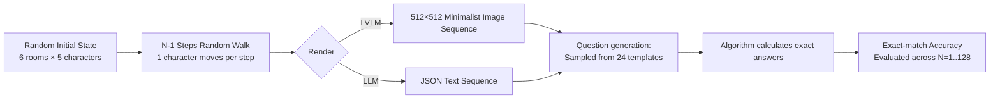

# MMReD: A Cross-Modal Benchmark for Dense Context Reasoning

**Conference**: ICLR 2026  
**OpenReview**: [https://openreview.net/forum?id=H6fM44DOHP](https://openreview.net/forum?id=H6fM44DOHP)  
**Code**: To be confirmed  
**Area**: Multimodal Reasoning / Long-context Evaluation  
**Keywords**: Long-context Reasoning, Dense Context, Multimodal Benchmark, NIAH, Vision-Language Models  

## TL;DR
MMReD constructs a "room-character" randomly-evolving visual sequence environment, upgrading long-context reasoning from "needle-in-a-haystack retrieval" to "dense reasoning that requires uniform attention to the entire context." It reveals that nearly 30 LLMs/LVLMs, ranging from GPT-4o to reasoning-specialized models, systematically collapse as the sequence length grows, a limitation that SFT/GRPO fine-tuning fails to mitigate.

## Background & Motivation
**Background**: Expanding the context window has become a primary battleground for LLMs/LVLMs. A plethora of long-context evaluation benchmarks has emerged, such as RULER, BABILong, and Michelangelo for text, alongside VideoMME, MLVU, and LVBench for vision. However, the vast majority of these benchmarks adhere to the **Needle-in-a-Haystack (NIAH)** paradigm: embedding a key fact within a large amount of irrelevant/distracting content and requiring the model to locate it.

**Limitations of Prior Work**: NIAH is essentially a retrieval task, where truly informative content consists of only a sparse set of "needles," while the rest is noise. The authors demonstrate through experimental results that a model's performance on NIAH **has no clear correlation** with its genuine reasoning ability in information-dense scenarios—excellence in NIAH does not imply an ability to perform structured reasoning in dense contexts. Even efforts trying to go beyond single-needle retrieval (e.g., Michelangelo, LongBench v2, HERBench) are still dominated by irrelevant context, meaning the task still degenerates into "locating a sparse subset of evidence."

**Key Challenge**: Existing evaluations are deficient in assessing the ability to integrate global patterns where "every part of the context is important." Concurrently, two parallel theoretical analyses (Veličković et al. prove that fixed-temperature softmax attention inevitably disperses as items increase; Ebrahimi et al. prove that Transformers learn length-specific solutions and barely share weights across lengths) imply that this collapse might be a **structural limitation** of softmax attention, rather than a mere scaling issue.

**Goal**: To construct a diagnostic benchmark that can measure "dense context reasoning" in isolation, allowing the aforementioned theoretical limitations to be empirically evaluated.

**Core Idea**: **[Controllable Synthesis + Dense Information]** Construct a "room-character" sequential environment with minimized visual/linguistic complexity but randomly evolving states. In this environment, every frame carries essential information. Two types of questions are designed: NIAH questions answerable by a single frame vs. DC (Dense Context) questions requiring a uniform scan of the entire sequence. This cleanly decouples "retrieval ability" from "dense reasoning ability" within the same environment.

## Method

### Overall Architecture
MMReD is not a model, but a **controllably synthesized evaluation environment + task set + evaluation protocol**. It first uses a random walk to generate state sequences of "characters moving between rooms," rendering each state into a minimalist image (for LVLMs) or JSON text (for LLMs). Then, each sequence is paired with a question sampled from 24 templates, and the answer is precisely calculated by an algorithm using the entire sequence information. Sequence lengths scale along $N \in \{1,2,4,8,16,32,64,128\}$, systematically applying pressure along the "context length" axis to observe when the models collapse.

### Key Designs

**1. Dense Information Environment: Enforcing "Every Frame Matters" as a Hard Constraint.** The environment defines 6 rooms (Kitchen/Bathroom/Garden/Office/Bedroom/Hallway) and 5 characters (Sandra/Mary/Michael/John/Daniel). The initial state randomly distributes characters uniformly across rooms. In each subsequent step, only a single random character moves to another random room. This "micro-level random evolution" ensures there are no redundant, noisy frames in the sequence. To answer questions like "which room is vacant for the fewest steps" or "who is in the same room as John at step i," the model must truly track the entire history. All sequences are de-duplicated, states evolve randomly to prevent heuristic cheating, and the answer distribution is balanced to suppress frequency bias.

**2. Dual-Track Tasks: NIAH and DC for "Controlled Experiments" on Model Capabilities.** The 24 questions are divided into two main categories. The NIAH track (the first three groups, totaling 15 types of questions) requires locating a single matching frame to answer. It is further divided into three sub-groups: First Appearance, Final Appearance, and Frame X (specified frame). This division allows the authors to isolate and measure the "lost-in-the-middle" phenomenon (where retrieval performance drops in the middle of sequences). The DC (Dense Context) track (the final group, totaling 9 types of questions) is the core innovation of this work: questions like "which room has the most/least vacant steps", "who spent the longest time alone in a room", or "how many times did a crowding of 3 or more people occur" **cannot be answered by locating a single frame; they require global and uniform attention to the entire sequence**. Both tracks share identical reasoning scopes (entity tracking, counting, spatial reasoning) and output types (rooms, characters, integers). The only variable is "single-frame retrieval vs. global integration," making the performance gap between NIAH and DC a clean metric of "dense reasoning ability."

**3. Cross-Modal Unified Representation: Placing "Images" and "Text" on the Same Scale.** To evaluate LVLMs, the same state sequence is rendered into 512×512 pixel images (rooms as a 2×3 grid of rectangles, characters as colored circles with names, and status numbers at the bottom, assuming basic OCR capability). For LLMs, it is converted into JSON texts explicitly detailing frame numbers and character positions. Video-oriented LVLMs receive the equivalent number of frames sampled according to their specific methods, ensuring equal information density. This enables a direct comparison between "text representation vs. multimodal representation" (the paper quantifies this relative gap as $\frac{\text{LLM}-\text{LVLM}}{\text{LVLM}}\times 100\%$) and verifies whether visual motifs influence the findings.

**4. Robustness and Diagnostic Validation: Verifying Findings are Structurally Maintained.** The authors reinforce the credibility of the benchmark using three ablation setups: (i) Introducing 5% "perceptual noise" (randomly misplacing a character in a frame to simulate occlusion/recognition errors), showing a proportional drop in overall performance while keeping the relative gap (core trend) between NIAH and DC intact; (ii) Replacing "rooms-characters" with abstract symbolic mappings (L1–L5 positions, E1–E6 entities), which preserves model rankings and trends, yielding a high Pearson correlation between the standard and symbolic environments and demonstrating that the DC vs. NIAH gap is structural and not an artifact of visual semantics; (iii) Evaluating whether SFT (Qwen2.5-7B, Falcon3-Mamba-7B) and GRPO (DeepSeek-R1-Distill-Qwen-7B) fine-tuned on $N \in [1,16]$ can generalize to longer sequences.

## Key Experimental Results

### Main Results

| Model / Group | N=1 | N=8 | N=32 | N=128 | Notes |
|---|---|---|---|---|---|
| GPT-4o (text) | ~95 | ~84 | ~47 | ~26 | One of the strongest closed-source models, near-perfect on short sequences |
| Qwen2.5-72B-Instruct | ~96 | ~75 | ~37 | ~16 | Slower decay on larger parameter scales |
| DeepSeek-R1-Distill-Llama-70B | ~98 | ~90 | ~69 | ~46 | Reasoning-specialized, most robust on long sequences |
| Qwen2.5-VL-7B-Instruct (img) | ~88 | ~70 | ~30 | ~14 | LVLMs generally collapse earlier |
| Qwen2.5-Coder-7B vs Original | — | — | — | — | Coder fine-tuning actually **performs worse** than the original |

*Trend: All models degrade significantly after $N>32$; the rate of decay is strongly correlated with parameter size; reasoning-specialized LLMs exhibit higher initial accuracy and greater resilience to long chains; some models drop to **0% accuracy** on certain tasks at 128 frames.*

### Ablation Study

| Ablation Dimension | Setup | Key Conclusion |
|---|---|---|
| DC vs NIAH Correlation | Pearson (model scores) | NIAH sub-groups maintain a correlation of ~0.9; NIAH ↔ DC correlation drops to **0.5–0.7** after 32 frames, proving distinct capabilities |
| Perceptual Noise | 5% random misplacement | Overall performance drops proportionally, but the relative gap between DC ↔ NIAH **remains unchanged** |
| Symbolic Environment | L1–L5 / E1–E6 | Model rankings and trends are preserved, strong correlation between standard and symbolic setups, proving the gap is structural and not visual |
| Text vs Multimodal | $\frac{\text{LLM}-\text{LVLM}}{\text{LVLM}}$ | Text outperforms for medium lengths; small models may reverse at extreme values of $N$ |
| Fine-tuning | SFT / GRPO ($N\le16$) | None generalize to longer sequences; GRPO performs even **worse** than SFT-Transformer |

### Key Findings
- **DC ≠ NIAH is a true proposition**: Excellent performance in NIAH does not translate to dense reasoning. Their correlation collapses as sequence length increases (consistent with observations from BABILong, dropping from 0.9 to 0.6).
- **Multimodal instruction tuning impairs long-context understanding**: LVLMs fail to utilize visual contexts effectively even within their claimed context limits (e.g., InternVL2.5 claims support for 64 images but drops drastically starting from 16 images), likely due to token budget consumption by visuals and catastrophic forgetting during vision-domain fine-tuning.
- **Reasoning capacity is a critical variable for long-context retention**: The DeepSeek-R1 distilled version outperforms GPT-4o by several percentage points on long sequences, with the gap widening as sequence length increases.
- **Fine-tuning fails to cure structural issues**: Neither SFT/GRPO nor Transformer/Mamba can generalize capabilities learned on short sequences to long sequences, supporting the hypothesis of structural limitations in softmax attention.

## Highlights & Insights
- **Paradigm Shift**: Moving long-context evaluation explicitly from "sparse retrieval" to "dense integration," validated robustly via a controlled dual-track NIAH/DC experiment in a unified environment.
- **Elegant Controllable Synthesis**: Minimizing visual and linguistic complexity ensures scores reflect "dense reasoning" rather than perception or instruction-following errors. The use of symbolic mapping and noise ablations rigorously demonstrates that the findings are not artifacts of visual semantics.
- **Theory-Empirical Closed Loop**: Grounding theoretical conclusions such as "inevitable attention dispersion" and "length-specific solutions" of softmax attention into a measurable benchmark, providing empirical support for the failures of length generalization after fine-tuning.
- **Extensibility**: The sequence length can scale up to 256+ frames, allowing the benchmark to continuously apply pressure as models evolve, preventing rapid saturation.

## Limitations & Future Work
- **Overly Simplified Environment**: Although the 6-room/5-character toy world facilitates controlled reasoning isolation, it is far from real-world perception complexities (occlusion, long-tail vision). The authors acknowledge that perceptual challenges must be gradually introduced to align with practical scenarios.
- **Diagnosis without Mitigation**: While the paper exposes the collapse and its structural roots, it does not propose a novel architecture or training method that generalizes across variable lengths, leaving "how to fix it" to future research.
- **Limited Task Diversity**: The 24 templates primarily focus on entity tracking, counting, and spatial reasoning, lacking coverage of complex causal reasoning, numerical inference, or multi-hop composition.
- **Limited Coverage of Fine-tuning Experiments**: SFT/GRPO evaluations are restricted to smaller 7B models. Whether these failures persist on larger scales or longer training regimes requires broader experimentation.

## Related Work & Insights
- **The NIAH Genealogy**: BABILong (extending bAbI to book-length contexts) and Visual Haystacks (injecting known objects into multimodal data) established the needle-in-a-haystack paradigm. Michelangelo (multi-needle tracking via short-circuiting/latent list), LongBench v2 (natural long contexts), and HERBench (using MRFS to quantify minimal necessary frames) attempted to go beyond single-needle retrieval. Yet, they remain centered around locating sparse evidence. MMReD fills the gap in "full-context dense integration."
- **Architectures & Theories**: Memory-augmented Transformers, Mamba/SSM, YaRN/LongVA, and other context-extension methods are mostly evaluated using NIAH. In parallel, Entropic Optimal Transport (to reformulate attention priors) and theoretical analyses regarding inevitable softmax dispersion and length-specific solutions support the claim that "collapse is structural."
- **Insights**: For long-context/Agent memory researchers, MMReD highlights the necessity of separate evaluations for "dense integration" and "sparse retrieval." For architecture developers, it provides a clear failure target—architectures that maintain accuracy across $N$ on DC tasks are likely the key to breaking key limitations of softmax attention.

## Rating
- **Novelty**: ⭐⭐⭐⭐ — Successfully shifts long-context evaluation from sparse retrieval to dense integration. The dual-track NIAH/DC design and symbolic/noise ablations provide a clean, rigorous, and highly innovative assessment paradigm.
- **Experimental Thoroughness**: ⭐⭐⭐⭐ — Covers nearly 30 LLMs/LVLMs/reasoning models, SFT/GRPO fine-tuning, and three robustness ablation sets, making the conclusions exceptionally solid. Points are deducted as it only diagnoses the phenomenon without providing a solution, and the fine-tuning experiments use small-scale models.
- **Writing Quality**: ⭐⭐⭐⭐ — Logical motivation, tight transition between theory and empirical results, well-organized tasks, and maps, making the paper highly readable.
- **Value**: ⭐⭐⭐⭐ — Delivers a highly diagnostic, continuously stressful dense-reasoning benchmark that offers clear guidance for both evaluating long-context models and researching architectural improvements.

<!-- RELATED:START -->

## Related Papers

- [\[ICLR 2026\] Evaluating Cross-Modal Reasoning Ability and Problem Characteristics with Multimodal Item Response Theory](evaluating_cross-modal_reasoning_ability_and_problem_characteristics_with_multim.md)
- [\[CVPR 2026\] CRIT: Graph-Based Automatic Data Synthesis to Enhance Cross-Modal Multi-Hop Reasoning](../../CVPR2026/vlm_reasoning/crit_graph-based_automatic_data_synthesis_to_enhance_cross-modal_multi-hop_reaso.md)
- [\[CVPR 2026\] Can a Second-View Image Be a Language? Geometric and Semantic Cross-Modal Reasoning for X-ray Prohibited Item Detection](../../CVPR2026/vlm_reasoning/can_a_second-view_image_be_a_language_geometric_and_semantic_cross-modal_reasoni.md)
- [\[ICLR 2026\] Reasoning-Aligned Perception Decoupling for Scalable Multi-modal Reasoning](reasoning-aligned_perception_decoupling_for_scalable_multi-modal_reasoning.md)
- [\[ICLR 2026\] Mixture-of-Visual-Thoughts: Exploring Context-Adaptive Reasoning Mode Selection for General Visual Reasoning](mixture-of-visual-thoughts_exploring_context-adaptive_reasoning_mode_selection_f.md)

<!-- RELATED:END -->
