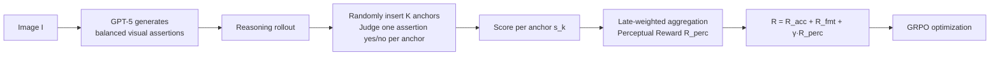

# More Thought, Less Accuracy? On the Dual Nature of Reasoning in Vision-Language Models

**Conference**: ICLR 2026  
**OpenReview**: [https://openreview.net/forum?id=XpL5eqjCjF](https://openreview.net/forum?id=XpL5eqjCjF)  
**Code**: To be confirmed  
**Area**: Multimodal Reasoning / VLM Reinforcement Learning  
**Keywords**: VLM, Multimodal Reasoning, GRPO, Visual Forgetting, Perceptual Reward, Test-time Scaling  

## TL;DR
The paper reveals the "double-edged sword" nature of multimodal reasoning—longer reasoning improves logic but weakens perceptual grounding due to "visual forgetting." It proposes VAPO (Visual-Anchored Policy Optimization), which inserts visual anchors and utilizes perceptual rewards to pull reasoning back to visual evidence, achieving a new SOTA with VAPO-Thinker-7B.

## Background & Motivation
- **Background**: In LLMs, long-chain reasoning trained via RL (especially GRPO) has become standard for math and code tasks. The rule "think longer, perform better" is treated as universal. The community has naturally migrated this to VLMs, achieving good results in visual tasks like geometry, navigation, and detection.
- **Limitations of Prior Work**: The "side effects" of reasoning in multimodal scenarios have rarely been systematically studied. Isolated signals show anomalies—some work found explicit reasoning yields only marginal gains over direct answers, while others observed reasoning length "collapsing" during multimodal RL training as accuracy rises, suggesting reasoning is not a free lunch in VLMs.
- **Key Challenge**: Through fine-grained "early decision" analysis, this paper finds that reasoning provides significant early gains, but these returns saturate or even reverse. In vision-intensive benchmarks like MMStar and HallusionBench, accuracy drops by over 2% from its peak, nearly offsetting the benefits of reasoning. Error analysis shows that **over 50% of failures are perceptual errors** (misreading charts, hallucinations) rather than logical errors (33%), and many can be corrected by "early stopping."
- **Goal**: Understand the root cause of "more thought, less accuracy" and propose a solution at the training level rather than a test-time patch.
- **Key Insight**: **[Causal Diagnosis]** The root cause is attributed to **visual forgetting**—as reasoning progresses, the model's attention to visual tokens decays, and decisions become increasingly dominated by history rather than the image. **[Training-level Fix]** VAPO is proposed to insert "visual anchors" along the reasoning path and use the model's judgment on visual assertions as a **perceptual reward** to explicitly incentivize visual grounding.

## Method

### Overall Architecture
VAPO is a multimodal alternative to GRPO: it retains the group-relative optimization framework while introducing a "perceptual reward" pathway. First, GPT-5 generates a balanced set of true/false visual assertions for each image. During the training rollout, these assertions are randomly inserted as "anchors" at different positions in the reasoning trajectory. The model's ability to judge these assertions at each anchor probes its current perception. Finally, anchor scores are aggregated using "late-weighting" into a perceptual reward, which is fed back into the GRPO objective alongside accuracy and format rewards.

### Key Designs

**1. Visual Assertion Generation: Isolating perception with "independently verifiable" probes.** To accurately measure if the "model is still looking at the image," assertions must be: (1) **Balanced**, with equal true/false counts to avoid bias; (2) **Independent**, where judgment relies solely on visual input rather than reasoning history. The authors use GPT-5 to generate diverse assertions **given only the image, not the question**, ensuring verification is purely based on perception to prevent the model from guessing via context.

**2. Visual Anchor Insertion: Slicing the trajectory into perceptible checkpoints.** Given a reasoning trajectory $o_i = (o_{i,1}, \dots, o_{i,T})$, a set of anchors $A_i = \{a_1, \dots, a_K\}$ is randomly distributed where $a_k \in [1,T]$. At each anchor $a_k$, an assertion $c_k$ is sampled and appended to the prefix reasoning context. The model's binary judgment is compared against the ground truth label $l_k$:

$$s_k = \mathbb{1}\!\left[\arg\max_{j\in\{\text{yes},\text{no}\}} \pi_\theta(j \mid q, I, o_{i,<a_k}, c_k) = l_k\right]$$

This functions as a recurring "can you still see the image?" quiz, transforming abstract "grounding" into quantifiable signals.

**3. Late-Weighted Perceptual Reward: Targeting visual decay at the end of reasoning.** Since perception is weakest in the late stages of reasoning, the authors apply "late-emphasis" weighting to aggregate scores, giving higher weight to later anchors:

$$R_{\text{perc}} = \frac{\sum_{k=1}^{K} w_k s_k}{\sum_{k=1}^{K} w_k}, \qquad w_k = \exp\!\left(\beta \cdot \frac{a_k}{T}\right)$$

where $\beta$ controls the emphasis on late anchors (default $\beta=1.5$, roughly 50% weight on the final 30% of anchors).

**4. Accuracy-Gated Reward to prevent reward hacking.** Perceptual reward is an auxiliary signal; simply adding it might lead to reward hacking where the model generates extremely short reasoning to maximize perception scores. Thus, it is gated by accuracy:

$$R_i = R_{\text{acc}} + R_{\text{fmt}} + \gamma \cdot \mathbb{1}[R_{\text{acc}}=1] \cdot R_{\text{perc}}$$

The perceptual reward only activates if the answer is correct ($R_{\text{acc}}=1$) with $\gamma=0.1$, encouraging grounding without incentivizing trivial short reasoning.

## Key Experimental Results

Implementation: Base model Qwen2.5-VL (3B/7B), trained on ViRL39K for 2 epochs, lr=5e-6, 5 responses per sample; $K=20, \beta=1.5, \gamma=0.1$.

### Main Results

Mathematical Benchmarks (7B scale, Average):

| Model | MathVerse | MathVista | MathVision | LogicVista | WeMath | Geo3k | Avg. |
|------|-----------|-----------|------------|------------|--------|-------|------|
| Qwen2.5-VL-7B | 40.7 | 62.3 | 23.2 | 42.6 | 33.1 | 38.5 | 40.1 |
| R1-OneVision-7B | 46.4 | 64.1 | 29.9 | 45.6 | 44.6 | 46.1 | 46.1 |
| VLAA-Thinker-7B | 48.2 | 68.0 | 26.4 | 48.5 | 41.5 | 50.6 | 47.2 |
| Vision-R1-7B | 52.4 | 73.5 | 28.2 | 49.7 | 41.6 | 49.0 | 49.1 |
| **VAPO-Thinker-7B** | **53.3** | **75.6** | **31.9** | **50.9** | 43.6 | **51.3** | **51.1** |

General Benchmarks (7B scale, Average):

| Model | MMMU | MMStar | Hall | MMVet | Avg. |
|------|------|--------|------|-------|------|
| Vision-R1 | 57.6 | 61.4 | 49.5 | 71.1 | 59.9 |
| **VAPO** | **60.2** | **63.0** | **57.4** | **71.9** | **63.1** |

Math gains are ~2% (49.1→51.1), while general benchmarks improve more significantly by 3.2% (59.9→63.1), setting a new SOTA.

### Ablation Study

Comparison with "test-time patches" (FP=focus prompt, VR=visual replay):

| Model | WeMath | Geo3k | MMStar | Hall | Avg. |
|------|--------|-------|--------|------|------|
| V-R1 + FP | 42.1 | 49.7 | 61.8 | 50.5 | 51.0 |
| V-R1 + VR | 42.5 | 50.5 | 62.1 | 51.8 | 51.7 |
| **VAPO** | **43.6** | **51.3** | **63.0** | **57.4** | **53.8** |

Hyperparameter Ablation: As anchor count $K$ increases from 0 (vanilla GRPO) to 20, accuracy rises and saturates; $\beta=1.5$ is optimal for the late-weighting factor.

### Key Findings
- **Double-edged sword curve**: Accuracy rises then falls as reasoning progresses; vision-intensive benchmarks (MMStar, HallusionBench) show the sharpest declines.
- **Perception errors dominate**: In failed full-reasoning cases, perception errors account for 55.23%, logic for 33.05%, and 32.35% of perception errors are salvageable via early decision.
- **Visual forgetting visualization**: In vanilla reasoning, visual token attention decays monotonically to nearly zero. Visual replay/focus prompts trigger temporary spikes in attention.
- **VAPO flattens the decay**: Compared to the baseline, VAPO's attention decay is much slower, maintaining higher levels in late stages; accuracy continues to rise steady instead of dropping.

## Highlights & Insights
- **Counter-intuitive yet solid diagnosis**: It disproves the "longer is better" belief for VLM reasoning, using attention curves, error attribution, and early decision analysis to pin down "visual forgetting."
- **Paradigm shift from patches to training**: While visual replay/focus prompts are "probes," VAPO bakes visual grounding into the reward, proving that a fundamental cure requires intervention during training.
- **Gating and weighting**: The late-weighting addresses the terminal decay, and the accuracy gate prevents reward hacking, making the method robust.

## Limitations & Future Work
- **Reliance on external models**: Assertions are generated by GPT-5; quality, cost, and bias are tied to the external model.
- **Assertions as perception proxies**: Whether binary yes/no assertions fully capture "grounding" for complex spatial or fine-grained attributes remains debatable.
- **Modest gains on small models**: The average math gain is only +2% at 7B and even smaller at 3B, showing limited marginal utility for logic-centric tasks.
- **Deeper mechanisms untouched**: Visual forgetting is described as an attention phenomenon, but *why* long reasoning systematically crowds out visual attention remains an open architectural question.

## Related Work & Insights
- **Tension with LLM reasoning**: Test-time scaling (TTS) beliefs from LLM do not directly generalize to VLM, warning the community to re-evaluate assumptions during cross-modal transfer.
- **Visual bias/Forgetting**: Early VLM text bias was mitigated via test-time methods like contrastive decoding; this work points out that long-reasoning scales this problem up and provides a training-level solution.
- **Inspiration**: The idea of "periodically forcing a look back at the source" (anchors + process rewards) can be transferred to other RAG or multimodal scenarios where long generation drifts from evidence.

## Rating
- **Novelty**: ⭐⭐⭐⭐ First to systematically reveal the VLM reasoning "double-edged sword" and identify "visual forgetting."
- **Experimental Thoroughness**: ⭐⭐⭐⭐ 10 benchmarks, two scales, comparison with test-time patches, and extensive visualization.
- **Writing Quality**: ⭐⭐⭐⭐ Logical flow from phenomenon to diagnosis to solution.
- **Value**: ⭐⭐⭐⭐ Practical and easy to implement as a GRPO replacement; provides direct guidance for multimodal RL.

<!-- RELATED:START -->

## Related Papers

- [\[CVPR 2026\] Select Less, Reason More: Prioritizing Evidence Purity for Video Reasoning](../../CVPR2026/vlm_reasoning/select_less_reason_more_prioritizing_evidence_purity_for_video_reasoning.md)
- [\[ICLR 2026\] ThinkMorph: Emergent Properties in Multimodal Interleaved Chain-of-Thought Reasoning](thinkmorph_emergent_properties_in_multimodal_interleaved_chain-of-thought_reason.md)
- [\[CVPR 2026\] Improving Vision-language Models with Perception-centric Process Reward Models](../../CVPR2026/vlm_reasoning/improving_vision-language_models_with_perception-centric_process_reward_models.md)
- [\[ICLR 2026\] Beyond Classification Accuracy: Neural-MedBench and the Need for Deeper Reasoning Benchmarks](beyond_classification_accuracy_neural-medbench_and_the_need_for_deeper_reasoning.md)
- [\[ICLR 2026\] OmniSpatial: Towards Comprehensive Spatial Reasoning Benchmark for Vision Language Models](omnispatial_towards_comprehensive_spatial_reasoning_benchmark_for_vision_languag.md)

<!-- RELATED:END -->
