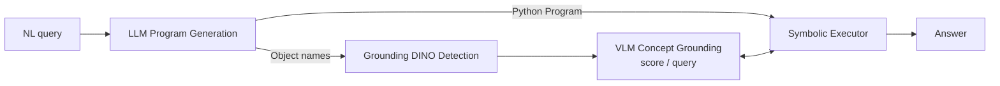

# NePTune: A Neuro-Pythonic Framework for Tunable Compositional Reasoning on Vision-Language

**Conference**: ICLR 2026  
**OpenReview**: [https://openreview.net/forum?id=8H0TkSusWI](https://openreview.net/forum?id=8H0TkSusWI)  
**Code**: [https://github.com/HLR/NePTune](https://github.com/HLR/NePTune)  
**Area**: Vision-Language Reasoning / Neuro-Symbolic  
**Keywords**: Compositional Reasoning, VLM, Neuro-Symbolic, Soft Logic, Program Generation, Visual Prompting, Domain Adaptation  

## TL;DR
NePTune enables LLMs to translate natural language questions into "hybrid Python programs"—combining imperative control flow with soft logic operators—executed by scoring atomic concepts with a VLM under uncertainty to achieve training-free yet fine-tunable compositional visual reasoning.

## Background & Motivation
**Background**: Modern VLMs perform exceptionally well across various tasks but remain fragile in "compositional reasoning" (decomposing known concepts to solve new problems). Neuro-Symbolic (NeSy) methods are a promising direction, currently split into two camps: one uses LLMs to generate imperative code calling pre-trained vision models (e.g., VisProg/ViperGPT), while the other parses questions into differentiable declarative first-order logic to learn concepts end-to-end (e.g., LEFT/NeSyCoCo).

**Limitations of Prior Work**: Imperative program methods rely on chains of "crisp decisions," where an early object recognition error causes the entire reasoning chain to collapse; furthermore, they are non-differentiable and cannot adapt to new domains. Differentiable declarative methods support global reasoning under uncertainty but are restricted to concepts learned during training, showing poor zero-shot capabilities. Additionally, the authors find that LLMs are more prone to errors when generating ProbLog compared to Python.

**Key Challenge**: The expressive power of imperative programming (Turing-complete, LLM-friendly) and the robustness of global soft reasoning under uncertainty (differentiable, resistant to perceptual noise) have long been isolated in separate methodologies.

**Goal**: To combine the advantages of both camps—attaining Python's procedural expressiveness and zero-shot availability alongside the differentiable global reasoning and domain adaptation capabilities of soft logic applied to VLM uncertainty scores.

**Core Idea**: **[Hybrid Execution]** Use an LLM to translate queries into Python programs containing both imperative control flow (for/if/set operations) and soft logic operators with overloaded `&`/`|` that perform fuzzy logic operations on continuous concept scores provided by the VLM. **[Perception-Reasoning Decoupling]** Treat the VLM as an "atomic concept scorer" rather than a "direct answerer," making it training-free while supporting optional fine-tuning via differentiable operators.

## Method

### Overall Architecture
NePTune decomposes visual reasoning into three sequential components: the LLM Program Generator translates the natural language query into a Python program and a set of relevant object names; Perceptual Grounding uses these names to invoke Grounding DINO for candidate box detection and grounds atomic predicates into concept scores via the VLM; the Symbolic Executor runs the program in a standard Python interpreter, interacting with the VLM through `score`/`query` interfaces for hybrid soft and imperative reasoning to reach the final answer.

### Key Designs

**1. LLM Program Generation: Python as a Turing-complete symbolic language.** NePTune delegates semantic parsing to an LLM few-shot parser. For a query like "Is there a big brown dog?", the LLM outputs a multi-step Python program (finding "dog" candidates, then performing compositional reasoning on atomic concepts like big, dog, and brown) and a list of object names for region proposals. Python is chosen over ProbLog/FOL because its Turing-completeness is natural for complex procedural reasoning and LLMs are highly proficient with Python code.

**2. Perceptual Grounding: Object proposals + dual-interface concept scoring.** Object names are fed to Grounding DINO to obtain bounding boxes. Symbolic predicates are grounded to pixels via two interfaces: `score(query, num_objects)` writes the predicate as a natural language question (e.g., `blue` becomes "Is the object in the red bounding box blue?") using red/green boxes as visual prompts. It returns a normalized confidence for "Yes" based on logits:

$$s = p(\text{"Yes"}\mid I, v, q_a) = \frac{e^{\text{logit("Yes")}}}{e^{\text{logit("Yes")}} + e^{\text{logit("No")}}}$$

`num_objects` distinguishes predicate types: 0 for global questions, 1 for single objects (returning a vector of length N), and 2 for relations (red box for subject, green for object, returning an N×N matrix). The `query(query, object_id)` interface returns open-ended natural language strings for "what/which" questions or to extract symbolic attributes for intermediate variables.

**3. Hybrid Symbolic Execution: Fusing soft composition and imperative reasoning.** The executor supports two modes. Soft compositional reasoning uses fuzzy logic: custom data structures encapsulate score tensors and overload Python operators to work on continuous uncertainty scores—e.g., `brown & dog` computes the element-wise minimum (fuzzy t-norm for conjunction). Operators include existential $\exists x\,\alpha_x = \max(\alpha_x)$, universal $\forall x\,\alpha_x = \min(\alpha_x)$, implication $\alpha_x \to \alpha_y = \max(1-\alpha_x, \alpha_y)$, summation $\sum_x \alpha_x$, and a differentiable sigmoid form for comparison with temperature $\tau=0.25$ and margin $\gamma=0.25$. Imperative reasoning utilizes standard Python for high-level structure and control flow (if/else, loops), as concept objects have defined iterations and boolean behaviors.

## Key Experimental Results

Experiments evaluate zero-shot compositional reasoning on synthetic data, complex human questions, referring expression grounding on real images, and generalization under domain shift. The backbone VLM is primarily InternVL2.5-8B.

### Main Results

Accuracy on CLEVR categories (Neural vs. Neuro-Symbolic):

| Method | Training | Final | Exist | Query Attr | Compare Attr | Count | Compare Num |
|------|------|-------|-------|-----------|--------------|-------|-------------|
| InternVL2.5 (Neural) | Zero-Shot | 90.25 | 87.10 | 98.26 | 98.61 | 74.60 | 90.86 |
| **NePTune** | Zero-Shot | **92.65 (↑2.40)** | 93.19 (↑6.09) | 96.81 (↓1.45) | 91.94 (↓6.67) | 87.10 (↑12.50) | 92.57 (↑1.71) |
| ViperGPT | Zero-Shot | 36.05 | 48.75 | 29.42 | 53.06 | 21.37 | 48.57 |
| NeSyCoCo | Trained | 99.68 | — | — | — | — | — |
| LEFT | Trained | 99.50 | — | — | — | — | — |

CLEVR Extended Tasks (↑ relative to InternVL2.5-8B, † uses ground-truth programs):

| Method | Ref(%) | Puzzles(%) | RPM(%) |
|------|--------|-----------|--------|
| NeSyCoCo (Trained) | 94.00 | 94.00 | 74.00 |
| LEFT (Trained) | 94.00 | 85.00 | 87.00 |
| InternVL2.5-8B (Zero-shot) | 27.00 | 52.00 | 47.00 |
| ViperGPT | 8.00 | 34.00 | 4.00 |
| **NePTune†** | 99.00 (↑72) | 85.00 (↑33) | 97.00 (↑50) |
| **NePTune** | 91.00 (↑64) | 81.00 (↑29) | 80.00 (↑33) |

Real Images and Domain Shift: On CLEVR-Humans, NePTune achieves 87.67%, outperforming LEFT/NeSyCoCo by ~↑31.55%. On Ref-GTA (gaming domain shift), the InternVL2.5-8B backbone drops to 6.95%, whereas NePTune maintains **69.69%**.

### Ablation Study

| Comparison | Dataset | Result |
|------|--------|------|
| NeSyCoCo+VLM (scaled with InternVL2.5) | CLEVR-Humans | 68.48 (↑12.36 vs NeSyCoCo, but inferior to NePTune's 87.67) |
| NePTune(1B) + NeSy Fine-tuning (1000 samples) | Ref-GTA | 69.90 ± 1.16 |
| InternVL2.5-1B + Vanilla Neural Fine-tuning | Ref-GTA | Only 32.61 ± 0.35 |
| VLM Atomic Query Ability (Micro-F1) | CLEVR/VG | InternVL2.5 overall 94.54 / 90.41, higher than its multi-step reasoning |

### Key Findings
- The largest gains occurred in "quantification" categories where compositional structure is vital (Count ↑12.50, Exist ↑6.09). Performance dipped in Attribute Comparison (↓6.67), revealing VLM weaknesses in scoring analogical relations (e.g., same-color).
- Domain shift is NePTune's strongest field: While pure neural VLMs collapse on Ref-GTA (6.95%), NePTune maintains performance through global symbolic reasoning.
- Differentiability of soft operators allows "using neuro-symbolic signals as supervision": fine-tuning a small VLM with just 1000 samples doubled the performance of vanilla fine-tuning on Ref-GTA.
- The VLM's ability to answer atomic questions (F1 ~94) is far superior to answering complex multi-step questions, validating the perception-reasoning decoupling hypothesis.

## Highlights & Insights
- **Hybrid execution is the true selling point**: Rather than simply concatenating imperative and declarative modes, operator overloading allows soft logic to be seamlessly embedded in Python control flow, preserving Turing-completeness while enabling global reasoning on continuous scores.
- **Training-free yet fine-tunable**: These seemingly contradictory attributes coexist. Zero-shot relies on VLM scoring, while domain adaptation leverages differentiable soft operators, offering a new path for "Neuro-Symbolic as a supervision source."
- Selecting Python over ProbLog/FOL is a pragmatic engineering insight—the reliability of LLMs generating Python is significantly higher, reducing system brittleness.
- Grounding relational predicates into N×N matrices using red/green visual prompts is an elegant way to map symbolic relations to VLMs.

## Limitations & Future Work
- Scoring for analogical concepts (same-color/shape/size) remains weak, which is a VLM perception bottleneck rather than a framework failure.
- Imperative operations (like set counting) cut the computation graph, preventing these parts from participating in gradient backpropagation and limiting the scope of end-to-end fine-tuning.
- Performance ceilings are constrained by the backbone VLM's atomic scoring and Grounding DINO's recall; visual prompts can still fail in highly complex scenes.
- The pipeline involves multiple large models (LLM + DINO + multiple VLM scores), leading to high inference overhead and latency.

## Related Work & Insights
NePTune bridges the gap between VisProg/ViperGPT (imperative program generation) and LEFT/NeSyCoCo (differentiable declarative logic), while benchmarking against NS-VQA/NS-CL execution paradigms. Its differentiation lies in "Hybrid reasoning + Dynamic predicates + VLM as a scorer + Tunability." The core insight is: since LLMs can reliably generate general-purpose code, it is better to embed soft logic operators into the languages they excel at, rather than forcing them to generate formal logic. Decoupling the VLM as an "atomic capability provider" combined with a symbolic layer is an effective path for compositional generalization and enters resistance to domain shift.

## Rating
- **Novelty**: ⭐⭐⭐⭐ Embedding soft fuzzy logic operators into imperative Python via operator overloading to unify two NeSy paradigms is novel and self-consistent.
- **Experimental Thoroughness**: ⭐⭐⭐⭐ Covers zero-shot to real-world domain shifts across multiple backbones, including detailed atomic diagnostics and fine-tuning comparisons.
- **Writing Quality**: ⭐⭐⭐⭐ Clear structure; the taxonomy in Table 1 and the three-component narrative make the motivation easy to follow.
- **Value**: ⭐⭐⭐⭐ Provides a feasible path for using neuro-symbolic signals to supervise VLMs, offering practical insights for compositional reasoning and domain adaptation.

<!-- RELATED:START -->

## Related Papers

- [\[ICLR 2026\] Test-Time Matching: Unlocking Compositional Reasoning in Multimodal Models](test-time_matching_unlocking_compositional_reasoning_in_multimodal_models.md)
- [\[ICLR 2026\] CompoDistill: Attention Distillation for Compositional Reasoning in Multimodal LLMs](compodistill_attention_distillation_for_compositional_reasoning_in_multimodal_ll.md)
- [\[CVPR 2026\] DeepScan: A Training-Free Framework for Visually Grounded Reasoning in Large Vision-Language Models](../../CVPR2026/vlm_reasoning/deepscan_a_training-free_framework_for_visually_grounded_reasoning_in_large_visi.md)
- [\[CVPR 2026\] Scaling Test-Time Robustness of Vision-Language Models via Self-Critical Inference Framework](../../CVPR2026/vlm_reasoning/scaling_test-time_robustness_of_vision-language_models_via_self-critical_inferen.md)
- [\[ICLR 2026\] More Thought, Less Accuracy? On the Dual Nature of Reasoning in Vision-Language Models](more_thought_less_accuracy_on_the_dual_nature_of_reasoning_in_vision-language_mo.md)

<!-- RELATED:END -->
