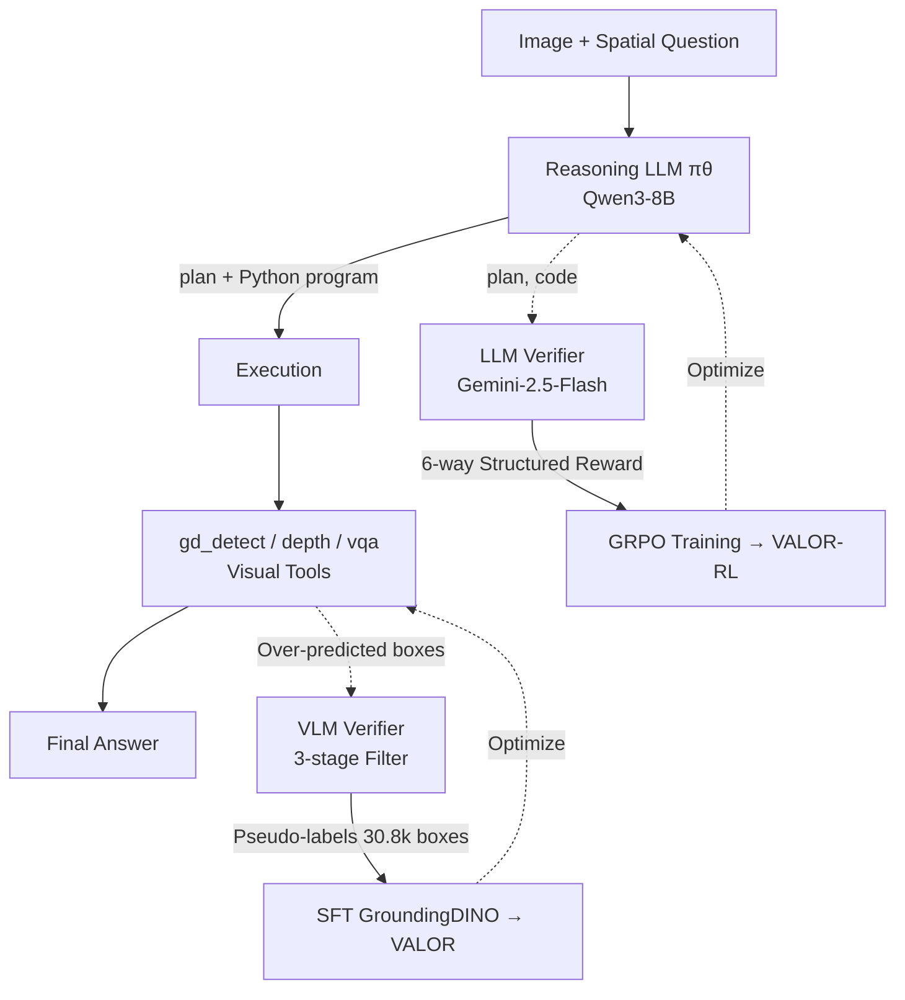

# No Labels, No Problem: Training Visual Reasoners with Multimodal Verifiers

**Conference**: ICLR 2026  
**OpenReview**: [https://openreview.net/forum?id=H7gtryDnVK](https://openreview.net/forum?id=H7gtryDnVK)  
**Code / Project Page**: [https://glab-caltech.github.io/valor/](https://glab-caltech.github.io/valor/)  
**Area**: Visual Reasoning / Tool-use / Annotation-free Training  
**Keywords**: Spatial reasoning, Multimodal verifiers, Verifiable reward RL, Visual grounding, Hard negative mining, Tool-use  

## TL;DR
VALOR is proposed: a **completely annotation-free** training framework for visual reasoning. It scales programmatic reasoning via RL with LLM verifiers and enhances visual grounding via hard-negative mining with VLM verifiers. A small Qwen3-8B combined with visual expert tools outperforms both open-source and closed-source large models in spatial reasoning.

## Background & Motivation
- **Background**: Visual reasoning (especially spatial reasoning) requires models to both precisely locate objects (grounding) and understand complex spatial relations. Existing methods follow two paths—**Language Chain-of-Thought (CoT)**, where VLMs generate reasoning in text, and **Program Synthesis**, where LLMs write code to call visual expert tools.
- **Limitations of Prior Work**: CoT methods are **data-hungry**, requiring massive (image, question, answer) triplets, and often suffer from weak visual understanding or logical errors (e.g., GPT-5-Thinking in Fig.1 relies on pixel dimensions while ignoring real 3D sizes). Program synthesis is **training-free** but relies on closed-source LLMs and "misaligned" pre-trained experts, leading to logical bugs and imprecise grounding.
- **Key Challenge**: High-quality ground-truth annotations for visual reasoning are **virtually non-existent**, and expert tools must be fine-tuned on target domains (robotics, manipulable objects, etc.) to be reliable—yet annotation costs are prohibitive. How can both **reasoning** and **grounding** be strengthened under a "zero-annotation" premise?
- **Goal**: To build a scalable, annotation-free training paradigm for **jointly optimizing** the reasoning LLM and visual grounding tools.
- **Core Idea**: **[Verification is more reliable than generation]** Drawing from "verifiable reward RL" in mathematical reasoning—stronger VLMs/LLMs act more reliably as **verifiers (critics)** than as **generators**. Thus, an LLM verifier constructs structured rewards to guide reasoning RL, and a VLM verifier filters detector over-predictions into pseudo-labels to reinforce grounding. The entire process **never touches ground-truth answers**.

## Method

### Overall Architecture
VALOR (**V**erifiers for **A**nnotation-free **LO**gic and **R**easoning) decomposes visual reasoning into "LLM planning + program -> visual expert tool execution." The LLM invokes three APIs: `gd_detect` (GroundingDINO), `depth` (MoGe2 point-level depth), and `vqa` (GPT-5-mini for attribute queries on crops). Training follows two complementary paths: **Reasoning logic enhanced via GRPO with an LLM verifier**, and **Grounding enhanced via SFT with pseudo-labels from hard-negative mining by a VLM verifier**. Both are driven solely by "answer-less (image, question) pairs."

### Key Designs

**1. Structured Six-way Reward LLM Verifier: Decomposing "correctness" into evaluable logical dimensions.** Simply asking a verifier "is this program correct" is too sparse. VALOR decomposes program quality into six binary rewards targeting specific spatial reasoning failure modes: `Format` (template check), `Syntax` (executable code), `Logic` (coherent plan), `Attribute` (correct object attributes like height/color), `Spatial` (coverage of spatial relations), and `Adherence` (faithful code implementation). `Format` and `Syntax` use a deterministic Python interpreter, while the others use a frozen pre-trained LLM verifier. The final reward is:

$$R(q,p,c) = r_{fmt}(p,c)\cdot\Big(\lambda_{sn} r_{sn}(c)+\lambda_{log} r_{log}(q,p)+\lambda_{att} r_{att}(q,p)+\lambda_{sp} r_{sp}(q,p)+\lambda_{ad} r_{ad}(p,c)\Big)$$

`Format` acts as a **hard constraint multiplier**. This allows the verifier to pinpoint errors like "calculated width instead of height" while providing dense learning signals.

**2. GRPO Optimization + Annotation-free Query Engine: Breaking the ceiling of small datasets.** Using structured rewards, the base LLM $\pi_\theta$ (Qwen3-8B) is optimized via GRPO (Group Relative Policy Optimization) to maximize expected advantage with KL constraints. Training data requires no ground truth: images are sampled from SA-1B, and Gemini-2.5-Flash generates spatial questions. OMNI3D-BENCH samples (without answers) are added for 3D coverage. This paradigm is **naturally scalable**. The study finds that just **800 queries** (400 from SA-1B, 400 from OMNI3D) are sufficient for GRPO.

**3. Three-stage VLM Verifier for Hard-negative Mining: Grounding reinforcement.** Grounding errors propagate through reasoning steps. Instead of manual labeling, VALOR leverages the detector: parsing `gd_detect` queries from LLM-generated programs, **deliberately lowering the confidence threshold** to force over-prediction (high recall), and using a frozen VLM for three-stage verification: ① Coarse filtering (on image with box overlay), ② Per-crop verification, and ③ De-duplication. Precision increases through stages: Coarse 0.45 → Crop 0.50 → De-duplication 0.75, with **zero human labels**.

**4. SFT Loop for Grounding Refinement.** Verified boxes serve as pseudo-labels to fine-tune GroundingDINO-T (freezing the Swin backbone and BERT encoder). The final training set contains **7,373 images and 30,826 bbox annotations**. The refined detector is fed back into VALOR, allowing grounding capability to scale with unlabeled data without hurting general detection (COCO val mAP slightly increased from 48.4 to 48.7).

## Key Experimental Results

### Main Results

**VALOR vs LLM + Tool-use (Same visual expert APIs)**:

| Model | OMNI3D | RoboSpatial | BLINK | VSR | RealWorldQA | GQA | TallyQA | CountBenchQA |
|------|:---:|:---:|:---:|:---:|:---:|:---:|:---:|:---:|
| GPT-4o | 38.0 | 56.6 | 64.2 | 67.4 | 54.5 | 58.0 | 49.9 | 67.6 |
| Gemini-2.5-Flash | 37.1 | 68.7 | 61.5 | 68.5 | 62.2 | 65.2 | 48.9 | 65.6 |
| Qwen3-8B (Base) | 37.5 | 60.5 | 63.9 | 68.2 | 53.3 | 57.4 | 50.1 | 68.6 |
| **VALOR-RL (Reasoning only)** | 43.9 | 61.8 | 67.3 | 70.3 | 53.5 | 57.6 | 49.5 | 67.6 |
| **VALOR (Reasoning+Grounding)** | **44.0** | **69.5** | **69.2** | **75.6** | 57.3 | 64.4 | **51.0** | **75.9** |

**VALOR vs RL-tuned VLMs (GRIT / ViGoRL, requires GT labels)**: Significant lead in heavy reasoning tasks—OMNI3D-BENCH 44.0% vs GRIT 27.3%; even on TallyQA (which GRIT trained on), VALOR leads 51.0% vs 46.4%.

**VALOR vs Program Synthesis (VisProg/ViperGPT/VADAR with GPT-4o)**: OMNI3D 44.0% vs VADAR 38.9%, using a much smaller open-source Qwen3-8B.

### Ablation Study

**Impact of Training Sample Size (OMNI3D-BENCH)**:

| # Training Samples | 0 (Base) | 40 | 160 | 400 | 800 |
|:---:|:---:|:---:|:---:|:---:|:---:|
| VALOR-RL | 37.5 | 40.0 | 39.2 | 40.8 | **43.9** |

**RL vs SFT (Same high-reward $R\ge0.7$ programs filtered by verifier)**:

| Method | OMNI3D | RoboSpatial | CountBenchQA |
|------|:---:|:---:|:---:|
| SFT | 38.3 | 64.5 | 74.5 |
| **VALOR (RL/GRPO)** | **44.0** | **69.5** | **75.9** |

### Key Findings
- **Modular gains**: VALOR-RL (reasoning only) primarily improves OMNI3D (+6.4%), BLINK, and VSR. Adding the trained detector (grounding) boosts **grounding-intensive** tasks: CountBenchQA +8.3%, RoboSpatial +7.7%.
- **Verifier capacity matters**: Gemini-2.5-Flash has an 87% agreement rate with human labels, while open-source models (Qwen3-8B / Llama-3.2-11B) only 15% / 7%, validating the core assumption.
- **Extreme Data Efficiency**: Only 40 unlabeled samples exceed the base model performance; 800 samples reach 43.9%, showing a continuous upward trend.
- **RL > SFT for Reasoning**: Given the same program trajectories, GRPO significantly outperforms SFT on reasoning-heavy tasks.
- **Small Model + Tools > Large Model Direct Answer**: VALOR is 9 points higher than GPT-4o direct answering on OMNI3D (44.0% vs 35.0%).

## Highlights & Insights
- **Verifying > Generating systematized**: The intuition that strong models are better critics is applied to two distinct sub-problems: reasoning (6-way rewards) and grounding (3-stage filtering).
- **Interpretable Rewards**: The rewards pinpoint where logic failed or which attribute was missed, making it friendlier for debugging and training than a scalar reward.
- **Over-prediction and pruning**: Converting the detector's weakness (low precision at high recall) into a source of hard negatives for the VLM verifier to "harvest" is a clever way to bootstrap 30k labels at zero cost.
- **Zero-annotation vs. Supervised RL-VLM**: By using a pure language LLM and answer-less data, VALOR **avoids data leakage** concerns prevalent in vision-language benchmarks.

## Limitations & Future Work
- **Grounding Bottleneck**: VALOR lags behind direct-answering VLMs (like Gemini-2.0-Flash) on CountBenchQA, suggesting that a VLM itself might be a better grounding base than GroundingDINO.
- **Single-point Dependency**: The training signal relies on Gemini-2.5-Flash. Systematic biases in the verifier (e.g., "under-rewarding") could skew the results.
- **Disjoint Training**: Grounding is currently SFT-based; embedding the VLM verifier directly into the RL loop is a future direction.
- **Fixed Toolsets**: Complex spatial relations (occlusion, counterfactuals) still rely on manually designed program patterns.

## Related Work & Insights
- **Verifiable Reward RL** (o1 / DeepSeek-R1): The direct inspiration. This work transfers "verifiable rewards" from domains with exact checkers (math) to visual reasoning where LLM verifiers approximate a checker.
- **Hard-negative Mining**: A classic computer vision technique (bootstrapping for face detection) is automated here using VLM verifiers.
- **Insight**: For any task where labels are scarce but strong critics are available, the "over-generate -> multi-dim verify -> recycle" paradigm is a scalable alternative to manual annotation.

## Rating
- **Novelty**: ⭐⭐⭐⭐ — A clean, unified framework for annotation-free reasoning and grounding.
- **Experimental Thoroughness**: ⭐⭐⭐⭐ — Strong baselines and comprehensive ablations across 8 benchmarks.
- **Writing Quality**: ⭐⭐⭐⭐ — Clear logic and well-explained reward formulations.
- **Value**: ⭐⭐⭐⭐ — Provides a practical, scalable route to outperform supervised methods using zero labels.

<!-- RELATED:START -->

## Related Papers

- [\[ICLR 2026\] ProxyThinker: Test-Time Guidance Through Small Visual Reasoners](proxythinker_test-time_guidance_through_small_visual_reasoners.md)
- [\[ICLR 2026\] Evaluating Cross-Modal Reasoning Ability and Problem Characteristics with Multimodal Item Response Theory](evaluating_cross-modal_reasoning_ability_and_problem_characteristics_with_multim.md)
- [\[ICLR 2026\] AutoGPS: Automated Geometry Problem Solving via Multimodal Formalization and Deductive Reasoning](autogps_automated_geometry_problem_solving_via_multimodal_formalization_and_dedu.md)
- [\[ICLR 2026\] VisualPRM400K: An Effective Dataset for Training Multimodal Process Reward Models](visualprm400k_an_effective_dataset_for_training_multimodal_process_reward_models.md)
- [\[ICML 2026\] Breaking Dual Bottlenecks: Evolving Unified Multimodal Models into Self-Adaptive Interleaved Visual Reasoners](../../ICML2026/vlm_reasoning/breaking_dual_bottlenecks_evolving_unified_multimodal_models_into_self-adaptive_.md)

<!-- RELATED:END -->
