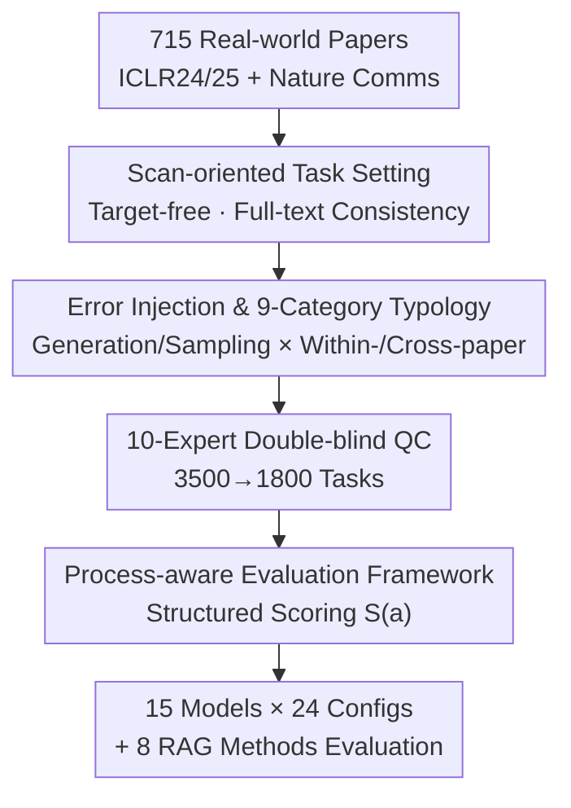

# Not Search, But Scan: Benchmarking MLLMs on Scan-Oriented Academic Paper Reasoning

**Conference**: ICLR 2026  
**Paper**: [ScholScan Project Page](https://bupt-reasoning-lab.github.io/ScholScan)  
**Code**: https://github.com/BUPT-Reasoning-Lab/ScholScan  
**Data**: https://huggingface.co/datasets/BUPT-Reasoning-Lab/ScholScan  
**Area**: Multimodal VLM / LLM Reasoning / Benchmark  
**Keywords**: Scan-oriented reasoning, academic paper understanding, scientific error detection, MLLM evaluation, process-aware assessment

## TL;DR
ScholScan proposes a new "scan-oriented" paradigm for academic paper reasoning—moving away from pre-defined retrieval targets and instead tasking models to read an entire paper like a reviewer to actively discover internal scientific inconsistencies. Based on 715 real-world papers, 9 error categories, and 1,800 tasks, this multimodal benchmark evaluated 15 models under 24 input configurations. The findings reveal that even the strongest MLLMs score below 60 across all error categories, and RAG provides almost no assistance, exposing systematic shortcomings in the existing "search-oriented" paradigm.

## Background & Motivation

**Background**: Currently, the mainstream approach for MLLM-based academic paper understanding is a "search-oriented" paradigm. Given an explicit question (e.g., "What methodological issues arise from short-interval calcein labeling?"), the model first retrieves relevant text segments and then performs local reasoning. Systems like PaSa and Google Deep Research are built on this "locate then reason" logic, which is effective for tasks with clear targets.

**Limitations of Prior Work**: However, actual researchers do not read papers this way. Tasks such as peer review, reproduction, and bug hunting have **no predefined targets**—one does not know where an error is hidden or its type. One must read the entire text and cross-reference information scattered across different sections and pages to find contradictions. Existing benchmarks (CharXiv, ArXivQA, MMLongBench-Doc, etc.) almost exclusively use the QA paradigm, where questions often **contain clues** and assume an answer exists. This weakens the evaluation of "global understanding + information organization" capabilities. Furthermore, evaluations typically only check the correctness of the final answer, ignoring whether the intermediate reasoning is supported by evidence or logically sound.

**Key Challenge**: The search-oriented paradigm inherently relies on "predefined targets + relevance retrieval," whereas researcher-level full-text understanding requires "target-free + consistency checking." The former tests the ability to "find and reason locally," while the latter tests the ability to "actively scan the full text, construct a document-level evidence view, and perform evidence-based reasoning." These are distinct capabilities, and benchmarks for the former cannot reveal the shortcomings of the latter.

**Goal**: To construct a benchmark that truly examines "target-free full-text scanning + cross-source evidence reasoning + process-verifiable evaluation," and to systematically quantify how much current MLLMs fall short and where.

**Key Insight**: The authors instantiate the scanning task through **scientific error detection**. Discovering non-explicit flaws in a paper without any prompts naturally requires reading the full text and constructing autonomous concepts and inferences, which forces the use of scan-oriented capabilities.

**Core Idea**: Flip the task from "retrieval-based reasoning with a given target" to "target-free scanning for consistency issues," paired with a **process-aware** evaluation framework that assesses not only detection accuracy but also evidence localization and reasoning chain integrity.

## Method

### Overall Architecture

ScholScan is not a single model but a "data-task-evaluation" trinity benchmark. Starting from 715 real papers, tasks are set as **target-free scan-oriented queries** (e.g., telling the model only to "check Method for measurement issues" without specifying where or what they are). Through LLM injection and expert quality control, 1,800 tasks across 9 categories were constructed with labeled evidence and reasoning chains. Finally, a structured scoring formula $S(a)$ evaluates "detection accuracy + evidence quality + reasoning faithfulness." The pipeline is as follows:

The diagram from top to bottom corresponds to the three core contributions: **Scan-oriented task setting** (B), **Error injection and the 9-category typology** (C, with D as its quality control), and the **Process-aware evaluation framework** (E). A and F represent the data source and evaluation application, respectively.

### Key Designs

**1. Scan-oriented Task Paradigm: Converting "target-based retrieval" to "target-free active scanning"**

This is the foundation of the work, directly addressing the pain point that the search-oriented paradigm fails to measure full-text understanding. In a search-oriented setup, a question might be "What methodology problem exists in short-interval calcein labeling?"—the target is named, and the model only needs to retrieve the segment on Page 3. In ScholScan’s scan-oriented setup, the query becomes "Evaluate the Methods section for Measurement & Operationalization (MO) issues." With **no specific target**, the model must scan the whole text, cross-referencing "calcein labeling with a one-day interval" on Page 3 with the "BFR/MAR values" reported on Page 5 to discover the disconnect: such labeling intervals cannot effectively measure MAR/BFR, yet these values were still reported. Its essence is shifting the evaluation focus from "relevance retrieval" to "**consistency checking**": all necessary concepts and inferences must be derived from the document itself rather than from question clues.

**2. Error Injection & 9-Category Typology: Controllable generation of "real, falsifiable, full-lifecycle" scientific errors**

A new paradigm requires large-scale, high-quality, verifiable samples. ScholScan categorizes errors into **9 types** spanning the research lifecycle: Research Question & Definition (RQD), Design & Identifiability (DI), Sampling & Generalization (SG), Measurement & Operationalization (MO), Data Handling & Preprocessing (DHP), Calculation & Formula (CF), Inference & Conclusion (IC), Reference & Citation Alignment (RCA), and Language & Expression (LE). Tasks are constructed along two dimensions: source (**Generation** vs. **Sampling**) and context (**Within-paper** vs. **Cross-paper**). For generation, Gemini 2.5 Pro is used on high-quality accepted papers to perform cross-section/cross-page sentence-level rewrites, synthesizing composite errors. For sampling, explicit, falsifiable scientific errors are extracted from rejected ICLR submissions and their public reviews (excluding subjective comments on novelty/writing). Cross-paper tasks test citation consistency by providing an accepted paper and a cited reference with an introduced misinterpretation. QC is critical: 10 experts performed **independent double reviews + third-party arbitration** on 3,500 candidates, discarding 1,700 and revising 1,541 to ensure errors are factual rather than LLM hallucinations.

**3. Process-aware Evaluation Framework: Assessing "what was found" and "why it was found"**

To address the issue of outcome-only evaluation, ScholScan parses model output $a$ into a structured tuple $\Psi(a)\Rightarrow(\mathbb{1}_{\text{exist}}, \mathbb{1}_{\text{contain}}, \hat{E}, \hat{R}, n)$. These represent whether an error was reported, whether the target error was hit, the predicted evidence set $\hat{E}$, reasoning chain $\hat{R}$, and the number of unrelated errors $n$. The final score multiplies four components:

$$S(a) = S_{\text{detection}} \cdot \sqrt{S_{\text{location}} \cdot S_{\text{reasoning}} \cdot P_{\text{unrelated}}(n)}$$

Where detection score $S_{\text{detection}}=\mathbb{1}_{\text{exist}}\cdot\mathbb{1}_{\text{contain}}$ acts as a hard threshold (0 if target is missed); $S_{\text{location}}$ uses a squared-penalty Dice score to reward correct evidence and penalize noise; $S_{\text{reasoning}}=\left(\hat{g}/|R^*|\right)^2$ use prefix matching $\hat{g}=\text{prefix\_match}(\hat{R}, R^*)$ to measure reasoning chain alignment; and $P_{\text{unrelated}}(n)=0.9^{\min(n,2)}\exp\!\left(-0.6\,\max(n-2,0)^{1.5}\right)$ suppresses "spamming" errors to boost recall. Open-ended outputs are parsed by GPT-4.1 to extract citations and steps for alignment with labels, which manual validation shows matches expert annotations closely.

## Key Experimental Results

### Main Results

Evaluation covered 15 models across 24 configurations (Image input or Tesseract OCR Text). Scores are scaled to 100.

| Input | Model | Avg. | Strongest Cat | Weakest Cat (CF/LE) |
|------|------|------|---------|----------------|
| Image | GPT-5 | 19.2 | SG 28.2 | CF 13.8 / LE 6.9 |
| Image | Gemini 2.5 Pro | 15.6 | SG 35.7 | CF 4.6 / LE 7.4 |
| Text (OCR) | Gemini 2.5 Pro | **30.3** | DHP 56.6 | CF 10.3 / LE 8.1 |
| Text (OCR) | GPT-5 | 22.5 | DHP 36.7 | CF 4.7 / LE 2.6 |
| Text (OCR) | Qwen3-235B-Thinking | 17.4 | SG 31.9 | CF 5.6 / LE 2.3 |
| Text (OCR) | DeepSeek-R1 | 11.4 | SG 25.4 | CF 4.7 / LE 3.5 |

The best performance (Gemini 2.5 Pro via Text, 30.3) **did not exceed the 60-point threshold in any category**. Open-source models (e.g., Qwen2.5-VL-72B) scored near zero.

### Ablation Study

| Dimension | Key Data | Note |
|----------|---------|------|
| Reasoning vs. Instruct | Qwen3-Thinking 17.4 vs Instruct 1.7; DeepSeek-R1 11.4 vs V3.1 1.7 | Reasoning models are 10+ points higher, across all categories. |
| Text vs. Image | 9 MLLMs avg difference of 4.81 points (Text superior) | Visual processing of long multimodal input is a major bottleneck. |
| CF Exception | Image input outperforms text in CF | OCR flattens formulas/tables, losing structural information. |
| RAG (Text, Qwen3-Thin.) | Oracle 24.5 vs Baseline 17.4; BM25 16.7, NV-Embed 6.8 | Almost no gains (or regressions) except for Oracle. |
| RAG (Image, Llama4) | VRAG-RL 10.9 slight increase; ColPali/VisRAG ≈0.8–1.0 | Multimodal retrieval scores collapsed near 0. |
| Retrieval Quality | All embedding models Recall@5 < 50% (Max BM25 0.48) | Relevance retrieval fails in consistency tasks. |

### Key Findings
- **RAG failure**: 8 RAG methods provided no significant gains. Only the Oracle (providing ground-truth images) helped significantly (Text 17.4→24.5). This suggests the bottleneck is "reasoning even with evidence" rather than just "finding evidence."
- **Reasoning chain fragility**: Scores declined steadily as the required reasoning steps increased, revealing bottlenecks in constructing long causal chains.
- **Hidden complexity**: Even top models like GPT-5 often scan 8x more evidence and execute 3.5x more reasoning steps than ground truth just to approach an answer, yet still fail frequently.
- **"Confident Hallucination" in strong models**: Zero-score cases are either omissions (found nothing) or hallucinations (missed the actual error). Stronger models have fewer zero-scores but are more prone to overconfident hallucinations.
- **CF as a hard nut**: Low correlation between CF and other categories suggests mathematical/symbolic reasoning is a distinct capability dimension.

## Highlights & Insights
- **The paradigm shift itself is the contribution**: Moving from "search" to "scan" redefines the tested capability—from "relevance matching" to "global consistency checking."
- **Reusable process-aware scoring**: The $S(a)$ formula combines detection, localization, and reasoning with a hard threshold and penalties for noise, suitable for any task requiring verified evidence.
- **Diagnostic value of Rerieval vs. Reasoning**: The performance of Oracle vs. RAG cleanly isolates failure to "reasoning capability" rather than "retrieval ability."
- **OCR vs. Image Asymmetry**: Text is generally better, but images are superior for CF, highlighting that once structured content like formulas is flattened by OCR, information is irreversibly lost.

## Limitations & Future Work
- **Error distribution**: Synthesized errors via Gemini 2.5 Pro might diverge from naturally occurring flaws in real papers despite expert review.
- **Judge dependency**: Evidence extraction relies on GPT-4.1. While validated, judge bias might affect scoring, particularly in LE or CF categories.
- **Language issues (LE)**: Near-zero scores across all models in the LE category might suggest either extreme task complexity or potential subjectivity in the labels.
- **Future Directions**: Exploring training for long causal chains, structure-preserving multimodal encoding, and memory mechanisms specialized for consistency checking.

## Related Work & Insights
- **Comparison with search-based benchmarks (CharXiv / ArXivQA)**: These use the Search paradigm, evaluate only Outcome, and have limited domain coverage. ScholScan uses the Scan paradigm, evaluates Process+Outcome, and covers 13 scientific domains.
- **Comparison with document understanding (MMLongBench-Doc)**: While these handle long documents, they remain within the QA paradigm where the question implies an answer exists.
- **Comparison with RAG methods**: ScholScan shows that relevance-based retrieval fails for consistency-checking tasks where Recall@5 is consistently below 50%.

## Rating
- **Novelty**: ⭐⭐⭐⭐⭐ The shift to "scan-oriented" reasoning targets a blind spot in current benchmarks.
- **Experimental Thoroughness**: ⭐⭐⭐⭐⭐ Comprehensive coverage across 15 models, RAG methods, and fine-grained error analysis.
- **Writing Quality**: ⭐⭐⭐⭐ Logic is clear, though some category-specific failures (LE) could be further explained.
- **Value**: ⭐⭐⭐⭐⭐ Proves RAG is insufficient for consistency reasoning, directing future research toward holistic inference.

<!-- RELATED:START -->

## Related Papers

- [\[ICML 2026\] Imagination Helps Visual Reasoning, But Not Yet in Latent Space](../../ICML2026/vlm_reasoning/imagination_helps_visual_reasoning_but_not_yet_in_latent_space.md)
- [\[ICLR 2026\] JUDO: A Juxtaposed Domain-Oriented Multimodal Reasoner for Industrial Anomaly QA](judo_a_juxtaposed_domain-oriented_multimodal_reasoner_for_industrial_anomaly_qa.md)
- [\[ICLR 2026\] What "Not" to Detect: Negation-Aware VLMs via Structured Reasoning and Token Merging](what_not_to_detect_negation-aware_vlms_via_structured_reasoning_and_token_mergin.md)
- [\[ICLR 2026\] Mini-o3: Scaling Up Reasoning Patterns and Interaction Turns for Visual Search](mini-o3_scaling_up_reasoning_patterns_and_interaction_turns_for_visual_search.md)
- [\[ICLR 2026\] Children's Intelligence Tests Pose Challenges for MLLMs? KidGym: A 2D Grid-Based Reasoning Benchmark for MLLMs](childrens_intelligence_tests_pose_challenges_for_mllms_kidgym_a_2d_grid-based_re.md)

<!-- RELATED:END -->
