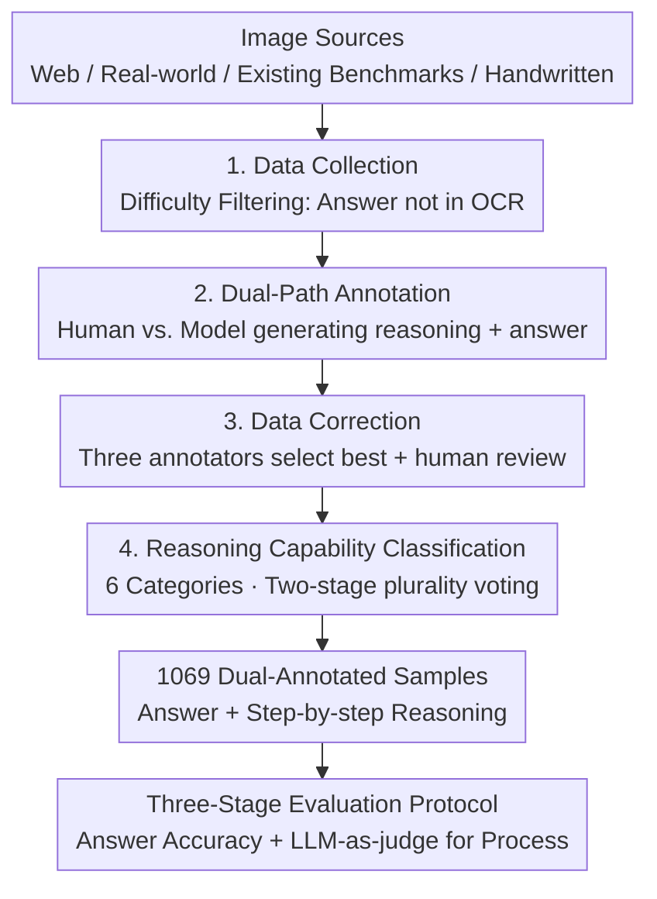

# OCR-Reasoning Benchmark: Unveiling the True Capabilities of MLLMs in Complex Text-Rich Image Reasoning

**Conference**: ICLR 2026  
**OpenReview**: [https://openreview.net/forum?id=aH7eyx64pC](https://openreview.net/forum?id=aH7eyx64pC)  
**Code**: https://github.com/SCUT-DLVCLab/OCR-Reasoning  
**Area**: Multimodal VLM / LLM Reasoning / Benchmarks & Datasets  
**Keywords**: Text-Rich Image Reasoning, OCR, Slow Thinking, Reasoning Process Evaluation, Benchmark

## TL;DR
The authors constructed OCR-Reasoning—the first benchmark to systematically evaluate the "text-rich image reasoning" capabilities of multimodal large language models (MLLMs). It includes 1,069 human-annotated samples covering 6 core reasoning capabilities across 18 practical tasks, providing both final answers and step-by-step reasoning processes. Results show that even the strongest MLLMs do not exceed 50% accuracy, revealing that this direction remains far from resolved.

## Background & Motivation

**Background**: "Slow-thinking" systems represented by OpenAI-o1, DeepSeek-R1, and Gemini-Thinking have made significant progress in math, code, and scientific reasoning through Chain-of-Thought (CoT) and test-time compute scaling. This has led to the emergence of multimodal slow-thinking models. To evaluate their reasoning capabilities, the community has developed specialized benchmarks such as MathVista, MathVerse, and MMMU targeting mathematical and academic knowledge.

**Limitations of Prior Work**: However, evaluation benchmarks are missing for "text-rich images" (text-dense scenarios like documents, charts, receipts, infographics, and handwritten problems), which are high-frequency applications. Existing benchmarks like DocVQA, ChartQA, and OCRBench primarily test the model's perception capability to "read" text and only annotate the final answer. In most of these cases, the answers appear directly in the OCR results, allowing models to use "fast thinking" for direct extraction without needing reasoning.

**Key Challenge**: Text-rich scenarios are actually full of tasks requiring deep analysis, such as financial report analysis, invoice auditing, and cost-effective purchasing decisions. Yet, existing benchmarks can neither distinguish between "extracting an answer" and "reasoning" nor evaluate the reasoning process itself. In other words, there is a structural mismatch between the focus of old benchmarks (perception/extraction) and real-world needs (reasoning on top of perception).

**Goal**: To fill this gap, three sub-problems must be addressed: (1) How to collect difficult samples where the answer is not in the OCR result and must be reasoned; (2) How to systematically define and cover core sub-capabilities involved in text-rich reasoning; (3) How to evaluate both the final answer and the reasoning process.

**Key Insight**: The authors observed that matching existing benchmark answers with image OCR results shows that 78%~99.8% of questions in DocVQA/OCRBench contain the answer directly within the OCR text, compared to only 2.3% in the carefully designed OCR-Reasoning. This contrast quantifies that "existing benchmarks test extraction, not reasoning." Constructing data based on the principle of "answer not directly extractable" forces true reasoning.

**Core Idea**: Construct a text-rich reasoning benchmark where answers cannot be directly read from OCR using "dual annotation (answer + step-by-step reasoning) + a 6-category core reasoning taxonomy," thereby revealing the overestimated capabilities of MLLMs in these scenarios.

## Method

OCR-Reasoning is an evaluation benchmark. The core work involves "how to create high-quality text-rich reasoning data that distinguishes reasoning from extraction" and "how to fairly evaluate answers and reasoning processes." The overall approach follows two lines: a four-step data construction pipeline (collection → annotation → correction → classification) and a three-stage evaluation protocol (extraction-based answer scoring + LLM-as-judge for the reasoning process). It results in 1,069 samples and 1,022 unique images, covering 6 reasoning capabilities and 18 tasks.

### Overall Architecture

Data construction follows a four-step human-in-the-loop pipeline with expert quality control at every stage:

The final dataset of 1,069 questions includes two formats: 250 multiple-choice (23.4%) and 819 free-response (76.6%, further split into integer/float/string). 92.3% of the questions and 100% of the reasoning paths are newly annotated. The reasoning chain + answer averages 421 characters (max 3,106), reflecting complexity. Additionally, Ours explicitly limits the scope to "single images" because multi-image/multi-document tasks primarily test long-context capabilities, which can confound reasoning evaluation, and many document MLLMs are trained only on single images.

### Key Designs

**1. Difficulty Filtering: Answer Not Directly Extractable from OCR**

This is the fundamental difference from DocVQA/OCRBench, addressing the limitation that "old benchmarks test extraction over reasoning." The authors use a quantifiable criterion: the proportion of samples where the "answer is contained in the OCR results." In existing benchmarks, this ranges from 78.4% (ChartVQA) to 99.8% (DocVQA), meaning models can copy from recognition results. OCR-Reasoning compresses this to 2.3%. To achieve this, the authors actively construct questions requiring multi-step calculation/inference (e.g., "How much cheaper is Package One compared to buying separately?" requires listing prices, summing, and subtracting) and filter out low-resolution or noisy images. Data sources are diverse—476 web images, 253 street view/handwritten photos, 293 from existing benchmarks like InfoVQA/DocVQA/ChartQA—with a specific addition of scarce handwritten reasoning data (annotators handwrote university-level chemistry, physics, geometry, and statistics problems) to force models to possess both strong OCR and reasoning.

**2. Dual-Path Annotation + Correction: Ensuring Reasoning Process Quality**

The true difficulty of a text-rich reasoning benchmark lies in ensuring the "step-by-step reasoning process" is correct and high-quality. For each image, three STEM-field Ph.D. annotators each propose one question, and other annotators select the best one. Then, two parallel paths generate the reasoning process: one via human handwriting and another by feeding the question/answer to a closed-source MLLM (e.g., Gemini 2.0 Flash). In the correction phase, three annotators score both paths, choosing the higher-scoring one as the ground truth, followed by a final round of human review. This "dual-path competition + multi-reviewer selection + human backup" ensures every reasoning path is refined.

**3. Six Core Capabilities Taxonomy + Two-Stage Classification**

To make the evaluation systematic, the authors decompose text-rich reasoning into 6 core capabilities: Spatial Reasoning, Numerical Analysis, Mathematical Reasoning, Enumerate Reasoning, Logical Reasoning, and Interdisciplinary Knowledge Reasoning. These are further refined into 18 practical tasks (e.g., financial analysis, K-line analysis, scheduling, conditional counting, IQ tests, relationship extraction). Numerical analysis is the largest (37.0%) as it covers 5 tasks. Mathematical reasoning specifically uses handwritten text to raise the OCR bar. Classification uses a two-stage plurality consensus: three annotators independently categorize samples, with the final category determined by majority vote to reduce bias.

**4. Three-Stage Evaluation Protocol + LLM-as-judge for Reasoning**

Evaluation considers both answers and processes. For answers, a three-stage framework is used: (1) Model generates a detailed response; (2) An LLM extractor (e.g., GPT-4o) parses the concise answer (validated at >99.5% extraction accuracy); (3) The extracted answer is normalized for deterministic accuracy calculation. For the process, LLM-as-judge is used: given the question, model response, and ground truth trajectory, an LLM judge provides a score. Human alignment verified the judge's reliability—DouBao-1.5-Vision-Pro human 53.1 vs. judge 55.4; Qwen2.5-VL-72B 50.2 vs. 51.8. To handle diverse output formats (currencies \$15, durations 20 days), "format-specific prompts" are appended to queries for deterministic scoring.

## Key Experimental Results

### Main Results

Zero-shot evaluation with "step-by-step reasoning" prompts. Final answer accuracy (Overall, selected models):

| Category | Model | Overall Accuracy |
|----------|-------|------------------|
| Closed-source MLLM | DouBao-1.5-Vision-Pro | **46.8** (Highest) |
| Closed-source MLLM | OpenAI-o1 | 44.4 |
| Closed-source MLLM | Gemini-2.0-Flash | 39.3 |
| Closed-source MLLM | GPT-4o | 30.7 |
| Open-source MLLM | GLM-4.1V-Thinking-9B | 44.1 |
| Open-source MLLM | MiMo-VL-RL-7B | 38.8 |
| Open-source MLLM | Qwen2.5-VL-72B | 37.5 |
| OCR + LLM | OpenAI-o3-mini (Text-only) | 33.3 |
| Document MLLM | TokenVL-8B | 14.3 (Highest Doc-VLM) |
| Document MLLM | mPLUG-DocOwl2-8B | 3.3 |

Core conclusion: **No model exceeds 50%**. The strongest model (DouBao) reaches only 46.8%—while it scores 96.7% on DocVQA and 87.4% on ChartQA—showing that "understanding" text-rich images does not equal "reasoning." Document-centric MLLMs all score <15%, indicating weak deep reasoning despite basic understanding.

### Ablation Study

| Analysis Dimension | Key Observation | Explanation |
|--------------------|-----------------|-------------|
| Vision Necessity | Performance drops when replacing images with OCR text | DeepSeek-R1-Distill-Qwen-32B is 9.7% lower than Qwen2.5-VL-32B, proving text is insufficient for text-rich reasoning. |
| Model Scaling | Positive correlation | Qwen2.5-VL 32B is 20.5% higher than 7B. |
| CoT Prompting | Model-dependent | GPT-4o +4.2%; but VL-Rethinker-7B decreased (train/test mismatch). |
| Few-shot | Minor gains but side effects | Three-shot helped Numerical/Logic but decreased Interdisciplinary due to long-token pressure. |
| Process Scoring | Generally aligns with accuracy | Gemini/Claude have high process quality even if final answers are slightly off. |
| RL Methods | Mostly poor performance | Reward functions/data are often designed for printed math, not text-rich scenarios. |

### Key Findings
- **Extraction $\ne$ Reasoning is the soul of this benchmark**: Qwen2.5-VL-7B scores >80% on DocVQA/ChartQA but only 15.7% on OCR-Reasoning. Shifting focus from perception to reasoning causes a performance cliff.
- **Uneven Capability Distribution**: Enumerate reasoning is a strength for most models, while spatial and mathematical reasoning are generally the weakest.
- **Promising Directions**: Designing RL reward functions specifically for text-rich reasoning and "thinking with images" are identified as valuable research paths.

## Highlights & Insights
- **Defining difficulty with a quantifiable metric**: The ratio of answers in OCR (Existing 78%~99.8% vs. Ours 2.3%) distinguishes "extraction tasks" from "reasoning tasks" effectively.
- **Dual Annotation + Dual-Path Competition**: Annotating both answers and reasoning processes through human-model competition ensures high quality and enables "process evaluation."
- **Honest Exposure**: The value of this work lies in "unveiling"—informing the community that the strongest models remain <50% and document models <15%, grounding an capabilities that were previously overestimated.
- **Handwritten Math Strategy**: Coupling strong OCR requirements with strong reasoning by using handwritten university-level STEM problems effectively challenges current models.

## Limitations & Future Work
- **Single-Image Limitation**: Does not cover multi-image/multi-document/long-context scenarios. This isolation of reasoning ability limits evaluation of complex document flows.
- **LLM Dependency in Evaluation**: Answer extraction and process scoring rely on LLMs. While human-aligned, this may introduce biases from the judge models.
- **Scale**: At 1,069 questions, the scale is comparable to other reasoning benchmarks but relatively small; some subcategories (e.g., Spatial Reasoning at 10%) have limited samples.
- **Future Directions**: Implementing "thinking with images," customizing RL rewards for text-rich reasoning, and expanding to multi-image or video text-rich reasoning.

## Related Work & Insights
- **vs. Math Reasoning (MathVista / MathVerse)**: These focus on math and academic knowledge; Ours focuses on text-rich images (documents/receipts/handwriting) and uses handwritten text to couple OCR difficulty.
- **vs. Text-Rich Understanding (DocVQA / ChartQA / OCRBench)**: These primarily test perception/extraction. Ours targets reasoning where answers are not directly extractable.
- **vs. General Multimodal Reasoning (CLEVR / ScienceQA)**: These test scientific or compositional reasoning. Ours focuses on real-world text-rich scenarios and defines 6 specific sub-capabilities for them.

## Rating
- Novelty: ⭐⭐⭐⭐ First systematic text-rich image reasoning benchmark; clear motivation using "non-extractable" criterion.
- Experimental Thoroughness: ⭐⭐⭐⭐⭐ Covers 30+ models across OCR+LLM, closed-source, and open-source, including CoT, few-shot, and RL analysis.
- Writing Quality: ⭐⭐⭐⭐ Logical flow from motivation to construction to evaluation.
- Value: ⭐⭐⭐⭐⭐ Reveals the true gap in text-rich reasoning (all <50%), providing directions for future RL and architecture design.

<!-- RELATED:START -->

## Related Papers

- [\[ICLR 2026\] VideoReasonBench: Can MLLMs Perform Vision-Centric Complex Video Reasoning?](videoreasonbench_can_mllms_perform_vision-centric_complex_video_reasoning.md)
- [\[ICLR 2026\] VisuLogic: A Benchmark for Evaluating Visual Reasoning Capabilities of Multimodal Large Models](visulogic_a_benchmark_for_evaluating_visual_reasoning_in_multi-modal_large_langu.md)
- [\[ICLR 2026\] Perception-R1: Advancing Multimodal Reasoning Capabilities of MLLMs via Visual Perception Reward](perception-r1_advancing_multimodal_reasoning_capabilities_of_mllms_via_visual_pe.md)
- [\[CVPR 2026\] MMTIT-Bench: A Multilingual and Multi-Scenario Benchmark with Cognition-Perception-Reasoning Guided Text-Image Machine Translation](../../CVPR2026/vlm_reasoning/mmtit-bench_a_multilingual_and_multi-scenario_benchmark_with_cognition-perceptio.md)
- [\[ICLR 2026\] Children's Intelligence Tests Pose Challenges for MLLMs? KidGym: A 2D Grid-Based Reasoning Benchmark for MLLMs](childrens_intelligence_tests_pose_challenges_for_mllms_kidgym_a_2d_grid-based_re.md)

<!-- RELATED:END -->
