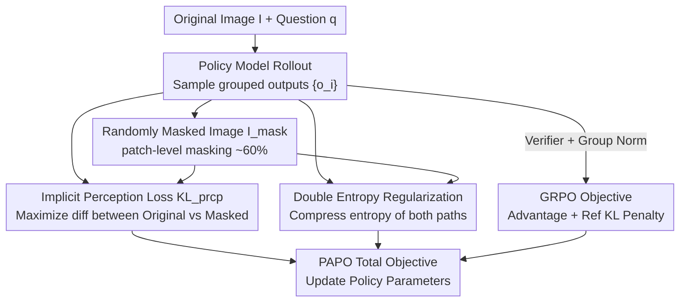

# Perception-Aware Policy Optimization for Multimodal Reasoning

**Conference**: ICLR 2026  
**OpenReview**: [https://openreview.net/forum?id=izbBqTL8vb](https://openreview.net/forum?id=izbBqTL8vb)  
**Code**: TBD  
**Area**: Multimodal VLM / LLM Reasoning / Reinforcement Learning  
**Keywords**: Multimodal Reasoning, RLVR, GRPO, Implicit Perception Loss, Training Stability

## TL;DR
Identifying that 67% of errors in multimodal RLVR stem from the neglected bottleneck of "inaccurate visual perception," this paper proposes PAPO. It introduces an implicit perception KL loss between "original vs. masked images" (plus double entropy regularization) into the GRPO/DAPO optimization objective. Without additional annotations, reward models, or teacher models, PAPO achieves an overall improvement of 4.4%–17.5% across 8 multimodal reasoning benchmarks and a 30.5% reduction in perception errors.

## Background & Motivation
**Background**: RLVR (Reinforcement Learning with Verifiable Rewards) has significantly enhanced the long-chain reasoning capabilities of text-only LLMs like DeepSeek-R1 and GRPO using rule-based rewards (format + answer correctness). Naturally, many works directly adapt GRPO to Large Multimodal Models (LMMs) to replicate these reasoning gains.

**Limitations of Prior Work**: Existing adaptations mostly focus on changing inputs to include images while leaving the optimization objective untouched. Research efforts have been concentrated on data engineering, rollout quality, and reward design, while the GRPO objective remains unchanged from the text-only era. Consequently, multimodal reasoning continues to lag behind text-only reasoning.

**Key Challenge**: The authors perform a diagnostic study by training Qwen2.5-VL-3B with standard GRPO and manually labeling 200 error samples. They find that **67% of errors stem from perception**—the model's logic or algebraic reasoning is sound, but it misinterprets the image (e.g., associating $x$ with the wrong side in a geometry problem). The root cause is that the GRPO objective **lacks any incentive for the model to generate "truly vision-dependent" responses**; as long as the final answer is correct, the model receives a reward even if it relies on text priors.

**Goal**: To simultaneously improve perception and reasoning in multimodal RLVR without relying on extra data or reward models.

**Key Insight**: Previous works acknowledging the importance of perception (e.g., adding captioning or perception score rewards) often decouple perception and reasoning into two stages and require large, expensive external reward models. This work proposes integrating perception incentives directly into the **core optimization objective**, allowing the model to "learn to see while learning to reason."

**Core Idea**: Use the KL divergence between the "original image vs. masked image" (from an information gain perspective) as implicit supervision. If the probability of a specific response drops significantly after masking the image, it indicates that the response is vision-dependent. Maximizing this KL divergence encourages the model to generate visually grounded responses without external supervision.

## Method

### Overall Architecture
PAPO (Perception-Aware Policy Optimized) is a policy gradient algorithm that can **directly replace GRPO/DAPO**. It operates on standard RLVR triplets (visual input $I$, question $q$, short answer $a$), requiring no CoT data or SFT. It adds two terms to the standard GRPO objective: an implicit perception loss (to separate policy distributions between original and masked images) and a double entropy regularization (to prevent collapse).

The update flow for a single step is: the policy model performs a rollout on the original image to obtain a set of responses → the probabilities for the same responses are calculated for both "original" and "randomly masked" images → the KL difference serves as the implicit perception loss (**maximized**) → the original GRPO advantage and reward are calculated using the reference model and answer verifier → the perception loss, double entropy regularization, and GRPO objective are combined into a total objective for parameter updates.

### Key Designs

**1. Implicit Perception Loss: Distribution Difference as Unsupervised Perception Signal**

This core component addresses the lack of visual grounding incentives in GRPO. The authors define a perception ratio $r_{prcp}(\theta)=\dfrac{\pi_\theta(o\mid q,I)}{\pi_\theta(o\mid q,I_{mask})}$, where $o$ is the generated token sequence and $I_{mask}$ is a "damaged" version of the image. From a Shannon information gain perspective, this ratio measures how much the output distribution changes when meaningful visual information is removed. A high ratio implies the model assigns low probability to the correct answer without the image, meaning the response is vision-dependent.

To encourage an image-aware model, the objective maximizes the KL divergence: $D_{KL}[\pi_\theta\|\pi_\theta^{mask}]=D_{KL}[\pi_\theta(o\mid q,I)\,\|\,\pi_\theta(o\mid q,I_{mask})]$, implemented with Schulman’s unbiased estimator as $r_{prcp}-\log r_{prcp}-1$. The beauty lies in its **implicit** nature—it requires no grounding labels, captioning, or external reward models; perception supervision emerges entirely from the model comparing itself with its "blind" version.

**2. Double Entropy Loss: Restraining Unbounded Perception KL**

The implicit perception loss is theoretically **unbounded**, and direct maximization can lead to "KLprcp Hacking": the model discovers that generating nonsensical tokens unrelated to the image under the original image can inflate the distribution difference, thus maximizing KL while reasoning collapses. The authors observe that this collapse is preceded by a **simultaneous surge in entropy for both paths ($\pi_\theta$ and $\pi_\theta^{mask}$)**.

Consequently, Double Entropy Loss is introduced to **simultaneously compress the entropy of both paths**: $H[\pi_\theta]=\log\pi_\theta(o\mid q,I)$ and $H[\pi_\theta^{mask}]=\log\pi_\theta(o\mid q,I_{mask})$, with weights $\eta_1, \eta_2$. This stabilizes training without sacrificing performance and is nearly indispensable when the reference KL penalty is removed (DAPO). The complete objective (e.g., PAPOG) is:

$$J_{PAPO_G}(\theta)=J_{GRPO}(\theta)+\gamma D_{KL}[\pi_\theta\|\pi_\theta^{mask}]-\eta_1 H[\pi_\theta]-\eta_2 H[\pi_\theta^{mask}]$$

where $\gamma$ is the perception loss weight, which requires careful tuning (excessive $\gamma$, e.g., 0.04, leads to unrecoverable collapse).

**3. Patch-level Random Masking: Constructing Effective $I_{mask}$**

Perception signal quality depends on the masking strategy. The authors compare random masking (uniform patch sampling) and semantic-aware masking (using DINOv2 self-attention scores). While semantic masking seems more intuitive, **random masking performs better**—the authors speculate that semantic masking might remove entire salient regions at once, forcing the model to focus on everything equally rather than identifying informative local details.

The authors further justify **patch masking over Gaussian noise**: pixel-level noise might not eliminate semantics even at high levels, whereas patch masking cleanly removes semantic content to create a true "information deficit." A masking ratio of 0.6–0.8 is optimal; complete blackouts (1.0) are less effective as they trigger indiscriminate "looking" at the image regardless of content, increasing the risk of KLprcp Hacking.

### Loss & Training
The model is trained via RL on ViRL39K using Qwen2.5-VL-3B/7B and Qwen3-VL-2B for 2 epochs with a 1e-6 learning rate. Rule-based verifiers provide rewards; no SFT or CoT data is used. Default hyperparameters: for models without reference KL, $\gamma$ is conservative (0.01) and double entropy is mandatory. For PAPOG-3B, $\gamma=0.02$, and for PAPOG-7B, $\gamma=0.01$. Masking is random at 0.6. The DAPO version (PAPOD) follows a similar derivation.

## Key Experimental Results

### Main Results
The table shows average accuracy (%) across 8 multimodal reasoning benchmarks, where $\Delta\%_{rel}$ denotes the average relative gain over respective baselines. Overall improvements range from 4.4%–17.5%, with more significant gains in vision-dependent subsets (8.0%–19.1%).

| Model / Method | General AVG | Vision-Dep AVG | Overall | Overall $\Delta\%_{rel}$ |
|------|------|------|------|------|
| GRPO-3B | 51.89 | 42.97 | 47.92 | — |
| PAPOG-3B | 53.39 | 45.57 | 49.92 | ↑4.36 |
| GRPO-7B | 62.51 | 54.11 | 58.78 | — |
| PAPOG-7B | 63.50 | 59.37 | 61.66 | ↑4.39 |
| DAPO-7B | 57.58 | 51.79 | 55.01 | — |
| PAPOD-7B | 65.83 | 59.82 | 63.16 | ↑17.54 |
| GRPO-2B (Qwen3-VL) | 49.13 | 43.97 | 46.84 | — |
| PAPOG-2B | 51.36 | 46.73 | 49.30 | ↑5.25 |

Notably, PAPOD-7B achieves a 19.09% relative gain on vision-dependent subsets. While DAPO-7B typically suffers from **model collapse** in later training stages, PAPOD maintains upward progress due to double entropy regularization. Manual audit shows perception errors decreased by **30.5%**. PAPO also converges faster, with gains appearing within ~25 steps.

### Ablation Study

| Configuration | Overall $\Delta\%_{rel}$ (3B) | Description |
|------|------|------|
| random @0.6 | ↑2.97 | Optimal masking strategy |
| semantic @0.6 | ↑1.02 | Semantic masking is surprisingly worse |
| random @0.4 / 0.8 / 1.0 | ↑1.88 / ↑2.02 / ↑1.42 | 0.6–0.8 is best; 1.0 is worst |
| $\gamma=0.02$ | ↑4.36 | Better default for 3B |
| $\gamma=0.04$ (collapsed) | ↓28.46 | Excessive weight leads to immediate collapse |

### Key Findings
- **Perception is the bottleneck**: 67% of errors come from perception; PAPO reduces this by 30.5%, validating the motivation.
- **Random > Semantic Masking**: Simple random masking outperforms DINOv2-based semantic masking at zero cost; a 0.6–0.8 masking ratio is optimal.
- **$\gamma$ is a double-edged sword**: Gains are monotonic for $\gamma \leq 0.02$, particularly for vision-dependent tasks. $\gamma=0.04$ triggers collapse that regularization cannot fix.
- **Orthogonality**: PAPO modifies the optimization objective and is compatible with rollout-level modifications like NoisyRollout, yielding cumulative gains.
- **Stability on low-vision tasks**: On text-only MMLU-pro with noise "images," PAPO maintains performance without blindly focusing on meaningless visual tokens.

## Highlights & Insights
- **Turning "Diagnosis" into Method**: Starting with a manual error analysis of 200 cases to locate the "67% perception error" creates a data-driven, highly convincing motivation for the perception loss.
- **Elegant Implicit Perception Loss**: Using a "self-comparison with a blind version" instead of external reward models or teachers makes perception supervision an efficient, self-generated signal with minimal overhead.
- **Identification of a New Failure Mode**: The study defines "KLprcp Hacking" and provides observable precursors (surging entropy) and effective cures (double entropy), a diagnostic loop that is highly transferable.
- **"Information Deficit via Masking" is a versatile concept**: This unsupervised probe (distribution KL between original vs. damaged inputs) can be used in any scenario to measure output dependence on specific modalities.

## Limitations & Future Work
- The implicit perception loss is applied **uniformly to all instances and tokens**, which is a minimalist design. It may be redundant for samples that naturally do not require visual input; adaptive weighting based on visual dependence could be more elegant.
- Training stability is highly sensitive to $\gamma$ and double entropy parameters. Large models are particularly sensitive to high $\gamma$, requiring careful grid searches.
- Evaluation is limited to exact-match tasks; it lacks direct evidence on whether perception gains transfer to open-ended multimodal generation requiring LLM-as-judge.
- Masking strategies are limited to random/semantic. More structured masking (e.g., dynamic masking based on question-relevant regions) could further push the perception performance ceiling.

## Related Work & Insights
- **vs. Perception Reward Methods (e.g., captioning-first, perception scores)**: These modify the **reward layer**, decouple stages, and require external models. PAPO modifies the **objective layer**, enables joint learning, and requires no extra models.
- **vs. GRPO / DAPO**: PAPO acts as a **plugin** rather than a replacement (PAPOG/PAPOD), achieving gains solely through objective updates under identical data/rollout/reward conditions.
- **vs. NoisyRollout (Rollout modification)**: The two are orthogonal and stackable. While NoisyRollout occasionally decreases performance on certain benchmarks, PAPO is more consistent and provides additional gains when combined.

## Rating
- Novelty: ⭐⭐⭐⭐⭐ First work to integrate perception supervision into the core RLVR objective without external supervision.
- Experimental Thoroughness: ⭐⭐⭐⭐⭐ 8 benchmarks × multiple model scales × GRPO/DAPO bases; covers error analysis, stability, and compatibility.
- Writing Quality: ⭐⭐⭐⭐ Clear logic from motivation and diagnosis to methodology and failure modes.
- Value: ⭐⭐⭐⭐⭐ Plug-and-play, zero-cost, and stackable; highly practical for the multimodal RLVR community.

<!-- RELATED:START -->

## Related Papers

- [\[ICLR 2026\] Perception-R1: Advancing Multimodal Reasoning Capabilities of MLLMs via Visual Perception Reward](perception-r1_advancing_multimodal_reasoning_capabilities_of_mllms_via_visual_pe.md)
- [\[ICLR 2026\] Unlocking the Essence of Beauty: Advanced Aesthetic Reasoning with Relative-Absolute Policy Optimization](unlocking_the_essence_of_beauty_advanced_aesthetic_reasoning_with_relative-absol.md)
- [\[CVPR 2026\] CodeV: Code with Images for Faithful Visual Reasoning via Tool-Aware Policy Optimization](../../CVPR2026/vlm_reasoning/codev_code_with_images_for_faithful_visual_reasoning_via_tool-aware_policy_optim.md)
- [\[ICLR 2026\] Unleashing Perception-Time Scaling to Multimodal Reasoning Models](unleashing_perception-time_scaling_to_multimodal_reasoning_models.md)
- [\[ICLR 2026\] MM-HELIX: Boosting Multimodal Long-Chain Reflective Reasoning with Holistic Platform and Adaptive Hybrid Policy Optimization](mm-helix_boosting_multimodal_long-chain_reflective_reasoning_with_holistic_platf.md)

<!-- RELATED:END -->
