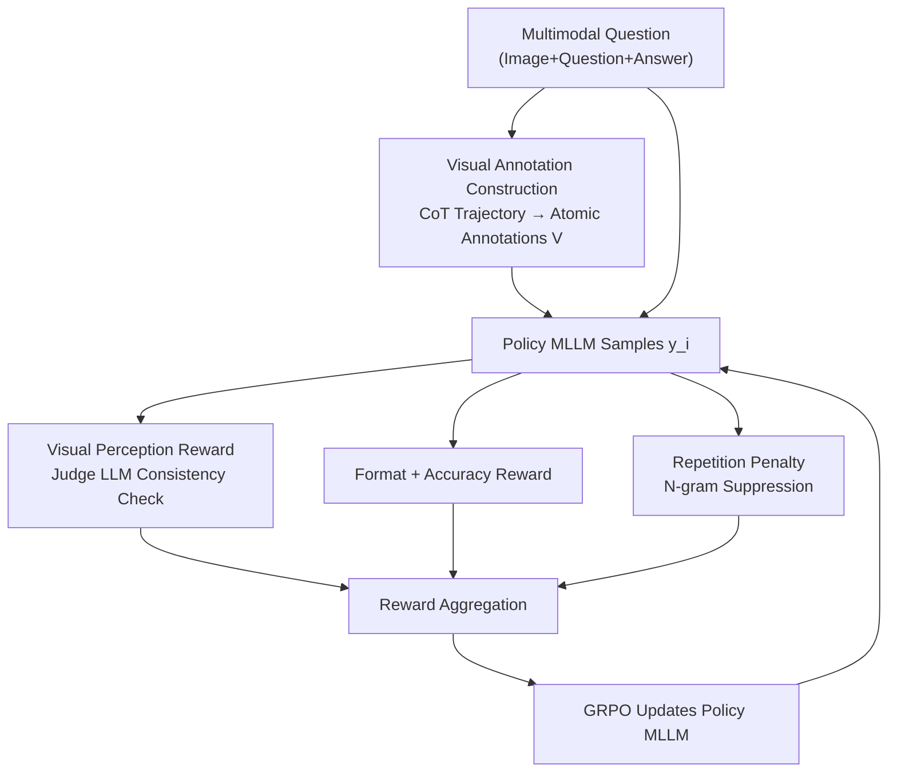

# Perception-R1: Advancing Multimodal Reasoning Capabilities of MLLMs via Visual Perception Reward

**Conference**: ICLR 2026  
**OpenReview**: [https://openreview.net/forum?id=KttCXdjj4w](https://openreview.net/forum?id=KttCXdjj4w)  
**Code**: https://github.com/tongxiao2002/Perception-R1  
**Area**: Multimodal VLM / LLM Reasoning  
**Keywords**: Multimodal Reasoning, RLVR, Visual Perception Reward, GRPO, Data Efficiency

## TL;DR
Addressing the limitation where existing Reinforcement Learning from Verifiable Rewards (RLVR) only rewards final answer correctness and fails to improve visual perception, this paper proposes Perception-R1. By extracting atomic "visual annotations" from high-quality CoT trajectories as references, it employs a judge LLM to determine if the model's response faithfully describes these visual facts. Significant performance gains are achieved on 8 multimodal benchmarks using only 1,442 training samples, significantly outperforming Vision-R1 trained on 200k samples.

## Background & Motivation
**Background**: Adapting DeepSeek-R1 style RLVR to the multimodal domain is the current mainstream approach for enhancing MLLM reasoning. Works like MM-Eureka, R1-VL, Vision-R1, and R1-OneVision use "answer correctness" as a verifiable reward with GRPO, showing substantial gains on multimodal math benchmarks.

**Limitations of Prior Work**: Multimodal reasoning consists of **multimodal perception** (understanding images) and **logical reasoning**. Perception is the foundation. Analysis shows current RLVR primarily improves logic while providing negligible benefits to perception. As shown in Figure 1, models may guess the correct answer while hallucinating non-existent visual elements like "right triangle △OAE." Accuracy-only rewards fail to correct—and may even reinforce—these flawed reasoning paths.

**Key Challenge**: The root cause is the **sparse reward** for perception in RLVR. Correct answers do not guarantee accurate perception, and the optimization signal lacks an explicit "see the image correctly" component. Quantitative analysis using the McNemar test on MathVista confirms that the p-values for perception capability changes post-RLVR (0.22 and 0.69) are not significant. Furthermore, 72%–78% of failure cases are attributed to perception errors, identifying perception as the true bottleneck.

**Goal**: To introduce a dense "visual perception reward" signal into RLVR to simultaneously drive perception and reasoning without introducing a multimodal reward model prone to reward hacking.

**Key Insight**: Leveraging the "verifiability" that makes RLVR reliable, the authors propose a "visual reference" for images. High-quality CoT trajectories from strong models already contain accurate visual descriptions (e.g., $GE=10$, $GE\perp DF$), which can be extracted as verifiable references.

**Core Idea**: Construct a visual perception reward by having a judge LLM determine consistency between the model response and extracted atomic visual annotations, which is then integrated into the RLVR reward function.

## Method

### Overall Architecture
Perception-R1 follows a GRPO-driven RLVR pipeline with a modified **reward function**. In addition to format and accuracy rewards, it adds a visual perception reward and a repetition penalty. The process involves two stages: **offline preparation**, where a SOTA closed-source MLLM generates CoT trajectories and a text-only LLM extracts atomic "visual annotations" $V=(v_1,\dots,v_m)$ from correct trajectories; and **online training**, where the policy model samples responses and a judge LLM evaluates the consistency of $v_j$ in those responses to calculate rewards for GRPO updates.

### Key Designs

**1. McNemar Test Diagnosis: Proving accuracy-only RLVR fails to fix perception**

This diagnostic step establishes the motivation for the extra reward. By sampling 50 problems from MathVista and analyzing pre/post RLVR performance using the McNemar test, the authors found p-values of 0.22 (Qwen2-VL-7B) and 0.69 (Qwen2.5-VL-7B). Both are far above 0.05, indicating no significant perception improvement. This confirms that perception is the bottleneck limiting multimodal reasoning.

**2. Visual Annotation Construction: Extracting "Visual References" from CoT**

To create a "ground-truth" for perception, the authors used Gemini-2.5-Pro to generate correct CoT trajectories. A text-only LLM (Qwen2.5-32B-IT) then extracted **atomic visual annotations** $V=(v_1,\dots,v_m)$. Each $v_j$ represents an image fact critical for solving the problem (e.g., $GE=10$). These annotations achieved 96% accuracy in human audits. From Geometry3K, 1,442 samples with visual annotations were curated.

**3. Visual Perception Reward: Dense signals via consistency checking**

A judge LLM $\Phi$ performs binary checks for each annotation $v_j$ against the policy model response $y_i$, resulting in a judgment sequence $J=(o_{i,1},\dots,o_{i,m})$ where $o_{i,j}\in\{0,1\}$. The reward is the hitting ratio:

$$r_v(y_i, V) = \frac{\mathrm{sum}\{o_{i,1},\dots,o_{i,m}\}}{|o_{i,1},\dots,o_{i,m}|},\quad o_{i,j}=\Phi(y_i, v_j)\in\{0,1\}$$

The final reward is $r(y_i, a, V) = \alpha\, r_f(y_i) + \beta\, r_a(y_i, a) + \gamma\, r_v(y_i, V) + r_p(y_i)$. This transforms perception into a dense, verifiable signal, mitigating reward sparsity. Using "annotations + judge" avoids direct MLLM-based reward models and associated hacking risks.

**4. Repetition Penalty: Suppressing repetitive behavior**

The introduction of $r_v$ can cause models to repeat visual descriptions to maximize hitting ratios. An N-gram repetition penalty $r_p$ is used to mitigate this degradation.

### Loss & Training
The framework uses GRPO. For each question, a group of responses $Y=(y_1,\dots,y_G)$ is sampled from the old policy. Advantage $\hat{A}_i$ is estimated using the normalized group reward: $\hat{A}_i=\frac{r(y_i,a,V)-\mathrm{mean}\{r\}}{\mathrm{std}\{r\}}$. The policy is updated to maximize the objective with clipping and KL regularization. Training used 1,442 Geometry3K geometric questions.

## Key Experimental Results

### Main Results
Perception-R1-7B, using only 1.4K data samples, outperformed all open-source reasoning MLLMs on nearly all benchmarks except EMMA. The gains over Vision-R1-7B/MM-Eureka-7B were significant (p < 0.01).

| Model | #Data | MathVista | MathVerse | WeMath | MMMU | MMMU-Pro |
|------|-------|-----------|-----------|--------|------|----------|
| Qwen2.5-VL-7B-IT (base) | / | 68.1 | 47.4 | 61.4 | 55.2 | 37.0 |
| MM-Eureka-7B | 15K | 72.5 | 51.9 | 65.6 | 58.0 | 38.3 |
| Vision-R1-7B | 200K | 73.1 | 52.4 | – | 55.2 | 37.6 |
| **Perception-R1-7B** | **1.4K** | **74.2** | **54.3** | **72.0** | **60.8** | **42.4** |

Ours achieved 100x better data efficiency than Vision-R1. Significant improvements on the Vision-Only subset and a post-training McNemar test (p=0.04 < 0.05) prove that perception capability was successfully enhanced.

### Ablation Study

| Configuration | MathVista | MathVerse | WeMath | MMMU-Pro | Note |
|------|-----------|-----------|--------|----------|------|
| base + GRPO (accuracy-only) | 73.3 | 51.3 | 69.5 | 38.2 | Answer reward only |
| **Perception-R1 (full)** | **74.2** | **54.3** | **72.0** | **42.4** | Full model |
| w/o Visual Perception Reward | 73.6 | 53.0 | 70.4 | 40.1 | Removed $r_v$ |
| w/o Repetition Penalty | 73.6 | 52.6 | 68.5 | 40.6 | Removed $r_p$ |
| base + SFT | 67.3 | 39.1 | 49.1 | 35.2 | SFT on same data |
| Qwen2.5-VL-32B-IT as RM | 73.2 | 54.1 | 66.3 | 40.6 | Direct MLLM as RM |

### Key Findings
- Both visual perception rewards and repetition penalties are essential; removing either leads to performance drops.
- Directly using a strong MLLM (32B) as a reward model is inferior to Perception-R1, likely due to reward hacking.
- Sensitivity analysis on $\gamma$ showed stability across $\gamma\in\{0.1,\dots,0.9\}$ due to group normalization in GRPO.
- Judge LLM quality is critical; a weak 7B judge led to severe reward hacking and performance below the baseline.

## Highlights & Insights
- **Statistical Diagnosis**: Using the McNemar test to provide a p-value for the perception bottleneck validates the motivation beyond anecdotal evidence.
- **Transference of Verifiability**: A key innovation is creating verifiable references for perception (atomic annotations + judge), extending the reliability of RLVR beyond final answers.
- **Richer Rewards for Data Efficiency**: Outperforming 200K data points with 1.4K emphasizes that extracting extra supervision signals (visual consistency) is a powerful lever for efficiency.

## Limitations & Future Work
- The training data is limited (1,442 geometry questions); broader and more diverse data is needed to improve benchmarks like EMMA.
- Dependency on SOTA closed-source MLLMs for annotation extraction and a strong judge LLM increases training overhead.
- Atomic annotations work well for structured geometric data but may be difficult to scale to complex natural images or documents.

## Related Work & Insights
- **vs MM-Eureka/Vision-R1**: These works rely on answer-only RLVR, ignoring the perception bottleneck. Perception-R1 achieves superior results with 10–100× less data by targeting the root cause.
- **vs MLLM as RM**: MLLM-based RM is prone to hacking. Perception-R1 follows the "verifiable reference" RLVR paradigm, which is more robust.
- **vs SFT**: RL proves to be more data-efficient and offers better generalization than SFT using the same CoT data.

## Rating
- Novelty: ⭐⭐⭐⭐⭐ Extending verifiable rewards to visual perception addresses a structural blind spot in RLVR.
- Experimental Thoroughness: ⭐⭐⭐⭐ Strong analysis with statistical tests, though data is biased toward geometry.
- Writing Quality: ⭐⭐⭐⭐⭐ Clear logical flow from diagnosis to solution and verification.
- Value: ⭐⭐⭐⭐⭐ High data efficiency and a transferable methodology for adding intensive rewards to RLVR.

<!-- RELATED:START -->

## Related Papers

- [\[ICLR 2026\] Perception-Aware Policy Optimization for Multimodal Reasoning](perception-aware_policy_optimization_for_multimodal_reasoning.md)
- [\[ICLR 2026\] ReVisual-R1: Advancing Multimodal Reasoning from Optimized Cold Start to Staged Reinforcement Learning](revisual-r1_advancing_multimodal_reasoning_from_optimized_cold_start_to_staged_r.md)
- [\[ICLR 2026\] Unleashing Perception-Time Scaling to Multimodal Reasoning Models](unleashing_perception-time_scaling_to_multimodal_reasoning_models.md)
- [\[ICLR 2026\] SophiaVL-R1: Reinforcing MLLMs Reasoning with Thinking Reward](sophiavl-r1_reinforcing_mllms_reasoning_with_thinking_reward.md)
- [\[ICLR 2026\] VisionReasoner: Unified Reasoning-Integrated Visual Perception via Reinforcement Learning](visionreasoner_unified_reasoning-integrated_visual_perception_via_reinforcement_.md)

<!-- RELATED:END -->
