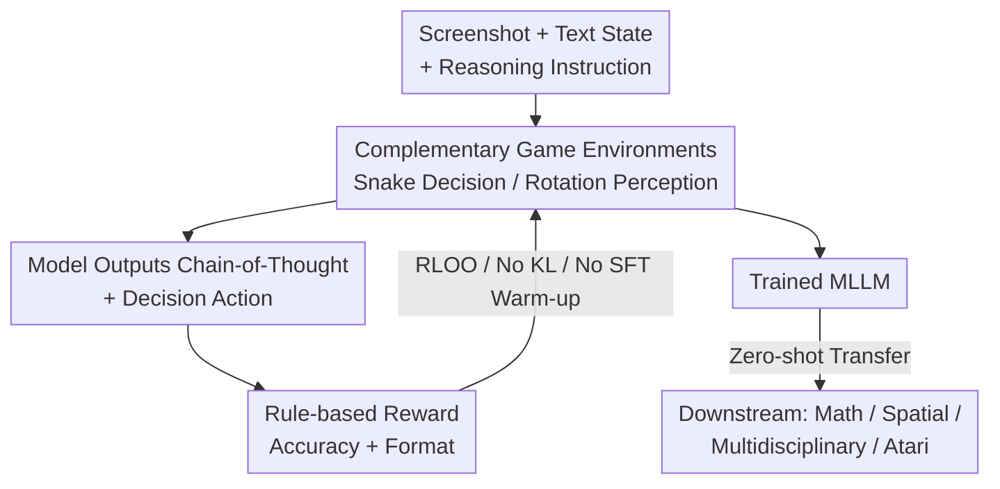

# Play to Generalize: Learning to Reason Through Game Play

**Conference**: ICLR 2026  
**OpenReview**: [https://openreview.net/forum?id=u1tsgXPh2o](https://openreview.net/forum?id=u1tsgXPh2o)  
**Code**: https://yunfeixie233.github.io/ViGaL  
**Area**: Multimodal VLM / LLM Reasoning  
**Keywords**: Multimodal Large Models, Reinforcement Learning, Post-training on Games, Cross-domain Generalization, Surrogate Tasks

## TL;DR
By applying Reinforcement Learning (RL) to let a 7B multimodal large model (MLLM) play arcade games like Snake and 3D rotation recognition—without ever touching math problems, formulas, or diagrams—the model outperforms similarly sized models trained specifically on mathematical data in multimodal reasoning benchmarks like MathVista and MMMU, while preserving general vision capabilities.

## Background & Motivation
**Background**: Injecting reasoning capabilities into MLLMs currently relies on RL post-training (e.g., MM-Eureka, R1-VL, VLAA-Thinker) on meticulously annotated math, geometry, or multi-disciplinary datasets, encouraging models to "think before speaking" by generating chains-of-thought (CoT). Evidence suggests RL generalizes better than SFT on out-of-distribution samples.

**Limitations of Prior Work**: This paradigm depends heavily on large-scale, in-domain human annotations, making high-quality multimodal reasoning data difficult to scale. Furthermore, "expert models" trained on specific domains often suffer from performance degradation in general visual understanding, with generalization boundaries locked strictly within the training domain.

**Key Challenge**: Is reasoning capability "domain knowledge that must be learned from in-domain problems," or is it a "transferable underlying cognitive skill"? If it is the latter, then focusing solely on in-domain data is both expensive and self-limiting.

**Goal**: To identify a post-training surrogate task that does not depend on any in-domain reasoning data but can stimulate transferable reasoning skills, while ensuring that it enhances reasoning without destroying general vision capabilities.

**Key Insight**: Drawing from cognitive science and AI agent observations, humans acquire abstract thinking foundations—such as pattern recognition, spatial reasoning, and causal inference—through play (arranging objects, spatial navigation, tool use) from childhood. AI agents also exhibit emergent transferable skills in environments like hide-and-seek or Atari. Games provide structured, rule-based, difficulty-controllable, and infinitely synthesizable environments, making them ideal "training grounds" for RL.

**Core Idea**: Treat "playing games" as a surrogate task for RL post-training (ViGaL, Visual Game Learning). Using rule-based rewards, MLLMs learn to play Snake and rotation recognition. The emergent reasoning skills transfer to downstream tasks like mathematics, spatial reasoning, and multi-disciplinary benchmarks, analogous to how "pretext tasks" in self-supervised pre-training yield broad generalization.

## Method

### Overall Architecture
The logic of ViGaL is straightforward: **Train on games instead of math data, forcing reasoning skills out through rule-based rewards, and then zero-shot transfer them to downstream reasoning benchmarks**. The pipeline consists of three steps: modeling the game as a Partially Observable Markov Decision Process (POMDP) where the model follows a "view state — think — output action — receive reward" loop; performing direct post-training using rule-based RL (RLOO) without SFT warm-up or KL constraints; and finally evaluating the trained model directly on unseen tasks like math, geometry, and multidisciplinary benchmarks. The authors designed two complementary games: **Snake** (focusing on strategic decision-making) and **Rotation** (focusing on 3D spatial perception) to hone both reasoning and perception.

### Key Designs

**1. Complementary Dual Games: Snake for Decision-making, Rotation for Perception**

To cover multiple types of reasoning skills without domain data, the authors deliberately designed two games with **complementary cognitive mechanisms**. Snake features a $10\times10$ board with two snakes: the state includes coordinates of both snakes $(x^t_{si}, y^t_{si})$, apple position $(x^t_a, y^t_a)$, and the previous action. The model selects from $\{up, down, left, right\}$ at each step, dying if it hits a wall/body. It emphasizes **strategic decisions** like path planning and collision detection. Rotation provides an initial view $I_{init}$ and a rotated view $I_{rot}$ (at $90°$ or $180°$ around the z-axis), asking the model to estimate the angle with an in-context example. This emphasizes **spatial perception** such as angle estimation. Evidence shows Snake primarily improves math problems involving 2D coordinates, while Rotation improves angle and length problems; **training both together leads to further gains**, proving that different games foster different transferable skills.

**2. Rule-based Reward + "Best/Worst Action" Dual Prediction**

To prevent reward hacking and ensure rewards incentivize true reasoning, ViGaL uses simple rule-based rewards $r = r_{accuracy} + r_{format}$: 1 for correct, 0 for incorrect, plus a format reward. To further enhance Snake training, the model is required to **predict both the best and worst next steps** (where "worst" leads to immediate death). This requirement improved downstream average accuracy by 1.8%, as it forces the model to evaluate the consequences of the entire action space. Contrast experiments showed that replacing labels with **random actions** resulted in near-zero gains (49.4%, same as base), indicating that **reward signals must be grounded and meaningful** for skills to be truly learned rather than noise-fitted.

**3. RLOO + Pure Rule-based RL without KL Constraints**

To allow the model to freely explore better reasoning strategies in games, the authors use REINFORCE Leave-One-Out (RLOO) for advantage estimation and follow the practice of **removing KL divergence regularization**. Removing KL constraints allows the new policy to move away from the base model, giving it freedom to discover optimal CoT pathways. The training follows the DeepSeek-R1 recipe (regularized format + accuracy rewards) and **skips SFT warm-up**, applying RL directly. Ablations supported this: SFT an game data actually caused math scores to drop by 9.7% and geometry by 12.7% (memorizing game moves destroyed existing reasoning), whereas RL achieved a net gain of 12.3%.

**4. Controllable Difficulty + Infinitely Synthesizable Game Engine**

Addressing the bottleneck of domain data scarcity, games allow for **infinite, on-demand data generation with controllable difficulty**. Snake uses SnakeBench as an engine, and Rotation uses Hunyuan3D to generate 3D meshes from images/text, rendering them into image pairs (rotation angles serve as automatic labels). Synthesizing 36K samples per game was sufficient for convergence. Difficulty is defined by snake length; the authors kept lengths between 1–5 to avoid suboptimal convergence on samples that are too hard or too easy, raising accuracy from 60.6% to 61.4%. Data scalability was also verified: increasing samples from 16K to 32K brought a 1.3% average improvement.

## Key Experimental Results

### Main Results
The base model is Qwen2.5-VL-7B-Instruct. Downstream math benchmarks (Average):

| Model | Training Data | Math Avg | Geometry Avg | Remarks |
|------|---------|---------|--------------|------|
| Qwen2.5-VL-7B (Base) | — | 47.7 | 44.8 | Baseline |
| MM-Eureka-Qwen-7B | Large-scale Math/Geometry | 50.1 | 28.4 | Geometry collapse |
| OpenVLThinker-7B | Math | 47.8 | 56.4 | — |
| **Ours (ViGaL Snake + Rotation)** | **Games Only** | **50.6** | **57.1** | No math data used |

ViGaL, relying only on game data, outperformed the math-specialized MM-Eureka in average math and significantly surpassed it in geometry (where MM-Eureka collapsed to 28.4 due to over-specialization). On MMMU series benchmarks, ViGaL Snake+Rotation achieved an average score of 64.7, 5.4% higher than R1-OneVision-7B on MMMU.

Game-specific capability (Tab. 1): ViGaL wins 6–9/10 games against GPT-4o / Gemini-2.5-Pro / Claude-3.7 in Snake. Crucially, it shows **zero-shot transfer to 7 unseen Atari games**, nearly doubling the base model's cumulative reward (2251 vs 1253).

### Ablation Study (Snake, Downstream Avg Accuracy)

| Configuration | Avg | Description |
|------|-----|------|
| Base | 49.1 | Start point |
| w/o Reasoning Prompt | 59.5 | Removed prompts like "Calculate Manhattan distance" |
| **w/ Reasoning Prompt** | **62.3** | CoT guidance, +2.8% |
| Predict best action only | 59.6 | — |
| **Best + Worst action** | **62.3** | Dual prediction, +1.8% |
| Random labels | 49.4 | Nearly no gain; signals must be real |
| w/o Difficulty control | 60.6 | — |
| **w/ Difficulty control** | **62.3** | Moderate difficulty is optimal |
| Text-only input | 59.6 | — |
| **Image + Text** | **62.3** | Multimodal gain, +1.8% |
| SFT | 47.2 | Lower than base; destroys reasoning |
| **RL** | **62.3** | RL Gain: 12.3%, SFT Gain: -1.9% |

### Key Findings
- **Different games feed different skills and are combinable**: Snake boosts coordinate/expression problems (+6.25 / +6.16), while Rotation boosts angle/length problems (+8.75 / +4.62). Training on both is optimal.
- **RL vs SFT is a paradigm-level difference**: For the same game data, SFT leads to rote memorization and hurts general reasoning (-9.7% in math), while RL expands reasoning boundaries while preserving general vision (Tab. 9 shows general vision remains nearly intact).
- **Games and math data are complementary**: Using MMK12 (12K math samples) for a second stage on top of ViGaL increased math scores by another 1.2%.
- **Meaningful reward signals are mandatory**: Random labels provided almost zero gain, refuting the idea that "random rewards work" in the visual game domain.

## Highlights & Insights
- **Elevating "Game Play" as a Surrogate Task Paradigm**: The most "aha" moment is proving that reasoning is a transferable cognitive skill rather than domain-specific knowledge. Playing Snake to solve math challenges the assumption that reasoning data must be in-domain.
- **Cognitive Alignment Explains Transfer**: The authors explain the transfer path via "Snake 2D coordinate reasoning $\leftrightarrow$ Expression/Coordinate problems" and "Rotation angle reasoning $\leftrightarrow$ Angle/Length problems," validated by K-Means clustering across multiple games (Maze, Tetris, Sudoku, etc.).
- **"Best+Worst" Dual Prediction Reward**: A reusable trick that forces the model to evaluate the entire action space rather than just greedily predicting one step. It improves performance with zero additional cost.
- **Controllable and Scaleable Data**: Game engines solve the data scale problem inherent in human annotation. Difficulty, modality, and scale are all adjustable "knobs."

## Limitations & Future Work
- The authors acknowledge that two games only cover specific reasoning and perception dimensions; complex reasoning (long-range planning, abstract symbols) has not been fully verified.
- Experiments were performed solely on the 7B Qwen2.5-VL; whether game transfer remains effective or hits a point of diminishing returns on larger models is unknown.
- The "Cognitive Alignment" explanation remains qualitative or based on clustering; causal analysis of how internal representations are reshaped by games is lacking.
- Future work: Transform the "game library — downstream skill" mapping into a searchable design space to **reverse-engineer** optimal surrogate games for specific target tasks.

## Related Work & Insights
- **vs. MM-Eureka / R1-VL**: These perform RL on in-domain math data; this work performs RL on unrelated games. The advantage is avoiding expensive annotations and preventing specialist collapse in other domains.
- **vs. SFT Post-training**: SFT causes the model to memorize actions and degrades original reasoning, whereas RL allows for the exploration of transferable strategies, confirming RL's superiority in out-of-distribution generalization.
- **vs. Self-supervised Pre-training**: This work moves the "designing pretext tasks for generalization" philosophy from representation learning to the RL post-training phase.

## Rating
- Novelty: ⭐⭐⭐⭐⭐ Breakthrough in using game surrogate tasks instead of domain data for reasoning RL.
- Experimental Thoroughness: ⭐⭐⭐⭐⭐ Multiple benchmarks, Atari zero-shot transfer, and scalability tests.
- Writing Quality: ⭐⭐⭐⭐ Clear storytelling; cognitive alignment explanations are insightful.
- Value: ⭐⭐⭐⭐⭐ Provides an extensible roadmap for using synthetic tasks to stimulate reasoning at low cost.

<!-- RELATED:START -->

## Related Papers

- [\[CVPR 2026\] Seeing Clearly, Reasoning Confidently: Plug-and-Play Remedies for Vision Language Model Blindness](../../CVPR2026/vlm_reasoning/seeing_clearly_reasoning_confidently_plug-and-play_remedies_for_vision_language_.md)
- [\[ICLR 2026\] Game-RL: Synthesizing Multimodal Verifiable Game Data to Boost VLMs' General Reasoning](game-rl_synthesizing_multimodal_verifiable_game_data_to_boost_vlms_general_reaso.md)
- [\[CVPR 2026\] Decouple to Generalize: Context-First Self-Evolving Learning for Data-Scarce Vision-Language Reasoning](../../CVPR2026/vlm_reasoning/decouple_to_generalize_context-first_self-evolving_learning_for_data-scarce_visi.md)
- [\[ICLR 2026\] DeepEyes: Incentivizing "Thinking with Images" via Reinforcement Learning](deepeyes_incentivizing_thinking_with_images_via_reinforcement_learning.md)
- [\[ICLR 2026\] DIVA-GRPO: Enhancing Multimodal Reasoning through Difficulty-Adaptive Variant Advantage](diva-grpo_enhancing_multimodal_reasoning_through_difficulty-adaptive_variant_adv.md)

<!-- RELATED:END -->
