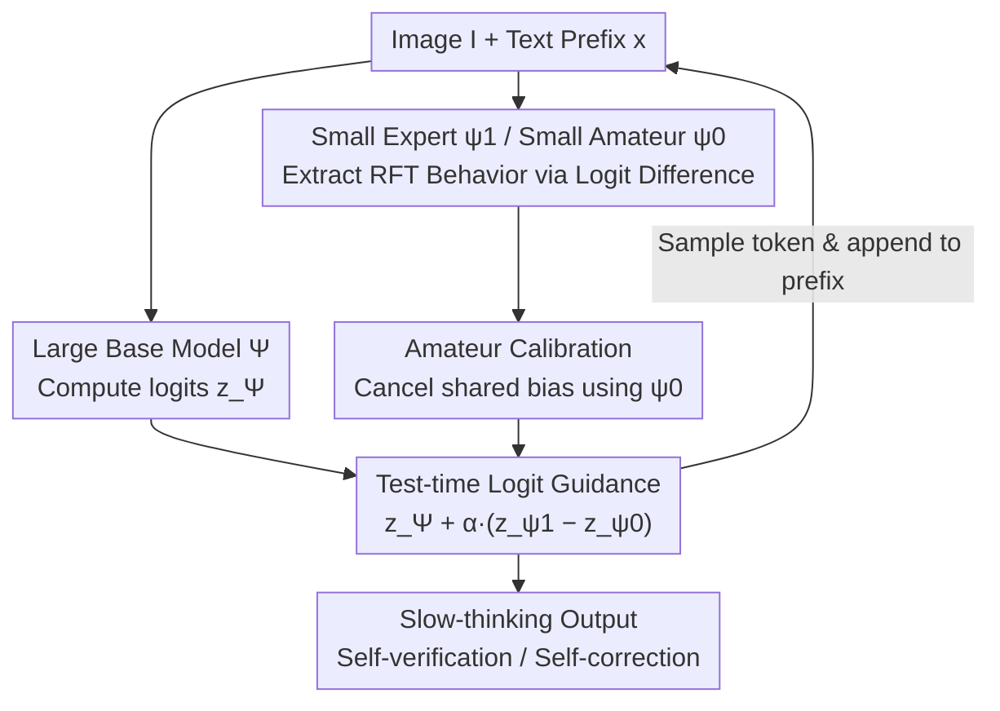

# ProxyThinker: Test-Time Guidance Through Small Visual Reasoners

**Conference**: ICLR 2026  
**OpenReview**: [https://openreview.net/forum?id=dt6fnFypEn](https://openreview.net/forum?id=dt6fnFypEn)  
**Code**: https://github.com/MrZilinXiao/ProxyThinker  
**Area**: Multimodal VLM / LLM Reasoning  
**Keywords**: Visual Reasoning, Decoding-time Guidance, Logit Difference, Reinforcement Fine-Tuning, Slow Thinking

## TL;DR
ProxyThinker proposes a **completely training-free** test-time method: by adding the token-level logit difference between a small "RFT Expert" and an equivalent-sized "Base Amateur" to the output logits of a large base model (weighted by coefficient $\alpha$), a 32B/72B model can "inherit" the slow-thinking behaviors (e.g., self-verification, self-correction) from RL-tuned small models without any parameter updates. This approach approaches or even exceeds the performance of full-scale RFT models of the same size on mathematical and multimodal reasoning benchmarks, achieving a 38× speedup through asynchronous parallel implementation in vLLM.

## Background & Motivation
**Background**: The current mainstream approach to equipping Large Vision-Language Models (LVLMs) with "slow-thinking" capabilities is **Reinforcement Learning from Verifiable Rewards (RLVR / RFT)**. Algorithms like PPO and GRPO reward intermediate reasoning steps that lead to correct answers, pushing models toward reasoning patterns involving branching discussions, backtracking, and self-checking. OpenAI-o1, DeepSeek-R1, and QwQ are products of this direction.

**Limitations of Prior Work**: RFT is extremely expensive. Not only does PPO/GRPO require maintaining multiple model copies (policy, reference, reward, etc.), leading to massive VRAM overhead, but the process is also complex and time-consuming due to frequent switching between rollout and optimization. Consequently, few in the industry attempts **RFT on LVLMs larger than 7B**, as training costs become prohibitive for larger scales.

**Key Challenge**: The industry desires the strong capacity of large models combined with RFT-driven reasoning behavior, but the combined training cost is unsustainable. Recent studies (e.g., Yue et al. 2025b) suggest a Key Insight: **RFT does not teach models new knowledge; it merely amplifies potential reasoning behaviors already latent in the base model's sampling distribution**. In other words, "slow-thinking" capability exists in large base models but remains inactive.

**Goal**: Can the activation of reasoning behavior be transferred directly from a **cost-effective small model** to a large model, bypassing RFT for the latter?

**Key Insight**: Drawing from decoding-time steering (e.g., DExperts, Contrastive Decoding), the authors observe that if RFT shifts probability mass toward slow-thinking tokens, the logit difference between a "Small RFT Expert" and a "Small Base Amateur" at each step serves as an **explicit signal** for this RFT behavior shift. Crucially, this signal is largely independent of model size.

**Core Idea**: Guiding the decoding of a "Large Base Model" using the difference vector of 「Small Expert Logits − Small Amateur Logits」 to proxy the reasoning behavior learned by small models onto the large model with zero training.

## Method

### Overall Architecture
At **each step** of autoregressive decoding, ProxyThinker runs three models concurrently: a Large Base model $\Psi$ to be guided (e.g., Qwen2.5-VL-32B/72B), a small base Amateur model $\psi_0$ (Qwen2.5-VL-7B), and its RFT-derived small Expert model $\psi_1$ (e.g., VL-Rethinker-7B). All three share the same input image $I$ and current text prefix $x_{<t}$, calculating logits $z_\Psi$, $z_{\psi_0}$, and $z_{\psi_1}$ respectively. ProxyThinker treats the logit difference between Expert and Amateur as the "RFT behavior direction," adds it to the large model's logits via coefficient $\alpha$, and then performs softmax sampling. The sampled token is appended to the prefix for all three models for the next step—forming a feedback loop throughout the generation. Ultimately, the large model's behavior is rewritten into that of a slow-thinking reasoner without parameter updates.

### Key Designs

**1. Logit Difference as a Carrier for RFT Behavior: Training-free Transfer**

To address the prohibitive cost of RFT for large models, the authors **abstract the RFT effect into an additive direction vector**. Since RFT amplifies existing behaviors, the logit difference $z_{\psi_1}-z_{\psi_0}$ between an expert $\psi_1$ and an untrained amateur $\psi_0$ of the same size represents the "clean signal" of which tokens RFT boosts or suppresses. This signal is dense across the vocabulary and decoupled from model size, allowing the difference calculated on small models to guide large ones. The output distribution of the ProxyThinker model $\hat\Psi$ is:

$$p(x_t \mid x_{<t}, I) = \mathrm{softmax}\big[\,z_\Psi(x_t \mid x_{<t}, I) + \alpha \cdot \big(z_{\psi_1}(x_t \mid x_{<t}, I) - z_{\psi_0}(x_t \mid x_{<t}, I)\big)\big]$$

This works because the large base model possesses the "capacity" for deep reasoning but lacks the "trigger" for slow-thinking behavior. Small experts, while knowing when to output "Wait/However/But," are limited in capacity and often resort to shallow reasoning (e.g., repeating options). Combining the large model's capacity with the small model's behavior signal enables the large model to perform slow thinking using its own knowledge.

**2. Three-Model Proxy Architecture: Roles of Base, Expert, and Amateur**

ProxyThinker specifically uses **three** models rather than two. The Large Base $\Psi$ provides knowledge and capacity; the Small Expert $\psi_1$ provides the "how to reason post-RFT" signal; and the Small Amateur $\psi_0$ provides the "original reasoning style of the same-sized model pre-RFT." Crucially, $z_{\psi_1}$ alone would carry the small model's own biases and limitations. By subtracting $\psi_0$ (same size and architecture, differing only by RFT), the **non-RFT-related common components are canceled out**, leaving only the behavioral shift contributed by RFT. Computationally, this requires only one RFT run on a 7B model, making it a true "proxy."

**3. Calibration Role of the Amateur: Distinction from Naive Contrastive Decoding**

To prove the amateur's necessity, the authors compared a modified baseline using $z_\text{base}+\alpha\cdot z_\text{expert}$ (direct expert addition without subtraction). The $\alpha$ sweep experiments (Figure 4) show ProxyThinker consistently outperforms this baseline. This is because adding $z_{\psi_1}$ directly forces the absolute bias of the small expert's distribution into the large model, polluting its original capabilities. In contrast, $z_{\psi_1}-z_{\psi_0}$ is a **relative quantity** where $\psi_0$ "zero-calibrates" the expert distribution, retaining only the RFT increment and preserving the large model's strong inherent distribution.

**4. Asynchronous Tensor Parallel Scheduling: Reducing Multi-model Overhead**

Running three models is inherently expensive. Previous decoding-time steering methods used coarse-grained pipeline parallelism, where experts waited for the base model, leading to GPU idling (Figure 3). ProxyThinker implements collaborative decoding in vLLM by reusing KV caches, tensor parallelism (TP), and continuous batching. Furthermore, it allocates **TP only to the large base model, while small Expert/Amateur models are placed in independent TP groups for asynchronous execution**. Logits are synchronized via collective communication only before sampling. This scheduling minimizes idling, yielding a 33× speedup over Huggingface implementations and a total 38× improvement when optimized with TP grouping, bringing latencies close to running a single 32B RFT model.

## Key Experimental Results

### Main Results
Evaluated on math and multidisciplinary reasoning benchmarks with $\alpha=0.5$ and Pass@1 greedy decoding. Base models are Qwen2.5-VL-32B/72B, Amateur is Qwen2.5-VL-7B, and Experts are three public 7B RFT models.

| Base Model | Expert | MathVista | MathVerse | MathVision | MMMU-Pro | R1-Bench | Avg Δ |
|-----------|--------|-----------|-----------|------------|----------|----------|--------|
| Qwen2.5-VL-32B | – | 74.7 | 53.8 | 38.4 | 49.5 | 49.4 | 0.0 |
| Qwen2.5-VL-32B | OpenVLThinker-7B | 77.4 | 53.8 | **40.8** | 51.8 | 53.0 | +2.2 |
| Qwen2.5-VL-32B | VL-Rethinker-7B | 78.1 | 55.3 | 39.2 | 52.8 | 52.5 | +2.4 |
| VL-Rethinker-32B (Full RFT Ceiling) | – | 78.8 | 56.9 | 40.5 | 50.6 | 50.8 | +2.4 |
| Qwen2.5-VL-72B | – | 74.8 | 55.1 | 38.1 | 51.6 | 50.4 | 0.0 |
| Qwen2.5-VL-72B | VL-Rethinker-7B | 78.1 | 58.6 | 39.5 | 53.1 | 54.4 | +2.7 |

A standout result: using OpenVLThinker-7B (which has only 25.3% MathVision accuracy) as an expert raised the 32B base from 38.4% to 40.8%, **surpassing** the full-RFT VL-Rethinker-32B (40.5%). This supports the claim that the transfer focuses on "behavior" rather than "knowledge."

### Ablation Study

| Analysis | Key Metric | Explanation |
|------|---------|------|
| Removing Amateur (using $z_\text{base}+\alpha z_\text{expert}$) | Consistently lower on MathVision/MathVerse | The calibration role of the Amateur is indispensable. |
| $\alpha$ sweep $[0.1,1.5]$ | Stable gains for 0.1–1.0; optimal $\alpha$ reaches 40.3/57.2 | Robust to hyperparameters; default 0.5 is not even the optimal. |
| Inference Overhead (MathVision, 8×A100) | HF 19133s → Ours 578s → Optimized TP 501s | 38× acceleration, approaching direct 32B RFT (451s). |
| Reasoning Behavior Stats (GPT-4o-mini judge) | Backtracking +137%, Verification +44%, Sub-goals +0.6% | Inherits expert's backtracking/verification while keeping base's planning. |

### Key Findings
- **Expert quality determines the gain ceiling**: Stronger experts with more structured reasoning paths provide larger boosts to large models.
- **Duality of Pass@k**: Pure RFT can reduce reasoning boundaries (diversity drops as $k$ increases). ProxyThinker's Pass@k curve sits **between the base and the expert** for $k\ge2$, inheriting efficient sampling while preserving exploration diversity.
- **Scalability**: Gains on 32B are equivalent to full RFT; 72B gains are smaller but remain consistently positive.

## Highlights & Insights
- **Compressing "Training" into an Additive Vector**: The core insight is "RFT = amplified existing behavior," modularizing this into a logit difference that requires zero gradient updates—the most elegant aspect of the method.
- **Small Model Empowering Large Model**: A 25% accurate small expert can push a 40% accurate large model past its full-RFT ceiling, contradicting the intuition that "the teacher must be stronger than the student."
- **Transferable "Relativity" in Amateur Calibration**: The trick of using a same-sized untrained model to strip bias is applicable to any decoding-time control scenario where one wants to transfer a specific behavior without inheriting model-specific biases.
- **Engineering Pragmatism**: Asynchronous TP grouping transforms decoding-time guidance from a slow "33× overhead" into a deployable solution close to single-model speed.

## Limitations & Future Work
- **Triple Model Deployment**: Despite 38× optimization, running Base+Expert+Amateur simultaneously requires significant VRAM and compute, making it less suitable for edge or resource-constrained scenarios.
- **Dependency on Existing Small Experts**: While the method is training-free, it requires a pre-existing small RFT expert and a matching base amateur from the same family with the same tokenizer.
- **Vocabulary/Architecture Coupling**: Logit differences require shared vocabularies and aligned decoding spaces, limiting cross-architecture transfer.
- **Inconsistencies on Benchmarks**: Improvements are not universal; for instance, the MMMU validation set and certain 72B tasks showed inconsistent gains or slight negative impacts with weaker experts.

## Related Work & Insights
- **vs DExperts / Contrastive Decoding**: These methods use expert/anti-expert or large/small model contrast for toxicity control or quality enhancement. ProxyThinker applies this paradigm to **transfer reasoning behavior**, using an Amateur for relative calibration.
- **vs Full RFT (VL-Rethinker-32B/72B)**: RFT is costly and narrows Pass@k boundaries; ProxyThinker is training-free, uses small proxies, and preserves better exploration diversity.
- **vs "RFT doesn't teach new knowledge" (Yue et al. 2025b)**: These works provide the observation; ProxyThinker operationalizes it into an inference-time algorithm.

## Rating
- Novelty: ⭐⭐⭐⭐⭐ Formulating "RFT = behavior amplification" as an additive logit difference is a fresh and consistent perspective.
- Experimental Thoroughness: ⭐⭐⭐⭐ Extensive benchmarks and analyses are provided, though discussions on negative gains in MMMU could be deeper.
- Writing Quality: ⭐⭐⭐⭐⭐ Intuitions are clearly derived and supported by high-quality visualizations (Fig 2/6).
- Value: ⭐⭐⭐⭐⭐ Provides a practical, deployable path for reasoning enhancement where large model RFT is unaffordable.

<!-- RELATED:START -->

## Related Papers

- [\[ICLR 2026\] Test-Time Matching: Unlocking Compositional Reasoning in Multimodal Models](test-time_matching_unlocking_compositional_reasoning_in_multimodal_models.md)
- [\[ICLR 2026\] Small Drafts, Big Verdict: Information-Intensive Visual Reasoning via Speculation](small_drafts_big_verdict_information-intensive_visual_reasoning_via_speculation.md)
- [\[ICLR 2026\] No Labels, No Problem: Training Visual Reasoners with Multimodal Verifiers](no_labels_no_problem_training_visual_reasoners_with_multimodal_verifiers.md)
- [\[CVPR 2026\] UniT: Unified Multimodal Chain-of-Thought Test-time Scaling](../../CVPR2026/vlm_reasoning/unit_unified_multimodal_chain-of-thought_test-time_scaling.md)
- [\[ICLR 2026\] Through the Lens of Contrast: Self-Improving Visual Reasoning in VLMs](through_the_lens_of_contrast_self-improving_visual_reasoning_in_vlms.md)

<!-- RELATED:END -->
