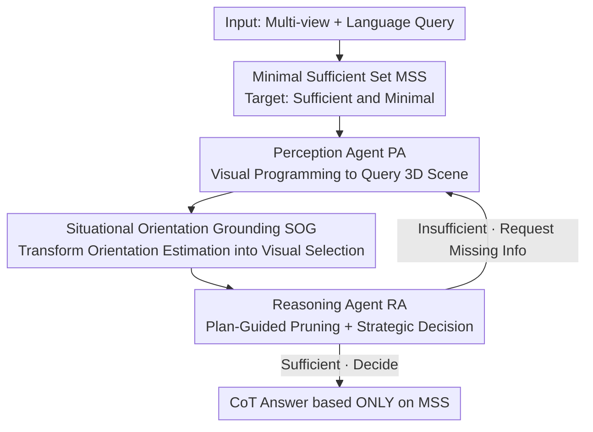

# Pursuing Minimal Sufficiency in Spatial Reasoning

**Conference**: ICLR 2026  
**OpenReview**: [https://openreview.net/forum?id=bZAKJwyn1n](https://openreview.net/forum?id=bZAKJwyn1n)  
**Code**: https://github.com/gyj155/mssr  
**Area**: Multimodal VLM / Spatial Reasoning / Agent  
**Keywords**: Spatial Reasoning, Minimal Sufficient Set, Dual-Agent, Visual Programming, Orientation Grounding

## TL;DR
Addressing the dual bottlenecks where VLMs "perceive inaccurately" and are "distracted by redundant information" in 3D spatial reasoning, this paper proposes MSSR: a zero-shot dual-agent framework. A Perception Agent actively queries the 3D scene via visual programming, while a Reasoning Agent iteratively prunes and completes information as needed to construct a "Minimal Sufficient Set (MSS)" before answering. It achieves +19.2 and +16.8 percentage point improvements over the GPT-4o backbone on MMSI-Bench and ViewSpatial-Bench, respectively.

## Background & Motivation
**Background**: Spatial reasoning—grounding linguistic object relationships into 3D space—is a fundamental capability for physical-world applications such as robotics and AR/VR. While modern VLMs excel at general vision tasks, they frequently fail at 3D geometric questions like "is the chair facing the window?" or "where is the clock relative to me when entering through the door?".

**Limitations of Prior Work**: The authors diagnose failures into two independent bottlenecks. The first is **Insufficient 3D Perception**: VLMs are primarily pre-trained on 2D data and lack geometric priors, making them naturally poor at estimating 3D quantities like layout, orientation, and depth. The second is **Redundancy-Induced Reasoning Failure**: 3D scenes have extremely high information density. Feeding all perception results into a VLM dilutes attention and triggers "shortcut" heuristic reasoning—for example, seeing "a table in front of a chair" might lead to the incorrect assumption that "the chair faces the table" (as shown in the counter-examples in Fig. 1).

**Key Challenge**: Resolving the first bottleneck (collecting more 3D information) naturally exacerbates the second (information redundancy). There is a tension between achieving "sufficiency" (having enough info) and preserving "minimality" (avoiding excess).

**Key Insight**: The authors draw on an observation from cognitive science—humans do not exhaustively process all sensory inputs but instead build **task-specific minimal mental models**, updating details as needed. In statistics, this corresponds to "Minimal Sufficient Statistics": retaining all relevant information in the sample using the most compressed form.

**Core Idea**: Spatial reasoning is reformulated as the process of **actively constructing a "Minimal Sufficient Set" (MSS)**—the most compact representation of spatial information required to answer a specific query. Two specialized agents, "Collection" and "Pruning," collaborate in a closed loop to approximate this MSS before generating the final answer.

## Method

### Overall Architecture
MSSR processes language-conditioned spatial reasoning: given $M$ views $I=\{I_1,\dots,I_M\}$ of the same scene and a natural language query $q$, it outputs answer $a$. Instead of answering directly, it iteratively constructs an MSS. Formally, let $W$ be all spatial and semantic information derivable from the 3D scene; the target MSS $S^\star\subseteq W$ must satisfy two conditions: **Sufficiency**—there exists an ideal reasoner $R^\star$ such that $R^\star(S^\star,q)=a^\star$ (no critical information is missing); and **Minimality**—$\forall S'\subset S^\star,\ R^\star(S',q)\neq a^\star$ (the smallest set maintaining sufficiency).

The process is a **closed-loop collaboration between a Perception Agent (PA) and a Reasoning Agent (RA)**. Starting from an empty set $S$: the PA first executes broad instructions to "collect as much relevant information as possible," filling $S$ with potentially redundant spatial primitives. The RA takes over, formulates a reasoning plan, and **prunes** information that has no causal connection to the plan to pursue minimality. If $S$ remains insufficient after pruning, the RA sends a **precise request for missing information** to the PA, which then runs another round of programming to fill the gap. This "pruning-targeted completion" loop continues until the RA determines $S$ is sufficient; at this point, the RA **discards all historical context** and generates the answer via CoT based only on this refined MSS, ensuring focus and interpretability.

### Key Designs

**1. Minimal Sufficient Set (MSS): Reformulating Spatial Reasoning as Finding "Just Enough Info"**

This is the foundation of the work, directly addressing the tension between sufficiency and minimality. Instead of treating reasoning as "the more info, the better," the authors define a target set $S^\star$ to actively approximate: it must satisfy $R^\star(S^\star,q)=a^\star$ (sufficient) and $\forall S'\subset S^\star,\ R^\star(S',q)\neq a^\star$ (minimal). Since ideal reasoners do not exist in real scenarios, MSSR approximates $S^\star$ by continuously updating $S$. The value of this formulation is that it explicitly splits "VLM errors" into "missing information" and "excessive information," allowing the PA (handling completion) and RA (handling pruning) to perform their respective duties. Ablations verify that minimality is a source of correctness, not just efficiency—pruning the set from an average of 17.3 items to 5.9 items improved accuracy from 45.8% to 48.3%.

**2. Perception Agent PA: Stateful Visual Programming to Query 3D Scenes into Structured Data**

The PA addresses the "Insufficient 3D Perception" bottleneck. It utilizes a visual programming paradigm: in each round, it receives the current $S$, the original query, scene images $I$, and a natural language request $r$ from the RA. It generates a Python script to call a set of predefined modules (vision expert models for geometric reconstruction, object localization, coordinate transformation, etc.), writing extracted object coordinates and relations into a dictionary merged into $S$. A key design is **preserving execution state across rounds**: the entire Python environment (intermediate variables, data structures) is saved as a snapshot after each script execution and reloaded in the next round. This allows subsequent perception tasks to reuse previous calculations, avoiding redundant work and supporting stateful incremental exploration. The toolkit includes basic `locate` (3D coordinate localization) and `computation` (value/coordinate system transformation) modules, along with two modules specifically for robust spatial understanding: **3D Scene Reconstruction** uses a fast neural reconstruction model (VGGT) to estimate camera parameters, depth maps, and a unified point cloud from sparse 2D images, serving as the "canvas" for subsequent extraction; **Global Coordinate Calibration** aligns scene axes based on explicit instructions (e.g., "assuming the window faces east") or prominent landmarks, disambiguating view-dependent terms like "left/behind" to provide a consistent reference for multi-step reasoning.

**3. Situational Orientation Grounding SOG: Rewriting Orientation Estimation as Visual Multiple Choice**

Orientation is the hardest part of spatial reasoning, and VLMs fail at directly regressing 3D geometric outputs. The core idea of SOG is **bypassing regression in favor of visual selection**: for a query anchored at object position $P_o$, it randomly generates four coplanar vectors $\{\vec{d}_i\}_{i=1}^4$ parallel to the ground and orthogonal to each other (like compass directions). Using visual prompts, these candidate 3D directions are **overlaid onto two views**—the "Situational View" (the original image) which preserves natural context, and the "Standard View" (an overhead synthetic view) which reduces perspective compression. The VLM then selects the direction that best fits the query. Once selected, denser candidates are generated around that direction for repeated selection, converging from **coarse to fine** toward an accurate direction. This avoids coordinate regression while leveraging the VLM’s strong semantic scene understanding. SOG handles not only intrinsic object orientations ("front of the chair") but also **situational orientations** ("direction exiting the room," "the direction one faces when going upstairs")—capabilities overlooked by prior work, significantly expanding queries from static localization to dynamic, perspectival reasoning. Ablations show that removing SOG (letting the VLM predict orientation vectors directly) drops performance to 46.9%.

**4. Reasoning Agent RA: Plan-Guided Pruning + Strategic Decision-Making**

The RA is the cognitive core, ensuring $S$ is both sufficient and minimal through a two-stage process. The first stage is **Plan-Guided Information Organizing**: the RA formulates a high-level reasoning plan for the query, initializes an empty $S_{n+1}$, and **inspects every item** in $S_n$ for relevance to the plan, retaining only necessary items in $S_{n+1}$. This subtractive filtering is key to maintaining a concise $S$. In the second stage, it makes a **Strategic Decision**: if $S_{n+1}$ is judged insufficient for the plan, it issues a `<Request>`—a natural language instruction describing exactly what is missing (e.g., "find the orientation of the person sitting on the chair"), which is sent back to the PA to trigger a new programming round. If $S_{n+1}$ is judged to contain all necessary information, it triggers `<Decide>`—discarding all historical context and generating an answer via CoT based only on this minimal set, ensuring the final reasoning is not distracted by irrelevant data. Notably, both PA and RA operate **zero-shot**, guided by high-level principles rather than ICL examples, ensuring strong generalization without overfitting to specific dataset quirks.

### Mechanism Example
Consider the query "Where is the clock relative to me when I enter through the door? (A Front / B Left / C Right-Front / D Left-Front)". In the first round, the PA performs broad collection, outputting an $S_n$ with 18 items including door position, clock position, "entrance" orientation, camera poses, outdoor locations, etc. The RA takes over, and based on a "establish coordinate system → calculate angle" plan, prunes $S_n$ down to 3 core items: $\{\text{Loc(door)}, \text{Loc(clock)}, \text{Orient(come\_in)}\}$. Determining these 3 items still lack specific angle calculations, it issues a `<Request>` for the PA to "establish coordinates and calculate the angle." After the PA provides the angle, the RA deems it sufficient and triggers `<Decision>`: using the entrance direction as North, the clock is at 38°/52° North-West, falling in the "Left-Front" area, selecting D. The trajectory compresses 18 items to 3 and then completes them, remaining interpretable and usable as supervision data for training.

## Key Experimental Results

### Main Results
On MMSI-Bench (multi-view situational reasoning) and ViewSpatial-Bench (multi-perspective relationship understanding), MSSR (with a GPT-4o backend) achieves new SOTAs:

| Dataset | Metric | MSSR (Ours) | GPT-4o backbone | Prev. SOTA | Gain |
|--------|------|------|----------------|----------|------|
| MMSI-Bench | overall | 49.5 | 30.3 | o3 41.0 | +19.2 (vs backbone) / +8.5 (vs o3) |
| ViewSpatial-Bench | overall | 51.8 | 35.0 | LEO 43.7 | +16.8 (vs backbone) |
| MMSI-Bench | multi-step reasoning | 50.0 | 30.8 | — | — |

Compared to the strongest open-source model, Qwen3-VL-8B (31.1%), the relative improvement on MMSI-Bench exceeds 60%. It significantly leads over 3D-VLMs (VLM-3R 32.0), expert models (LEO 39.3), and agent frameworks (ViLaSR 30.2). On ViewSpatial, it scores 51.0 in Camera-Based and 54.4 in Person-Based tasks, demonstrating stable generalization across egocentric and allocentric perspectives.

### Ablation Study

| Configuration | MSR | MMSI | ViewSpatial | Description |
|------|-----|------|-------------|------|
| Ours (Full) | 50.0 | 49.5 | 51.8 | Full model |
| GPT-4o | 30.8 | 30.3 | 35.0 | Bare backbone |
| Only PA | 33.8 | 37.1 | 32.5 | No RA; PA answers directly via programming |
| Only RA | 31.8 | 31.1 | 35.3 | No PA; RA relies on initial context |
| w/o SOG | 47.0 | 46.9 | 43.2 | Replaces SOG with direct VLM orientation prompting |
| w/o Iteration | 44.4 | 47.2 | 48.8 | Max iteration set to 1; completion disabled |

### Key Findings
- **Minimality is a source of correctness, not just efficiency**: Controlled experiments with "sufficiency-normalized" info sets showed that as set size decreased from 17.3 to 5.9 items, accuracy rose from 45.8% to 48.3%. There is a negative correlation between set size and accuracy—redundant information is a significant distractor for LLM agents.
- **Both agents are indispensable**: "Only PA" dropped to 37.1 (top-down execution is good for collection but poor for reasoning), and "Only RA" was barely stronger than the baseline (prompting cannot replace precise 3D perception), confirming their synergy.
- **PA is more sensitive to backbone capability than RA**: Cross-model ablations show that downgrading the PA from GPT-4o to Qwen2.5 dropped performance by 9.4%, while downgrading the RA only dropped it by 5.3%. The PA requires precise code generation and API calls, whereas the RA’s natural language planning is more robust. This allows for a "Strong PA + Light RA" (GPT-4o + Qwen2.5) configuration to save costs while retaining ~90% performance (44.2 vs 49.5).

## Highlights & Insights
- **Introduces "Minimal Sufficient Statistics" from statistics into agentic VLMs**, providing a correction to the "more information is better" additive strategy of 3D agents. Explicitly treating "pruning" as a first-class citizen alongside "collection" is a key departure from purely additive agents like ReAct.
- **SOG rewrites unsolvable 3D regression into reliable visual selection**. The coarse-to-fine selection combined with dual-view overlay of candidate vectors is a generalizable trick for other scenarios where VLMs fail to estimate geometric quantities.
- **Stateful Visual Programming**: Saving snapshots of the entire Python environment across rounds allows perception to build incrementally on previous calculations, transforming one-off scripts into a closed loop of exploration. This engineering design is valuable for any tool-augmented agent.
- Zero-shot, training-free, and requires no fine-tuning of VLM weights. It preserves general capabilities, avoids expensive 3D instruction data, and produces interpretable reasoning trajectories that can serve as supervision data for future 3D models.

## Limitations & Future Work
- SOG does not aim for sub-degree precision; the authors admit it may be insufficient for tasks requiring extremely fine-grained orientation. It has currently only been validated on two benchmarks; broader real-world robotics or AR scenarios remain to be tested.
- The framework depends entirely on the quality of external vision expert models (VGGT for reconstruction, expert segmentation for localization). Errors in reconstruction or localization propagate through the pipeline, and the paper does not deeply analyze this cascading error.
- The closed-loop iteration, multiple expert model calls, and VLM queries likely result in higher inference overhead and latency than a monolithic VLM. While the paper suggests a "Strong PA + Light RA" cost-saving plan, it does not systematically report end-to-end latency or cost.
- RA pruning relies on "plan relevance" judgments; if the plan is flawed, critical information might be deleted. The robustness boundaries of this pruning merit further investigation.

## Related Work & Insights
- **vs. Monolithic 3D-VLMs (LEO / VLM-3R / LLaVA-3D)**: These models require fine-tuning on synthetic 3D data or connecting point cloud modules, necessitating expensive 3D instruction sets and risking catostrophic forgetting of pre-trained knowledge. MSSR is zero-shot, leaves weights untouched, preserves all VLM capabilities, and wins through a structured perception-reasoning process.
- **vs. Accumulative Agents (ReAct / VADAR / 3D VQA agents)**: These primarily focus on information collection via additive strategies. MSSR’s key departure is "collection + pruning," using the RA’s subtractive filtering specifically to handle high redundancy in 3D scenes.
- **vs. Visual Programming (VisProg / ViperGPT)**: These usually involve one-time execution. MSSR embeds visual programming into a closed loop and saves execution states across rounds, allowing perception to build incrementally and avoid redundant work.

## Rating
- Novelty: ⭐⭐⭐⭐⭐ Formalizing "minimal sufficient statistics" for agentic spatial reasoning is highly original, and SOG’s regression-to-selection rewrite is clever.
- Experimental Thoroughness: ⭐⭐⭐⭐⭐ Solid evidence provided via two benchmarks, extensive baselines, controlled minimality experiments, and cross-backend generalization.
- Writing Quality: ⭐⭐⭐⭐ The Motivation-Method-Experiment chain is clear and diagrams are helpful; some implementation details are relegated to the appendix.
- Value: ⭐⭐⭐⭐⭐ Significantly improves spatial reasoning zero-shot without training, while producing interpretable trajectories for future training data.

<!-- RELATED:START -->

## Related Papers

- [\[ICLR 2026\] Spatial CAPTCHA: Generatively Benchmarking Spatial Reasoning for Human-Machine Differentiation](spatial_captcha_generatively_benchmarking_spatial_reasoning_for_human-machine_di.md)
- [\[ICLR 2026\] Transductive Visual Programming: Evolving Tool Libraries from Experience for Spatial Reasoning](transductive_visual_programming_evolving_tool_libraries_from_experience_for_spat.md)
- [\[ICLR 2026\] SpinBench: Perspective and Rotation as a Lens on Spatial Reasoning in VLMs](spinbench_perspective_and_rotation_as_a_lens_on_spatial_reasoning_in_vlms.md)
- [\[ICLR 2026\] Spatial-DISE: A Unified Benchmark for Evaluating Spatial Reasoning in Vision-Language Models](spatial-dise_a_unified_benchmark_for_evaluating_spatial_reasoning_in_vision-lang.md)
- [\[ICLR 2026\] OmniSpatial: Towards Comprehensive Spatial Reasoning Benchmark for Vision Language Models](omnispatial_towards_comprehensive_spatial_reasoning_benchmark_for_vision_languag.md)

<!-- RELATED:END -->
