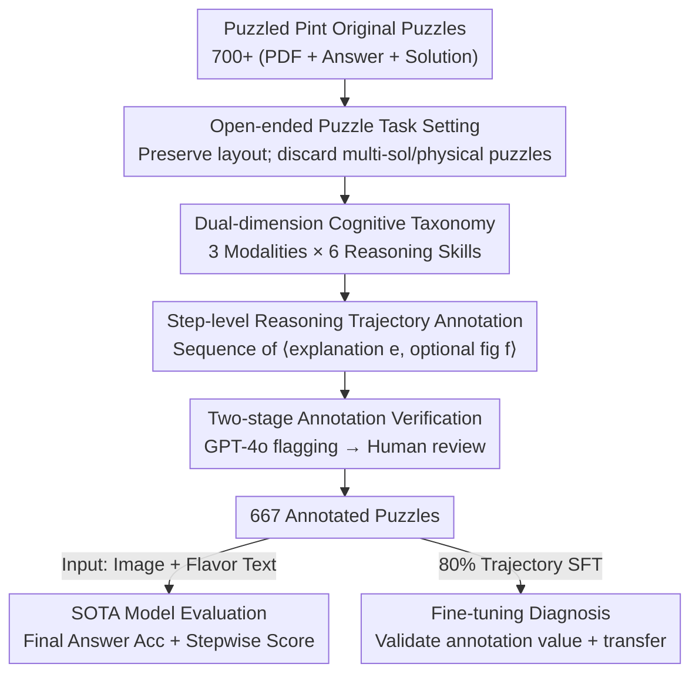

# PuzzleWorld: A Benchmark for Multimodal, Open-Ended Reasoning in Puzzlehunts

**Conference**: ICLR 2026  
**OpenReview**: [https://openreview.net/forum?id=5sAsjb2jCb](https://openreview.net/forum?id=5sAsjb2jCb)  
**Code**: https://github.com/MIT-MI/PuzzleWorld  
**Area**: Multimodal VLM / Reasoning Evaluation  
**Keywords**: Open-ended reasoning, multimodal puzzles, reasoning benchmark, step-level scoring, puzzlehunt

## TL;DR
PuzzleWorld collects 667 "puzzlehunt" style multimodal puzzles without explicit problem definitions, annotating each with final answers, stepwise reasoning trajectories, and cognitive skill labels. Results show that current state-of-the-art models achieve final answer accuracies of only 1–18%, far behind puzzle enthusiasts. Through stepwise scoring and fine-tuning experiments, the study reveals three major model shortcomings: "myopic reasoning, over-reliance on language, and lack of visual sketching capabilities."

## Background & Motivation
**Background**: Current progress in language and multimodal reasoning is largely built on benchmarks like mathematics, code, and geometry, which feature "clearly defined problems and constrained environments." These tasks pre-define the problem space—coding problems provide executable environments for verification, and geometry problems use domain-specific languages to describe structures—meaning models only need to solve within a designated problem space.

**Limitations of Prior Work**: These benchmarks essentially only test the ability to "solve within a pre-defined problem space," while almost never testing the ability to "discover the problem itself." However, real-world scientific discovery, exploratory data analysis, and intelligence analysis occur in open-ended environments where rules are unclear and goals are fuzzy. Such tasks require dynamically proposing hypotheses, adapting to implicit structures, and cross-modal creative reasoning. The performance of foundation models in these open-ended settings has rarely been systematically measured before.

**Key Challenge**: Existing multimodal benchmarks (MMMU, OlympiadBench, ARC-AGI, etc.) either consist of "well-defined" academic problems close to the training distribution, measuring in-distribution reasoning, or abstract visual pattern problems that lack the exploratory, cross-modal entanglement of the real world. EnigmaEval, which is most similar to PuzzleWorld, also uses puzzlehunts for evaluation but is closed-source, provides only evaluation metrics without human stepwise annotations, and cannot perform fine-grained diagnosis of intermediate reasoning or failure modes.

**Goal**: To construct an open-ended, compositional multimodal reasoning benchmark that truly tests the ability to "think through what the problem is before solving it," while supporting fine-grained diagnosis (where and why failure occurs) and model training.

**Key Insight**: The authors selected "puzzlehunt" as a puzzle category—solvers are not told what the task is and must first infer the nature of the problem from fuzzy clues in text, images, and cultural references before designing and executing a solution. This naturally demands lateral thinking and resilience in "following clues, backtracking after hitting walls, and managing uncertainty," making it an ideal carrier for evaluating general reasoning.

**Core Idea**: Transform real puzzles from the Puzzled Pint monthly events into a benchmark, **preserving the original layout** (not splitting content into pure text and images, as spatial layout itself is a solution clue). Manually annotate each puzzle with **stepwise reasoning trajectories + input modalities + cognitive skills**, enabling the measurement of both final answers and intermediate reasoning progress.

## Method

### Overall Architecture
PuzzleWorld is not a model architecture but a **benchmark construction + evaluation pipeline**. Inputs consist of 700+ original puzzles (including original PDFs, single-phrase answers, and solution documents) released by Puzzled Pint from 2010–2025. Outputs are 667 cleaned and annotated puzzles, each with standardized metadata (title, flavor text, difficulty, answer, stepwise reasoning, modality labels, skill labels, and source). On the evaluation side, models are fed the puzzle image and transcribed flavor text to output the final answer and reasoning process, which are then scored using "final answer accuracy" and "stepwise accuracy."

The pipeline is executed in four serial steps: collection, manual annotation, automatic verification, and manual cleaning, integrated with two evaluation dimensions (modality × skill) and two evaluation metrics. The following diagram provides an overview of data construction and evaluation:

### Key Designs

**1. Open-ended puzzle task setting: Forcing general reasoning through the dual challenge of "problem discovery and problem solving"**

Addressing the pain point that existing benchmarks only test well-defined problem solving, the authors deliberately chose puzzlehunts. Solvers do not receive clear tasks but must infer "what the problem actually is" from fuzzy clues embedded in text, images, and cultural references. A puzzle might require decoding the first line as binary, the second as Morse code, and the third as semaphore, then combining the results—without any instructions suggesting this. A critical engineering decision was **preserving the original puzzle layout** rather than transcribing content into isolated text and images as in EnigmaEval, because spatial layout (e.g., words filled into a spiral, letter order on a ring) is itself critical information. Puzzles with incomplete solutions, multiple correct answers, or those requiring physical activity were discarded, leaving 667 items. This setting prevents models from succeeding via pattern matching close to the training distribution, forcing them to perform lateral thinking, symbolic abstraction, and integration of spatial reasoning.

**2. Dual-dimensional cognitive taxonomy: Decoupling "what is tested" into two orthogonal axes: Modality × Reasoning Mechanism**

To make the evaluation diagnostic rather than just providing a total score, each puzzle is labeled across two dimensions. **Input Modality** is categorized into three types: Text (instructions/narrative/wordplay), Visual (unstructured visuals like images, icons, typography), and Structured (organized visuals like tables, grids, matrices, diagrams). **Reasoning Mechanism** covers six core cognitive abilities: logic (deductive/causal inference), wordplay (puns, anagrams, homophones), spatial (mental manipulation of objects, structure navigation), cryptic decoding (identifying and applying ciphers/encodings), knowledge (domain facts like science/history), and commonsense (implicit real-world expectations). Mapping every puzzle to a "modality combination × skill combination" allows for locating exactly where a model is strong or weak.

**3. Step-level reasoning annotation and stepwise accuracy: Decomposing "0% failure" into observable reasoning trajectories**

Final answer accuracy typically yields single-digit scores, a "pass-fail" approach that obscures how far a model's reasoning actually progressed. The core annotation contribution is decomposing the solution process into **ordered reasoning steps**, formalized as tuples $\langle e, f\rangle$ where $e$ is a textual explanation and $f$ is an optional diagram. Based on this, **stepwise accuracy** is defined: since puzzles may have multiple solution paths, a candidate solution's stepwise score is the "proportion of the furthest reference step successfully executed." This is evaluated by GPT-4o acting as an LLM judge, determining step-by-step if the candidate hits each reference step. This judge achieved a Pearson correlation of $r=0.829$ and an MAE of only $0.083$ compared to human scoring, confirming its reliability. This metric allows models with 0% answer accuracy but decent intermediate reasoning (e.g., InternVL3 with 0.89% answer but 15.49% stepwise) to be differentiated.

**4. Two-stage annotation verification and contamination checks: Ensuring quality and benchmark credibility**

Manual stepwise annotation can introduce ambiguity and inconsistency. The authors designed a two-stage verification process: first, GPT-4o automatically flags each puzzle for "correctness and reasoning coherence," identifying ambiguous or logically broken steps (12.11% of data flagged). Then, two human verifiers independently review all flagged items and correct them (modifying 10.93% of initial annotations). As additional quality assurance, manual verification of a random 5% subset resulted in 96.5% of annotations being judged as correct. Finally, a specific check was performed to see if SOTA models had "memorized" these puzzles (data contamination), with no evidence of contamination found. This workflow ensures the 667 puzzle annotations are consistent and trustworthy, validating the subsequent findings that fine-tuning works and errors are attributable.

## Key Experimental Results

### Main Results
SOTA closed-source reasoning models (GPT-o3, GPT-4o, Claude Opus 4, Gemini-2.5/3-Pro, Grok 4) and open-source models (QVQ-72B, InternVL3-78B, Kimi VL A3B) were evaluated on PuzzleWorld, with three levels of human baselines provided (Novice / Enthusiast / Expert).

| Model | Final Answer Acc | Stepwise Score | Remarks |
|------|------|------|------|
| QVQ-72B-Preview (Best OS) | 1.36 | 30.23 | Lowest answer acc, but stepwise exceeds many closed models |
| InternVL3-78B | 0.89 | 15.49 | Near 0 answer acc but some intermediate reasoning |
| GPT-4o | 1.83 | 22.09 | — |
| Claude Opus 4 | 4.50 | 24.56 | — |
| Gemini 2.5 Pro | 7.65 | 31.61 | — |
| GPT-o3 | 14.22 | 39.81 | — |
| **Gemini 3 Pro (Overall Best)** | **18.00** | **39.99** | Only matches human Novice |
| Human Novice | 13.89 | 23.10 | Best model ≈ Novice |
| Human Enthusiast | 44.44 | 51.70 | Far exceeds all models |
| Human Expert | 100.0 | 100.0 | Ideal score |

Most models' final answer accuracy is only 1–4%. Even the strongest, Gemini 3 Pro, solved only 18% of puzzles with a stepwise score of 40%, barely matching a human novice and trailing far behind enthusiasts (44%) and experts (100%). By modality, models perform best on text puzzles and worst on unstructured visual puzzles (often less than half of text accuracy). Structured puzzles (e.g., crossword grids) are handled better than free visuals, exposing persistent weaknesses in visual grounding and spatial reasoning.

### Ablation Study (Annotation Value and Downstream Transfer)
InternVL3-8B was fine-tuned on 80% of the data using "Reasoning Trajectories" vs. "Final Answer Only," and evaluated on a 20% test set.

| Config | Acc | Stepwise Score | Note |
|------|------|------|------|
| Base | 0.76 | 4.78 | Un-tuned |
| Fine-tuned (Answer only) | 0.00 | 2.96 | Reasoning collapse, 0 accuracy |
| Fine-tuned (Trajectories) | 0.76 | 11.00 | Stepwise score doubles |

In terms of downstream transfer, the trajectory-tuned model showed gains on Rebus visual puzzles (3.2%→5.1%), MathVista geometry (65.87%→66.35%), and Visual Question Answering (32.40%→39.11%), while slightly declining on knowledge-dependent tasks like TextbookQA (63.92%→60.13%) and Math Word Problems (62.37%→59.14%).

### Key Findings
- **SOTA models only reach human novice levels**: Biological performance at 18% shows that open-ended multimodal reasoning is a vacuum for current models. Stepwise metrics demonstrate that "answer failure" hides significant differences in intermediate reasoning quality.
- **Stepwise annotation is a gold mine**: Fine-tuning with answers only causes reasoning to collapse (stepwise 4.78%→2.96%), whereas trajectory fine-tuning doubles stepwise progress to 11.00% and transfers to vision-oriented downstream tasks, suggesting models learn transferable reasoning rather than task-specific tricks.
- **Three error modes**: ① Myopic reasoning—GPT-o3 often scores 0 on stepwise because it commits to an early surface hypothesis (e.g., insisting on Morse code) without backtracking; ② Language bottleneck—loss of information when converting visual content to textual representations; ③ Lack of sketching—inability to perform visual "scribbling" steps to generate correct intermediate outputs.

## Highlights & Insights
- **"Discovering the problem" is the next frontier**: The most valuable perspective of the paper is pointing out that existing benchmarks test "solving within a given problem space," while the path to general intelligence requires inferring the problem itself in open-ended environments. Puzzlehunt is an excellent realization of this abstract concept.
- **Clever definition of stepwise accuracy**: Using the "furthest reference step successfully reached" as the score bypasses the "multiple solution path" problem and automates expensive human evaluation using an LLM judge ($r=0.829$). This protocol is transferable to other open-ended reasoning tasks.
- **Preserving original layout is counter-intuitive but correct**: While most benchmarks split text and images for convenience, Ours does the opposite because spatial layout is informative. The result also suggests that the bottleneck is not OCR, allowing effort to be shifted to valuable stepwise annotation.
- **Collapsing on "answer-only fine-tuning" is a warning**: It proves that for complex reasoning, the form of the supervision signal (process vs. outcome) is more critical than raw data volume, providing a lesson for training reasoning models.

## Limitations & Future Work
- **Single data source**: All puzzles come from Puzzled Pint, which has a specific style and cultural bias (English-centric), potentially limiting coverage of other open-ended reasoning types.
- **Reliance on LLM judge**: Stepwise accuracy is determined by GPT-4o; while highly correlated with humans, it may have systematic biases in edge cases or visual steps where the judge itself is weak.
- **Basic fine-tuning approach**: Simple SFT barely moved the needle on final answer accuracy (0.76%), suggesting SFT is insufficient for such complex reasoning, leaving significant room for RL, tool calling, or explicit backtracking mechanisms.
- **Weak difficulty-step correlation (0.24)**: Difficulty stems from open-endedness rather than number of steps, suggesting difficulty labels as a single dimension may not fully characterize the tasks.

## Related Work & Insights
- **vs. EnigmaEval**: Both use puzzlehunts, but EnigmaEval is closed-source and lacks stepwise annotation. PuzzleWorld is open-access with rich annotations, supporting fine-grained diagnostics and preserving original layouts.
- **vs. MMMU / OlympiadBench / SciBench**: These are well-defined academic multimodal problems measuring in-distribution reasoning. PuzzleWorld focuses on open-ended reasoning without clear instructions.
- **vs. ARC-AGI**: ARC tests abstract visual patterns with minimal priors but lacks the exploratory, multimodal entanglement of the real world found in PuzzleWorld.
- **vs. PuzzleVQA / AlgoVQA**: These focus on narrow, constrained task formats where modern models perform well. PuzzleWorld's unstructured puzzles cause broad model failure, better exposing true reasoning gaps.

## Rating
- Novelty: ⭐⭐⭐⭐⭐ Materializes "discovering the problem" into an evaluatable benchmark with diagnostic metrics.
- Experimental Thoroughness: ⭐⭐⭐⭐⭐ Covers 9 SOTA models, three human baselines, modality/difficulty breakdowns, fine-tuning transfer, and error attribution.
- Writing Quality: ⭐⭐⭐⭐ Clear motivation and effective visuals; minor inconsistencies in reported SOTA numbers.
- Value: ⭐⭐⭐⭐⭐ Open-source puzzles + rich annotations + diagnostic metrics provide a scarce and sustainable resource for multimodal reasoning research.

<!-- RELATED:START -->

## Related Papers

- [\[AAAI 2026\] SToLa: Self-Adaptive Touch-Language Framework with Tactile Commonsense Reasoning in Open-Ended Scenarios](../../AAAI2026/vlm_reasoning/stola_self-adaptive_touch-language_framework_with_tactile_commonsense_reasoning_.md)
- [\[NeurIPS 2025\] MM-OPERA: Benchmarking Open-ended Association Reasoning for Large Vision-Language Models](../../NeurIPS2025/vlm_reasoning/mm-opera_benchmarking_open-ended_association_reasoning_for_large_vision-language.md)
- [\[ICLR 2026\] MathNet: A Global Multimodal Benchmark for Mathematical Reasoning and Retrieval](mathnet_a_global_multimodal_benchmark_for_mathematical_reasoning_and_retrieval.md)
- [\[ICLR 2026\] SportR: A Benchmark for Multimodal Large Language Model Reasoning in Sports](sportr_a_benchmark_for_multimodal_large_language_model_reasoning_in_sports.md)
- [\[ICLR 2026\] MMR-V: What's Left Unsaid? A Benchmark for Multimodal Deep Reasoning in Videos](mmr-v_whats_left_unsaid_a_benchmark_for_multimodal_deep_reasoning_in_videos.md)

<!-- RELATED:END -->
