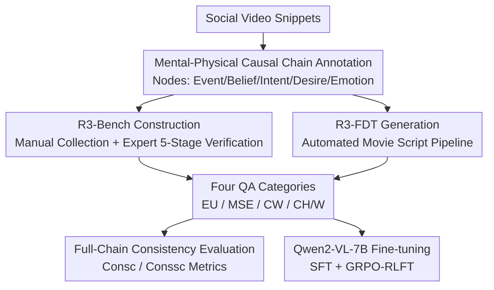

# Read the Room: Video Social Reasoning with Mental-Physical Causal Chains

**Conference**: ICLR 2026  
**OpenReview**: [https://openreview.net/forum?id=TJilJnZjpw](https://openreview.net/forum?id=TJilJnZjpw)  
**Code**: https://github.com/LiXingNiu/Read-the-Room  
**Area**: Multimodal VLM / LLM Reasoning  
**Keywords**: Video Social Reasoning, Mental-Physical Causal Chains, Theory of Mind, VLM Evaluation, Social Cognition Benchmark

## TL;DR
This paper introduces the R3-Bench benchmark and the R3-FDT large-scale training set to systematically evaluate the video social reasoning capabilities of LVLMs through a "Mental-Physical Causal Chain" structure. The study reveals a significant gap between current state-of-the-art models and human performance and demonstrates that fine-tuning on R3-FDT significantly improves social reasoning across multiple benchmarks.

## Background & Motivation

**Background**: "Reading the room" is a core component of human social intelligence—the ability to infer others' mental states from subtle social cues and understand the causal relationships between beliefs, intentions, desires, and emotions. While Large Vision-Language Models (LVLMs) have made substantial progress in multimodal understanding, social reasoning evaluation systems remain immature.

**Limitations of Prior Work**: Existing video QA benchmarks (e.g., MVBench, Video-MME) primarily focus on factual visual understanding and lack a fine-grained characterization of multiple mental state categories. Datasets focused on mental states (e.g., MMToM-QA, Social-IQ) are limited in scope, small in scale (maximum 6k questions), and do not model multi-step causal chains between mental states. More fundamentally, current benchmarks only measure single-question accuracy, failing to determine whether a model truly understands the complete causal logic of social interactions.

**Key Challenge**: The observable physical world is merely the tip of the iceberg; humans can perceive nested layers of mental states—who knows what, who is hiding what, and how emotions evolve with events—from just a few seconds of a social scene. This "Mental-Physical Causal Chain" reasoning requires models to simultaneously: (i) detect subtle behavioral cues; (ii) estimate multiple dynamic mental states; and (iii) identify cross-temporal causal relationships between physical events and mental states. This gap in LVLMs has never been systematically quantified.

**Goal**: To build a complete system for diagnosing the social reasoning capabilities of LVLMs: a high-quality evaluation benchmark, a set of metrics revealing "full-chain consistency" rather than just single-question accuracy, and a large-scale training set to drive model performance.

**Core Idea**: Use the "Mental-Physical Causal Chain" as a unified structure to drive annotation, QA generation, and consistency evaluation, ensuring all components share the same reasoning graph.

## Method

### Overall Architecture

The work centers on the "Mental-Physical Causal Chain" structure, producing two data assets: an evaluation benchmark (R3-Bench) and a training set (R3-FDT). Comprehensive evaluations of mainstream LVLMs are conducted on R3-Bench to validate the training utility of R3-FDT.

### Key Designs

**1. Mental-Physical Causal Chain Annotation: A Unified Graph for Mental States**

Traditional social reasoning datasets treat beliefs, intentions, desires, and emotions as independent labels, failing to capture their dynamic evolution and causal dependencies. Based on Theory of Mind and the BDI framework, this work models key events and various mental states in a social video as nodes in a directed graph. Causal edges connect them into a "subchain $\rightarrow$ chain" hierarchical structure: each subchain consists of a result node $n_1$ and several sufficient cause nodes $\{n_0^i\}$, where each cause is necessary for deriving the result. This annotation system directly drives the generation of four QA types: Event Understanding (EU) for event nodes, Mental State Estimation (MSE) for mental state nodes, Causal-Why (CW) for abductive reasoning of subchains, and Causal-How/What (CH/W) for deductive reasoning. All questions naturally form a verifiable causal graph.

**2. R3-Bench Five-Stage Construction: Ensuring Difficulty and Reliability**

High-quality social reasoning benchmarks face two challenges: ensuring questions are truly difficult (avoiding pre-training data leakage) and maintaining the coherence of causal chain annotations. R3-Bench addresses these via a five-stage pipeline: (i) Manual Data Collection—volunteers submit videos (ads, short films, life snippets) with questions, distractors, and explanations; (ii) Manual Data Verification—experts in cognitive science and AI independently review samples, filtering those that do not meet standards for "causal depth, mental state relevance, and clarity," while using Gemini 1.5 Pro to filter out questions that models can already solve; (iii) Causal Chain Annotation—experts annotate nodes and subchains, with cross-verification for consistency; (iv) QA Generation—GPT-4o generates 4,840 questions based on node/subchain rules (EU/MSE/CW/CH/W); (v) QA Validation—experts check temporal reference accuracy, node coverage, and uniqueness of correct answers. R3-Bench is divided into a challenge subset (R3-Bench-Hard) and a diagnostic subset (R3-Bench-DX).

**3. R3-FDT Automated Movie Data Generation: Bypassing Hallucinations via Textual Accuracy**

Training LVLMs requires large-scale annotated data, but manual frame-by-frame annotation is prohibitively expensive. The key insight of R3-FDT is that movie data comes with scripts (scene descriptions, dialogues, and metadata). Using textual information to drive GPT-4o for causal chain generation avoids cross-modal hallucinations. The pipeline consists of: (i) Information Alignment—extracting scene contexts, event annotations, and dialogues from MovieNet/MovieQA, then aligning them with Whisper timestamps; (ii) Causal Chain Generation—GPT-4o infers causal relationships based on aligned text, identifying implicit mental states from behaviors and dialogues; (iii) Self-Correction—GPT-4o checks consistency between symbolic representations and natural language; (iv) Hallucination Detection—Gemini 2.5 Flash performs a three-step analysis of the video and generated QA (alignment check + explanation + confidence score), retaining only hallucination-free samples. R3-FDT contains 2.8k videos and 41k QA pairs.

**4. Full-Chain Consistency Metrics: Revealing the Accuracy-Consistency Paradox**

Single-question accuracy fails to detect a common failure mode: a model might correctly answer "Why did A happen? Because of B" while incorrectly answering "Did B happen in the video?". This indicates the model is guessing rather than understanding causal structures. This paper proposes Chain Consistency ($\text{Cons}_c$) and Subchain Consistency ($\text{Cons}_{sc}$): a chain (or subchain) is only counted if the model answers all associated questions correctly.

$$\text{Cons}_c = \frac{\sum_{g \in G} \prod_{(v,q,a_{gt},A) \in D(g)} \mathbb{I}(a^* = a_{gt})}{|G|}$$

This metric is rigorous—Gemini 2.5 Pro achieves 86.34% accuracy on R3-Bench-DX but only **36.60%** chain consistency; GPT-4o achieves 82.64% accuracy but only **25.36%** consistency. This gap proves that current models lack structural understanding of social interactions.

## Loss & Training

A sample of 13k QA pairs from R3-FDT (with subtitles) was used for Supervised Fine-Tuning (SFT) and Group Relative Policy Optimization (GRPO) reinforcement learning (RLFT), using Qwen2-VL-7B as the backbone. In SFT, 10% of samples were converted to open-ended formats to enhance generalization. For RLFT, the reward signal was defined by multiple-choice answer matching. Despite domain differences between movie clips (training) and YouTube-style content (testing), the consistency in causal chain structures facilitates successful transfer learning.

## Key Experimental Results

**Main Results on R3-Bench-Hard** (Video+Subtitle setting):

| Model | Accuracy |
|------|--------|
| Random Baseline | 20% |
| InternVL2-8B | 24.68% |
| GPT-4o | 48.73% |
| Gemini 2.5 Pro | 59.18% |
| Qwen2-VL-7B + R3-FDT (SFT) | **42.09%** |
| Human | **80.06%** |

**Consistency Gap on R3-Bench-DX** (+Sub setting):
- GPT-4o: 82.64% Accuracy, **25.36%** Chain Consistency (48.93% Subchain)
- Gemini 2.5 Pro: 86.34% Accuracy, **36.60%** Chain Consistency (58.82% Subchain)
- Human: 92.24% Accuracy, **60.47%** Chain Consistency

**Key Findings from Cognitive Analysis**: The weakest dimensions are "detection of verbal and behavioral contradictions" (Gemini 2.5 Pro 48.2% vs. Human 78.8%) and "pragmatic reasoning/subtext." For "inference beyond the video," top models (68.8%) approach human levels (75.0%), suggesting strong linguistic priors benefit these tasks.

**Generalization after Fine-tuning** (Gain over baseline):
- R3-Bench-DX: SFT +22.81%, RLFT +20.95%
- R3-Bench-Hard: SFT +7.91%, RLFT +5.69%
- Social-IQ 2.0: SFT +3.87%, RLFT +6.89%
- IntentQA: SFT +4.78%, RLFT +7.59%

## Highlights & Insights

- **Iceberg Effect**: The observable physical world is just the tip of the iceberg for the mental world. Structuring the "underwater" portion through causal chains is the central metaphor and distinguishing feature of this work.
- **Consistency Paradox**: The gap between high accuracy and low consistency points toward architectural issues—models lack systematic modeling of temporal event structures and deep multimodal fusion, rather than just lacking knowledge.
- **Leveraging Text to Bypass Visual Hallucinations**: The R3-FDT pipeline intelligently utilizes high-quality human textual annotations from script data to anchor GPT-4o's reasoning structure generation, bypassing the unreliability of direct video-to-causal-chain inference.

## Limitations & Future Work

- R3-FDT training data comes from movie clips, creating a domain gap with YouTube-style test videos. While the causal structure helps transfer, generalization in more open scenarios requires further validation.
- The current consistency evaluation uses multiple-choice formats; future work could explore chain consistency measures in open-ended generation.
- Hallucination detection using Gemini 2.5 Flash may contain its own errors, particularly concerning subtle pragmatic nuances.

## Related Work & Insights

This work is directly related to Theory of Mind (ToM) modeling (MMToM-QA), emotional reasoning (MELD), intent understanding (IntentQA), and social reasoning (Social-IQ). The primary differentiation is the simultaneous coverage of four mental state categories and the modeling of multi-step causal chains. Insights for future work: (i) Social reasoning evaluations should report both accuracy and chain consistency; (ii) Mental state modeling requires explicit temporal causal structures, not just frame-wise feature extraction; (iii) Using high-quality structured text annotations to "bridge" video data is a viable path for constructing large-scale fine-grained training sets.

<!-- RELATED:START -->

## Related Papers

- [\[CVPR 2026\] Streaming Video Crime Anticipation with Spatio-Temporal Causal Reasoning](../../CVPR2026/vlm_reasoning/streaming_video_crime_anticipation_with_spatio-temporal_causal_reasoning.md)
- [\[ICLR 2026\] MindCube: Spatial Mental Modeling from Limited Views](mindcube_spatial_mental_modeling_from_limited_views.md)
- [\[CVPR 2026\] Beyond Perceptual Shortcuts: Causal-Inspired Debiasing Optimization for Generalizable Video Reasoning in Lightweight MLLMs](../../CVPR2026/vlm_reasoning/beyond_perceptual_shortcuts_causal-inspired_debiasing_optimization_for_generaliz.md)
- [\[CVPR 2026\] CaST-Bench: Benchmarking Causal Chain-Grounded Spatio-Temporal Reasoning for Video Question Answering](../../CVPR2026/vlm_reasoning/cast-bench_benchmarking_causal_chain-grounded_spatio-temporal_reasoning_for_vide.md)
- [\[ACL 2026\] GeoRC: A Benchmark for Geolocation Reasoning Chains](../../ACL2026/vlm_reasoning/georc_a_benchmark_for_geolocation_reasoning_chains.md)

<!-- RELATED:END -->
