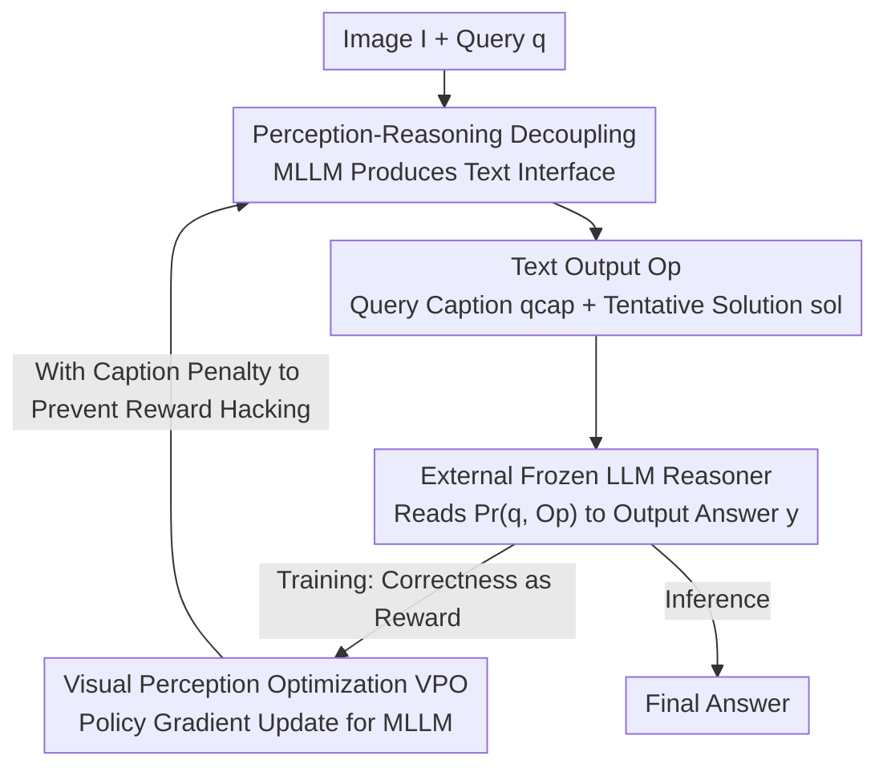

# Reasoning-Aligned Perception Decoupling for Scalable Multi-modal Reasoning

**Conference**: ICLR 2026  
**OpenReview**: [https://openreview.net/forum?id=hlLXvyz5iP](https://openreview.net/forum?id=hlLXvyz5iP)  
**Code**: https://github.com/gyhdog99/RAPID/  
**Area**: Multi-modal VLM / LLM Reasoning  
**Keywords**: Multimodal Reasoning, Perception-Reasoning Decoupling, Reinforcement Learning, Inference-time Scaling, Caption Generation

## TL;DR
RAPID repositions the role of Multi-modal Large Language Models (MLLMs) as "perceptors"—responsible only for translating images into text (query-related captions + tentative solutions), which is then handed over to any external text-only LLM for reasoning. A reinforcement learning algorithm named VPO is used to optimize these text outputs based on the "final correctness of the external LLM," allowing a single trained MLLM to be used plug-and-play with increasingly powerful LLMs to achieve continuous performance gains without expensive vision-language re-alignment.

## Background & Motivation
**Background**: Text-only reasoning models, represented by OpenAI-o1 and Qwen3, have made significant progress in complex tasks such as mathematics and science through "slow thinking" (over 30% improvement on AIME). However, the multi-modal field lags significantly: the LLMs embedded in MLLMs like Qwen2.5-VL, InternVL3, and Gemma3 are often previous-generation models lacking slow-thinking capabilities, leading to struggles in math-intensive visual reasoning.

**Limitations of Prior Work**: To enhance MLLM reasoning, mainstream methods involve reinforcement learning (e.g., VL-Rethinker, MM-EUREKA) or distillation (e.g., Vision-R1). However, the ceiling of these methods is strictly locked by the base LLM—if the base is Qwen2.5, no amount of RL can surpass Qwen3. The most direct solution is to replace the internal LLM with the latest and strongest one, but this requires re-aligning vision and language over trillions of tokens, a prohibitively high cost.

**Key Challenge**: The "perception capability" and "reasoning capability" of an MLLM are tightly bound within the same model. Whenever a stronger reasoning LLM emerges, one is forced to retrain even the perception component, incurring massive redundant alignment costs; these costs, in turn, deter frequent upgrades of the reasoning backbone.

**Goal**: Is it possible to replace the internal LLM of an MLLM to efficiently unlock advanced reasoning capabilities without re-doing vision-language alignment?

**Key Insight**: The authors observe that if the MLLM only produces "text," then text naturally serves as a universal interface between the perception module and the reasoning module—any text-only LLM can understand text. Thus, the responsibility of the MLLM is narrowed to "captioning," while reasoning is outsourced to an external strong LLM, allowing the two to be decoupled and upgraded independently.

**Core Idea**: Utilize "Perception-Reasoning Decoupling + Aligning captions using downstream correctness as a reward" instead of "retraining the entire MLLM." This enables the perception module to be trained once and reused permanently, showing performance gains when paired with any LLM reasoner.

## Method

### Overall Architecture
RAPID splits a multi-modal reasoning task into two serial processes: the **perception stage**, where an MLLM (e.g., Qwen2.5-VL) translates the image $I$ and query $q$ into a set of text outputs $O_p$; and the **reasoning stage**, where a frozen, powerful text-only LLM reasoner (e.g., R1-Distilled-7B, Qwen3-8B) receives the original query $q$ and $O_p$ (organized by a reasoning prompt $P_r$) to output the final answer $y = \text{LLM}(P_r(q, O_p))$. The text output $O_p$ is the crucial "universal interface" that allows the reasoning LLM to be independently replaced and upgraded without retraining the MLLM.

However, decoupling introduces a risk: the text produced by the MLLM is not optimized for "making the downstream reasoning correct"—it receives no feedback on whether the description helped the LLM answer correctly. RAPID addresses this with a reinforcement learning loop called **VPO**: the MLLM samples a group of caption candidates for the same image, each candidate is fed to the reasoning LLM, and rewards are assigned based on "whether the final answer is correct." Policy gradients are then used to update the MLLM, teaching it to generate "faithful and query-relevant" captions conducive to downstream success. The training requires minimal data (approx. 39K), and the resulting MLLM can be used plug-and-play with any LLM.

### Key Designs

**1. Perception-Reasoning Decoupling: Downgrading MLLM to an "Image Describer" for Hot-Swappable Reasoning LLMs**

Addressing the bottleneck that replacing the reasoning backbone requires re-alignment, RAPID shifts the MLLM's role from end-to-end "perception + reasoning" to translating multi-modal input into text $O_p$. Reasoning is entirely outsourced to a standalone text-only LLM. This text serves as a **universal natural language interface**—since LLMs only read text, any stronger LLM can be directly attached without retraining the MLLM or re-doing vision-language alignment. A key difference from previous "caption-then-reason" pipelines is that RAPID's output includes both an image caption and a **tentative solution** to ensure that critical visual information required for reasoning is captured. Ablation shows that this decoupling alone (using Qwen3-8B) improves the 7B MLLM's average score from 42.0 to 47.5 (+5.5%).

**2. Design of Text Output Content: Complementary Standard Captions and Tentative Solutions**

The authors systematically compared six combinations for $O_p$: empty set `none`, standard caption `cap`, query-related caption `qcap`, tentative solution `sol`, and combinations like `cap+sol` and `qcap+sol`. Two conclusions emerged: first, **without optimization, standard `cap` outperforms `qcap`** because MLLMs are better trained on standard description tasks; second, **captions and tentative solutions are complementary** (`cap+sol` with Qwen3-8B is ~7% higher than the original MLLM) as captions provide context and solutions provide a preliminary answer. Interestingly, the authors defaulted to `qcap+sol` because once VPO optimization is applied (Design 3), query-related captions outperform standard ones by guiding the MLLM to focus on relevant visual details, showing higher potential for RL optimization.

**3. Visual Perception Optimization (VPO): Aligning Captions with "Downstream Correctness" as a Reward**

This is the core innovation, targeting the lack of downstream feedback for MLLM captioning. VPO leverages the group relative policy optimization approach from GRPO, setting the policy $\pi_\theta$ to be the MLLM producing visual captions. For an input pair $(I, q)$, the old policy samples $G$ caption candidates. Since captions are intermediate products with no intrinsic ground truth, VPO feeds each candidate $o_i$ into the reasoning LLM to generate a final answer $y_i$, using the truth-matching of the answer as the reward:

$$\hat{R}_i = r(y_{gt}, y_i) = \mathbb{1}(y_{gt} = \text{parse}(y_i)),\quad y_i = \text{LLM}(P'_{reason}(q, o_i))$$

Normalized advantages $\hat{A}_i = \frac{R_i - \bar{R}}{\sigma(R)}$ are calculated within the group, and a clipped surrogate loss (clipping to $[1-\epsilon_l, 1+\epsilon_h]$) with a KL penalty is used. Thus, the MLLM generates captions not just for similarity but to help the downstream reasoner succeed. Crucially, VPO is **LLM-agnostic**: the MLLM communicates via natural language, meaning one alignment allows it to be used with any LLM without re-running VPO for new reasoners.

**4. Caption Penalty: Preventing Reward Hacking**

Rewarding only correctness can lead to **reward hacking**: training observations showed that MLLMs learned to solve the problem directly within the "caption" slot instead of describing the image, which degraded captioning capability. To counter this, a penalty is added: if a candidate $o_i$ leads to a correct answer but does not contain a genuine caption, the reward is reduced:

$$R_i = \hat{R}_i - \lambda\, \mathbb{1}\!\left(\hat{R}_i = 1 \wedge \neg\,\text{hasCap}(o_i)\right)$$

Where $\text{hasCap}(\cdot)$ is determined by the policy MLLM via few-shot prompting, and $\lambda$ is the penalty factor (set to 0.1). This penalty is vital; with it, the ratio of rollouts with valid captions stays above 95%; without it, the ratio collapses. Ablation shows the caption penalty contributes +1.0% to the average score. Additionally, GRPO is used separately to optimize tentative solutions with rule-based rewards, following a "GRPO then VPO" sequence.

### Loss & Training
Training uses ViRL39K (38,870 verifiable multi-modal QA pairs). R1-Distilled-7B is used as the reasoner for calculating rewards during training, while Qwen3-8B / GPT-OSS-120B are used for evaluation. For GRPO, the number of rollouts $G$ is 8 for 3B/7B models and 4 for 32B/72B; KL regularization is replaced with a Clip-Higher strategy ($\epsilon_l=0.2, \epsilon_h=0.25$). For VPO, $G=4$, KL coefficient $\beta=10^{-3}$, and $\lambda=0.1$, applied after 200 steps of GRPO. Global batch size is 256, rollout temperature is 1.0, and the learning rate is $10^{-6}$. Notably, 32B models are already RL-tuned, so VPO is applied directly without GRPO.

## Key Experimental Results

### Main Results
Average accuracy (AVG) was compared across seven multi-modal reasoning benchmarks:

| Model | Reasoner | Total Size | AVG | Gain vs. Orig. |
|------|--------|--------|-----|-----------|
| Qwen2.5-VL-7B | — | 7B | 42.0 | — |
| Qwen2.5-VL-7B + RAPID | Qwen3-8B | ~15B | 53.2 | +11.2 |
| Qwen2.5-VL-32B | — | 32B | 52.2 | — |
| Qwen2.5-VL-32B + RAPID | GPT-OSS-120B | — | 57.4 | +5.2 |
| Qwen2.5-VL-72B + RAPID | GPT-OSS-120B | — | 58.0 | +5.2 |
| InternVL3-78B | — | 78B | 54.6 | — |
| VL-Rethinker-72B | — | 72B | 54.7 | — |

Key Findings: (i) Significant gains, with the 7B model increasing by +11.2%; (ii) Better performance-scale trade-off—RAPID-7B (15B total size) outperforms larger models like MM-Eureka-32B and InternVL3-38B; (iii) RAPID-72B with GPT-OSS-120B achieves a top score of 58.0, surpassing closed-source models like Claude-3.7-Sonnet and Gemini-2.0-Flash, as well as prior caption-then-reason methods like ECSO and OmniCaptioner.

### Ablation Study
Based on Qwen2.5-VL-7B, components were added sequentially (AVG):

| Config | Decoupling | GRPO | VPO† | Cap Penalty | AVG | Description |
|------|------|------|------|---------|-----|------|
| A | | | | | 42.0 | Original MLLM |
| B | ✓ | | | | 47.5 | Decoupling only, +5.5 |
| C | ✓ | ✓ | | | 50.5 | +GRPO for solutions, +3.0 |
| D | ✓ | ✓ | ✓ | | 52.2 | +VPO (no penalty), +1.7 |
| E | ✓ | ✓ | ✓ | ✓ | 53.2 | Full model, +1.0 |
| G | ✓ | | ✓ | ✓ | 51.1 | w/o GRPO, -2.1 |
| I | | ✓ | ✓ | ✓ | 44.7 | w/o Decoupling, -8.5 |

### Key Findings
- **Decoupling is the most critical element**: Config I (44.7) lags far behind Config E (53.2), showing that outsourcing reasoning to a strong LLM is the main driver.
- **GRPO and VPO are complementary**: Removing either (G or C) results in performance drops; VPO provides a secondary boost after GRPO gains plateau.
- **Caption penalty prevents reward hacking**: Without it, valid caption ratios collapse; with it, they stay above 95%. It independently contributes +1.0%.
- **VPO allows qcap to surpass cap**: While `cap+sol` is better without optimization, `qcap+sol` takes the lead after VPO because query-guidance allows for more stable reward growth.
- **No harm to general capabilities**: The optimized models perform on par with originals on general benchmarks like MMBench and MMVet.

## Highlights & Insights
- **Using "text" as a universal interface** between perception and reasoning is the primary insight of this paper. It transforms the "re-alignment required for upgrades" problem into a zero-cost operation of switching to a better text-only LLM, enabling a new inference-time scaling paradigm.
- **Supervising intermediate products (captions) with downstream correctness** shifts the metric from "is it descriptive" to "is it helpful," a strategy applicable to any two-stage pipeline where intermediate outputs lack direct labels (e.g., RAG, tool-call query generation).
- **Addressing reward hacking by identifying "shortcuts"** is a practical contribution; using a penalty for missing captions when the final answer is correct is a reusable defense trick for such RL pipelines.

## Limitations & Future Work
- VPO alone does not enhance the MLLM's internal reasoning (Config H vs I even shows a slight drop); its value depends entirely on the external LLM.
- The method focuses on multi-modal math and science reasoning with **verifiable answers**; rewards for open-ended tasks without ground truth were not explored.
- The two-stage pipeline requires running two large models (MLLM for captions + LLM for reasoning), resulting in higher latency and cost compared to single-model approaches.
- **Perception bottleneck**: If the perception stage misses critical visual info, even the strongest downstream LLM cannot recover.

## Related Work & Insights
- **vs VL-Rethinker / MM-EUREKA**: These apply RL to the end-to-end MLLM, locking the ceiling to the base LLM. RAPID bypasses this by outsourcing reasoning to upgradable external LLMs.
- **vs ECSO / OmniCaptioner**: Previous two-stage pipelines optimized only for caption quality and did not use downstream correctness as a reward. RAPID includes tentative solutions and uses VPO to align for success.
- **vs direct backbone replacement**: While replacing the internal LLM is ideal, the alignment cost on trillions of tokens is prohibitive; RAPID achieves an equivalent upgrade via a natural language interface with zero retraining of the vision-language alignment.

## Rating
- Novelty: ⭐⭐⭐⭐⭐ Decoupling perception-reasoning + aligning captions with downstream rewards is a clear, practical paradigm for inference-time scaling.
- Experimental Thoroughness: ⭐⭐⭐⭐⭐ Covers 7 benchmarks, 4 scales, detailed ablation, training dynamics, and general capability validation.
- Writing Quality: ⭐⭐⭐⭐ Motivations and methods are clear; some implementation details are deferred to the appendix.
- Value: ⭐⭐⭐⭐⭐ Resolves the core pain point of upgrading MLLM reasoning backbones; the plug-and-play paradigm has strong engineering value.

<!-- RELATED:START -->

## Related Papers

- [\[ICML 2026\] Vision-aligned Latent Reasoning for Multi-modal Large Language Model](../../ICML2026/vlm_reasoning/vision-aligned_latent_reasoning_for_multi-modal_large_language_model.md)
- [\[ICLR 2026\] SpaCE-Eval: A Benchmark for Real-World Multi-Modal Reasoning](space-eval_a_benchmark_for_real-world_multi-modal_reasoning.md)
- [\[ICLR 2026\] Perception-R1: Advancing Multimodal Reasoning Capabilities of MLLMs via Visual Perception Reward](perception-r1_advancing_multimodal_reasoning_capabilities_of_mllms_via_visual_pe.md)
- [\[ICLR 2026\] Perception-Aware Policy Optimization for Multimodal Reasoning](perception-aware_policy_optimization_for_multimodal_reasoning.md)
- [\[ICLR 2026\] VisionReasoner: Unified Reasoning-Integrated Visual Perception via Reinforcement Learning](visionreasoner_unified_reasoning-integrated_visual_perception_via_reinforcement_.md)

<!-- RELATED:END -->
