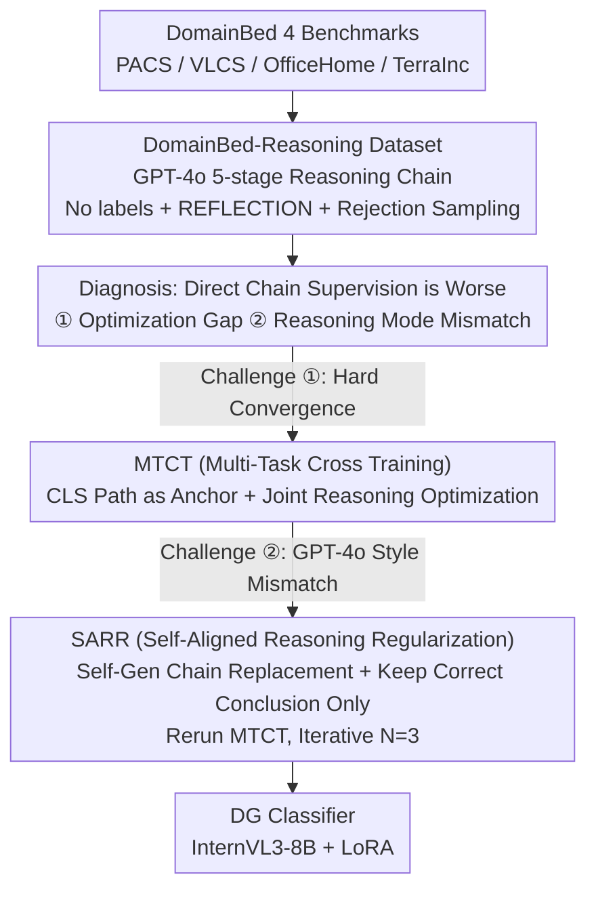

# Reasoning-Driven Multimodal LLM for Domain Generalization

**Conference**: ICLR 2026  
**arXiv**: [2602.23777](https://arxiv.org/abs/2602.23777)  
**Unit**: Xidian University / Microsoft Research Asia  
**Area**: Domain Generalization / Multimodal Reasoning

## TL;DR

Ours proposes RD-MLDG: the first framework to introduce Multimodal Large Language Model (MLLM) reasoning chains into Domain Generalization (DG). By constructing the DomainBed-Reasoning dataset, the study systematically analyzes two major challenges in reasoning supervision (optimization difficulty and reasoning mode mismatch). These are addressed through the synergy of Multi-Task Cross Training (MTCT) and Self-Aligned Reasoning Regularization (SARR). On four standard DG benchmarks, it achieves an average accuracy of 86.89%, significantly outperforming GPT-4o (83.46%) and all CLIP/ViT-based methods.

## Background & Motivation

Existing DG methods (IRM, CORAL, MixStyle, SWAD, etc.) focus on **feature-level invariance**—improving generalization by aligning latent representations across different domains. CLIP-based methods introduce multimodal representations but remain limited to feature-level alignment. The problem is that feature-level invariance fails to capture higher-level cross-domain commonalities.

MLLMs exhibit powerful reasoning capabilities; reasoning chains can explicitly decompose the classification process into interpretable, domain-invariant steps (e.g., although "printer" images from different domains differ greatly visually, the category-related parts of their reasoning chains are highly consistent). However, directly using reasoning chains for supervision results in performance **worse** than direct label supervision—this contradiction motivates the deep analysis and design of the new framework.

## Method

### Overall Architecture

RD-MLDG aims to elevate DG from "feature-level invariance" to "reasoning process-level invariance": even if visual differences for the same category across domains are large, the category-related reasoning criteria remain highly consistent. Therefore, rather than aligning ambiguous features, it is better to let the model learn a set of domain-invariant reasoning processes. The pipeline is as follows: first, GPT-4o is used to create the DomainBed-Reasoning dataset for all samples in DomainBed. A diagnosis reveals that "direct supervision with reasoning chains is worse than label supervision" due to two issues: the optimization gap and reasoning mode mismatch. Subsequently, an InternVL3-8B is fine-tuned in two stages: MTCT uses the classification path as an anchor to pull the reasoning path across the optimization gap, and SARR replaces GPT-4o-style supervision with self-generated chains to eliminate mode mismatch, eventually yielding a reasoning-driven DG classifier.

### Key Designs

**1. DomainBed-Reasoning Dataset: Upgrading Supervision from Labels to Interpretable Reasoning**

The "reasoning process invariance" hypothesis requires data that can carry it. Since standard DG benchmarks only provide images and category labels, GPT-4o is used to generate a five-stage reasoning chain for each sample across PACS/VLCS/OfficeHome/TerraInc: SUMMARY → CAPTION → REASONING → REFLECTION → CONCLUSION. Three details ensure quality: **no ground-truth labels** are provided during generation to force reasoning to be based entirely on visual evidence and prevent answer leakage; an additional REFLECTION stage is inserted to reduce invalid generation and improve stability; finally, **rejection sampling** is performed to keep only chains that contain all components and reach a self-consistent conclusion. The category-related steps in these chains are naturally consistent across domains, serving as the carrier for process-level invariance and the supervision source for subsequent training.

**2. MTCT (Multi-Task Cross Training): Using Classification Path as an Anchor to Bridge the Optimization Gap**

Directly training with the chains is problematic—this is "Challenge I: Optimization Gap." On TerraInc, zero-shot with reasoning chains can increase ground-truth token probability by +43.28%p, but during SFT, reasoning supervision performs 0.93%p lower than direct label supervision because reasoning SFT only increases token probability by +1.88%p (compared to +43.38%p for direct label SFT). MTCT addresses this by constructing two prompts for the same image: a no-thinking **classification path** that directly predicts label $y_i$, providing a stable signal, and a **reasoning path** that inputs the full chain $\mathbf{r}_i$, providing rich semantics. The combined optimization is:

$$\mathcal{L}_{\text{MTCT}}=\frac{1}{B}\sum_{i=1}^{B}\Big[-\log p_{\theta}(y_i\mid\mathbf{x}_i,\mathbf{q}_{\text{cls}})-\frac{1}{T_i}\sum_{t=1}^{T_i}\log p_{\theta}(r_{i,t}\mid\mathbf{r}_{i,<t},\mathbf{x}_i,\mathbf{q}_{\text{reason}})\Big]$$

The reasoning chain loss is normalized by token length $T_i$ to prevent long chains from dominating the gradient. The classification path acts as an "anchor," guiding the reasoning optimization and preventing overfitting on long sequences without learning high-confidence tokens.

**3. SARR (Self-Aligned Reasoning Regularization): Gradually Replacing GPT-4o Style with the Model's Own Style**

MTCT enables training, but "Challenge II: Reasoning Mode Mismatch" remains: GPT-4o chains are full of descriptive context (background, perspective), leading to only a +1.88%p token probability increase after SFT. Conversely, SFT with self-generated chains yields a +29.74%p increase but lacks informational depth. SARR allows the model to generate its own chains after MTCT, keeping only those where the `<CONCLUSION>` matches ground-truth labels $\hat{\mathbf{r}}_i$ as refined supervision. The model is then re-tuned using the same $\mathcal{L}_{\text{SARR}}$ target for $N$ iterations (typically $N=3$). Each round replaces part of the hard-to-optimize GPT-4o descriptions with the model's own style, balancing semantic richness and optimizability.

### Loss & Training

Both stages share the $\mathcal{L}_{\text{MTCT}}$ form of visual-classification plus normalized reasoning chain loss. SARR rounds simply replace the supervision chain from GPT-4o's version to the self-generated chain $\hat{\mathbf{r}}_i$. InternVL3-8B is used as the base with LoRA rank 8 applied to both vision encoders and language decoders. Each stage runs for 3 epochs with a batch size of 128, a learning rate of 5e-4, using the AdamW optimizer on 4× A100 80GB.

## Key Experimental Results

### Main Results: SOTA Comparison on DomainBed Benchmarks

| Method | Backbone | PACS | VLCS | OfficeHome | TerraInc | **Average** |
| :--- | :--- | :--- | :--- | :--- | :--- | :--- |
| CORAL | ResNet-50 | 86.20 | 78.80 | 68.70 | 47.60 | 70.33 |
| SMOS | ResNet-50 | 89.40 | 79.80 | 71.60 | 55.40 | 74.05 |
| SWAD | ViT-B/16 | 91.30 | 79.40 | 76.90 | 45.40 | 73.25 |
| CLIP | ViT-B/16 | 96.20 | 81.70 | 82.00 | 33.40 | 73.33 |
| SIMPLE+ | ViT-B/16 | **99.00** | 82.70 | 87.70 | 59.00 | 82.10 |
| CLIP-LoRA | ViT-B/16 | 97.10 | 83.10 | 83.90 | 55.70 | 79.95 |
| DGCLDTP | ViT-B/16 | 97.03 | 84.79 | 87.65 | 63.27 | 83.19 |
| GPT-4o | MLLM | 97.83 | 85.41 | 90.12 | 60.49 | 83.46 |
| InternVL3-8B | MLLM | 96.26 | 85.67 | 85.10 | 46.84 | 78.47 |
| **RD-MLDG** | **MLLM** | **98.13** | **87.03** | **91.73** | **70.65** | **86.89** |

RD-MLDG achieves an average accuracy of 86.89%, surpassing GPT-4o by +3.43%p and the strongest CLIP method DGCLDTP by +3.70%p. The improvement on TerraInc is particularly striking—rising from 46.84% (InternVL3-8B) to 70.65% (+23.81%p), even exceeding GPT-4o by +10.16%p.

### Ablation Study (InternVL3-8B, OfficeHome / TerraInc)

| Config | OfficeHome | $\Delta$ | TerraInc | $\Delta$ |
| :--- | :--- | :--- | :--- | :--- |
| Zero-shot | 85.10 | — | 46.84 | — |
| + CLS only | 89.39 | — | 66.69 | — |
| + Reasoning only (Baseline) | 88.76 | — | 64.56 | — |
| + MTCT | 90.58 | +1.81 | 67.19 | +2.63 |
| + SARR | 90.91 | +2.14 | 65.29 | +0.73 |
| + MTCT + SARR (Full) | **91.73** | **+2.97** | **70.65** | **+6.09** |

Key Findings: (1) Using reasoning chains alone (Reasoning only) is lower than direct classification (CLS only) by 0.63%p / 2.13%p, validating Challenge I; (2) MTCT alone provides significant gains; (3) The combined effect of MTCT + SARR far exceeds individual usage, especially on TerraInc with a +6.09%p boost.

### Key Findings

*   **SARR Iteration Analysis**: On TerraInc, accuracy reaches 70.06% at $N=1$, 70.59% at $N=2$ (significant at $p<0.01$), and 70.65% at $N=3$ (not significantly different from $N=2$). Token probability distributions also converge within 2-3 rounds.
*   **MTCT Token Analysis**: After MTCT, the proportion of high-confidence category tokens (>0.75) increases from 86.33% to 90.23%, while the low-confidence proportion (<0.25) drops from 7.59% to 3.19%. Although 19.33% of GPT-4o chain tokens remain in the low-probability zone (semantic details being hard to fit), critical classification tokens are significantly enhanced.

## Highlights & Insights

**Highlights**:
*   **A New Perspective on "Process-Level Invariance"**: Elevates DG from feature-level invariance to reasoning process-level invariance; category-related steps in reasoning chains are naturally consistent across domains.
*   **Problem-Driven Design**: The systematic analysis of the two challenges (optimization difficulty and mode mismatch) leads to targeted designs (MTCT and SARR), forming a rigorous logic.
*   **Exceptional Performance on TerraInc**: Improvements of +23.81%p over the base model and +10.16%p over GPT-4o suggest that reasoning chains are particularly effective for scenarios with dramatic domain shifts.

**Limitations**:
*   Dependence on GPT-4o for initial reasoning chains entails high data construction costs.
*   Verification is limited to classification tasks; it is unclear if reasoning-driven DG generalizes to detection or segmentation.
*   Training overhead (4× A100) presents a barrier for widespread reproduction.

## Rating

*   Novelty: ⭐⭐⭐⭐⭐ First reasoning-driven DG framework + DomainBed-Reasoning dataset.
*   Experimental Thoroughness: ⭐⭐⭐⭐⭐ 4 DG benchmarks + dual-model ablation + token-level analysis + parameter sensitivity.
*   Writing Quality: ⭐⭐⭐⭐⭐ Complete logical loop from challenge discovery to analysis to method and validation.
*   Value: ⭐⭐⭐⭐⭐ Opens a new reasoning-driven paradigm for Domain Generalization.

<!-- RELATED:START -->

## Related Papers

- [\[ICLR 2026\] Vid-LLM: A Compact Video-based 3D Multimodal LLM with Reconstruction–Reasoning Synergy](vid-llm_a_compact_video-based_3d_multimodal_llm_with_reconstructionreasoning_syn.md)
- [\[ICLR 2026\] JUDO: A Juxtaposed Domain-Oriented Multimodal Reasoner for Industrial Anomaly QA](judo_a_juxtaposed_domain-oriented_multimodal_reasoner_for_industrial_anomaly_qa.md)
- [\[ICLR 2026\] VTool-R1: VLMs Learn to Think with Images via Reinforcement Learning on Multimodal Tool Use](vtool-r1_vlms_learn_to_think_with_images_via_reinforcement_learning_on_multimoda.md)
- [\[ICML 2026\] LIMSSR: LLM-Driven Sequence-to-Score Reasoning under Training-Time Incomplete Multimodal Observations](../../ICML2026/vlm_reasoning/limssr_llm-driven_sequence-to-score_reasoning_under_training-time_incomplete_mul.md)
- [\[ICLR 2026\] VLM-SubtleBench: How Far Are VLMs from Human-Level Subtle Comparative Reasoning?](vlm-subtlebench_how_far_are_vlms_from_human-level_subtle_comparative_reasoning.md)

<!-- RELATED:END -->
