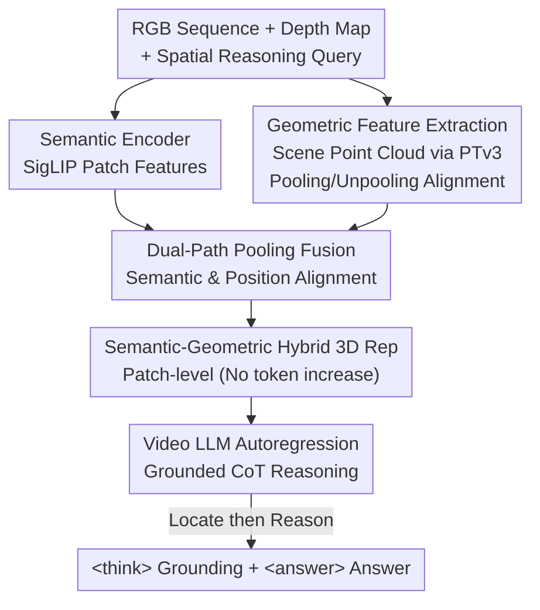

# Reasoning in Space via Grounding in the World

**Conference**: ICLR 2026  
**OpenReview**: [https://openreview.net/forum?id=CfKi92bgnq](https://openreview.net/forum?id=CfKi92bgnq)  
**Code**: Available (Project Page / GitHub / HuggingFace)  
**Area**: Multimodal VLM / 3D Vision / Spatial Reasoning  
**Keywords**: 3D Visual Grounding, Spatial Reasoning, 3D Large Models, Semantic-Geometric Fusion, Grounded CoT  

## TL;DR
This paper proposes GS-Reasoner, which utilizes a "dual-path pooling" mechanism to align geometric features with image patch-level semantic and positional features, constructing a unified semantic-geometric hybrid 3D representation. This allows a 3D LLM to perform autoregressive 3D visual grounding **without relying on any external detectors or decoders** for the first time. By using grounding results as intermediate Chain-of-Thought (CoT) steps to enhance spatial reasoning, the model achieves SOTA performance on benchmarks like VSI-Bench.

## Background & Motivation
**Background**: Associating 3D objects with textual descriptions (3D visual grounding) is regarded as a prerequisite for spatial reasoning—humans also identify "which object" before reasoning about their spatial relationships. Recent 3D LLMs can perform 3D VQA, localization, and captioning, but generally rely on pre-trained 3D detectors, mesh proposals, or external grounding modules to complete localization.

**Limitations of Prior Work**: This "plug-in localization" paradigm has two major flaws. First, 3D data itself is complex; point clouds carry rich geometric/depth cues but are difficult to align with the semantic space of LLMs. Additionally, large-scale 3D data is scarce. Previous works either used Q-formers to compress point clouds or utilized voxel representations, trading geometric fidelity for token efficiency, which results in extracted point cloud features with limited semantic information and inaccurate localization/reasoning. A newer class of work injects 3D positional encodings into video features of vision foundation models to maintain generalization, but geometric cues derived solely from positional encodings are too weak, limiting localization performance. Second, there is a lack of high-quality datasets that embed grounding as an intermediate step in spatial reasoning—existing 3D VQA data only contains short answers, lacking both localization annotations and reasoning steps, making it impossible to train "localization + reasoning" jointly.

**Key Challenge**: The lack of a unified 3D representation that can **simultaneously** carry semantic and geometric information. Models are either geometrically strong but semantically weak (pure point cloud encoders) or semantically strong but geometrically weak (vision features + positional encoding). This fragmentation forces 3D LLMs to either suffer from poor localization or rely on external modules, preventing grounding and spatial reasoning from naturally merging.

**Goal**: (1) Design a unified 3D scene representation that jointly encodes semantics, geometry, and position without increasing the number of input tokens, allowing the LLM to directly output 3D boxes autoregressively; (2) Create a dataset that treats localization as an intermediate reasoning step, enabling the model to learn to "locate first, then reason."

**Key Insight**: The authors argue that **3D visual grounding is the cornerstone of spatial reasoning**. Since properly aligned geometry allows for accurate localization, localization results can naturally serve as an intermediate Chain-of-Thought for reasoning. Thus, the key is not to replace external detectors with larger ones, but to **correctly align** geometric features within a semantic-positional framework using image patches as the basic units.

**Core Idea**: Use patch-level "dual-path pooling" to align geometric features with semantic context and 3D positions respectively, merging them into a unified hybrid representation. Then, train the model using a GCoT dataset containing 3D box annotations and step-by-step reasoning paths, allowing the model to write grounding into the `<think>` chain, achieving a self-contained 3D spatial reasoning framework.

## Method

### Overall Architecture
The input consists of an RGB image sequence $\{I_i\}_{i=1}^N$ of a 3D scene and a spatial reasoning query $Q$ (depth maps and camera intrinsics/extrinsics can be estimated by visual geometry methods like VGGT-SLAM). The output is autoregressive text containing a `<think>` reasoning block and an `<answer>` final response, where the `<think>` block first lists the 3D bounding boxes of relevant objects. The framework consists of three parts: a semantic encoder (SigLIP vision foundation model), a geometry encoder (Sonata point cloud encoder based on PTv3), and a video LLM (LLaVA-Video 7B).

The process is: The semantic encoder extracts semantic features from RGB images; depth maps are back-projected into point maps and aggregated into scene point clouds, which are then fed into the geometry encoder to extract geometric features, with 3D positional encodings applied to each patch center. The three types of features (semantic, geometric, and positional) undergo semantic-geometric fusion via **dual-path pooling**, forming patch-level hybrid 3D representations without increasing token count. These hybrid representations and the text query are fed into the video LLM, which autoregressively performs object localization followed by step-by-step reasoning before providing an answer. The output strictly follows a CoT format: analyzing the problem in `<think>`, listing axis-aligned 3D boxes in the world coordinate system (in meters) as `OBJECT_NAME OBJECT_COUNT <bbox>(x1,y1,z1,x2,y2,z2)</bbox>`, and then providing a concise answer in `<answer>`.

### Key Designs

**1. Semantic-Geometric Hybrid 3D Representation: Unifying Three Signals via Image Patches**
To address the core contradiction of fragmented geometry and semantics, the authors use image patches—which video LLMs already excel at—as the basic building blocks. They "embed" geometric features into each patch, preserving the generalization of vision-semantic pre-training while adding geometric cues **without increasing input tokens**. Specifically, point maps are chunked into $p\times p$ sizes matching the image patches, and $K$ points are uniformly sampled per chunk to obtain sub-sampled point maps $\{P_i^{sub}\in\mathbb{R}^{3\times K\times H'\times W'}\}$ with $H'=H/p,\,W'=W/p$. A critical choice here is that geometric extraction **does not** process points in isolation within each patch; instead, the entire point cloud $P=\cup_i P_i$ is fed into PTv3 as a whole. PTv3 uses space-filling curves for serialization and grouping, applying U-Net style serialized attention, with inter-layer pooling defined as $f_i'=\text{MaxPool}(\{f_jU\}),\,p_i'=\text{MeanPool}(\{p_j\})$. Features are then unpooled via saved mapping relationships to get geometric feature maps $\{G_i\in\mathbb{R}^{C\times K\times H'\times W'}\}$ aligned with the input.

**2. Dual-Path Pooling: Eliminating Semantic-Geometric and Position-Geometric Misalignment**
While global encoding is accurate, simply adopting PTv3's "geometric max pool + point mean pool" to obtain patch representations leads to two types of misalignment, degrading localization. The first is **semantic-geometric misalignment**: 3D points in a patch can interact with the entire scene during global encoding, whereas corresponding semantic features are restricted to visible information. Max pooling picks the most salient geometric features regardless of the patch's semantic context. The second is **position-geometric misalignment**: Traditional point cloud encoders use KNN or serialization to ensure spatial proximity. While naive pooling works for these groups, points within an image patch do not necessarily satisfy this, especially when a patch contains both foreground and background. Max pooling results in geometric inconsistency, and mean pooling might calculate a position far from both foreground and background, ruining 3D box accuracy.

The authors resolve this with a lightweight dual-path fusion module. To fix semantic-geometric misalignment, they use a cross-attention mechanism where **the semantic features of each patch act as the query**, and the $K$ geometric features within the patch act as keys/values. To fix position-geometric misalignment, they sample the 3D point corresponding to the **center pixel** of the patch for positional encoding and interpolate geometric features based on this point's location. This ensures the position and geometry are consistent. Finally, both paths are concatenated and projected into the final patch-level hybrid feature.

**3. GCoT Dataset: Embedding Grounding into the Reasoning Chain**
To address the lack of integrated data, the authors constructed the Grounded Chain-of-Thought (GCoT) dataset. The premise is that spatial reasoning is rooted in the location and size relationships of relevant objects. The construction pipeline has two steps: generating spatial QA pairs without CoT while retaining object 3D box metadata, and then using these QA pairs, boxes, and Birds-Eye-View (BEV) maps to prompt GPT-4o to generate coherent CoT paths. This resulted in 156k QA pairs, 79% of which contain CoT annotations. The model is trained via next-token prediction: first pre-training on grounding data (ScanRefer, Multi3DRef, etc.) to warm up, then fine-tuning on GCoT and other 3D tasks.

### Loss & Training
The model is trained end-to-end using an autoregressive next-token prediction objective. Localization and reasoning share the same output format and supervision. Pre-training is conducted on a 3D visual grounding subset, followed by fine-tuning on GCoT, remaining grounding data, and other 3D tasks (ScanQA, SQA3D, Scan2Cap). During inference, 32 images are sampled per scene. For reasoning tasks, depth and camera parameters are estimated via VGGT-SLAM and aligned using Moge2.

## Key Experimental Results

### Main Results
VSI-Bench Spatial Reasoning (>5000 QA across 8 tasks): GS-Reasoner achieves SOTA on most tasks.

| Model | Avg Score | Abs. Dist. | Rel. Dir. | Appr. Order |
|------|--------|-----------|-----------|-------------|
| Gemini-1.5 Pro (API) | 45.4 | 30.9 | 46.3 | 34.6 |
| Spatial-MLLM-4B | 48.4 | 34.8 | 46.2 | 46.3 |
| VLM-3R-7B | 60.9 | 49.4 | 80.5 | 40.1 |
| **GS-Reasoner (Est. Depth)** | **64.7** | **61.9** | **88.9** | **52.3** |
| **GS-Reasoner (GT Depth)** | **70.1** | **73.6** | **90.5** | **52.6** |

3D Visual Grounding: GS-Reasoner rivals plug-in solutions without external modules, reaching SOTA among 3D LLMs on Multi3DRef F1@25.

| Method | ScanRefer Acc@25 | Multi3DRef F1@25 | SR3D Acc@25 |
|------|------------------|------------------|-------------|
| LLaVA-3D (External Grounding) | 54.1 | 54.3 | - |
| ROSS3D (Mesh Proposal) | 61.1 | 59.6 | - |
| **GS-Reasoner (No Ext. Module)** | 60.8 | **61.7** | 56.7 |

### Ablation Study
Table 5: Ablation of 3D representation and data augmentation (ScanRefer).

| Config | Acc@25 | Acc@50 | Note |
|------|--------|--------|------|
| LLaVA-NeXT (No 3D) | 0.0 | 0.0 | Cannot perform grounding |
| + Augmentation (Avg pos) | 53.2 | 29.8 | Augmentation is key for startup |
| + Max Geo Pooling | 57.5 | 35.7 | Naive max pool improvement |
| + Cross-Attn (Semantic Align) | 58.9 | 38.6 | Mitigates semantic-geo misalignment |
| + Interpolate (Position Align) | 59.3 | 40.2 | Mitigates position-geo misalignment |
| **GS-Reasoner (Full Dual-Path)** | **60.8** | **42.2** | +7.6 / +12.4 over baseline |

### Key Findings
- **Dual-path alignment is essential**: Each step (semantic alignment and positional alignment) provides incremental gains, cumulatively improving Acc@50 by +12.4.
- **Grounded CoT provides massive gains**: Adding GCoT increased the average score by +8.4, proving that "locating then reasoning" successfully converts grounding ability into reasoning power.
- **Depth accuracy dictates the ceiling**: Switching from estimated to GT depth improves performance by about 5 points across the board.
- **LLM vs. Expert Models**: GS-Reasoner excels at complex language queries (ScanRefer) but lags behind expert models on simple queries requiring pinpoint accuracy (SR3D/NR3D).

## Highlights & Insights
- **"Grounding as a CoT step" is a elegant perspective**: Turning 3D grounding from an external task into a natural step within the `<think>` block makes the system self-contained and interpretable.
- **Dual-path pooling is a low-cost, effective trick**: Using semantic features as queries and center-point interpolation accurately addresses the misalignments caused by global point cloud encoding.
- **Zero-token geometric injection**: Integrating geometric information into existing patch representations saves computation while preserving the LLM's linguistic capabilities.

## Limitations & Future Work
- The model still lags behind mesh-proposal methods on certain metrics (Acc@50) due to the use of noisy, incomplete sensor point clouds compared to cleaned mesh data.
- It struggles with datasets like ScanQA/SQA3D where textual bias is strong, suggesting that reconstruction constraints might be needed to force the model to rely more on 3D tokens.
- Dependence on depth/camera parameters means that error in geometric estimation propagates to reasoning outcomes.

## Related Work & Insights
- **vs. Q-former/Voxel-based 3D LLMs**: Unlike models that trade fidelity for efficiency, GS-Reasoner maintains both semantics and geometry without adding token overhead.
- **vs. PE-only Vision Features**: GS-Reasoner adds an explicit geometric encoder, providing much stronger cues than positional encoding alone.
- **vs. External-Grounding models**: This is the first 3D LLM to achieve competitive grounding autoregressively without modular separation.

## Rating
- Novelty: ⭐⭐⭐⭐⭐ 
- Experimental Thoroughness: ⭐⭐⭐⭐⭐ 
- Writing Quality: ⭐⭐⭐⭐ 
- Value: ⭐⭐⭐⭐⭐

<!-- RELATED:START -->

## Related Papers

- [\[ICLR 2026\] LLMs as Rules Oracles: Exploring Real-World Multimodal Reasoning in Tabletop Strategy Game Environments](llms_as_rules_oracles_exploring_real-world_multimodal_reasoning_in_tabletop_stra.md)
- [\[CVPR 2026\] From Indoor to Open World: Revealing the Spatial Reasoning Gap in MLLMs](../../CVPR2026/vlm_reasoning/from_indoor_to_open_world_revealing_the_spatial_reasoning_gap_in_mllms.md)
- [\[ICML 2026\] Temporal-Aware Reasoning Optimization for Video Temporal Grounding](../../ICML2026/vlm_reasoning/temporal-aware_reasoning_optimization_for_video_temporal_grounding.md)
- [\[ICML 2026\] Learning GUI Grounding with Spatial Reasoning from Visual Feedback](../../ICML2026/vlm_reasoning/learning_gui_grounding_with_spatial_reasoning_from_visual_feedback.md)
- [\[CVPR 2026\] Monet: Reasoning in Latent Visual Space Beyond Image and Language](../../CVPR2026/vlm_reasoning/monet_reasoning_in_latent_visual_space_beyond_image_and_language.md)

<!-- RELATED:END -->
