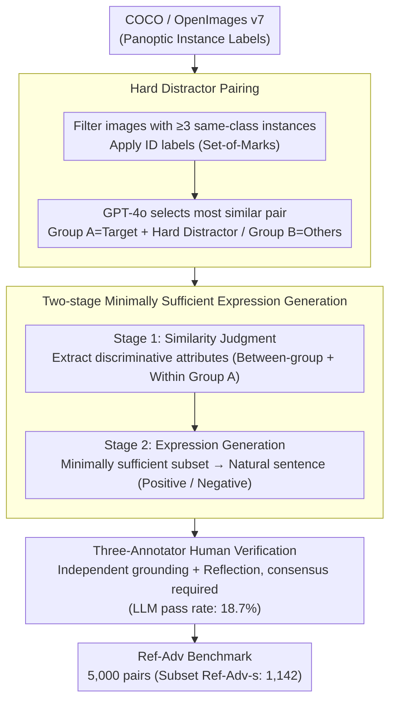

# Ref-Adv: Exploring MLLM Visual Reasoning in Referring Expression Tasks

**Conference**: ICLR 2026  
**arXiv**: [2602.23898](https://arxiv.org/abs/2602.23898)  
**Code**: [https://ref-adv.github.io/](https://ref-adv.github.io/)  
**Authors**: Qihua Dong, Kuo Yang, Lin Ju, Handong Zhao, Yitian Zhang, Yizhou Wang, Huimin Zeng, Jianglin Lu, Yun Fu  
**Area**: Multimodal VLM — Referring Expression Comprehension, Visual Grounding  
**Keywords**: Referring Expression Comprehension, Visual Grounding, Hard Distractors, Benchmark, Shortcut Suppression

## TL;DR

The authors propose the Ref-Adv benchmark, constructed through a pipeline of **Hard Distractor Pairing + LLM-assisted Minimally Sufficient Expression Generation + Three-annotator Consistency Verification**. This benchmark eliminates "grounding shortcuts" in modern REC. On Ref-Adv, the accuracy of 13 contemporary MLLMs (including GPT-4o, Gemini 2.5, Qwen2.5-VL-72B, etc.) drops significantly from 90%+ on RefCOCO(+/g) to 50-68%, systematically exposing severe deficiencies in complex visual reasoning and authentic grounding capabilities.

## Background & Motivation

**Background**: Referring Expression Comprehension (REC) is a classic task of grounding natural language descriptions to specific image regions. RefCOCO, RefCOCO+, and RefCOCOg are standard benchmarks where current top-tier MLLMs (Qwen2.5-VL-72B, InternVL-3, etc.) have achieved 90%+ accuracy, approaching saturation.

**Limitations of Prior Work**: Classic REC benchmarks suffer from three systematic flaws: ① Expressions are extremely short (average of 3.6 words for RefCOCO/RefCOCO+), requiring minimal linguistic understanding; ② Distractors are scarce (most images in RefCOCO(+/g) contain only one object of the target class), allowing grounding via simple classification; ③ Existence of "grounding shortcuts," where redundant descriptors allow models to succeed by matching only part of the description without full comprehension.

**Key Challenge**: High scores do not equate to true visual reasoning capabilities. Experiments show that even when expressions are replaced with a fixed "the one," shuffled into bag-of-words, or have descriptors removed, performance on RefCOCO(+/g) drops far less than expected. This implies benchmark scores severely overestimate true reasoning and grounding abilities.

**Goal**: Build a modern REC benchmark that satisfies: ① Every expression requires multi-step textual reasoning; ② Fine-grained visual reasoning is needed to distinguish between highly similar candidates; ③ Shortcuts that bypass reasoning are eliminated.

**Key Insight**: Treat REC as a coupled multi-step reasoning task of **textual reasoning + visual reasoning**. By forcing "hard distractors" (objects of the same class that partially but not fully match the target) and using LLMs to generate **minimally sufficient expressions**, every descriptor becomes necessary for grounding, eliminating shortcuts at the source.

**Core Idea**: Construct a REC benchmark where every descriptor is indispensable for grounding through a pipeline of hard distractor pairing and minimally sufficient expression generation, thereby truly evaluating the visual reasoning capabilities of MLLMs.

## Method

### Overall Architecture

Ref-Adv does not propose a new model but rather a more rigorous metric for REC—a data construction pipeline that blocks "grounding shortcuts." The mechanism involves: assembling several similar instances in an image to force fine-grained discrimination; using LLMs to write "minimally sufficient" expressions where every descriptor is essential; and finally, having three annotators verify consistency. The pipeline consists of four steps: Input Preparation (filtering images + numbering labels) → Similarity Judgment (identifying hard distractor pairs + extracting discriminative attributes) → Expression Generation (minimizing sufficient subsets into sentences) → Human Verification (requiring 3-way consensus). Inputs are images from COCO and OpenImages v7 with panoptic instance labels; the output is 5,000 referring expression-target pairs (Ref-Adv-s public subset contains 1,142). Approximately 4,000 were LLM-generated, with the rest hand-written, all passing the same triple-verification.

### Key Designs

**1. Hard Distractor Pairing: Assembling similar objects to force fine-grained discrimination**

A fundamental issue with RefCOCO(+/g) is that 70%+ of images contain only 0-1 same-class distractors, allowing models to ground via class identification. Ref-Adv reverses this: images with **$\ge 3$ instances of the same class** are filtered from COCO and OpenImages v7. Using Set-of-Marks-style numeric labels, GPT-4o selects the most similar pair (Target and Hard Distractor) as Group A, while other same-class instances form Group B. This elevates the task from "find a cat" to "find the specific cat among nearly identical ones."

**2. Two-stage Minimally Sufficient Expression Generation: Extracting attributes then composing from minimal subsets**

Redundant descriptors enable "grounding shortcuts"—the more descriptors, the easier for a model to guess correctly by matching just one. Since direct LLM generation often results in overspecified sentences, Ref-Adv uses two stages. Stage 1 (Similarity Judgment) requires GPT-4o to output attributes that distinguish Group A from Group B, and the Target from the Hard Distractor within Group A. Stage 2 (Expression Generation) starts with the **minimally sufficient subset** of these descriptors to form a sentence. It supports two strategies: positive descriptors for the target, or **negation** of the hard distractor (e.g., "The one that is NOT..."), intentionally introducing negation reasoning. The final expressions average 11.5 words (vs 3.6 for RefCOCO) and 21.25% contain negation.

**3. Three-Annotator Verification: Filtering LLM hallucinations and ambiguity**

To handle LLM hallucinations, a final human gate is used. Three annotators independently perform two checks: whether the expression is accurate and unambiguous (by grounding on the original image without ID labels), and whether a hard distractor truly exists. Only samples with **unanimous agreement** are retained. This strict process results in a low LLM pass rate of only 18.7% (requiring ~5.35 generations per 1 valid sample), ensuring benchmark credibility.

## Key Experimental Results

### Table 1: Ref-Adv Statistics vs. Classic REC Benchmarks

| Benchmark | Images | Instances | Avg. Length | Avg. Distractors | Negation % | Vocab Size |
|-----------|---------|-----------|-------------|------------------|------------|------------|
| RefCOCO | 3,000 | 7,596 | 3.6 | 3.99 | 0.99% | 3,525 |
| RefCOCO+ | 3,000 | 7,578 | 3.6 | 3.96 | 3.36% | 4,387 |
| RefCOCOg | 3,900 | 7,596 | 8.4 | 1.64 | 1.41% | 5,050 |
| **Ref-Adv** | **2,833** | **5,000**| **11.5** | **4.01** | **21.25%** | **5,308** |

### Table 2: Main Results (Ref-Adv Full Set, Representative Models)

| Model | CoT | SoM | Acc@0.5 | Acc@0.75 | Acc@0.9 | mAcc | $\ge 7$ Distr. $\Delta$ |
|-------|-----|-----|---------|----------|---------|------|------------------------|
| GPT-4o | ✗ | ✓ | 52.3 | 31.2 | 13.4 | 27.8 | -0.6 |
| GPT-4o | ✓ | ✓ | **63.7** | **38.4** | **19.7** | **34.1** | -3.2 |
| Gemini 2.5-Flash | ✓ | ✗ | 59.4 | 35.1 | 16.3 | 30.6 | -3.8 |
| Qwen2.5-VL-72B | ✓ | ✗ | 58.3 | 47.8 | 29.5 | 41.1 | -2.7 |
| CogVLM-Grounding| ✗ | ✗ | 51.5 | 41.2 | 23.4 | 35.0 | -0.7 |

Compared to 90%+ on RefCOCO, no model exceeds 64% Acc@0.5 on Ref-Adv. Even **GPT-4o+CoT+SoM only reaches 63.7%**. At high IoU (Acc@0.9), the gap is wider, with the best model (InternVL-3-78B) at only 29.6%.

### Key Findings

- **CoT effectiveness**: Chain-of-Thought is highly effective on Ref-Adv (which requires multi-step reasoning to exclude distractors) but ineffective on RefCOCO (where it introduces redundancy for simple tasks).
- **Distractor count as a bottleneck**: Performance drops significantly in images with $\ge 7$ distractors, with the largest drop being -19.3%.
- **Negation Reasoning**: Current models struggle with "The one that is NOT X" descriptions.
- **Low Acc@0.9**: Even when grounding is successful (Acc@0.5), precise box regression remains poor.

## Highlights & Insights

1. **Systematic Shortcut Diagnosis**: The paper unifies benchmark flaws (short expressions, few distractors, redundancy) into a "grounding shortcut" framework, validated by three ablation tests (bias, word order, and descriptor deletion).
2. **Two-stage > One-step Generation**: Moving from end-to-end generation to "extract-then-combine" is a valuable design insight for producing precise, non-redundant LLM outputs.
3. **Thinking Mode Advantage**: Qwen3-VL-2B-Thinking (44.4%) outperforms Qwen2.5-VL-32B-Instruct (48.0% on some sets), suggesting that reasoning-optimized small models can surpass standard large models in complex reasoning.

## Limitations & Future Work

1. **Data Source Limitation**: Relies only on COCO and OpenImages v7; missing complex real-world scenes like dense street views or industrial inspection.
2. **SoM Consistency**: Using Set-of-Marks (SoM) for proprietary models vs. coordinates for open-source ones makes direct comparison slightly unfair as SoM simplifies grounding to a selection task.
3. **Missing Segmentation**: The benchmark evaluates bounding box IoU only and does not extend to pixel-level Referring Expression Segmentation (RES).

## Related Work & Insights

- **vs RefCOCO(+/g)**: Systematic enhancement across expression length, distractor density, and shortcut suppression.
- **vs Cops-Ref**: Ref-Adv's LLM + Human pipeline provides higher naturalness compared to template-based GQA generation.
- **Adversarial Nature**: Ref-Adv serves as an adversarial benchmark for REC, similar to how VQA-CP acts for VQA.

## Rating

- Novelty: ⭐⭐⭐⭐ Systematic methodology for shortcut suppression.
- Experimental Thoroughness: ⭐⭐⭐⭐⭐ Comprehensive model testing and detailed ablation of benchmark validity.
- Writing Quality: ⭐⭐⭐⭐ Clear problem definition and clever test designs.
- Value: ⭐⭐⭐⭐ Exposes the "false prosperity" of saturated RefCOCO scores and sets a higher standard for the community.

[1] Kazemzadeh et al. "Referitgame: Referring to objects in photographs of natural scenes." (RefCOCO)
[2] Yu et al. "Modeling context in referring expressions." (RefCOCOg)
[3] Mao et al. "Generation and comprehension of unambiguous object descriptions." (RefCOCO+)

## Related Papers

- [\[ICLR 2026\] Mixture-of-Visual-Thoughts: Exploring Context-Adaptive Reasoning Mode Selection for General Visual Reasoning](mixture-of-visual-thoughts_exploring_context-adaptive_reasoning_mode_selection_f.md)
- [\[ICLR 2026\] Agent-X: Evaluating Deep Multimodal Reasoning in Vision-Centric Agentic Tasks](agent-x_evaluating_deep_multimodal_reasoning_in_vision-centric_agentic_tasks.md)
- [\[ICLR 2026\] MIMIC-Bench: Exploring the User-Like Thinking and Mimicking Capabilities of Multimodal Large Language Models](mimic-bench_exploring_the_user-like_thinking_and_mimicking_capabilities_of_multi.md)
- [\[CVPR 2026\] CodeDance: A Dynamic Tool-integrated MLLM for Executable Visual Reasoning](../../CVPR2026/vlm_reasoning/codedance_a_dynamic_tool-integrated_mllm_for_executable_visual_reasoning.md)
- [\[ICLR 2026\] FlowGen: Synthesizing Diverse Flowcharts to Enhance and Benchmark MLLM Reasoning](flowgen_synthesizing_diverse_flowcharts_to_enhance_and_benchmark_mllm_reasoning.md)

<!-- RELATED:END -->

<!-- RELATED:START -->

## Related Papers

- [\[ICLR 2026\] Agent-X: Evaluating Deep Multimodal Reasoning in Vision-Centric Agentic Tasks](agent-x_evaluating_deep_multimodal_reasoning_in_vision-centric_agentic_tasks.md)
- [\[ICLR 2026\] Mixture-of-Visual-Thoughts: Exploring Context-Adaptive Reasoning Mode Selection for General Visual Reasoning](mixture-of-visual-thoughts_exploring_context-adaptive_reasoning_mode_selection_f.md)
- [\[ICLR 2026\] MIMIC-Bench: Exploring the User-Like Thinking and Mimicking Capabilities of Multimodal Large Language Models](mimic-bench_exploring_the_user-like_thinking_and_mimicking_capabilities_of_multi.md)
- [\[ICLR 2026\] CircuitSense: A Hierarchical MLLM Benchmark Bridging Visual Comprehension and Symbolic Reasoning in Engineering Design Process](circuitsense_a_hierarchical_mllm_benchmark_bridging_visual_comprehension_and_sym.md)
- [\[ICLR 2026\] Rex-Thinker: Grounded Object Referring via Chain-of-Thought Reasoning](rex-thinker_grounded_object_referring_via_chain-of-thought_reasoning.md)

<!-- RELATED:END -->
