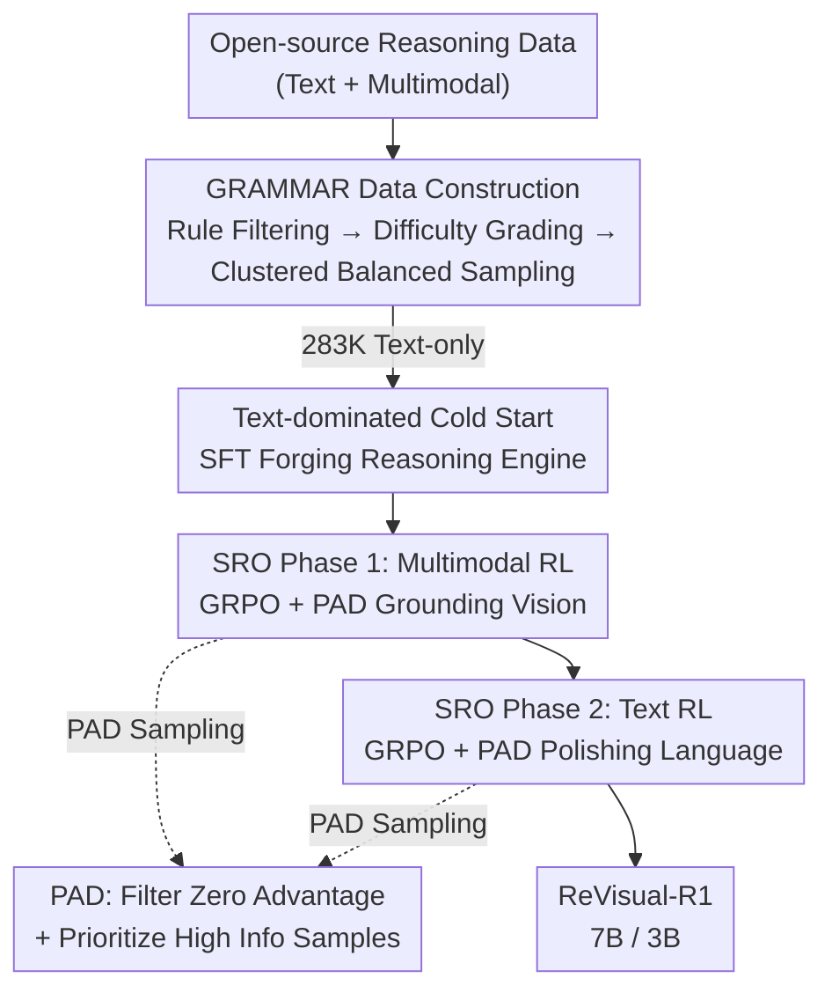

# ReVisual-R1: Advancing Multimodal Reasoning from Optimized Cold Start to Staged Reinforcement Learning

**Conference**: ICLR 2026  
**OpenReview**: [https://openreview.net/forum?id=NTo6f6GENJ](https://openreview.net/forum?id=NTo6f6GENJ)  
**Code**: https://github.com/CSfufu/Revisual-R1  
**Area**: Multimodal VLM / LLM Reasoning  
**Keywords**: Multimodal Reasoning, Cold Start, Reinforcement Learning, GRPO, Curriculum Training

## TL;DR
This paper systematically deconstructs the training pipeline of Multimodal Large Language Models (MLLMs). It discovers that a three-stage curriculum—consisting of "high-difficulty text-only cold start + multimodal RL + text RL"—is the key to activating complex reasoning. Furthermore, it proposes the PAD sampling mechanism to address "gradient stagnation" in multimodal GRPO. ReVisual-R1-7B achieves open-source SOTA across nine reasoning benchmarks, even surpassing GPT-4o.

## Background & Motivation

**Background**: Following the spontaneous emergence of complex reasoning abilities in DeepSeek-R1 via reinforcement learning (RL) on text-only tasks, numerous efforts have attempted to migrate the same RL paradigm to MLLMs to replicate this cognitive leap.

**Limitations of Prior Work**: Directly applying text-centric RL techniques to MLLMs yields diminishing returns. The challenge lies in cultivating abstract linguistic reasoning while anchoring it within a continuous, high-dimensional visual perception space. Naive joint training often fails to optimize either modality, leaving their potential underutilized. Specifically, current MLLM cold-start phases rely on simple image-text pre-training corpora, failing to stimulate deep self-reflective reasoning in subsequent RL stages.

**Key Challenge**: The issue is not the expansion of network architecture, but the training pipeline itself. The authors argue that multimodal reasoning should not be viewed as an isolated "multimodal RL" step, but as a carefully orchestrated curriculum of cold start, modal grounding, and linguistic refinement. Three overlooked segments determine success or failure.

**Goal**: Deconstruct the MLLM training pipeline, identify the bottlenecks hindering multimodal reasoning, and assemble them into a reusable training curriculum.

**Key Insight**: The authors conducted a counter-intuitive control experiment: fine-tuning with text-only cold-start data yielded better multimodal reasoning performance than using multimodal cold-start data. This occurred because text-based math problems (e.g., DeepMath) have an average Chain-of-Thought (CoT) length of 8,200 tokens and a pass rate of only 75%, whereas multimodal problems (e.g., Vision-R1) average only 821 tokens with a 96% pass rate. This indicates that existing multimodal cold-start corpora lack sufficient complexity to trigger deep reasoning.

**Core Idea**: Unlock MLLM reasoning potential systematically through a three-stage curriculum: "Forge reasoning engine via high-difficulty text-only cold start → Ground the engine in vision via multimodal RL → Polish language and logic via text-only RL," combined with PAD to resolve gradient stagnation in multimodal RL.

## Method

### Overall Architecture

ReVisual-R1 decomposes multimodal reasoning training into "data construction + cold start + two-stage reinforcement learning." First, the GRAMMAR dataset (283K text-only cold start samples + 31K text + 21K multimodal RL samples) is constructed using a multi-stage cleaning pipeline. Second, a text-only cold-start SFT is performed to transform the Qwen2.5-VL base model into a reasoning engine capable of long-chain reflection. Third, Staged Reinforcement Optimization (SRO) is executed: Multimodal RL (MRL) grounds reasoning to visual inputs, followed by Text RL (TRL) to polish linguistic fluency and abstract logic. Both RL stages utilize GRPO enhanced with the proposed PAD sampling mechanism.

### Key Designs

**1. Text-dominated High-difficulty Cold Start and GRAMMAR Dataset**

The authors address whether cold-start data should be multimodal. In control experiments sampling 40,000 sequences for Qwen2.5-VL-7B fine-tuning, text-only cold start (DeepMath / OpenR1-Math) significantly improved both multimodal and text benchmarks, whereas multimodal cold start (Vision-R1 / R1-One-Vision) provided limited gains. The complexity disparity—text math problems requiring ~10x more tokens—suggests that **high-difficulty text data is a superior catalyst for reasoning**.

Consequently, the GRAMMAR (Generalized Multimodal Reasoning Dataset) was built using a multi-stage pipeline: (1) Filtering open-source data for verifiability; (2) Using Qwen2.5-VL-7B to remove trivial/over-complex samples and Qwen2.5-VL-32B for difficulty grading (10 levels); (3) Embedding with NV-Embedding-V2, clustering with HDBSCAN, and labeling with Qwen2.5-7B to perform balanced sampling across topics and difficulties, maximizing diversity.

**2. PAD (Prioritized Advantage Distillation): Countering Multimodal GRPO Gradient Stagnation**

In complex multimodal tasks, standard GRPO suffers from "Gradient Stagnation." GRPO advantages are calculated relatively within a group: $\hat{A}(x,y_i) = \frac{r(x,y_i) - \text{mean}(r)}{\text{std}(r) + \epsilon}$. When outputs in a group share identical rewards (all correct or all incorrect—common in sparse binary rewards), the advantage signal vanishes to zero, causing policy gradients to collapse and stalling learning.

PAD introduces three steps to recover gradient quality. First, "per-sequence advantage calculation" computes absolute advantage $|\hat{A}_i|$ as signal strength. Second, "effective sample filtering" retains only sequences where $|\hat{A}_i| \in [T_{low}, T_{high}]$, removing near-zero advantage samples. Third, "prioritized sub-sampling" selects $k' = \min(\rho|B|, |E|)$ sequences from the effective set $E$ via temperature-controlled Softmax:

$$\Pr(i \mid i \in E) = \frac{\exp(\hat{A}_i / \tau)}{\sum_{j \in E} \exp(\hat{A}_j / \tau)}$$

The temperature $\tau$ decays from 1.0 to 0.3 during training to transition from exploration to high-information focus.

**3. SRO Staged Reinforcement Optimization: Grounding then Polishing**

Reinforcement learning is split into two sequential phases. Phase 1 (MRL) uses multimodal samples to ground text reasoning into visual information, removing GRPO's KL constraint to encourage exploration. However, intensive MRL can degrade text-only performance. Phase 2 (TRL) freezes the vision tower and focuses on text-only reasoning to recover linguistic fluency and clarity.

Ablations show the order (CS+MRL+TRL) achieves 49.6, significantly outperforming TRL+MRL (45.5) or Mixed-RL (47.6). Anchoring vision before refining text allows capabilities to synergize rather than overwrite.

### Loss & Training
The entire process uses rule-based rewards (correct $r=1$, incorrect $r=0$). Cold start uses LLaMA-Factory for text-only SFT. MRL and TRL use Easy R1 for GRPO+PAD. Models are based on Qwen2.5-VL-7B/3B-Instruct, trained on 8×A100-80G. Statistics: 283K text for CS, 26K multimodal for MRL, 30K text for TRL.

## Key Experimental Results

### Main Results
ReVisual-R1-7B averages 53.1% across ten benchmarks (+16.8% over baseline), ranking 1st among open-source models on nine benchmarks. It surpasses GPT-4o (41.6%) and exceeds Doubao-1.5-vision-pro (85.2%) and GPT-4o (74.6%) on MATH500 with a score of 89.2%.

| Model | MathVision | AIME24 | MATH500 | Avg |
|------|-----------|--------|---------|-----|
| OpenAI-GPT-4o | 31.1 | 9.3 | 74.6 | 41.6 |
| VLAA-Thinker-7B (Prev. SOTA) | 26.4 | 0.8 | 30.8 | 33.0 |
| VL-Rethinker-7B | 28.4 | 2.9 | 47.0 | 33.6 |
| **Ours (ReVisual-R1-7B)** | **48.8** | **53.3** | **89.2** | **53.1** |
| Gain vs Prev. SOTA | +18.6 | +43.3 | +22.0 | +16.8 |

ReVisual-R1-3B also outperforms VLAA-Thinker-3B by 16.0 points, validating curriculum scalability.

### Ablation Study

Training Phase Sequence (based on the same CS):

| Configuration | Avg Score | Description |
|------|--------|------|
| CS only | 47.1 | Cold start only, already high |
| CS + MRL | 47.7 | +Multimodal RL, improves vision tasks |
| CS + TRL | 44.9 | +Text RL only, performance drops |
| **CS + MRL + TRL** | **49.6** | Complete three-stage, optimal |
| CS + TRL + MRL | 45.5 | Reversed order is significantly worse |
| CS + Mixed-RL | 47.6 | Mixed training is sub-optimal |

PAD Component Ablation (CS+MRL setting):

| Configuration | Avg Score | Description |
|------|--------|------|
| Full PAD | 47.7 | Complete mechanism |
| w/o Prioritized Sub-sampling | 46.0 | Filtering only |
| w/o Effective Filtering | 46.2 | Random sampling only |
| GRPO-Baseline | 45.1 | Original GRPO |

### Key Findings
- **Text cold start outperforms multimodal**: CS only (47.1) surpasses many specialized multimodal models, confirming that reasoning bottlenecks are often linguistic/logical depth rather than visual coverage.
- **Sequence is vital**: MRL→TRL is 4.1 points higher than TRL→MRL, proving the synergy of visual grounding followed by text refinement.
- **PAD components are synergistic**: Neither filtering nor prioritized sampling alone achieves the full gains of PAD.

## Highlights & Insights
- **The "Less is More" Cold Start Philosophy**: High-complexity text data triggers long-chain reflection better than standard image-text pairs.
- **Gradient Stagnation is an Underestimated RL Issue**: In sparse reward settings, group-relative advantages often collapse. PAD provides a lightweight solution via filtering and temperature-annealed weighting.
- **Curriculum Order as a Hyperparameter**: The paper proves that the sequence of training phases is a first-class design choice rather than a random arrangement.

## Limitations & Future Work
- The curriculum requires three datasets and three training rounds, increasing computational and tuning costs.
- Rewards remain constrained to rule-based binary correctness, which may not apply to open-ended vision-language tasks (e.g., visual explanations).
- Evaluation focuses heavily on math/logic; general commonsense or perception-dense tasks require further study.
- PAD hyperparameters ($T$, $\rho$, $\tau$) require sensitivity analysis across different domains.

## Related Work & Insights
- **vs DeepSeek-R1**: Extends the paradigm to multimodal but identifies that text cold start must precede staged RL.
- **vs Vision-R1 / R1-One-Vision**: Proves text-only cold start complexity is more effective than the multimodal cold starts used in prior work.
- **vs DAPO**: PAD achieves better results in mathematical reasoning through the dual mechanism of effective filtering and temperature-controlled priority sampling.

## Rating
- Novelty: ⭐⭐⭐⭐⭐ (Text-only cold start insight, PAD mechanism, and sequence ablation)
- Experimental Thoroughness: ⭐⭐⭐⭐⭐ (Dual scales, 10 benchmarks, comprehensive ablation)
- Writing Quality: ⭐⭐⭐⭐ (Clear narrative, though some hyperparameter details are brief)
- Value: ⭐⭐⭐⭐⭐ (Open-source 7B model surpassing GPT-4o provides a reusable paradigm)

<!-- RELATED:START -->

## Related Papers

- [\[ICLR 2026\] Perception-R1: Advancing Multimodal Reasoning Capabilities of MLLMs via Visual Perception Reward](perception-r1_advancing_multimodal_reasoning_capabilities_of_mllms_via_visual_pe.md)
- [\[ICLR 2026\] VisionReasoner: Unified Reasoning-Integrated Visual Perception via Reinforcement Learning](visionreasoner_unified_reasoning-integrated_visual_perception_via_reinforcement_.md)
- [\[ICLR 2026\] VTool-R1: VLMs Learn to Think with Images via Reinforcement Learning on Multimodal Tool Use](vtool-r1_vlms_learn_to_think_with_images_via_reinforcement_learning_on_multimoda.md)
- [\[ICLR 2026\] MedVR: Annotation-Free Medical Visual Reasoning via Agentic Reinforcement Learning](medvr_annotation-free_medical_visual_reasoning_via_agentic_reinforcement_learnin.md)
- [\[ICLR 2026\] DeepEyes: Incentivizing "Thinking with Images" via Reinforcement Learning](deepeyes_incentivizing_thinking_with_images_via_reinforcement_learning.md)

<!-- RELATED:END -->
