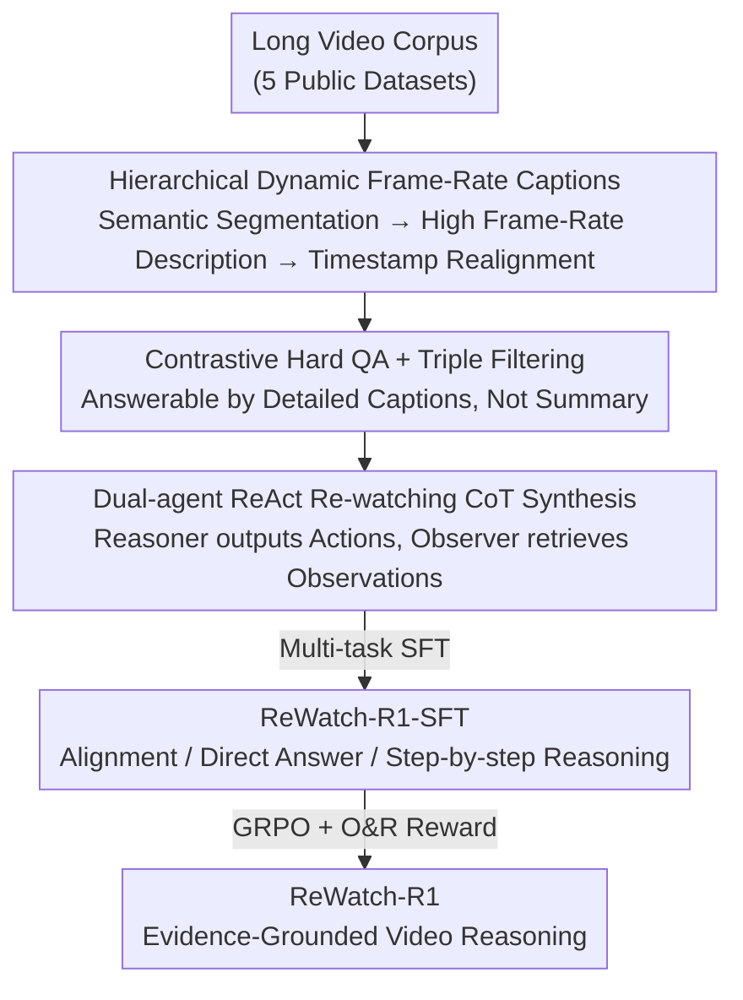

# ReWatch-R1: Boosting Complex Video Reasoning in Large Vision-Language Models through Agentic Data Synthesis

**Conference**: ICLR 2026  
**OpenReview**: [https://openreview.net/forum?id=xindJJLSr1](https://openreview.net/forum?id=xindJJLSr1)  
**Code**: Project Page (see paper)  
**Area**: Multimodal VLM / Video Understanding / LLM Reasoning  
**Keywords**: Video Reasoning, RLVR, Agentic Data Synthesis, ReAct, Process Rewards

## TL;DR
To address the bottleneck of high-quality training data for complex video reasoning, this paper develops a multi-stage "agentic data synthesis" pipeline to create the ReWatch dataset (hierarchical captions + high-difficulty QA + re-watching CoT). By applying SFT followed by RLVR with an "Observation & Reasoning (O&R)" reward, Qwen2.5-VL-7B is trained into ReWatch-R1, achieving SOTA performance among models of similar size across five challenging video reasoning benchmarks.

## Background & Motivation
**Background**: The "SFT + Reinforcement Learning from Verifiable Rewards (RLVR)" paradigm is well-established for image reasoning. The community has begun migrating this to video reasoning—typically by synthesizing Chain-of-Thought (CoT) trajectories from existing simple video QA datasets for SFT cold-starting, followed by RLVR.

**Limitations of Prior Work**: The authors identify three critical flaws in mainstream open-source video reasoning data: (1) Captions provide global, timestamp-free descriptions that flatten the temporal structure; (2) QA pairs are too simple and perception-heavy, often answerable from a few short frames or even textual common sense; (3) Synthetic CoTs lack "visual faithfulness," relying on common sense and elimination rather than genuine video inspection. Consequently, SFT fails to teach "reasoning grounded in video content," and subsequent RL cannot penalize intermediate hallucinations as it only relies on final answer correctness.

**Key Challenge**: Video reasoning is indexed on "reasoning grounded in video content," but existing data and rewards focus solely on the final answer. Models learn to "hallucinate a plausible-looking reasoning chain" rather than retrieving and verifying evidence from the video. This creates a coupled deadlock between data and reward bottlenecks.

**Goal**: Split the solution into two parts: (a) Construct a temporally dense, high-difficulty dataset where reasoning chains are anchored in video evidence; (b) Design an RL reward that simultaneously incentivizes "process faithfulness" and "result correctness."

**Key Insight**: The authors observe that humans "re-watch" complex videos—repeatedly locating, retrieving, and verifying segments based on the question. They utilize a multi-agent ReAct framework to explicitly simulate this "retrieval + verification" process, transforming human re-watching behavior into synthetic reasoning trajectories with `<action>/<observation>` tags.

**Core Idea**: Bridge the data bottleneck using agent-synthesized high-fidelity data and resolve the reward bottleneck via "Observation & Reasoning" dual rewards, enabling the model to retrieve evidence before reasoning.

## Method

### Overall Architecture
The approach consists of two main components. First is the **ReWatch Dataset Construction**: a three-stage pipeline starting from raw long videos to produce ReWatch-Caption-10k (temporally dense hierarchical captions), ReWatch-QA-170k (high-difficulty QA via contrastive generation and triple filtering), and ReWatch-CoT-135k (re-watching reasoning chains synthesized by dual-agent ReAct). Second is **Two-Stage Post-training**: multi-task SFT on the three sub-datasets to equip the model with video-text alignment, direct answering (non-thinking), and step-by-step reasoning (thinking) capabilities; followed by RLVR using GRPO and the proposed O&R reward to upgrade the model from "writing CoT forms" to "reasoning based on evidence."

The pipeline connects four contribution nodes: hierarchical captions provide a high-fidelity text base → high-difficulty QA provides challenges unsolvable by short segments → multi-agent CoT breaks down answering into verifiable retrieval-observation trajectories → O&R rewards use these trajectories in RL to evaluate if observations are grounded and reasoning is sufficient.

### Key Designs

**1. Hierarchical Dynamic Frame-Rate Captions: Accurate Temporal Grounding Without Hallucination**

Directly asking an LVLM to describe a long video leads to temporal loss or hallucination. The authors use Hierarchical Dynamic Frame-Rate Generation: First, a segmentation model $M_{seg}$ at low frame-rate divides videos into $k$ segments $S=\{s_1,\dots,s_k\}=M_{seg}(V)$. Only videos exceeding 10 minutes are segmented into ~10-minute chunks to maintain narrative integrity. Then, a powerful LVLM $M_{cap}$ generates fine-grained descriptions with relative timestamps $D^{rel}_i=\{(c_{ij},\tau_{ij})\}_{j=1}^{m_i}$ for each segment $s_i$ at high frame-rate. Finally, $t_{ij}=t^{start}_i+\tau_{ij}$ restores global timestamps for the full caption $C_{detail}(V)$. This "low-rate segmenting, high-rate describing, timestamp aligning" workflow ensures dense temporal detail while avoiding the hallucinations typical of long-context LVLM processing.

**2. Contrastive Hard QA + Triple Filtering: Enforcing Video Dependency**

Simple QA prevents models from learning genuine reasoning. This stage creates difficult questions and filters out "shortcuts." Contrastive generation is key: a lightweight LLM compresses detailed captions into a summary $C_{sum}=M_{sum}(C_{detail})$. Then, $M_{qa}(C_{detail},C_{sum})$ generates questions answerable by $C_{detail}$ but not by $C_{sum}$, targeting fine-grained details. This is followed by a triple filter: F1 Answer Verification (verifying factual correctness against $C_{detail}$); F2 Text Bias Elimination (probing LLMs without video—retained only if accuracy $\frac{1}{|M_{probe}|}\sum_M \mathbf{1}(M(Q)\approx A)<\theta_{text}$); and F3 Summary Bias Elimination (retained only if $\frac{1}{|M_{probe}|}\sum_M \mathbf{1}(M(Q,C_{sum})\approx A)<\theta_{sum}$). The resulting 85k questions are reformulated into 170k multiple-choice QA pairs, ensuring deep dependency on video content.

**3. Dual-agent ReAct Re-watching CoT Synthesis: Formalizing Evidence Retrieval**

To ensure "visual faithfulness," reasoning chains must explicitly record where evidence was found and what was seen. The authors employ two agents: a Reasoner $A_R$ producing thoughts $T$ and actions $Act$, and an Observer $A_O$ executing actions on captions to return observations $Obs$. At each step, $(T_t,Act_t)=A_R(H_{t-1})$ determines the next move based on history, and $Obs_t=A_O(Act_t,C_{detail})$ retrieves information. Actions include `segment_retrieval(query)` to find event timestamps and `segment_query(timestamp)` for detailed descriptions. A key design choice: the Observer retrieves from high-fidelity captions instead of raw pixels, as the authors verified that Stage 1 captions are sufficiently granular to act as visual proxies, making synthesis more scalable. Trajectories $T=\{(T_1,Act_1,Obs_1),\dots,(A_{final})\}$ are converted by $M_{convert}$ into natural language CoT with `<action>/<observation>` tags for SFT and RL.

**4. Observation & Reasoning (O&R) Reward: Grounding Evidence and Logic**

Using only accuracy $r_{acc}=M_{judge}(A,A_{gt})$ allows models to guess correctly through hallucinations. The authors split process rewards into two components. Observation Reward: Parse trajectories $\{Act_i,Obs_i\}_{i=1}^N=\text{Parse}(R)$ and compute $r_{obs}=\text{mean}(\{M_{judge}(C_{detail},\{Act_i,Obs_i\})\}_{i=1}^N)$ to verify if observations are grounded in the video. Reasoning Reward: An LLM $A_{ao}=M_{infer}(Q,\{Act_i,Obs_i\}_{i=1}^N)$ attempts to answer the question using *only* the provided actions and observations; $r_{rea}=M_{judge}(A_{ao},A_{gt})$ measures if the gathered evidence is sufficient. The final reward:
$$r_{O\&R} = r_{acc}\times(1+r_{obs}+r_{rea})+r_{fmt}$$
where $r_{fmt}$ is a format reward. The multiplicative structure ensures process rewards only amplify the score when the answer is correct ($r_{acc}=1$), preventing high scores for "well-written but incorrect" chains.

### Loss & Training
The SFT stage uses a multi-task composite loss $L_{SFT}=L_{Cap}+L_{QA}+L_{CoT}$: $L_{Cap}=-\mathbb{E}[\log\pi_\theta(C_{detail}|V)]$ for alignment; $L_{QA}=-\mathbb{E}[\log\pi_\theta(A|V,I_{direct},Q)]$ for direct answer (non-thinking); $L_{CoT}=-\mathbb{E}[\log\pi_\theta(R|V,I_{think},Q)]$ for step-by-step reasoning (thinking). Tasks are optimized in parallel with instructions to toggle modes. The RL stage fine-tunes the SFT policy on ReWatch-QA using GRPO with the O&R reward.

## Key Experimental Results

### Main Results
Trained on Qwen2.5-VL-7B and evaluated across five benchmarks (192-frame setting, Thinking mode).

| Model | VCR-Bench | MINERVA | Video Holmes | VideoMathQA | CG-AV-Counting | Avg |
|------|-----------|---------|--------------|-------------|----------------|------|
| Qwen2.5-VL-7B (Base, Direct) | 36.75 | 33.19 | 38.87 | 24.76 | 19.96 | 30.71 |
| Video-R1 | 32.69 | 32.36 | 41.97 | 25.95 | 22.01 | 31.00 |
| GLM4.1V-9B | 34.53 | 33.75 | 38.98 | 27.38 | 21.32 | 31.19 |
| LongVideoReason-RL† | 35.30 | 35.01 | 43.49 | 23.57 | 20.55 | 31.58 |
| ReWatch-R1-SFT | 35.78 | 35.43 | 39.52 | 30.00 | 25.51 | 33.25 |
| ReWatch-R1 | 40.14 | 35.70 | 43.00 | 30.71 | 24.73 | 34.86 |
| **ReWatch-R1 + O&R** | **40.43** | **36.05** | **43.88** | **31.67** | **25.51** | **35.51** |

Key points: (1) ReWatch-R1-SFT (33.25%) alone outperforms Video-R1-SFT (29.74%) and LongVideoReason-SFT (26.31%), highlighting the impact of CoT data quality. (2) RL improves performance from 33.25% → 34.86%, reaching 35.51% with O&R rewards. (3) Thinking mode on un-tuned base models actually decreases performance (27.54% vs 30.71% direct), proving that "learning to think" is a prerequisite.

### Ablation Study
Ablation of CoT data and QA quality (Mean Accuracy: All / Reasoning / Understanding):

| Config | All | Reasoning | Understanding | Note |
|------|-----|-----------|---------------|------|
| ReWatch-R1 (Full) | 43.3 | 34.9 | 53.9 | Full model |
| SFT with Video-R1-CoT | 39.8 | 30.3 | 51.7 | Low-qual CoT drops 3~4.6 pts |
| w/o SFT (Direct RL) | 38.9 | 30.1 | 50.0 | No SFT cold-start |
| w/o SFT & RL (base) | 35.5 | 26.4 | 46.9 | Original base |
| RL on Our QA | 42.8 | 34.8 | 52.8 | Stronger reward signal from hard QA |
| RL on baseline QA | 42.0 | 34.3 | 51.7 | Weaker signal from simple QA |

### Key Findings
- **SFT is a Prerequisite for RL**: Removing SFT and performing direct RL leads to a catastrophic drop; RL requires a strong initial policy to survive.
- **CoT Quality Defines the Ceiling**: Replacing ReWatch-CoT with Video-R1-CoT drops Reasoning from 34.9% to 30.3%, verifying that the multi-agent framework produces superior reasoning corpora.
- **Hard QA Provides Stronger Reinforcement Signals**: ReWatch-QA averages 3.31 actions and longer responses (398.75 vs 205.74). Its "text-only" accuracy is only 29.4% (vs 68.9% for Video-R1-QA), indicating that simpler datasets provide almost no reward signal for legitimate video-based reasoning.
- **Efficacy of O&R Structure**: Process rewards are only amplified upon correct answers, rewarding faithfulness while avoiding "plausible failures."

## Highlights & Insights
- **Captions as Visual Proxies for Synthesis**: Enabling the Observer to search high-fidelity captions instead of pixels significantly reduces the cost and improves scalability of synthesized re-watching trajectories. These Thought-Action-Observation traces can serve as training data for future models that query visual encoders directly.
- **"Detailed-can, Summary-cannot" Contrastive Logic**: Matching this with text/summary bias filtering systematically removes shortcuts. This methodology is transferable to any modality requiring evidence-dependent QA.
- **Defining Reasoning via Recoverability**: Using "whether the answer can be recovered solely from observations ($r_{rea}$)" provides a concrete, verifiable signal for reasoning quality, which is more robust than heuristic scoring.

## Limitations & Future Work
- **Reliance on Textual Captions**: The fidelity of the Stage 1 captions anchors the entire pipeline. Missing or hallucinated events in captions propagate to downstream QA/CoT/Rewards. Currently, this is a text-based simulation rather than a direct visual query.
- **Dependency on External Teacher Models**: The chain of $M_{seg}$ to $M_{judge}$ is lengthy. Filtering thresholds and judge consistency introduce potential biases and high replication costs.
- **Scale Verification**: Experiments were conducted primarily on the 7B (Qwen2.5-VL) scale. The generalizability of O&R and this synthetic data to larger or heterogeneous backbones remains to be fully explored.

## Related Work & Insights
- **vs. Video-R1 / Simple QA Methods**: Previous methods rely on existing simple video QA to synthesize CoTs for RL, inheriting flaws like lack of temporal structure and visual unfaithfulness. ReWatch-R1's SFT-only variant already exceeds their RL-trained versions.
- **vs. Outcome-only RLVR**: Traditional $r_{acc}$ ignores hallucinations. O&R integrates "observation faithfulness + reasoning recoverability" using a multiplicative structure to penalize fabrications.
- **vs. LongVideoReason**: Instead of just scaling context size, this work balances temporal precision and hallucination prevention via hierarchical captions and formalizes human re-watching as a synthetic trajectory.

## Rating
- Novelty: ⭐⭐⭐⭐⭐ Adapting multi-agent ReAct for video CoT synthesis and developing the O&R dual process reward directly addresses coupled data/reward bottlenecks.
- Experimental Thoroughness: ⭐⭐⭐⭐ Extensive evaluation across 9 benchmarks and multi-dimensional ablations, though focused on the 7B backbone.
- Writing Quality: ⭐⭐⭐⭐ Clear explanation of the pipeline and logic; intuitive diagrams for data comparison and framework.
- Value: ⭐⭐⭐⭐⭐ The dataset and reward paradigm are directly reusable and provide significant engineering value for advancing video reasoning.

<!-- RELATED:START -->

## Related Papers

- [\[ICLR 2026\] Composition-Grounded Data Synthesis for Visual Reasoning](composition-grounded_data_synthesis_for_visual_reasoning.md)
- [\[CVPR 2026\] Boosting Reasoning in Large Multimodal Models via Activation Replay](../../CVPR2026/vlm_reasoning/boosting_reasoning_in_large_multimodal_models_via_activation_replay.md)
- [\[ICLR 2026\] Agentic Jigsaw Interaction Learning for Enhancing Visual Perception and Reasoning in Vision-Language Models](agentic_jigsaw_interaction_learning_for_enhancing_visual_perception_and_reasonin.md)
- [\[ICLR 2026\] VidGuard-R1: AI-Generated Video Detection and Explanation via Reasoning MLLMs and RL](vidguard-r1_ai-generated_video_detection_and_explanation_via_reasoning_mllms_and.md)
- [\[CVPR 2026\] VAST: Video Ability-Stratified Taxonomy for Data-Efficient Video Reasoning](../../CVPR2026/vlm_reasoning/vast_video_ability-stratified_taxonomy_for_data-efficient_video_reasoning.md)

<!-- RELATED:END -->
