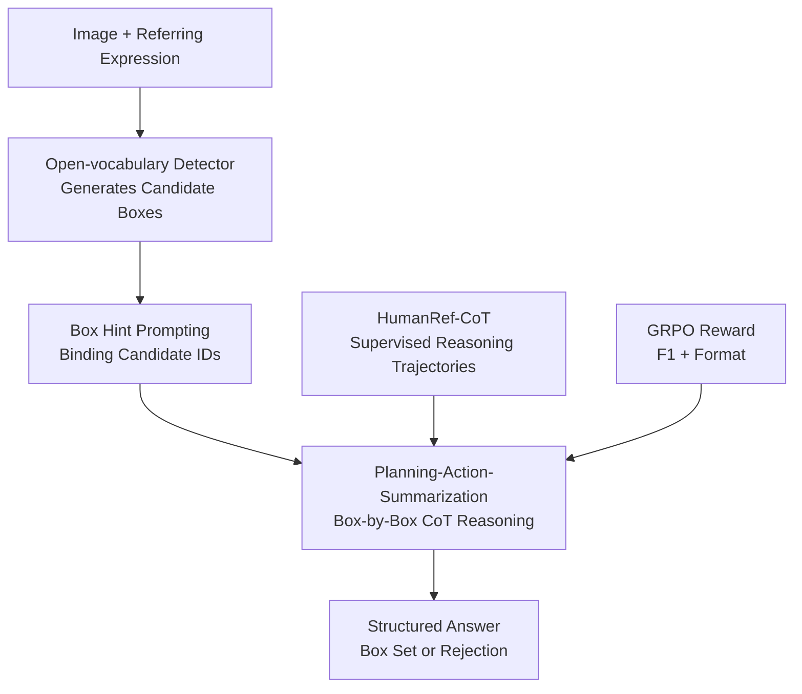

# Rex-Thinker: Grounded Object Referring via Chain-of-Thought Reasoning

**Conference**: ICLR 2026  
**OpenReview**: [https://openreview.net/forum?id=btWHQoSZZ1](https://openreview.net/forum?id=btWHQoSZZ1)  
**Code**: https://github.com/IDEA-Research/Rex-Thinker  
**Area**: Multimodal VLM / Visual-Language Reasoning / Referring Expression Comprehension  
**Keywords**: Referring Expression Comprehension, Visual Grounding, Chain-of-Thought, Candidate Box Retrieval, GRPO  

## TL;DR
Rex-Thinker reformulates grounded object referring from "direct coordinate generation" into a process where an open-vocabulary detector provides candidate boxes, followed by a multimodal large model (MLLM) performing box-by-box reasoning via a Planning-Action-Summarization framework with rejection capabilities. This approach simultaneously improves grounding accuracy, explainability, and rejection performance for null-target expressions on HumanRef.

## Background & Motivation
**Background**: Referring Expression Comprehension (REC) requires models to identify all matching objects in an image based on a natural language description. Recent MLLMs typically follow two paths: either generating bounding box coordinates directly as text tokens, or selecting matching candidate regions from a set of proposals. The former is end-to-end but poses high localization pressure, while the latter decouples localization from semantic matching and has shown promising results on several referring benchmarks.

**Limitations of Prior Work**: This paper focuses on whether a model is truly "grounded" rather than simply "enclosing a reasonable target." A reliable object referring system should satisfy two criteria: first, the prediction process must be verifiable, allowing users to understand why a specific box was chosen; second, the model should output an empty set rather than hallucinating a box when no object in the image satisfies the description. Most existing direct coordinate prediction or candidate retrieval methods provide only the final box, lacking explicit reasoning chains and struggling with rejection cases.

**Key Challenge**: Detectors excel at proposing candidate regions but struggle with complex linguistic relationships (e.g., "the person between two adults," "the person holding the letter H"). Conversely, MLLMs excel at linguistic and visual reasoning but are limited in precise localization, often suffering from pixel-level errors and missed detections when generating coordinates directly. REC necessitates strength in both: precise candidate proposals and the ability to explain "why it is or is not a match" for each candidate.

**Goal**: The authors decompose the objective into three sub-problems: providing the model with a reliable set of candidate boxes; enabling the model to perform traceable, step-by-step reasoning around these candidates; and employing a training objective that rewards both final box accuracy and credible output formatting, particularly the ability to reject output when no match exists.

**Key Insight**: The authors observe that humans performing referring tasks typically do not report coordinates directly. Instead, they identify candidate categories and exclude them based on attributes, positions, interactions, or commonsense conditions. For example, for "the person sitting on a turtle," one first identifies people and turtles, then checks if any person is actually sitting on a turtle. Rex-Thinker explicitly encodes this natural process as a Chain-of-Thought (CoT), binding each step to input candidate box hints.

**Core Idea**: By replacing implicit coordinate prediction with "open-vocabulary detector candidate boxes + MLLM box-by-box reasoning + two-stage SFT/GRPO training," the object referring answers become localizable, verifiable, and rejectable when no target is present.

## Method

### Overall Architecture
Rex-Thinker employs a two-stage system: the first stage uses an open-vocabulary detector to propose candidate boxes based on the target categories in the referring expression. The second stage inputs the image, candidate box hints, referring expression, and system prompts into Qwen2.5-VL-7B, allowing the model to generate a Planning-Action-Summarization reasoning chain within `<think>` tags and output the final set of boxes within `<answer>` tags. For training, the authors first perform cold-start supervised fine-tuning (SFT) using HumanRef-CoT to teach the model the fixed reasoning format, followed by GRPO post-training to encourage more accurate and generalizable candidate selection through task rewards.

The key to this framework is that "candidate boxes are not the final answer, but the reasoning coordinate system." During reasoning, references to "Person 1, Person 2, Fish 3" correspond to specific boxes in the input, allowing the reasoning chain to reference image regions. The final answer is selected from these candidates, preventing the MLLM from bearing the burden of precise coordinate regression alone.

### Key Designs
**1. Retrieval-based Referring: Transforming Localization into Box-by-Box Verification**

Rex-Thinker does not require the MLLM to generate arbitrary coordinates directly. Instead, it uses an open-vocabulary detector to extract candidate boxes related to the target category. For example, if the expression is "person holding letter H," the detector provides all "person" boxes. These boxes are provided in the prompt as box hints, and the model must determine which candidates satisfy the description within this fixed set.

This design mitigates the weaknesses of both model types. Detectors alone have high recall but poor precision regarding relationships and attributes; MLLMs have strong understanding but struggle with precise coordinates. By delegating "where" to the detector and "is it" to the MLLM, the final selection is constrained by visual candidates while leveraging linguistic reasoning. Ablations confirm this: a fine-tuned Qwen2.5-VL without box hints achieves 74.1/69.4/69.6 in Precision/Recall/DF1, whereas Rex-Thinker-Plain with box hints reaches 85.8/82.6/81.4.

**2. Planning-Action-Summarization: Traceable Judgments for Every Candidate Area**

The CoT in Rex-Thinker is not a generic explanation but is structured into three stages. **Planning** decomposes the expression into sub-goals (e.g., find people with yellow ties, then find everyone to their right). **Action** checks each candidate box against these sub-goals, labeling them as a match, a reference entity, or a mismatch. **Summarization** re-verifies the intermediate conclusions and converts matching candidates into answer boxes.

This structure externalizes "skipping steps," a common error in complex referring. For multi-target expressions, standard models might only find the most salient object; Rex-Thinker is trained to iterate through every candidate, reducing the likelihood of missing targets. For rejection cases, the model confirms in the summarization phase that no candidates satisfy the description, leading to an empty answer rather than a hallucinated region.

**3. HumanRef-CoT Data Engine: Grounded Reasoning Trajectories via GPT-4o**

To train this structured reasoning, the authors built HumanRef-CoT with 90,824 samples based on HumanRef. Original HumanRef provides human-related expressions, candidate boxes, and answers across attribute, position, interaction, reasoning, celebrity, and rejection subsets. The authors used a Set-of-Mark strategy to number candidates and prompted GPT-4o with the image, boxes, expression, ground truth, and few-shot examples to generate Planning-Action-Summarization reasoning chains.

GPT-4o acts as a labeler with ground-truth references rather than just a benchmark participant. After generation, a two-stage automatic filter checks for consistency between Action/Summarization symbols and verifies the final answer against the ground truth. Manual evaluation of 600 samples found zero summary errors or Action-Summarization contradictions, with only a 7/600 rate of local factual errors, indicating the data successfully provides supervision for "how to explain the correct answer via executable reasoning."

**4. SFT + GRPO: Learning Structure then Optimizing Strategy**

Training follows two steps. Step one is **CoT SFT cold start**: token-level cross-entropy on the full output of HumanRef-CoT, including the `<think>` chain and `<answer>` boxes. This teaches the model basic formats like candidate numbering, step-by-step checking, and JSON-style output.

Step two is **GRPO post-training**. For a given input, the model samples $G$ responses. The reward consists of an accuracy reward (F1 score over candidate sets) and a format reward. Specifically, a predicted box counts as a match only if it perfectly overlaps a ground-truth box (equivalent to selecting the correct candidate). The format reward checks for proper use of `<think>` and `<answer>` tags. The total reward is $r_i=\lambda r^{F1}_i+(1-\lambda)r^{fmt}_i$ with $\lambda=0.9$, emphasizing correct detection while maintaining interpretability.

GRPO allows the model to explore optimal reasoning paths rather than just mimicking SFT trajectories. Ablations show that GRPO without CoT cold start achieves a DF1 of 77.8, while CoT SFT followed by GRPO reaches 83.5, proving that "learning to explain before optimizing via rewards" is more stable.

### Loss & Training
The SFT phase employs token-level cross-entropy. The base model is Qwen2.5-VL-7B, with the visual encoder and MLP projector frozen. The learning rate is $2\times10^{-5}$ with a weight decay of 0.01 and a maximum length of 2048.

In the GRPO phase, $G=8$ responses are sampled per input, using group relative reward normalization:

$$
A_i=\frac{r_i-\mathrm{mean}(r_1,\ldots,r_G)}{\mathrm{std}(r_1,\ldots,r_G)}
$$

Updates use a PPO-style clipped objective with a KL penalty. The learning rate is $1\times10^{-6}$ with $\beta=0.04$ and temperature 1.0. To prevent the model from merely memorizing SFT candidate orders, box hint sequences are randomized during GRPO.

The accuracy reward utilizes candidate-level F1:

$$
\mathrm{Precision}=\frac{|M|}{|\hat{B}|},\quad
\mathrm{Recall}=\frac{|M|}{|B^*|},\quad
r_{F1}=\frac{2\cdot \mathrm{Precision}\cdot \mathrm{Recall}}{\mathrm{Precision}+\mathrm{Recall}}
$$

Where $M=\hat{B}\cap B^*$. Since answers must be selected from candidates, a match requires perfect overlap. 

## Key Experimental Results

### Main Results
The authors evaluate on HumanRef (in-domain) and RefCOCOg (out-of-domain).

| Dataset / Setting | Method | Key Metrics | Ours | Baseline | Gain / Conclusion |
|-------------------|--------|-------------|------|----------|-------------------|
| HumanRef in-domain | Rex-Thinker-GRPO | Avg R / P / DF1 | 86.6 / 86.8 / 83.5 | RexSeek-7B: 85.9 / 85.8 / 82.3 | +1.2 Avg DF1, higher P and R |
| HumanRef rejection | Rex-Thinker-GRPO | Rejection Score | 68.2 | RexSeek-7B: 54.1 | +14.1, significantly reduced hallucinations |
| HumanRef CoT Gain | CoT vs Plain | Avg R / P / DF1 | 85.2 / 85.9 / 82.3 | Plain: 82.6 / 85.8 / 81.4 | CoT primarily boosts Recall and rejection |
| RefCOCOg zero-shot | Rex-Thinker-GRPO | val / test accuracy | 83.2 / 83.3 | CoT SFT: 81.2 / 80.3 | GRPO improves cross-category generalization |
| RefCOCOg fine-tuned| Rex-Thinker-GRPO*| val / test accuracy | 89.2 / 88.8 | ChatRex-7B: 89.8 / 90.0 | Near SOTA performance |

The most notable improvement is in the **rejection** metrics. Rex-Thinker-Plain's rejection score of 53.5 rose to 67.3 with CoT SFT and 68.2 after GRPO, showing that structured reasoning helps the model "admit when there is no target."

### Ablation Study
| Configuration | Key Metrics | Description |
|---------------|-------------|-------------|
| Fine-tuned Qwen2.5-VL (no box hints) | Avg P/R/DF1 = 74.1 / 69.4 / 69.6 | Direct localization by MLLM is limited in Recall and DF1 |
| Rex-Thinker-Plain (box hints, no CoT) | Avg P/R/DF1 = 85.8 / 82.6 / 81.4 | Candidate hints alone significantly improve REC accuracy |
| Rex-Thinker-CoT | Avg DF1 = 82.3, Rejection 67.3 | CoT improves Recall and rejection via box-by-box verification |
| Rex-Thinker-GRPO | Avg DF1 = 83.5, Rejection 68.2 | GRPO further optimizes task-level metrics on top of CoT |
| GRPO without CoT cold start | Avg DF1 = 77.8, Rejection 66.4 | Unstable reasoning chains lead to significant performance drops |

### Key Findings
- **CoT gains** are primarily reflected in Recall and Rejection rather than just Precision. Analysis shows Recall gains of ~5.29 on Reasoning and ~4.48 on Attribute subsets, supporting the intuition that systematic candidate checking reduces missed detections.
- **Two-stage architecture is essential**. Open-vocabulary detectors have high recall but low precision; MLLMs are linguistically capable but locally unstable. Using the detector as a proposer and the MLLM as a verifier avoids the primary pitfalls of both.
- **CoT cold start is a prerequisite for GRPO**. GRPO alone does not naturally produce clear reasoning formats. SFT ensures stability, which GRPO builds upon to optimize accuracy.
- **Inference overhead**: Rex-Thinker-Plain averages 1.13s per image, while Rex-Thinker-GRPO averages 6.68s (~5.9x slower) due to long CoT outputs. This is the trade-off for interpretability and accuracy.

## Highlights & Insights
- **Grounded CoT**: Unlike CoT methods that provide generic natural language explanations, Rex-Thinker binds "Person 1" or "Person 2" to specific candidate boxes, making the reasoning chain verifiable.
- **Rejection as a First-Class Citizen**: The model is evaluated on its ability to output empty sets for invalid expressions, which is critical for real-world applications where user descriptions may be incorrect or missing targets.
- **Data Engine Strategy**: Instead of manual labeling, the authors use "LLM rationale distillation with ground-truth constraints," a scalable strategy for other grounded reasoning tasks.
- **Multi-Instance Support**: The box-by-box verification naturally handles expressions referring to sets (e.g., "all people wearing glasses"), which usually challenge standard grounding models.

## Limitations & Future Work
- **Inference Latency**: Increased compute time (6.68s) may hinder real-time deployment. Future work could explore short-reasoning or early-stopping mechanisms for easy samples.
- **Reasoning-Answer Inconsistency**: Models occasionally identify $N$ objects in reasoning but output $N-1$ boxes in the final answer. Stronger rewards for consistency are needed.
- **Interaction Complexity**: Gains on the Interaction subset are lower, likely because evaluating candidates in isolation is insufficient for complex tasks like "who is holding whom."
- **Candidate Bottleneck**: If the detector misses a target, the MLLM cannot recover it. Multi-category or relationship-aware proposals could be explored.

## Related Work & Insights
- **vs. Direct Coordinate MLLMs**: Methods like Shikra or Ferret offer simpler pipelines but lack candidate-level explainability and suffer from pixel-level errors. 
- **vs. Retrieval-based Methods**: Groma and RexSeek use candidate selection but lack explicit reasoning for *why* a candidate matches. Rex-Thinker adds verifiability and better rejection.
- **vs. General Visual CoT**: While LLaVA-CoT focus on general QA, Rex-Thinker's CoT is specifically engineered for the REC candidates, making the task rewards and evaluation more precise.

## Rating
- **Novelty**: ⭐⭐⭐⭐☆ Combines CoT, candidate retrieval, and GRPO effectively for REC.
- **Experimental Thoroughness**: ⭐⭐⭐⭐☆ Covers HumanRef, RefCOCOg, rejection cases, and ablation of each component.
- **Writing Quality**: ⭐⭐⭐⭐☆ Clear main narrative and intuitive illustrations.
- **Value**: ⭐⭐⭐⭐⭐ High reference value for VLM systems requiring explainable localization and low hallucination rates.

<!-- RELATED:START -->

## Related Papers

- [\[CVPR 2026\] Chain-of-Thought Guided Multi-Modal Object Re-Identification](../../CVPR2026/vlm_reasoning/chain-of-thought_guided_multi-modal_object_re-identification.md)
- [\[CVPR 2026\] Grounded Chain-of-Thought for Multimodal Large Language Models](../../CVPR2026/vlm_reasoning/grounded_chain-of-thought_for_multimodal_large_language_models.md)
- [\[ICLR 2026\] ThinkMorph: Emergent Properties in Multimodal Interleaved Chain-of-Thought Reasoning](thinkmorph_emergent_properties_in_multimodal_interleaved_chain-of-thought_reason.md)
- [\[ICLR 2026\] CoPRS: Learning Positional Prior from Chain-of-Thought for Reasoning Segmentation](coprs_learning_positional_prior_from_chain-of-thought_for_reasoning_segmentation.md)
- [\[CVPR 2026\] Reinforcing Structured Chain-of-Thought for Video Understanding](../../CVPR2026/vlm_reasoning/reinforcing_structured_chain-of-thought_for_video_understanding.md)

<!-- RELATED:END -->
