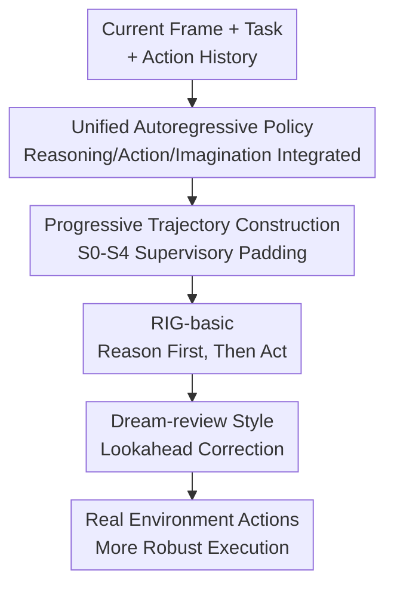

# RIG: Synergizing Reasoning and Imagination in End-to-End Generalist Policy

**Conference**: ICLR 2026  
**OpenReview**: [https://openreview.net/forum?id=LQv9LU2Ufg](https://openreview.net/forum?id=LQv9LU2Ufg)  
**Code**: Not public (The paper states that supplementary materials include training/inference code and checkpoints)  
**Area**: VLM Reasoning / Embodied Intelligence / Generalist Policy  
**Keywords**: Embodied Intelligence, World Model, Multimodal Reasoning, Lookahead, Minecraft  

## TL;DR
RIG integrates textual reasoning, low-level action prediction, and future frame generation into a single autoregressive Transformer. Through progressively constructed Minecraft trajectory data, the policy is enabled to "think, imagine the outcome, and then refine actions," simultaneously improving control, generation, and reasoning performance with significantly less environmental interaction data.

## Background & Motivation
**Background**: Open-world embodied intelligence typically follows two routes: one is VLM/LLM agents, which perform linguistic reasoning based on visuals and tasks before calling low-level controllers for execution; the other is world models or video prediction models, which learn "current state + action leads to what future frame" and apply this imagination for planning. The former excels in explaining goals and decomposing tasks, while the latter excels in forward simulations of physical environments.

**Limitations of Prior Work**: These two capabilities are separated in many systems. VLM-based agents might say "I should chop the tree" without knowing if they are close enough to the trunk. World models predict the next frame but often learn environmental dynamics as mere pixel sequences, lacking explicit task intent and reasons for action. Hybrid systems that combine VLMs, visual generation models, and low-level controllers occupy both reasoning and imagination, but suffer from a lack of end-to-end optimization between modules and error accumulation at interfaces.

**Key Challenge**: Actions in embodied tasks are not isolated tokens but are determined by "current observations, task goals, why this action is taken, and what will happen after." Learning only actions lacks interpretable intermediate intent, while learning only future images lacks task constraints. If reasoning, action, and imagination are not jointly modeled in a single model, the policy cannot truly leverage the correlations among the three.

**Goal**: The authors aim to train an end-to-end generalist policy that outputs textual reasoning, keyboard/mouse-level low-level actions, and next-frame visual imagination within a single model. It further supports test-time lookahead: performing internal rollouts of "dream trajectories" and correcting real actions based on imagined failures or risks.

**Key Insight**: The observation is that in open-world tasks like Minecraft, human actions usually involve forming a reason, estimating the result, and then deciding whether to execute. The authors do not view reasoning as an extra explanation nor imagination as a separate video generator; instead, they encode both as predictable tokens in an autoregressive sequence, allowing a single Transformer to learn the joint distribution of reasoning, action, and environment dynamics.

**Core Idea**: Use a unified multimodal autoregressive policy to string "reasoning → action → imagination → review/correction" into the same training and inference chain, replacing previous embodied agent systems composed of multiple stitched models.

## Method

### Overall Architecture
The input to RIG consists of the current visual observation, task text, and interaction history. The output is a structured sequence: generating textual reasoning first, then low-level action tokens, and finally visual tokens for the next or multiple future frames. During training, the authors start from existing Minecraft human/agent trajectories and progressively supplement them with reasoning, review, and temporal alignment data. During inference, RIG-basic acts directly based on current observations, while RIG-lookahead generates internal dream trajectories using an `<Imagine:>` tag, following which it reviews these imagined results to correct actions.

In terms of implementation, RIG is built upon unified multimodal understanding/generation models like Janus-1.3B, using SigLIP-L/16-384 to encode images and a VQ tokenizer to discretize visual frames into visual tokens. Image tokens, text tokens, and action text tokens are mixed within the same 4096 context window. The action space remains human-like keyboard and mouse controls (e.g., `forward`, `attack`, `camera:[0,10]`), rather than high-level APIs, allowing the model to learn a fine-grained embodied policy.

### Key Designs
**1. Unified Autoregressive Policy: Sequencing Reasoning, Action, and Imagination**

Traditional generalist policies mostly predict actions, while world models separately predict future states. The key change in RIG is allowing the model to generate three objects within the same conditional distribution: textual reasoning $Y$, low-level action $A$, and visual prediction $P$. The paper formulates this process as $(Y,A,P)=F(X)$, where $X=\{x_{IMG},x_{TXT}\}$ includes visual and textual inputs. Consequently, the model does not have a VLM explaining the scene for another controller; instead, it simultaneously learns "why to do this, how to do it specifically, and what will be seen" during next-token prediction.

In Minecraft, reasonable actions depend not just on the tree appearing in the frame but also on distance, crosshair position, terrain pits, and task phases. Placing reasoning before action adds an explicit semantic intermediate state to action prediction; placing image prediction after action forces the model to check if the action truly changes the environment. Sharing a Transformer makes reasoning more than a readable log and imagination more than independent video generation; they become supervisory signals and reasoning context for action learning.

**2. Progressive Trajectory Construction: From "Action and Frame Only" to "Frame-Reasoning-Action-Future"**

A practical problem is that existing Minecraft data lacks complete reasoning text and review trajectories strictly aligned with actions and future frames. RIG designs an S0 to S4 data pipeline instead of waiting for a perfect dataset. S0 uses human trajectories from MineRL-V0 and quantizes continuous camera actions into discrete text tokens at 5-degree intervals. S1 uses STEVE-1 to collect high-resolution image-action pairs to ensure alignment between low-level control and visuals. S2 employs GPT-4o as a Reasoner to write action reasons based on frames and actions, forming vision-reasoning data.

The core here is not just "adding CoT to data" but making the intent originally implicit in actions explicit. For an action like `forward, sprint, camera:[0,10]`, the model needs to see that it corresponds to "the tree is at the front-right, the current distance is insufficient, I need to adjust the view and move closer." RIG-basic trained up to S2 can already reason before acting in real interactions, though its reasoning is mainly based on current observations and history.

**3. Dream-review Lookahead: Retaining Failure Trajectories to Learn Correction**

The most interesting part of RIG-lookahead is the S3 vision-reviewing. The authors run RIG-basic and STEVE-1 rollouts in parallel from the same initial state and use a state-wise advantage filter to retain only states where STEVE-1's expected return is higher and RIG-basic performs poorly. This yields a set of local comparable negative trajectories $\{X^-,Y^-,A^-\}$ and positive trajectories $\{X^+,A^+\}$. A GPT-4o Reviewer then explains why the original action was wrong and how to fix it, forming error-correcting reasoning such as $Y=\{Y^-,\text{“Wait! Let’s re-observe...”},Y^+\}$.

This design is closer to lookahead scenarios than standard imitation learning: the model sees how it might misjudge, why imagined results expose problems, and how corrected actions avoid failure. During training, negative trajectories serve as context rather than optimization targets; only positive correction reasoning and actions enter the loss, similar to introducing rejection sampling fine-tuning into embodied agents. At inference, a fixed `<Imagine:>` token separates internal imagination from real observations.

**4. Temporally Aligned Visual Imagination: Future Frames Serving Control**

Generating the next frame is insufficient if it deviates from real interaction results, as lookahead could mislead the policy. S4 performs temporal alignment: the model autoregressively generates multiple imagined visual predictions $P$ while the same action path is rolled out in the real environment to obtain the true next frame $x_{IMG}$. $P_{i+1}$ is then aligned with $x^{IMG}_{i+1}$. This phase teaches the model the correspondence between the "dream stream" and the "reality stream," reducing drift in multi-step imagination.

The inference formula can be understood as follows: the final action is conditioned not just on the current $X_i$ but also on multiple imagined frames and reasoning: $(Y^*_{i+1},A^*_{i+1},P^*_{i+1}) \leftarrow F(X_i,P_{i+1},Y_{i+1},...,P_{i+n},Y_{i+n})$. This makes test-time scaling natural: providing more reasoning/imagination steps allows the agent to check consequences more thoroughly, though error accumulation occurs if steps are excessive.

### A Complete Example
In a tree-chopping case, the trunk appears ahead and the task is to "chop a tree." A strong model without lookahead might output `attack` and imagine the trunk cracking. However, if the distance is insufficient, the attack will miss, leading the model to get stuck in the false assumption of "I am already chopping the tree."

RIG-lookahead generates the next action and imagined frame, then triggers a review with "Wait! Let’s re-observe...". It discovers that the trunk did not change in the imagined frame, indicating insufficient distance; meanwhile, a tree to the right is closer with flatter terrain. Thus, the final action is corrected from `attack` to `forward, sprint, camera:[0,10]`. This illustrates the core difference: imagination is not for pretty pictures but for discovering that "this action will not produce the expected effect in the future."

### Loss & Training
The training objective is simple: cross-entropy over the unified token sequence: $L=-\sum_i \log P_\theta(x_i\mid x_{<i})$. All modalities (reasoning text, action text, and discretized visual tokens) are incorporated into the same next-token prediction framework. This is engineering-friendly and allows direct reuse of SFT/RFT training paradigms from LLMs.

Training is conducted in two stages. RIG-basic uses S0, S1, and S2 to learn to generate reasoning, action, and visual predictions from real observations. RIG-lookahead adds S3 and S4, using failure trajectory reviews and temporal alignment to learn dream-review. The paper reports collecting only 111 hours of interaction data (42h from MineRL-V0 and 69h from S1-S4), which is small compared to the ~2000 hours used by the STEVE-1/VPT series. Training costs for RIG-basic were approximately 704 GPU hours (64x A100 80GB), with an additional 280 GPU hours for the lookahead phase.

## Key Experimental Results

### Main Results
The paper evaluates three categories of capabilities in Minecraft/MineRL: embodied control tasks, visual generation quality, and understanding/reasoning. Tasks are split into Collect (Wood, Seeds/Grass, Dirt) and Explore (Dig, Explore, Tower), with Manual and Tool difficulty settings. The most important takeaway is that RIG-lookahead is the strongest across collection volume, exploration success, and generation quality, despite using significantly less training data than many baselines.

| Comparison | Training/Interaction Data | Visual Imagination | Textual Reasoning | Lookahead | Representative Result |
|------------|----------------------------|--------------------|-------------------|-----------|-----------------------|
| STEVE-1    | ~2000h                     | No                 | No                | No        | Low-level policy; lacks reasoning/world model |
| MineDreamer| ~2101h                     | Yes                | Yes               | Partial   | World model separate from controller |
| **Ours** (RIG-basic) | 111h | Yes | Yes | No | 101.1 collected samples, 93.4% explore accuracy in Tool setting |
| **Ours** (RIG-lookahead) | 111h | Yes | Yes | Yes | 246.6 collected samples, 94.1% explore accuracy in Tool setting |

| Capability Metric | RIG-basic / Variants | RIG-lookahead | Conclusion |
|-------------------|----------------------|---------------|------------|
| Collected samples (Tool) | 101.1 | 246.6 | Lookahead significantly improves collection efficiency |
| Explore success (Tool) | 93.4% | 94.1% | Already near peak; lookahead provides marginal gains |
| Generation FID | 156.5 | 77.6 | Review-style training significantly improves future frame quality |
| Generation PSNR | 17.9 | 18.4 | Temporal alignment makes visual predictions closer to real frames |
| Reasoning Score-Env. | 7.3 | 8.5 | Lookahead review improves environment-related reasoning |

### Ablation Study
Ablations focus on combinations of Action, Generation, Reasoning, and Lookahead. Results show that adding generation or reasoning individually helps, but the full combination provides the largest boost, especially in the Tool setting collection task where samples increased from 33.4 (action-only) to 246.6.

| Configuration | Manual collected avg. | Manual explore avg. | Tool collected avg. | Tool explore avg. | Note |
|---------------|-----------------------|---------------------|---------------------|-------------------|------|
| Action only   | 7.7                   | 8.4                 | 33.4                | 12.6              | Lacks explicit reasoning and future prediction |
| Action + Gen  | 13.2                  | 30.3                | 34.7                | 35.3              | Generation improves some navigation/alignment |
| Action + Reason| 21.4                 | 34.6                | 42.6                | 28.6              | Reasoning reduces valid/repetitive actions |
| Action + Gen + Reason (RIG-basic) | 35.6 | 44.1 | 101.1 | 93.4 | Joint reasoning and imagination provide large gains |
| Full + Lookahead | 80.2 | 79.6 | 246.6 | 94.1 | Maximum gains achieved |

### Key Findings
- The core gain comes from the synergy of the three components rather than individual modules. Action+Generation alone sometimes worsened FID, suggesting "being able to generate" is not equivalent to "helping control." Only when reasoning and review were included did generation quality and control performance improve together.
- Lookahead gains exhibit test-time scaling characteristics. Increasing dream trajectory steps improves performance; Tool setting exploration accuracy peaked at ~3 steps (94.12%), while Manual tasks continued to benefit from longer lookahead (with increased variance and accumulation error).
- Data efficiency is a major selling point. RIG achieves strong results with 111 hours of data, whereas VPT/STEVE-1/MineDreamer rely on ~2000 hours, supporting the claim that explicit reasoning + imagination supervision improves sample efficiency.
- General VQA capability is maintained. RIG performs comparably or slightly better than Janus-1.3B on VQAv2, GQA, MMMU, and MM-Vet, indicating that embodied finetuning does not severely damage general multimodal understanding.

## Highlights & Insights
- RIG's most ingenious aspect is turning the world model into a part of the policy rather than an "external module." It avoids separate planners, generators, and controllers, learning the causal relationships of all three in a unified token stream.
- Reasoning is not a decorative CoT; it is used for action learning and failure review. Retaining RIG-basic's failure trajectories and letting a Reviewer write "why it's wrong and how to fix it" teaches the model to handle boundary states better than just imitating success.
- The fixed `<Imagine:>` separator is simple but crucial for multi-turn reasoning. It explicitly tells the model that the following frames/reasons are internal simulations rather than real observations, allowing subsequent reviews to compare imagination against goals.
- This provides an insight for VLA/robotics: future end-to-end policies should perhaps output checkable intermediate intents and predicted outcomes alongside actions. Even if high-fidelity video isn't generated for real robots, low-dimensional states or risk tags could serve a similar "imagination" role.

## Limitations & Future Work
- Experimental environments are limited to the Minecraft simulator. While open and complex, it lacks the real-world sensor noise, dynamic errors, and safety constraints of physical robotics.
- The reliability of visual imagination is still a bottleneck. The authors observed increased variance with more lookahead steps; if the model takes hallucinated frames as evidence, the review mechanism might reinforce wrong decisions.
- Data labeling depends on GPT-4o as a Reasoner/Reviewer. The performance with open-source VLMs like Qwen3-VL-8B-Instruct shows perspective errors and hallucinations, meaning the pipeline currently relies on closed-source power.
- Computationally, RIG has higher FLOPs per step than low-level policies. It requires ~ $6.38\times10^{12}$ FLOPs for the full sequence, necessitating deployment optimization for real-time control.

## Related Work & Insights
- **vs VPT / STEVE-1**: These learn low-level Minecraft policies from video/text but lack explicit reasoning and future imagination. RIG maintains the low-level action granularity while adding semantic reasoning and visual prediction.
- **vs Voyager / Jarvis-1**: These LLM agents are good at high-level planning but rely on external controllers or APIs. RIG is an end-to-end VLA policy from pixels/text to actions without decomposing the architecture into separate high/low-level systems.
- **vs MineDreamer**: Already uses imagination for control, but the world model and controller are separated. RIG's novelty lies in joint training within a single Transformer.
- **vs Dreamer / DreamerV3**: Dreamer uses latent dynamics for imagination rollouts but lacks natural language reasoning. RIG incorporates linguistic reasoning into world model style control.
- **vs Unified Multimodal Models (Janus, Show-o, Emu3)**: These show that understanding and generation can be unified. RIG extends this by incorporating embodied action tokens and interaction trajectories into the sequence.

## Rating
- Novelty: ⭐⭐⭐⭐⭐ Systematically synergizes explicit reasoning, visual imagination, and low-level generalist policies; the lookahead review loop is highly distinctive.
- Experimental Thoroughness: ⭐⭐⭐⭐☆ Covers Minecraft tasks, generation, understanding, and scaling well, though cross-environment or real-robot transfer is not yet verified.
- Writing Quality: ⭐⭐⭐⭐☆ Clear narrative; however, some metric naming and table captions are dense, requiring cross-referencing with the appendix.
- Value: ⭐⭐⭐⭐⭐ Inspiring for VLA, world models, and embodied reasoning, particularly the concept of "imagination as a pre-action self-check signal."

<!-- RELATED:START -->

## Related Papers

- [\[ICLR 2026\] Synergizing Understanding and Generation with Interleaved Analyzing-Drafting Thinking](synergizing_understanding_and_generation_with_interleaved_analyzing-drafting_thi.md)
- [\[ICLR 2026\] Perception-Aware Policy Optimization for Multimodal Reasoning](perception-aware_policy_optimization_for_multimodal_reasoning.md)
- [\[ICLR 2026\] Unlocking the Essence of Beauty: Advanced Aesthetic Reasoning with Relative-Absolute Policy Optimization](unlocking_the_essence_of_beauty_advanced_aesthetic_reasoning_with_relative-absol.md)
- [\[ICML 2026\] Imagination Helps Visual Reasoning, But Not Yet in Latent Space](../../ICML2026/vlm_reasoning/imagination_helps_visual_reasoning_but_not_yet_in_latent_space.md)
- [\[CVPR 2026\] Think with 3D: Geometric Imagination Grounded Spatial Reasoning from Limited Views](../../CVPR2026/vlm_reasoning/think_with_3d_geometric_imagination_grounded_spatial_reasoning_from_limited_view.md)

<!-- RELATED:END -->
