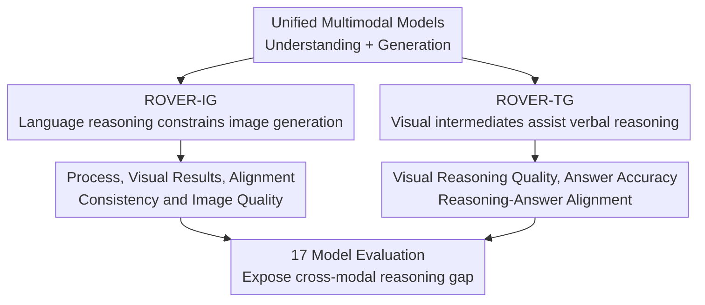

# ROVER: Benchmarking Reciprocal Cross-Modal Reasoning for Omnimodal Generation

**Conference**: ICLR 2026  
**OpenReview**: [https://openreview.net/forum?id=gu3DRaDWiI](https://openreview.net/forum?id=gu3DRaDWiI)  
**Paper**: https://roverbench.github.io  
**Code**: Not confirmed in cache  
**Area**: Multimodal VLM / Cross-modal reasoning evaluation / Omnimodal generation  
**Keywords**: Cross-modal reasoning, Unified Multimodal Models, Image generation evaluation, Visual intermediate reasoning, VLM-as-Judge  

## TL;DR
ROVER proposes a reciprocal cross-modal reasoning benchmark for unified multimodal models, utilizing 1,312 tasks and 1,876 images to simultaneously examine whether "linguistic reasoning can constrain image generation" and whether "visual intermediate results can assist verbal reasoning." The study finds that current models show gains in concrete physical visual reasoning but still significantly fail in the visualization of abstract symbols.

## Background & Motivation
**Background**: Unified Multimodal Models (UMMs) are integrating image understanding, text understanding, text generation, and image generation into a single model interface. Ideally, such models should not only be able to "see images, speak, and draw" but also switch back and forth between modalities: using verbal reasoning to plan image changes, using intermediate visual states to help answer questions, and aligning both into a verifiable reasoning process.

**Limitations of Prior Work**: Most existing evaluations separate these capabilities. VQA or multimodal understanding benchmarks primarily assess whether models can derive verbal answers from images; image generation and editing benchmarks focus on whether the output image adheres to instructions and preserves original structures. This misses a critical question: when a task requires the "reasoning process" and "generation result" to support each other, is the model performing cross-modal reasoning or simply wrapping one unimodal capability outside another task?

**Key Challenge**: The selling point of unified models is the shared internal representation of understanding and generation, yet evaluations often only verify unidirectional capabilities. Verbal metrics fail to see if the image truly embodies the reasoning chain, and image metrics cannot judge if the model generated results based on correct causal, spatial, temporal, or mathematical logic. Especially in omnimodal generation scenarios, a visually appealing image might be based on entirely flawed reasoning, and a seemingly fluent verbal answer might not have truly utilized the generated visual intermediates.

**Goal**: The authors aim to advance evaluation targets from "unimodal output quality" to "mutually verified cross-modal reasoning quality." Specifically, ROVER seeks to answer two questions: first, given an image and complex verbal constraints, can the model first perform linguistic reasoning and then implement that reasoning into the correct image; second, faced with problem-solving tasks, can the model generate useful visual intermediate representations that truly enhance the final verbal answer?

**Key Insight**: The paper defines this capability as reciprocal cross-modal reasoning—where one modality is used to guide, verify, or correct the output of another. This perspective is closer to the core promise of UMMs than simple "understanding" or "generation" because it requires that the model's internal text and visual pathways do not just coexist in parallel but provide evidentiary support for one each other.

**Core Idea**: ROVER utilizes a system of human-annotated, verifiable bidirectional tasks to place "language-assisted image generation" and "vision-assisted text generation" under the same benchmark, using three types of metrics—process, result, and alignment—to judge whether unified multimodal models truly possess cross-modal reasoning capabilities.

## Method

### Overall Architecture
ROVER is essentially a benchmark suite rather than a new model, designed for omnimodal generation. It decomposes reciprocal cross-modal reasoning into two complementary directions: ROVER-IG evaluates verbally-augmented reasoning for visual generation, requiring models to guide image generation with a linguistic reasoning chain; ROVER-TG evaluates visually-augmented reasoning for verbal generation, requiring models to generate visual intermediate processes to assist final verbal answers.

The design logic involves defining task taxonomies, constructing instances with reference information and verification targets, and finally evaluating both the process and output using an automated VLM judge with expert calibration. The emphasis is not merely on increasing task volume but on ensuring each instance questions "why the model generated/answered this way" and "whether this reasoning is consistent with the final product."

ROVER-IG contains 908 visual generation tasks involving 1,009 images. Each task typically provides an input image, verbal instructions, a target description, and domain-specific keywords; some tasks also provide target reference images. It covers four domains—natural sciences, culture & arts, common sense, and logic/math—split into seven reasoning sub-tasks: temporal, spatial, causal, imaginative, quantitative, puzzle, and geometric.

ROVER-TG contains 404 verbal generation tasks for problem-solving requiring visual intermediate steps. It covers three scenarios: physical world modeling, logic & math, and visual perception, with six sub-tasks including robot manipulation trajectories, physical state changes, geometric auxiliary lines, jigsaw puzzles, and multi-view understanding. Here, "generated images" are not decorative but are designed as a part of the reasoning process.

### Key Designs
**1. Bidirectional Evaluation: Splitting cross-modal reasoning into mirror task types**

The most significant design of ROVER is the simultaneous inclusion of "text guiding vision" and "vision assisting text." ROVER-IG focuses on the direction from linguistic reasoning to visual generation: models must understand input images and verbal constraints—e.g., "what happens to an object after 3 seconds," "generate a realistic landscape from the red map pin position," or "label an answer following geometric constraints"—and then generate images that embody the reasoning conclusion. Models cannot simply perform stylistic editing, as correctness stems from temporal, spatial, causal, quantitative, or geometric relationships.

ROVER-TG conversely investigates the direction from visual generation to verbal answers. Models must generate intermediate visual representations before answering, such as robot arm trajectories, intermediate frames of a physical process, auxiliary diagrams for geometry problems, puzzle completions, or multi-view syntheses. This setup is crucial: if the generated visual intermediates are merely aesthetic but do not support problem-solving, the final answer will not improve; if they are incorrect, they may even mislead the verbal reasoning.

**2. Verifiable Instance Design: Binding each instance to inputs, process targets, and output targets**

Standard image generation evaluations often only ask "if the image looks like the prompt," but ROVER needs to assess if the reasoning holds. Therefore, each ROVER-IG instance contains not just a prompt, but also a target description, domain-specific keywords, and optional reference images. The target description informs the evaluator of specific visual changes required, and keywords constrain reasoning to use certain domain concepts, such as oxidation, diffusion, perspective, numerical change, or geometric relations.

ROVER-TG instances also emphasize that "visual intermediates must be useful." Data is sourced from robotics, physical simulations, logic puzzles, and perception tasks. Samples include context images, progressive reasoning steps, and verified answers. The appendix notes that over 1,000 logic task candidates with ground-truth visual CoT were collected, with a sanity check performed by GPT-5 to filter for cases where visual CoT significantly impacts prediction; physical and perception tasks use robot videos, simulation rollouts, or puzzle targets as visual evidence.

**3. Multi-dimensional Evaluation Protocol: Assessing reasoning, quality, and alignment separately**

ROVER evaluation does not collapse all aspects into a single "correctness" score. ROVER-IG uses five dimensions: Reasoning Process (RP) evaluates the logical structure, domain knowledge, and completeness of verbal reasoning; Reasoning Visual (RV) evaluates whether the final image embodies target descriptions and correct reasoning principles; Reasoning Alignment (Align.) evaluates consistency between verbal reasoning and image results; Visual Consistency (VC) checks if non-target elements were unnecessarily altered; and Image Quality (IQ) evaluates technical quality and visual coherence.

ROVER-TG uses three dimensions: Interleaved Reasoning Quality (IR) evaluates if intermediate visual representations are physically/logically correct and helpful; Final Answer Accuracy (Acc.) evaluates if the final answer matches ground truth; and Reasoning-Answer Alignment (Align.) evaluates if the generated images truly drove the correct answer. This set of metrics separates "generating an image" from "the image being helpful for reasoning," identifying cases where visual intermediates look reasonable but actually mislead the answer.

Scoring is performed automatically by GPT-4.1 acting as a VLM judge, normalized from 1-5 to 0-100. Rubric cards, reference assets, and task-specific instructions are provided to the judge. Consistency was validated against 8 experts across 10 UMMs and 1,000 instances. The appendix reports that GPT-4.1 correlates strongly with experts on RV, VC, and IQ in ROVER-IG; while errors are higher in reasoning dimensions, they remain acceptable. Interleaved Reasoning (IR) and Alignment in ROVER-TG also showed high reliability.

**4. Comparative Analysis: Distinguishing internal cross-modal reasoning from external cascaded prompt optimization**

The paper goes beyond leaderboards by comparing unified models, image editing models, language models, and cascaded systems. A key comparison is BAGEL / BAGEL-Think versus FLUX / FLUX+GPT. While external GPT-4o can rewrite prompts to improve image editing metrics, it cannot substitute for the internal visual-linguistic synergy of unified models in tasks requiring reciprocal cross-modal reasoning.

This design helps rule out a common explanation: that one simply needs better verbal reasoning fed into a strong image model. ROVER results show otherwise. Cross-modal reasoning requires the model to place linguistic constraints, visual inputs, and visual outputs in the same closed loop during generation, rather than having a language model generate an explanation that a separate image model executes mechanically.

### Example Scenario
In a temporal/causal task in ROVER-IG, the input might be a bouquet of fresh tulips with a prompt to "show their state after a week of neglect." A correct model must first explain in verbal reasoning the loss of moisture, the stems losing support, and leaves/petals turning yellow or drooping, then implement these changes in the image: the flowers should not just have a filter applied but should show evidence of wilting, curling, and darkening consistent with biological processes.

In a ROVER-TG geometry problem, the model might need to generate a geometric diagram with auxiliary lines before providing a numerical answer based on similar triangles or circle theorems. If the visual intermediate fails to draw the key altitude or auxiliary line, the verbal answer often becomes a blind guess. Failure cases in the paper show that while current models can be helped by "directly drawing changes" in physical/perceptional tasks, they often fail to correctly visualize abstract relationships in symbolic tasks like geometry and puzzles.

## Key Experimental Results

### Main Results
The paper evaluates 17 unified multimodal models and baselines, including closed-source models Nano Banana, Gemini 2.0 Flash, and GPT-5; open-source unified models BAGEL-Think, BAGEL, UniCoT, BLIP3o-NEXT, Ovis-U1, and OmniGen2; and image editing models like Qwen-Image-Edit, FLUX.1 Kontext, UltraEdit, VAREdit, and Step1X-Edit.

ROVER-IG results indicate that closed-source unified models significantly lead in reasoning process, alignment, and visual results. Nano Banana achieved Overall RP / Align. / RV scores of 67.0 / 82.3 / 73.2, respectively; Gemini 2.0 Flash followed with 64.8 / 78.6 / 62.3; and GPT-5 reached 64.2 / 76.4 / 63.7. In comparison, BAGEL-Think scored 54.3 / 64.4 / 52.7, while the standard BAGEL only reported an RV of 40.5.

| Setting | Representative Model | Overall RP | Overall Align. | Overall RV / Acc. | Main Implication |
|------|----------|------------|----------------|-------------------|----------|
| ROVER-IG Closed UMM | Nano Banana | 67.0 | 82.3 | 73.2 RV | Strongest reasoning chain, visual results, and alignment |
| ROVER-IG Closed UMM | GPT-5 | 64.2 | 76.4 | 63.7 RV | Strong verbal reasoning, but weak logical/math image generation |
| ROVER-IG Open UMM | BAGEL-Think | 54.3 | 64.4 | 52.7 RV | "Think" mechanism helps, but large gap remains vs closed models |
| ROVER-IG Open UMM | BAGEL | - | - | 40.5 RV | Significant drop in visual results without explicit reasoning |
| ROVER-TG Closed UMM | Nano Banana | 38.8 IR | 60.0 Align. | 43.6 Acc. | Highest visual intermediate quality, though absolute value remains low |
| ROVER-TG Closed UMM | GPT-5 | 36.2 IR | 60.9 Align. | 43.4 Acc. | Visual assistance provides very marginal gains |
| ROVER-TG Open UMM | BAGEL-Think | 21.4 IR | 38.6 Align. | 28.4 Acc. | Intermediate visual quality limits final answer accuracy |

ROVER-TG results are more striking. Even the best model, Nano Banana, only reached an overall IR of 38.8 and Accuracy of 43.6; GPT-5 scored 36.2 and 43.4. Compared to text-only reasoning, visual augmentation usually provides small gains in world modeling and visual perception but inconsistent benefits in logic/math, sometimes offering zero gain.

Image editing models also lag significantly behind unified models on ROVER-IG. For Overall RV, Nano Banana, GPT-5, and Gemini 2.0 Flash reached 79.6, 74.9, and 72.1 respectively, while Qwen-Image-Edit, FLUX.1 Kontext, UltraEdit, VAREdit, and Step1X-Edit v1.1 scored between 34.6 and 47.1. This demonstrates that ROVER measures reasoning-driven visual generation rather than simple editing fidelity.

### Ablation Study
The paper lacks traditional training ablations as it is a benchmark; instead, it provides controlled analyses of reasoning modes, model types, and visual intermediates. Comparing BAGEL and BAGEL-Think shows that explicit thinking mechanisms significantly improve performance on ROVER, with visual consistency improving by approximately 11.9%. Conversely, external cascades like FLUX+GPT show minor CLIP-T improvements on EditWorld but decrease visual consistency and image quality on ROVER, proving that text prompt optimization cannot replace the cross-modal loop.

| Analysis Item | Controlled Setting | Observation | Explanation |
|--------|----------|----------|------|
| Explicit Thinking | BAGEL vs BAGEL-Think | Think version is stronger; VC improves ~11.9% | Coupling internal reasoning with generation improves reasoning-dependent output |
| External Cascading | FLUX vs FLUX+GPT | Gains on EditWorld; VC/IQ drop on ROVER | Text optimization cannot replace internal cross-modal closed loops |
| Visual Intermediate Utility | VLM w/o vs w/ UMM visual rationale | World models +3.5%, Perception +3.8%, Logic -1.4% | Quality of visual intermediate determines if it is evidence or noise |
| Reasoning Type Correlation | Temporal, Spat., Causal, Quant., Geom., Puzzle | Physical reasoning correlates; abstract vs. physical is weak | Concrete visual changes and symbolic visualization may rely on different abilities |

### Key Findings
- In ROVER-IG, cross-modal reasoning quality and final image quality are highly correlated. Closed-source models outperform open-source models by ~38% in reasoning, ~31% in alignment, which translates to a ~39% gap in visual generation.
- Models supporting interleaved image-text generation significantly outperform single-turn or single-modality models. Open-source models with interleaved capability show ~38.1% higher RV than non-interleaved ones.
- ROVER-TG reveals that "bad visual reasoning is worse than no visual reasoning." When intermediate images represent physical states or perceptual completions, answers improve; when tasks require converting symbolic logic to graphical structures, incorrect images mislead the final answer.
- Models are relatively stable in concrete reasoning (temporal, spatial, causal) but weaker in abstract/mathematical reasoning. Correlation analysis suggests physical reasoning types are highly related, while abstract reasoning is not naturally acquired by simply scaling visual generation capabilities.

## Highlights & Insights
- The value of ROVER lies in decomposing "generation quality" into an interpretable cross-modal chain. It doesn't just ask if the image looks good; it asks if the reasoning is correct, if the image embodies it, and if they are consistent—offering more diagnostic power for unified models than aesthetic or VQA scores.
- The paper identifies a blind spot in UMM evaluation: coexistence of understanding and generation does not imply reciprocal reasoning. ROVER proves through bidirectional tasks that the true difficulty is making one modality serve as evidence for another.
- Findings in ROVER-TG are particularly noteworthy: visual intermediates are not inherently beneficial. For the physical world and perception, drawing provides extra evidence; for geometry and symbolic logic, if the model cannot construct correct symbolic diagrams, visual CoT becomes high-confidence noise.
- For future training, this paper suggests a clear direction: improving aesthetics or text CoT fluency is insufficient. Training data and reward signals must explicitly constrain consistency between "Reasoning Process — Visual Intermediate — Final Output."

## Limitations & Future Work
- ROVER relies on GPT-4.1 as an automated judge. Despite expert calibration, complex reasoning dimensions may still be affected by VLM judge hallucinations, preferences, and rubric interpretation differences. Process-based metrics like RP and IR remain difficult to fully equate with human expert review.
- With 1,312 tasks, the benchmark is high-quality but still small for large-scale statistical analysis or intensive training. It does not yet fully cover diverse cultures, specialized domain knowledge, long-horizon multi-step interactions, or video/audio modalities.
- ROVER focuses on text and images for "omnimodal generation." Audio, video, 3D, and action control modalities have not yet entered the core evaluation loop. Future omnimodal intelligence evaluation will need to expand reciprocal reasoning to these output forms.
- The evaluation currently reveals capability gaps rather than training solutions. Future work could build preference data, process supervision data, or RL rewards based on ROVER to teach models when to generate visual intermediates and how to verify them.

## Related Work & Insights
- **vs ReasonPix2Pix / ReasonEdit / KRIS-Bench**: These works focus on reasoning-guided image editing or editing quality, emphasizing instruction following and output. ROVER differs by assessing the reasoning process, generation result, and their alignment together, additionally checking if visual intermediates aid verbal answers.
- **vs RISEBench / WorldGenBench**: These benchmarks focus on visual plausibility or world knowledge-driven generation. ROVER emphasizes reciprocal reasoning, requiring one modality to play a verifiable role in the output of another, rather than relying on similarity or simple plausibility.
- **vs Unified-Bench / MetaQuery**: These assess whether unified capabilities coexist or transfer. ROVER acts as a diagnostic tool, checking if understanding, reasoning, and generation form a closed loop, thereby distinguishing "interface unification" from "true reasoning unification."
- **Insight**: Future multimodal evaluation should adopt process-auditable task designs. A useful benchmark should not just provide a leaderboard but answer where a model fails: logic, visualization, alignment, or incorrectly trusting its own generated intermediate images.

## Rating
- Novelty: ⭐⭐⭐⭐⭐ Systematizing reciprocal cross-modal reasoning into a bidirectional benchmark clearly addresses the core blind spot of UMMs.
- Experimental Thoroughness: ⭐⭐⭐⭐ Covers 17 models, 23 task types, and comparative analyses with expert-calibrated judges; limited only by task scale and modality coverage.
- Writing Quality: ⭐⭐⭐⭐ Structure is clear, and figures support conclusions; however, evaluation prompts in the appendix are lengthy and results require cross-referencing between tables.
- Value: ⭐⭐⭐⭐⭐ Directly contributes to the development of UMMs, interleaved reasoning, visual CoT, and reasoning-driven generation, serving as an excellent diagnostic baseline.

<!-- RELATED:START -->

## Related Papers

- [\[ICLR 2026\] Evaluating Cross-Modal Reasoning Ability and Problem Characteristics with Multimodal Item Response Theory](evaluating_cross-modal_reasoning_ability_and_problem_characteristics_with_multim.md)
- [\[CVPR 2026\] CRIT: Graph-Based Automatic Data Synthesis to Enhance Cross-Modal Multi-Hop Reasoning](../../CVPR2026/vlm_reasoning/crit_graph-based_automatic_data_synthesis_to_enhance_cross-modal_multi-hop_reaso.md)
- [\[ACL 2025\] FCMR: Robust Evaluation of Financial Cross-Modal Multi-Hop Reasoning](../../ACL2025/vlm_reasoning/fcmr_robust_evaluation_of_financial_cross-modal_multi-hop_reasoning.md)
- [\[CVPR 2026\] CogniVerse: Revolutionizing Multi-Modal Retrieval-Augmented Generation with Cognitive Reflection and Geometric Reasoning](../../CVPR2026/vlm_reasoning/cogniverse_revolutionizing_multi-modal_retrieval-augmented_generation_with_cogni.md)
- [\[ICLR 2026\] Synergizing Understanding and Generation with Interleaved Analyzing-Drafting Thinking](synergizing_understanding_and_generation_with_interleaved_analyzing-drafting_thi.md)

<!-- RELATED:END -->
