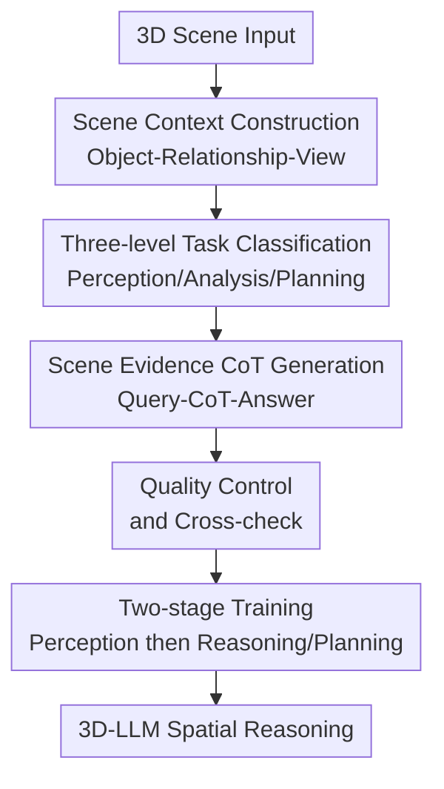

# SCoT: Teaching 3D-LLMs to Think Spatially with Million-scale CoT Annotations

**Conference**: ICLR 2026  
**OpenReview**: [https://openreview.net/forum?id=5Tph6wFMOm](https://openreview.net/forum?id=5Tph6wFMOm)  
**Code**: https://github.com/WHU-USI3DV/SCoT  
**Area**: VLM Reasoning / 3D-LLM Spatial Reasoning  
**Keywords**: 3D-LLM, Spatial Reasoning, Chain-of-Thought, Scene Understanding, Embodied Planning  

## TL;DR
SCoT constructs a 1.1 million-scale 3D scene Chain-of-Thought dataset, categorizing tasks into three levels: perception, analysis, and planning. By constraining the reasoning chain with scene evidence markers (`<SI>`), it makes 3D-LLMs more interpretable and faithful in complex spatial analysis and planning, while also cautioning that CoT should not be overused for simple perception tasks.

## Background & Motivation
**Background**: The goal of 3D-LLMs is to enable language models to understand 3D environments, allowing them to answer questions about real-world scenes, localize objects, explain layouts, and plan actions. Most prior training sets convert 3D scenes into QA, description, or grounding samples, training the model to learn "question-to-answer" mappings. While some recent 3D-VL datasets have expanded to multi-task and larger scales, supervision signals remain primarily focused on the final answer.

**Limitations of Prior Work**: Training methods that provide only the final answer turn models into black boxes that are difficult to inspect. Particularly in scenarios like robotics, embodied AI, and indoor navigation, users need to know not just "the answer," but also which objects, spatial relationships, and scene constraints the model relied upon. If a model guesses a plausible answer based on linguistic priors without genuinely referencing 3D evidence, such answers are unreliable in real-world environments.

**Key Challenge**: While Chain-of-Thought (CoT) often enhances reasoning transparency in text and 2D multi-modal tasks, directly transferring it to 3D scenes is not straightforward. Simple perception problems only require identifying colors, counts, or positions; forcing the model into long reasoning chains may cause linguistic priors to override visual evidence. Conversely, complex spatial analysis and planning do require explicit reasoning chains, otherwise, models struggle to explain "why this layout is suitable for a meeting" or "whether a task can be completed from the current position." Therefore, the key is not "whether to use CoT," but "which tasks require CoT, and how to bind CoT to scene facts."

**Goal**: The authors aim to solve three sub-problems: first, establishing a task hierarchy capable of distinguishing 3D task complexity; second, constructing large-scale, scene-grounded Query-CoT-Answer data for tasks requiring reasoning; and third, verifying whether such supervision truly improves the analysis, planning, interpretability, and generalization of 3D-LLMs while avoiding side effects on simple perception tasks.

**Key Insight**: The paper observes that the credibility of 3D reasoning comes from verifiable scene evidence. Instead of merely asking the model to "speak its thinking process," the authors require the reasoning chain to explicitly insert `<SI>` tags when utilizing object attributes, relative positions, distances, or layouts, ensuring every reasoning step has a corresponding scene source.

**Core Idea**: Replace indiscriminate QA supervision with a "Task Hierarchy + Scene Evidence-Marked CoT" approach. This ensures 3D-LLMs answer directly when they should just "look" and reason step-by-step through verifiable 3D evidence when reasoning is required.

## Method
### Overall Architecture
The SCoT pipeline can be viewed as a workflow from "3D scene structuring" to "reasoning-supervised training." The authors first decompose ScanNet scenes into objects, relationships, BEV maps, and local/global visual evidence. This scene context then drives a VLM to generate questions, reasoning chains, and answers. Subsequently, samples are filtered through `<SI>` checks, multi-model cross-checking, and manual inspection. Finally, multiple 3D-LLMs are trained using this data, and a unified model, SCoT-Reasoner, is proposed to support point clouds, video frames, and text inputs.

The contribution of this paper is not a single network layer but a consistent system linking data construction, reasoning annotation, and training strategy. The task hierarchy determines which samples receive CoT, the `<SI>` tag ensures CoT cites scene facts, quality control ensures these citations are credible, and the training phases separate simple perception from complex reasoning to prevent "overthinking" every question.

### Key Designs
**1. Three-level Spatial Task System: Applying CoT where reasoning is truly needed**

SCoT divides 3D tasks into Spatial Perception, Spatial Analysis, and Spatial Planning. Spatial Perception answers "what is there," covering object attributes, relationships, scene properties, and explicit visual grounding; most of these require direct observation, so "answer-only" supervision is used in the main training setup. Spatial Analysis answers "what this means," such as judging functionality from layout, calculating distance from coordinates, or finding objects from implicit descriptions; these require combining visual facts, spatial geometry, and common sense, thus CoT is included. Spatial Planning answers "what should be done," requiring models to generate executable steps from scene constraints, such as determining if a seat is available or how to complete a cleaning task; CoT is mandatory here as well.

This classification is valuable because it controls the form of supervision based on task complexity. A key experiment in the paper shows that adding CoT to simple perception tasks causes performance to drop on several metrics for SCoT-Reasoner (e.g., ScanRefer Acc@0.50 drops from 53.4 to 51.3, SQA3D EM drops from 55.8 to 47.4). Thus, CoT is not a "free" interpretability enhancer; in 3D scenes, incorrect reasoning steps create extra hallucinations. The three-level system uses task complexity to decide between "direct looking" and "reasoning first."

**2. Scene Context Construction: Compressing point clouds, relationships, and views into VLM-consumable evidence**

To ensure VLM-generated CoT is not just linguistically coherent but grounded, SCoT builds a rich multi-modality scene context for each 3D scene. Specifically, the scene is segmented into object proposals, each with a bounding box, semantic label, and center coordinates. These objects form a scene graph where edges represent spatial relationships like proximity, support, and relative orientation. Simultaneously, the authors generate BEV maps with object IDs and boxes, alongside local object crops and global scene images as supplementary visual evidence.

This information is serialized into structured text, such as "Object-3 is a chair, coordinates $(0.2, 0.4, 0.5)$, located $0.8$m to the left of Object-1 desk." This provides the data generation model with a clear information boundary: it can reference color, size, orientation, distance, layout, and functional cues, but these cues must come from the given scene rather than generic guesses about "what kitchens usually have." For the 3D-LLM, this transforms sparse, hard-to-read point clouds into a data format more suitable for linguistic reasoning.

**3. `<SI>` Scene Evidence Markers: Turning CoT from "plausible" to "traceable"**

The biggest issue with standard CoTs is that they might produce beautiful but unfaithful explanations. SCoT requires that whenever scene information is used in a reasoning chain, an `<SI>` tag must be inserted before the corresponding sentence, e.g., "`<SI>` The table width is $0.8$m, so it cannot accommodate six chairs." This design serves two purposes: during generation, it forces the VLM to clarify which reasoning stems from scene evidence; during filtering, it provides checkable anchors—samples lacking `<SI>` or with incorrect `<SI>` usage can be discarded.

This design is particularly suited for 3D scenes where conclusions often depend on a combination of spatial evidence: implicit detection might require mapping "dark rectangle, used for viewing content, placed near a circular surface light source" to a monitor; relationship analysis might require calculating Euclidean distances; and planning must simultaneously consider current position, clearance, and object usability. `<SI>` is not a simple formatting ornament but a mechanism to bind "reasoning steps" to "scene facts," making the final answer easier for developers and users to verify.

**4. Data Quality and Training Separation: Avoiding reasoning-supervision backlash via strict filtering and two-stage learning**

While the generation process is performed by a VLM, the authors do not trust the output blindly. In addition to `<SI>` checks, the paper utilizes three independent agents (ChatGPT-4.1, Qwen, and DeepSeek) for cross-checking. If any model identifies unclear problems, misleading CoT, ambiguous answers, or contradictions with scene facts, the sample is removed. Manual inspection of 50 random samples per task (500 total) showed 447 were correct, yielding a manual acceptance rate of approximately 90%.

Regarding training, the model first learns perception samples to establish basic grounding of object attributes, relationships, and scene structures. The second stage then introduces analysis and planning samples to generate explicit reasoning chains supported by scene evidence. This two-stage training aligns with the task hierarchy: stabilizing basic perception before expanding into complex reasoning. Otherwise, the model might start fabricating long explanatory chains before it has even mastered basic colors, counts, or localization, making the answers less reliable.

### Loss & Training
The paper does not place its core contribution on a new loss function but uses supervised fine-tuning to compare the "Full SCoT Setting" against the "Answer-Only Setting." The Full SCoT Setting uses complete answers and structured CoT sequences, where analysis and planning samples include reasoning chains with `<SI>` tags. The Answer-Only Setting removes CoT and keeps only the final answer to ablate the contribution of reasoning supervision.

SCoT-Reasoner is based on Vicuna-7B v1.5, adding scene tokens and image tokens while supporting up to 200 objects. 3D object proposals are obtained via Mask3D, and object-level 3D features are encoded with Uni3D. 2D proposals in video frames are extracted by DEVA and encoded with DINOv2. Subsequently, an Object-Relationship-Scene refinement module fuses object centers, 3D offsets, and adjacency relationships through a spatial graph and Graph Transformer, resulting in a representation containing object, relationship, and scene cues, which is then projected into the LLM embedding space.

For training details, the authors use LoRA to fine-tune attention projection and feed-forward components with a rank of 64, $\alpha=16$, and a dropout of 0.05. The optimizer is AdamW with a learning rate of $5 \times 10^{-3}$, weight decay of 0.02, and a warm-up over the first 10% of epochs. The two training stages take approximately 6 hours and 28 hours respectively on a single NVIDIA A100.

## Key Experimental Results

### Main Results
The main experiments focus on whether simple perception should use CoT, whether complex analysis/planning benefits from CoT, and whether this reasoning supervision generalizes to new queries and scenes. The immediate conclusion is: CoT is harmful for perception tasks, but significantly enhances explainability, faithfulness, and trustworthiness in analysis and planning tasks.

| Task / Metric | Answer-only | Full SCoT / CoT | Change | Note |
|--------|------|------|------|------|
| ScanRefer Acc@0.50 | 53.4 | 51.3 | -2.1 | Forced reasoning in simple grounding introduces extra errors |
| Multi3DRefer F1@0.50 | 55.7 | 49.3 | -6.4 | Multi-target perception is also disrupted by CoT |
| ScanQA CIDEr | 87.9 | 73.4 | -14.5 | Simple QA is more suitable for direct supervision |
| SQA3D EM | 55.8 | 47.4 | -8.4 | Position-related short answers do not need long chains |

| Model / Task | Metric | Answer-only | CoT | Gain |
|--------|------|------|------|------|
| SCoT-Reasoner / Object Analysis | Faithfulness | 5.59 | 6.15 | +0.56 |
| SCoT-Reasoner / Relationship Analysis | Trustworthiness | 4.23 | 5.41 | +1.18 |
| SCoT-Reasoner / Scene Analysis | ROUGE-L | 22.59 | 23.48 | +0.89 |
| SCoT-Reasoner / Situated Planning | Explainability | 6.64 | 7.38 | +0.74 |
| SCoT-Reasoner / Un-situated Planning | Faithfulness | 6.93 | 7.29 | +0.36 |

Overall, text similarity improvements are not always massive; for instance, ROUGE-L in analysis tasks improves by about 0.74% on average. However, comprehensive metrics highlight the value of CoT: in analysis and planning, CoT brings an average improvement of 6.21% in explainability, 11.74% in faithfulness, and 10.02% in trustworthiness. This indicates that while CoT may not make the text look more like the reference answer, it makes the answers more structured and closer to the scene evidence.

### Ablation Study
The paper also examines which level of `<SI>` information is most critical. The authors separately removed object-level and scene-level information within the `<SI>` tags for analysis and planning tasks.

| Task Config | ROUGE-L | METEOR | Explainability | Faithfulness | Trustworthiness | Inference Time |
|------|---------|--------|----------------|--------------|-----------------|----------|
| Object Analysis / No CoT | 27.34 | 15.62 | 6.67 | 5.59 | 5.89 | 6.51s |
| Object Analysis / w.o. Obj. in CoT | 26.85 | 15.34 | 6.43 | 5.37 | 5.72 | 11.71s |
| Object Analysis / Full CoT | 27.22 | 16.17 | 7.04 | 6.15 | 6.41 | 15.98s |
| Scene Analysis / No CoT | 22.59 | 14.68 | 7.82 | 7.32 | 7.45 | 5.08s |
| Scene Analysis / w.o. Sce. in CoT | 22.50 | 14.37 | 7.67 | 7.40 | 7.37 | 10.26s |
| Scene Analysis / Full CoT | 23.48 | 15.29 | 7.95 | 7.55 | 7.68 | 13.30s |
| Situated Planning / No CoT | 24.21 | 12.37 | 6.64 | 6.09 | 6.30 | 6.42s |
| Situated Planning / Full CoT | 25.13 | 13.06 | 7.38 | 6.94 | 7.14 | 13.95s |

Another compelling result comes from implicit detection, where queries use functions or roles rather than object names. Transitioning from "answer-only" to "CoT," SCoT-Reasoner's Acc@0.25 rose from 8.6 to 32.2. This task essentially requires "understanding descriptions → finding scene evidence → inferring identity," which perfectly matches SCoT's core design.

### Key Findings
- CoT is not monotonically beneficial for 3D tasks: for simple perception, long reasoning amplifies linguistic priors and hallucinations; for analysis and planning, explicit reasoning chains significantly improve explainability, faithfulness, and trustworthiness.
- The hierarchy of `<SI>` matters: object-level reasoning is critical for object analysis, while scene-level reasoning is more vital for scene analysis and planning. This suggests models must reference scene evidence at different granularities depending on the task.
- Generalization results show SCoT isn't just memorizing ScanNet templates: On MSQA-ScanNet, SCoT-Reasoner achieved a zero-shot score of 54.4, surpassing GPT-4o's 52.3; on MSQA-ARKitScenes, it scored 41.2, slightly higher than GPT-4o (41.0) and Qwen-VL (39.7).
- Compared to 3D-R1, Chat Scene trained with SCoT scored 47.6 on MSQA-ScanNet, higher than the 43.1 of 3D-R1 training. Notably, it scored 14.6 points higher in the Navigation category, proving that larger-scale, more granular task hierarchies yield more transferable spatial reasoning.
- The cost is realistic: Full CoT inference time typically increases to 2.0x–3.2x. Therefore, it is better suited for offline planning or high-stakes decisions rather than all real-time robotic tasks.

## Highlights & Insights
- The most significant insight is that "thinking less can sometimes be more accurate." Many CoT papers assume longer reasoning equals stronger capability, but SCoT proves that simple visible facts do not need explanatory chains. For 3D-LLMs, learning when to stop reasoning is as important as learning how to reason.
- The `<SI>` tag is a practical data engineering design. It requires no structural changes to the LLM but converts every scene assertion into a checkable object, which is invaluable for building credible datasets, debugging robot failures, and auditing hallucinations.
- The three-level task system clarifies 3D-LLM capabilities: perception is grounding, analysis is interpretation, and planning is action. This framework can transfer to other embodied datasets; for instance, outdoor driving could map to "identifying participants," "inferring risk," and "deciding maneuvers."
- The paper integrates the dataset, training model, and evaluation metrics into a logical closed loop. Beyond releasing 1.1M samples, it trains baselines, designs SCoT-Reasoner, and evaluates reasoning quality via explainability, faithfulness, and trustworthiness—metrics more relevant to spatial reasoning than simple text similarity.

## Limitations & Future Work
- Data is primarily based on ScanNet indoor scenes; real-world open environments, dynamic scenes, and outdoor/city-scale 3D scenes have not been fully verified. Robotic or autonomous driving applications would encounter significantly higher complexity and sensor noise.
- Data generation relies on VLM/LLM cross-checks. Despite `<SI>` and manual sampling, systematic biases may persist: the indoor common sense familiar to the generating models might skew the distribution, and rare layouts might be "normalized" by common sense.
- CoT significantly increases inference latency. The reported 2x+ time increase is a hard constraint for real-time robotics. Future work should explore task-adaptive reasoning: answering directly for simple tasks and triggering long reasoning only for complex ones.
- While `<SI>` provides traceability, it is not yet strict formal verification. An `<SI>` tag before a sentence doesn't guarantee the sentence is correctly bound to specific object IDs, coordinates, or view evidence. Future work could extend `<SI>` to explicit citations of object/relationship IDs or coordinate snippets.
- Evaluation metrics (explainability, etc.) are scored by LLMs. While averaged across multiple models, they still carry model preferences. Stronger automatic verifiers or human evaluation protocols would strengthen the conclusions.

## Related Work & Insights
- **vs 3D-LLM / Chat-3D / Chat Scene**: These focus on connecting 3D scenes to LLMs for dialogue. SCoT focuses on the training supervision itself, emphasizing the need for explicit, scene-grounded reasoning chains for complex tasks.
- **vs ScanRefer / ScanQA / SQA3D**: these provide basic grounding and QA supervision for perception. SCoT extends these to analysis and planning with Query-CoT-Answer annotations.
- **vs 3D-CoT**: 3D-CoT introduced reasoning for object-level QA, but SCoT covers a broader spectrum (perception/analysis/planning) and emphasizes when *not* to use CoT.
- **vs 3D-R1 / SpaceR**: These enhance spatial or multi-modal reasoning but are often limited by scale or transparency. SCoT's advantage lies in its 1.1M scale, three-level hierarchy, and `<SI>` evidence constraints.
- **Inspiration for Future Research**: To build the next generation of embodied agents, data should not just collect "whether an action succeeded" but the scene evidence chain of "why an action is/isn't feasible." SCoT provides a reusable template: define task complexity, decide on CoT annotation, and bind every step to verifiable evidence.

## Rating
- Novelty: ⭐⭐⭐⭐⭐ Not just adding CoT to 3D-QA, but proposing a combined framework of task hierarchy, scene evidence marking, and large-scale reasoning supervision.
- Experimental Thoroughness: ⭐⭐⭐⭐ Coverage of multiple baselines, hierarchies, generalizations, and ablations, though dynamic environments and human evaluation could be strengthened.
- Writing Quality: ⭐⭐⭐⭐ Clear main line and supporting charts; some appendix details are dense, and the engineering-heavy generation process requires careful reading.
- Value: ⭐⭐⭐⭐⭐ High direct value for 3D-LLM, embodied AI, and trustworthy spatial reasoning, especially the insight regarding selective CoT usage.

<!-- RELATED:START -->

## Related Papers

- [\[CVPR 2026\] Hear you are: Teaching LLMs Spatial Reasoning with Vision and Spatial Sound](../../CVPR2026/vlm_reasoning/hear_you_are_teaching_llms_spatial_reasoning_with_vision_and_spatial_sound.md)
- [\[CVPR 2026\] Think with 3D: Geometric Imagination Grounded Spatial Reasoning from Limited Views](../../CVPR2026/vlm_reasoning/think_with_3d_geometric_imagination_grounded_spatial_reasoning_from_limited_view.md)
- [\[CVPR 2026\] See, Think, Act: Teaching Multimodal Agents to Effectively Interact with GUI by Identifying Toggles](../../CVPR2026/vlm_reasoning/see_think_act_teaching_multimodal_agents_to_effectively_interact_with_gui_by_ide.md)
- [\[ICLR 2026\] Zebra-CoT: A Dataset for Interleaved Vision-Language Reasoning](zebra-cot_a_dataset_for_interleaved_vision-language_reasoning.md)
- [\[ICLR 2026\] Thyme: Think Beyond Images](thyme_think_beyond_images.md)

<!-- RELATED:END -->
