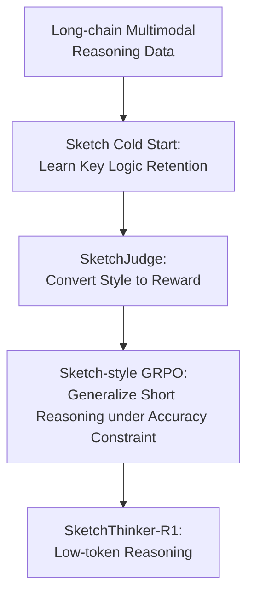

# SketchThinker-R1: Towards Efficient Sketch-Style Reasoning in Large Multimodal Models

**Conference**: ICLR 2026  
**OpenReview**: [https://openreview.net/forum?id=ZSMDuKtYbt](https://openreview.net/forum?id=ZSMDuKtYbt)  
**Code**: https://github.com/Ruiyang-061X/SketchThinker-R1  
**Area**: VLM Reasoning / Efficient Inference / Large Multimodal Models  
**Keywords**: Sketch-style reasoning, Multimodal reasoning, Reinforcement Learning, Inference efficiency, Reward model  

## TL;DR
SketchThinker-R1 introduces a three-stage pipeline—compressing long reasoning into sketches, training a SketchJudge reward model, and applying GRPO reinforcement learning—enabling Large Multimodal Models (LMMs) to significantly reduce intermediate reasoning tokens in visual question answering and logic/math/physics tasks while maintaining or improving accuracy.

## Background & Motivation
**Background**: LMMs are evolving along the R1/o1 trajectory, where models generate extensive reasoning processes before producing final answers. For tasks like geometry, visual logic, and physical commonsense, long-chain reasoning allows models to explicitly organize visual cues and problem conditions. Consequently, many LMM reasoning methods encourage models to "think more."

**Limitations of Prior Work**: Gains from long reasoning are not free. Longer reasoning chains increase token costs and response latency. More critically, verbose reasoning often introduces irrelevant clues, causing models to be misled by self-generated noise. For interactive multimodal applications, users often require models to capture key visual evidence and provide reliable answers quickly rather than providing long-winded explanations.

**Key Challenge**: This paper addresses the contradiction between reasoning capability and inference overhead. Direct truncation reduces thinking but often discards essential steps. Standard R1-style RL tends to induce increasingly longer explicit reasoning. The authors argue that the ideal goal is not simple shortening, but learning a "sketch-style reasoning" similar to a human scratchpad: retaining only the critical logical nodes that support the answer.

**Goal**: The target is to train a multimodal reasoning model that automatically generates concise and focused thinking processes: preserving key visual clues, essential calculations, or logical jumps while removing redundant explanations and repetitive confirmations, all while maintaining accuracy across multiple domains.

**Key Insight**: The entry point is straightforward: just as humans use a few core steps on scratch paper to solve problems, LMMs can be trained in this "sketch-style thinking" mode. The difficulty lies in the fact that prompt-based compression sacrifices accuracy, and simple length penalties lead models to omit necessary steps to minimize costs.

**Core Idea**: SketchThinker-R1 employs an explicit SketchJudge reward model to judge reasoning styles. By making "sketch-style rather than verbose" a part of the RL reward, the model internalizes a high-information-density multimodal reasoning method.

## Method

### Overall Architecture
SketchThinker-R1 is a training framework rather than a new decoding algorithm. Starting from existing long-chain multimodal reasoning data, it first constructs sketch-style data for cold-starting the base LMM. Then, it trains a SketchJudge model to distinguish between "sketch-style" and "verbose" reasoning. Finally, the cold-started LMM undergoes GRPO reinforcement learning, where accuracy, format, and SketchJudge style scores jointly shape the output.

The core of the process is separating "brevity" into two concepts: data compression during cold start (learning high-quality short reasoning) and style rewards during RL (generalizing critical logic preferences).

### Key Designs
**1. Sketch Cold Start: Turning "Writing Less" into a Learnable Style**

Directly applying RL to a base LMM to explore sketch-style reasoning is slow and yields limited token reduction. The model lacks a prior definition of "critical logic." If only accuracy rewards are provided, long reasoning remains an easier strategy to discover; if only length pressure is applied, essential clues are lost. Therefore, the authors first perform a Sketch-Mode Cold Start, converting long reasoning $T_{Long}$ from LLaVA-CoT-100K and Vision-R1-cold into sketch-style reasoning $T_{Sketch}$.

This conversion is performed by a strong LLM, requiring it to retain critical facts and logical order while removing irrelevant details and verbose explanations into a numbered list. These samples are used for Supervised Fine-Tuning (SFT) of base LMMs like Qwen2.5-VL-Instruct, optimizing the standard autoregressive objective $L_{SFT}=-\frac{1}{N}\sum_i\sum_t\log \pi_\theta(o_{i,t}\mid o_{i,<t},q_i)$. This step initializes the model's "reasoning format" toward high-density expression.

**2. SketchJudge: Transforming Reasoning Style into a Reward Signal**

SFT alone faces out-of-distribution issues: models might write short on cold-start data but fail to identify which steps are essential for new tasks. To address this, the SketchJudge Reward Model is trained. It takes a thinking process as input and outputs 1 (sketch-style) or 0 (verbose).

The training data comes from both versions of the cold-start samples ($T_{Long}$ as 0, $T_{Sketch}$ as 1). This allows the RL phase to avoid complex manual rules for "verbosity," delegating style judgment to a specialized model. The paper finds that SFT-based SketchJudge provides more reliable supervision and better accuracy/efficiency than zero-shot prompting of large LLMs.

**3. Sketch-style GRPO: Logical Constraints instead of Hard Truncation**

The final phase uses GRPO to fine-tune the LMM. For each question, a group of candidate responses is sampled, and the advantage $A_i=\frac{r_i-mean(\{r_1,\cdots,r_G\})}{std(\{r_1,\cdots,r_G\})}$ is calculated to update the policy. The reward design is critical:

$$
R_i = 0.5R_{accuracy}(o_i)+0.4R_{format}(o_i)+0.1R_{thinking\text{-}style}(o_i)
$$

$R_{thinking\text{-}style}$ is 1 if SketchJudge classifies the thinking as sketch-style, and 0 otherwise. This weight (0.1) is conservative; accuracy remains the primary driver. Ablations show that increasing the style reward further reduces tokens but triggers reward hacking, where the model sacrifices correctness for brevity.

**4. Multi-source Task Construction: Cross-domain Generalization**

SketchColdStart-20K samples 10K from two multimodal reasoning sources, while the SketchRL-1K phase uses questions from MMStar, MathVista, LogicVista, and SeePhys. This ensures the model encounters general visual understanding, math, logic, and physics tasks, preventing the "short reasoning" capability from overfitting to a single question type.

### Mechanism Example
Consider a geometry problem with an image. A Vanilla-R1 model might describe every point and line, repeatedly confirm conditions, and then solve. SketchThinker-R1 targets a scratchpad-like output:

1. Identify critical shapes and known values.  
2. Select relevant formulas or relationships.  
3. Substitute values.  
4. Derive the answer and match options.  

The model does not skip reasoning but skips low-information density content like "explaining why it sees a line" or "repeating every option."

### Loss & Training
Cold start and SketchJudge training use LLaMA-Factory. SketchThinker-R1-7B uses Qwen2.5-VL-7B-Instruct (3B version uses 3B-Instruct) with LoRA rank 8 and learning rate $1.0e^{-5}$. SketchJudge uses Qwen2.5-7B-Instruct as a backbone, trained on 40K samples.

RL uses Easy-R1 and GRPO with a max prompt/response length of 2048, KL coefficient 0.01, and learning rate $1.0e^{-6}$. The rollout group size is 5, with temperature 1.0, trained for 15 epochs. Dynamic reward weights (prioritizing style early, accuracy later) further improve performance on MMMU.

## Key Experimental Results

### Main Results
The paper evaluates accuracy, average reasoning tokens, and EoT ($Acc/N_{token}$) across MMMU, MathVision, VisuLogic, and PhyX.

| Model / Method | MMMU Acc. | MMMU #Token | MathVision Acc. | MathVision #Token | VisuLogic Acc. | PhyX Acc. | Conclusion |
|----------------|-----------|-------------|-----------------|-------------------|----------------|-----------|------------|
| Vanilla-R1-7B | 61.0 | 182.2 | 31.0 | 221.1 | 27.6 | 46.7 | Standard R1; effective but verbose |
| Constrained CoT | 58.6 | 78.2 | 26.2 | 79.2 | 26.4 | 42.4 | Direct length prompt hurts accuracy |
| Chain-of-Draft | 58.9 | 86.3 | 27.4 | 85.4 | 26.5 | 42.2 | Per-step compression loses info |
| C3oT | 59.3 | 127.1 | 28.8 | 125.5 | 27.1 | 43.8 | SFT-only short CoT is limited |
| SketchThinker-R1-7B | 62.8 | 64.3 | 31.7 | 65.5 | 27.8 | 48.6 | Highest accuracy with lowest tokens |

For the 7B model, SketchThinker-R1 significantly reduces tokens compared to Vanilla-R1 (MMMU: 182.2 to 64.3; MathVision: 221.1 to 65.5) while accuracy improves slightly. This represents a >64% reduction in reasoning cost without performance loss.

### Ablation Study
| Configuration | MMMU Acc. | #Token | EoT | Description |
|---------------|-----------|--------|-----|-------------|
| Sketch-Mode Cold Start Only | 61.4 | 114.5 | 0.536 | Initial sketch, limited generalization |
| Sketch-Thinking RL Only | 62.1 | 152.2 | 0.408 | Low exploration efficiency without SFT |
| Cold Start + RL | 62.8 | 64.3 | 0.977 | Optimal combination |
| Dynamic reward weight | 63.2 | 62.5 | 1.011 | Further boosts EoT |

### Key Findings
- **Complementary Stages**: Cold start provides the initial coordinate for sketch-style reasoning, while RL enables domain migration.
- **Style Reward Sensitivity**: A 0.1 weight is optimal. Increasing it to 0.4 reduces tokens but causes accuracy to drop, indicating reward hacking.
- **Explainability**: Human evaluators gave SketchThinker-R1 an explainability score of 4.25 (vs. 3.95 for Vanilla-R1), suggesting that concise "sketch" logic is more readable for humans.

## Highlights & Insights
- **Reframing Compression**: Shifts reasoning optimization from a length-penalty problem to a style-learning problem.
- **SketchJudge Utility**: Provides a specialized supervision signal that distinguishes "logical brevity" from "error-prone omission."
- **Low-Weight Style Reward**: Demonstrated that efficiency should not outweigh accuracy. The goal is to strip redundancy from correct reasoning.
- **Explainable Efficiency**: Concise reasoning is not just faster for machines but often clearer for users.

## Limitations & Future Work
- **Domain Scope**: Needs validation on longer context tasks like GUI agents or video reasoning.
- **Teacher Dependency**: The quality of sketch data relies on strong teacher LLMs.
- **Reward Granularity**: SketchJudge is binary; future work could explore process-level rewards (step-by-step necessity labeling).
- **Reasoning Analysis**: Needs deeper failure mode analysis (e.g., cases where extreme complexity necessitates verbose thinking).

## Related Work & Insights
- **vs. Vanilla-R1**: Moves beyond the "more thinking is better" default.
- **vs. Constrained CoT**: Achieves higher accuracy by internalizing the style through training rather than just prompting.
- **vs. L1/ThinkPrune**: Avoids the "leakage" of critical information caused by mechanical length penalties by rewarding structural critical logic.

## Rating
- Novelty: ⭐⭐⭐⭐☆
- Experimental Thoroughness: ⭐⭐⭐⭐☆
- Writing Quality: ⭐⭐⭐⭐☆
- Value: ⭐⭐⭐⭐⭐

<!-- RELATED:START -->

## Related Papers

- [\[ICLR 2026\] ReVisual-R1: Advancing Multimodal Reasoning from Optimized Cold Start to Staged Reinforcement Learning](revisual-r1_advancing_multimodal_reasoning_from_optimized_cold_start_to_staged_r.md)
- [\[ICLR 2026\] VisuLogic: A Benchmark for Evaluating Visual Reasoning Capabilities of Multimodal Large Models](visulogic_a_benchmark_for_evaluating_visual_reasoning_in_multi-modal_large_langu.md)
- [\[ICLR 2026\] Perception-R1: Advancing Multimodal Reasoning Capabilities of MLLMs via Visual Perception Reward](perception-r1_advancing_multimodal_reasoning_capabilities_of_mllms_via_visual_pe.md)
- [\[ICLR 2026\] ReWatch-R1: Boosting Complex Video Reasoning in Large Vision-Language Models through Agentic Data Synthesis](rewatch-r1_boosting_complex_video_reasoning_in_large_vision-language_models_thro.md)
- [\[NeurIPS 2025\] Retrv-R1: A Reasoning-Driven MLLM Framework for Universal and Efficient Multimodal Retrieval](../../NeurIPS2025/vlm_reasoning/retrv-r1_a_reasoning-driven_mllm_framework_for_universal_and_efficient_multimoda.md)

<!-- RELATED:END -->
