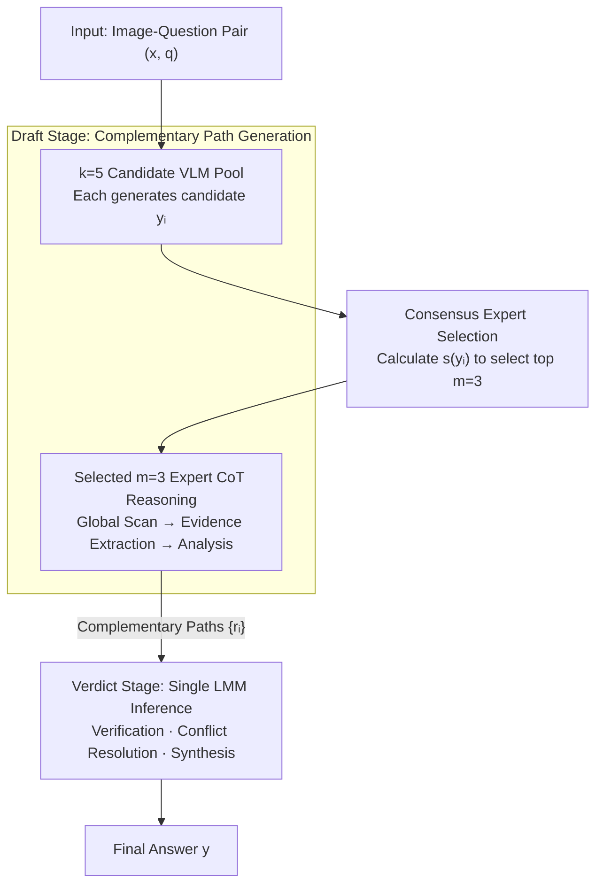

# Small Drafts, Big Verdict: Information-Intensive Visual Reasoning via Speculation

**Conference**: ICLR 2026  
**arXiv**: [2510.20812](https://arxiv.org/abs/2510.20812)  
**Code**: [https://github.com/Tinaliu0123/speculative-verdict](https://github.com/Tinaliu0123/speculative-verdict)  
**Area**: Multimodal VLM  
**Keywords**: speculative decoding, visual reasoning, information-intensive VQA, draft-verdict framework, consensus expert selection

## TL;DR
Inspired by the "draft-then-verify" paradigm of Speculative Decoding, this paper proposes Speculative Verdict (SV). It utilizes multiple lightweight VLMs to generate diverse reasoning paths as drafts, while a large model serves as the verdict to synthesize, verify, and correct errors. SV outperforms GPT-4o by 11.9% on information-intensive VQA without training and can rectify 47-53% of minority-correct cases.

## Background & Motivation

**Background**: While large VLMs exhibit excellence in general VQA, they face severe challenges in information-intensive image understanding (e.g., infographics and charts containing dense interleaved visual-textual content). These tasks, represented by benchmarks like InfographicVQA and ChartQAPro, require precise localization and multi-hop reasoning across complex layouts.

**Limitations of Prior Work**: Existing methods primarily improve perception through search-based zoom-in pipelines. Learning-based methods (e.g., DeepEyes, Pixel-Reasoner) train zoom strategies via reinforcement learning, which is costly. Training-free methods rely on attention maps or confidence scores for cropping, but these signals correlate weakly with relevant regions in dense layouts, often leading to misleading visual distractions. Both approaches struggle to comprehensively collect scattered evidence for multi-hop reasoning.

**Key Challenge**: Information-intensive VQA is extremely sensitive to errors—any misreading or omission during localization propagates through the reasoning chain, leading to a completely incorrect answer. A single model typically fails to achieve both "comprehensive evidence coverage" and "flawless execution." Furthermore, simple majority voting fails in minority-correct scenarios where multiple models might commit the same error at the same location.

**Goal**: (1) How to improve evidence coverage in info-intensive VQA without training? (2) How to correct errors and recover the correct answer from multiple partially correct reasoning paths? (3) How to efficiently select the most reliable draft experts to balance accuracy and cost? (4) Can multi-model synthesis surpass the reasoning capability of a single large model?

**Key Insight**: The core insight of Speculative Decoding—draft models for fast expansion and verifiers to ensure correctness—applies perfectly to information-intensive visual reasoning. Multiple lightweight VLMs can act as drafts to locate evidence from different perspectives, while a large model serves as the verdict to verify and resolve contradictions. Crucially, different VLMs tend to locate different regions and extract different evidence on the same dense image, creating natural complementarity.

**Core Idea**: Transfer the "draft-then-verify" paradigm from token-level inference acceleration to task-level multi-model evidence synthesis and error correction in VQA.

## Method

### Overall Architecture
SV (Speculative Verdict) addresses the dilemma of requiring a single model to "see all evidence" and "be error-free at every step." It decomposes reasoning into a two-stage pipeline: first, a pool of small VLMs reads the image to produce complementary reasoning drafts; then, a large model synthesizes these drafts into a final verdict. Given an image-question pair $(x, q)$, the Draft stage uses $k=5$ candidate VLMs to generate candidate answers, selecting $m=3$ most reliable experts via consensus scoring. Each expert generates a detailed reasoning path $r_i$ using CoT. In the Verdict stage, the original image, question, and all paths $\{r_i\}_{i=1}^{m}$ are fed to a large model (GPT-4o or Qwen2.5-VL-72B) to verify, resolve contradictions, and synthesize the final answer $y = J(x, q, \{r_i\}_{i=1}^{m})$ in a single inference pass.

### Key Designs

**1. Draft Stage: Complementary reasoning via multiple lightweight VLMs to maximize evidence coverage**

Small errors or omissions in dense images propagate through the reasoning chain. SV allows multiple 7-9B small VLMs to reason independently. Each draft expert follows a three-step CoT template: global scanning (identifying sub-graphs, axes, legends), evidence extraction (converting visual/text elements into structured clues), and analytical reasoning (filtering, calculation, cross-referencing). Different architectures locate different regions, forming an evidence pool broader than any single model. The draft pool uses five diverse models—Qwen2.5-VL-7B, MiMo-VL-7B-RL, InternVL3-8B, GLM-4.1V-9B-Thinking, and Ovis2.5-9B—to minimize overlapping blind spots.

**2. Consensus Expert Selection: Training-free identification of reliable drafts with minimal overhead**

From $k=5$ candidates, SV selects the $m=3$ most trustworthy experts. Each VLM generates a candidate answer $y_i$, and a global consensus score is calculated:

$$s(y_i) = \sum_{j \neq i} |NLL_j(y_i) - NLL_j(y_j)|$$

where $NLL_j(y_i)$ is the negative log-likelihood of model $M_j$ for answer $y_i$. Subtracting $NLL_j(y_j)$ (the model's NLL for its own answer) normalizes inherent calibration differences across models, ensuring fair comparison. Lower scores indicate stronger peer agreement. Consensus is prioritized over diversity because info-intensive VQA typically has a unique correct answer; agreement naturally points to reliability. This process only requires a single prefill and one-step decoding per candidate, incurring negligible cost.

**3. Verdict Stage: Leveraging the large model as a synthesizer to recover correctness from imperfect paths**

Given $m$ complementary but potentially flawed paths, the large verdict model (GPT-4o or Qwen2.5-VL-72B) receives the original image, question, and all paths $\{r_i\}_{i=1}^{m}$ to produce:

$$y = J(x, q, \{r_i\}_{i=1}^{m})$$

The model acts as a synthesizer: evaluating localization consistency, identifying contradictions, and integrating verified clues. Unlike majority voting, which is drowned by a majority of identical errors, the verdict can "salvage" information from a minority correct path (achieving a 47-53% recovery rate in minority-correct cases). Computationally, the verdict involves only one call, concentrating the load on prefill (processing thousands of context tokens) while minimizing expensive auto-regressive decoding for the answer.

### Loss & Training
SV is entirely training-free. It utilizes five 7-9B open-source VLMs for the draft pool and GPT-4o or Qwen2.5-VL-72B for the verdict. For info-intensive benchmarks, PP-StructureV3 is used to convert images into a layout-preserving structured format to assist the verdict model. This modularity allows for seamless upgrades as stronger VLMs emerge.

## Key Experimental Results

### Main Results

| Model | InfographicVQA (ANLS) | ChartMuseum (Acc) | ChartQAPro (Acc) | HR-Bench 4K (Acc) |
|------|----------------------|-------------------|------------------|-------------------|
| GPT-4o | 76.5 | 42.7 | 52.6 | 67.4 |
| GLM-4.1V-Thinking (9B) | 84.8 | 48.0 | 56.2 | 72.3 |
| Qwen2.5-VL-72B | 84.2 | 40.7 | 60.7 | 73.1 |
| DeepEyes (7B) | 75.5 | 28.0 | 48.7 | 73.0 |
| Pixel-Reasoner (7B) | 84.0 | 25.9 | 39.3 | — |
| **SV (GPT-4o verdict)** | **88.4** (+11.9) | **49.3** (+6.6) | **64.0** (+11.4) | 71.4 (+4.0) |
| **SV (72B verdict)** | 86.7 (+2.5) | 48.2 (+7.5) | 63.0 (+2.3) | **75.6** (+2.5) |

*Calculated as absolute gain relative to the respective verdict model baseline.*

### Ablation Study

| Ablation Dimension | Configuration | InfographicVQA | ChartQAPro | Description |
|---------|------|---------------|------------|------|
| Draft Count | m=1 | ~85 | ~59 | Linear performance gain as m increases |
| Draft Count | m=3 (Default) | 88.4 | 64.0 | Best balance of accuracy and efficiency |
| Draft Count | m=5 | ~88.5 | ~64 | Saturation with linear cost increase |
| Verdict Input | Answers Only | 73.4 | 59.2 | Severe drop due to missing reasoning paths |
| Verdict Input | Full Paths | 88.4 | 64.0 | +15pp / +4.8pp gain over answers only |
| Selection Strategy | Consensus | 88.4 | 64.0 | Default; optimal performance |
| Selection Strategy | Diversity | < baseline | < baseline | Diversity is harmful for these tasks |
| Verdict Scale | Small (7-9B) | 84.1-85.4 | 57.2-60.3 | Poor performance despite more decoding |

### Key Findings
- SV achieves 47-53% recovery in minority-correct cases: the verdict can extract correct information even when most drafts are wrong, which is impossible for majority voting.
- Zero-correct recovery (2.5-4.5%): even if all drafts and the standalone verdict are incorrect, SV can synthesize a correct answer from partially correct steps.
- Superiority over tool-driven methods: SV outperforms DeepEyes by 12.9-21.3% and Pixel-Reasoner by 4.4-24.7%.
- Consensus over diversity: Diversity-based selection underperforms the baseline, confirming that consensus points to the unique correct answer in VQA.
- Reasoning paths are critical: Passing only final answers to the verdict results in a 15pp decline.
- Generalization: SV also improves MathVista (17.8% over GPT-4o) and TallyQA (1.5% over GPT-4o).

## Highlights & Insights
- Moving "draft-then-verify" from token-level acceleration to task-level quality improvement is a significant conceptual shift that is applicable to multi-source document QA and scientific reasoning.
- Consensus scoring via NLL normalization effectively removes inter-model calibration bias, making cross-model comparisons equitable.
- Recovery in minority-correct cases is the fundamental advantage over majority voting; reasoning paths provide richer evidence for the verdict to differentiate fine-grained details.
- The engineering focus on prefill over auto-regressive decoding for the verdict makes the system significantly more efficient than iterative multi-region analysis.
- The training-free nature ensures long-term viability as the framework can integrate more powerful open-source VLMs as they are released.

## Limitations & Future Work
- Inference cost remains high (5 drafts + 1 large verdict), necessitating lighter verdict alternatives for resource-constrained scenarios.
- High dependency on the reasoning power of large verdict models; small models (7-9B) are insufficient for the synthesis task.
- The optimal composition of the expert pool remains unexplored (e.g., cross-architecture vs. homogeneous).
- Dependence on PP-StructureV3 adds complexity and might not generalize to non-document images.
- Consensus selection may be less effective for open-ended tasks (e.g., image captioning) where answers are not unique.

## Related Work & Insights
- **vs DeepEyes/Pixel-Reasoner**: SV replaces tool-driven search with multi-model synthesis. It is training-free and provides better coverage but may be less efficient in simple single-region localization.
- **vs LLaVA-Critic**: While LLaVA-Critic selects the best single answer, SV synthesizes a new one. SV achieves 4.9-11.9% higher performance by repairing internal path errors.
- **vs Majority Voting**: SV overcomes the limitation of majority voting in scenarios where multiple models share systematic errors, leveraging reasoning paths to cross-validate factual details.

## Rating
- **Novelty**: ⭐⭐⭐⭐ Creative transfer of speculative decoding to visual reasoning; elegant NLL-based consensus selection.
- **Experimental Thoroughness**: ⭐⭐⭐⭐⭐ Extensive evaluation across 7 benchmarks; comprehensive ablation of all system components.
- **Writing Quality**: ⭐⭐⭐⭐ Clear structure with illustrative running cases.
- **Value**: ⭐⭐⭐⭐ Highly practical training-free framework with significant gains on complex VQA tasks.

<!-- END -->

<!-- RELATED:START -->

## Related Papers

- [\[ICLR 2026\] ProxyThinker: Test-Time Guidance Through Small Visual Reasoners](proxythinker_test-time_guidance_through_small_visual_reasoners.md)
- [\[ICLR 2026\] Empowering Small VLMs to Think with Dynamic Memorization and Exploration](empowering_small_vlms_to_think_with_dynamic_memorization_and_exploration.md)
- [\[ICML 2026\] VideoKR: Towards Knowledge- and Reasoning-Intensive Video Understanding](../../ICML2026/vlm_reasoning/videokr_towards_knowledge-_and_reasoning-intensive_video_understanding.md)
- [\[CVPR 2026\] Thinking with Drafts: Speculative Temporal Reasoning for Efficient Long Video Understanding](../../CVPR2026/vlm_reasoning/thinking_with_drafts_speculative_temporal_reasoning_for_efficient_long_video_und.md)
- [\[CVPR 2026\] RMIR: A Benchmark Dataset for Reasoning-Intensive Multimodal Image Retrieval](../../CVPR2026/vlm_reasoning/rmir_a_benchmark_dataset_for_reasoning-intensive_multimodal_image_retrieval.md)

<!-- RELATED:END -->
