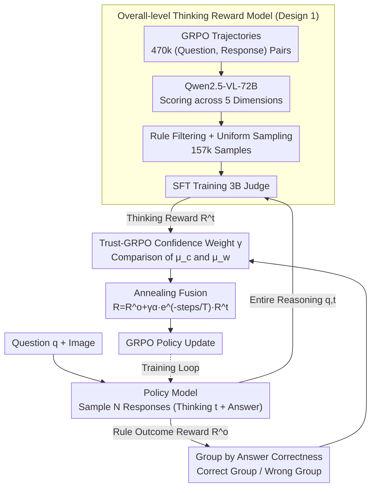

# SophiaVL-R1: Reinforcing MLLMs Reasoning with Thinking Reward

**Conference**: ICLR 2026  
**arXiv**: [2505.17018](https://arxiv.org/abs/2505.17018)  
**Code**: [GitHub](https://github.com/kxfan2002/SophiaVL-R1)  
**Area**: Multimodal Reasoning / RL Alignment  
**Keywords**: Thinking Reward, MLLM Reasoning, Trust-GRPO, Annealing Strategy, Process Supervision

## TL;DR
SophiaVL-R1 is proposed to introduce a holistic-level thinking process reward when training MLLM reasoning with rule-based RL. Specifically, a Thinking Reward Model is trained to evaluate reasoning quality across five dimensions (e.g., logical consistency and redundancy). Trust-GRPO is then introduced to calculate a confidence weight $\gamma$ based on the comparison of thinking rewards between correct and incorrect answer groups to mitigate reward hacking. Additionally, an annealing strategy $e^{-\text{steps}/T}$ gradually reduces the thinking reward to ensure greater reliance on accurate rule-based rewards in later stages. The 7B model comprehensively outperforms LLaVA-OneVision-72B across multiple benchmarks, including MathVista (71.3%) and MMMU (61.3%).

## Background & Motivation

**Background**: DeepSeek-R1-style rule-based RL (GRPO + outcome reward) has successfully stimulated reasoning capabilities in LLMs/MLLMs, as demonstrated by works like R1-OneVision, OpenVLThinker, and Video-R1. The key lies in using rule functions to generate accurate outcome reward signals.

**Core Problem**: Relying solely on outcome rewards cannot guarantee the quality of the reasoning process. Models may arrive at correct answers via flawed reasoning paths ("getting it right for the wrong reasons"). GRPO would encourage these responses equally, leading to the learning of suboptimal or incorrect reasoning strategies and poor generalization.

**Limitations of PRM**: Traditional step-wise Process Reward Models (PRM) impose constraints that are: (1) too rigid, limiting flexibility and generalization; (2) difficult to evaluate for step-wise correctness; and (3) exploitable by models through repeating valid steps or inserting meaningless ones.

**Reward Hacking Risk**: Thinking rewards generated by models can be unreliable on certain samples (Ye et al., 2024; Li et al., 2025a). Directly incorporating them into GRPO may lead to reward hacking, where the model learns to cater to the reward model rather than truly improving reasoning.

**Temporal Issues of Thinking Reward**: Maintaining the same intensity of thinking reward throughout training is not necessarily optimal. It helps discover good strategies in early stages, but imperfect reward signals may accumulate errors later.

**Goal**: To design a method that reliably integrates thinking process rewards into GRPO training, guiding the model to develop stronger and more generalizable reasoning capabilities without introducing additional computational overhead.

## Method

### Overall Architecture

SophiaVL-R1 adds a "thinking process" supervision layer on top of standard GRPO training. It consists of two stages: first, offline training of a lightweight Thinking Reward Model (TRM); second, embedding this model into the RL loop. During RL, the policy model samples $N$ responses (including the thinking process $t$ and final answer) for each question. Simultaneously, a rule function calculates the outcome reward $R^o$ and splits responses into correct/incorrect groups based on answer accuracy. The TRM outputs a thinking reward $R^t \in [0,1]$ for each reasoning segment. Trust-GRPO uses the contrast between the thinking rewards of the two groups to calculate a confidence weight $\gamma$. Finally, an annealing curve that decays with training steps is applied to fuse both rewards into the final reward for GRPO policy updates. This unifies "answer correctness" ($R^o$) and "thinking quality" ($R^t$) into one objective, with the latter constrained by both confidence and time to avoid reward hacking.

### Key Designs

**1. Overall-level Thinking Reward Model: Replacing step-wise PRMs with a 3B judge**

Traditional step-wise Process Reward Models (PRM) are overly restrictive and prone to exploitation (e.g., repeating valid steps). SophiaVL-R1 instead adopts a holistic evaluation: given a question $q$ and thinking process $t$, the reward model directly outputs a scalar $R^t = f_{\phi}(q, t) \in [0, 1]$, focusing on reasoning quality regardless of answer correctness. Training data is derived from GRPO trajectories—470,331 (question, response) pairs from Qwen2.5-VL-7B are scored by Qwen2.5-VL-72B across five dimensions (logical consistency, reasoning correctness, error identification, language consistency, and redundancy). After rule filtering and uniform sampling, 156,703 high-quality samples are used to SFT a Qwen2.5-VL-3B-Instruct base. Training on real trajectories ensures the model encounters actual errors it might make, while the holistic score bypasses the rigidity of step-wise assessment.

**2. Trust-GRPO: Using contrast between correct/wrong groups for confidence weighting**

Thinking rewards are not always reliable. Trust-GRPO leverages the group sampling in GRPO: for each question's $N$ responses, it splits them into $G_{\text{correct}}$ and $G_{\text{wrong}}$. Average thinking rewards are calculated as $\mu_c = \frac{1}{|G_{\text{correct}}|}\sum_{i \in G_{\text{correct}}} R_i^t$ and $\mu_w = \frac{1}{|G_{\text{wrong}}|}\sum_{i \in G_{\text{wrong}}} R_i^t$. The confidence weight is defined as:

$$\gamma = \begin{cases} 1, & \mu_c \geq \mu_w \\ e^{\mu_c - \mu_w}, & \mu_c < \mu_w \end{cases}$$

If the incorrect group has a higher average thinking reward ($\mu_c < \mu_w$), the signal is deemed untrustworthy and $\gamma$ is exponentially decayed. This zero-cost self-calibration requires no extra sampling or forward passes, which is critical for compute-intensive MLLM training.

**3. Annealing Strategy: Exponential decay of thinking reward weight**

Constant thinking reward intensity is suboptimal. Annealing introduces a time-decay factor into the fused reward:

$$R_i = R_i^o + \gamma \alpha e^{-\text{steps}/T} \cdot R_i^t$$

Where $\alpha$ is the base coefficient and $e^{-\text{steps}/T}$ monotonically decreases. This allows for early-stage divergent exploration guided by thinking rewards and late-stage convergence refinement focused on accurate rule-based outcome rewards, preventing the accumulation of reward hacking noise at the end of training.

### Loss & Training

The outcome reward $R^i_o$ follows rule-based designs: binary rewards for math/multiple-choice via exact/option matching, negative Word Error Rate (WER) for OCR, and average ROUGE scores for free text. This is combined with the thinking reward under the Trust-GRPO and annealing frameworks for standard GRPO policy optimization.

## Key Experimental Results

### Table 1: Mathematical Reasoning Benchmarks (MathVista & MathVerse)

| Model | MathVista | MathVerse | Parameters |
|------|-----------|-----------|--------|
| LLaVA-OneVision-72B | 68.4 | 27.2 | 72B |
| URSA-8B | 59.8 | 45.7 | 8B |
| R1-OneVision-7B | 64.1 | 46.4 | 7B |
| Qwen2.5-VL-7B+GRPO | 69.9 | 45.3 | 7B |
| Qwen2.5-VL-7B+SFT+GRPO | 66.8 | 43.1 | 7B |
| **SophiaVL-R1-7B** | **71.3** | **48.8** | **7B** |

### Table 2: General Multimodal Benchmarks

| Model | MMMU | MME | ChartQA | MMBench | MMStar |
|------|------|-----|---------|---------|--------|
| LLaVA-OneVision-72B | 56.8 | 2261 | 83.7 | - | 66.1 |
| URSA-8B | 43.1 | 1606 | 44.4 | 55.5 | 42.3 |
| Qwen2.5-VL-7B+GRPO | 58.0 | 2298 | 87.2 | 83.4 | 65.6 |
| **SophiaVL-R1-7B** | **61.3** | **2404** | **88.5** | **85.4** | **66.7** |

### Table 3: Ablation Study

| Variant | MathVista | MathVerse | MMMU |
|------|-----------|-----------|------|
| Qwen2.5-VL-7B+GRPO (Baseline) | 69.9 | 45.3 | 58.0 |
| SophiaVL-R1-wo-trained-TRM | 68.4 | 47.9 | 57.0 |
| wo-Trust + wo-Annealing | 67.4 | 46.3 | 56.7 |
| wo-Trust (Annealing only) | 70.2 | 47.8 | 60.0 |
| **Full SophiaVL-R1** | **71.3** | **48.8** | **61.3** |

## Key Findings

1. **Overall-level Thinking Reward outperforms step-wise PRM**: Compared to VisualPRM (InternVL2.5-8B), SophiaVL-R1 improves MathVerse by 18.1 points (48.8 vs 30.7), leading across all subtasks. Holistic assessment is more flexible and robust.
2. **Trust weight $\gamma$ effectively prevents reward hacking**: Removing the Trust weight dropped MMMU from 61.3 to 60.0 and MathVista from 71.3 to 70.2. $\gamma$ identifies unreliable signals by contrasting correct/incorrect group thinking rewards.
3. **Annealing strategy is indispensable**: Removing annealing (SophiaVL-R1-wo-trust-and-annealing) led to significant performance drops (MathVista 67.4 vs 71.3, MMMU 56.7 vs 61.3). Continuous exposure to imperfect thinking signals causes optimization bias.
4. **Untrained TRM is ineffective**: Using an untrained Qwen2.5-VL-3B performs similarly to the pure GRPO baseline, proving the necessity of the specialized training process and the SophiaVL-R1-Thinking-156k dataset.
5. **Training Curves**: SophiaVL-R1 shows the fastest and highest increase in outcome reward, indicating that Trust-GRPO accelerates policy exploration.

## Highlights & Insights

- **"Beyond answer correctness → Evaluate the methodology"**: Much like a teacher grading the steps of a solution rather than just the final answer, SophiaVL-R1 achieves process supervision in MLLM training.
- **Zero-cost self-calibration in Trust-GRPO**: It ingeniously uses existing GRPO group samples to estimate reward reliability without extra inference, providing a compute-friendly defense against reward hacking.
- **Reversing the 10x parameter gap**: The 7B model surpasses the 72B model on MMMU by 4.5 points (61.3 vs 56.8), suggesting that reasoning quality is more vital than parameter scale.
- **Engineering wisdom in annealing**: Thinking rewards drive exploration early on, while rule-based rewards ensure stability and refinement later. This "diverge early, converge late" philosophy is highly generalizable.

## Limitations & Future Work

1. **Thinking Reward Model depends on LLM labeling**: Training data was scored by Qwen2.5-VL-72B; thus, labeling quality is bounded by that model's capabilities and may contain systematic biases.
2. **Completeness of five-dimension evaluation**: Dimensions like logical consistency were distilled from observed error patterns and may not cover all reasoning defects in new domains.
3. **Architectural verification**: The study is primarily validated on the Qwen2.5-VL series; generality across other architectures like InternVL or LLaVA remains to be tested.

## Related Work & Insights

### vs VisualPRM (Wang et al., 2025b)
VisualPRM uses step-wise PRM, while SophiaVL-R1 uses holistic thinking rewards. The latter's 18.1 point Lead on MathVerse suggests that holistic evaluation is more effective for MLLM reasoning training, avoiding the rigidity and exploitation issues of step-wise constraints.

### vs Video-R1 / R1-OneVision
These works rely solely on rule-based outcome rewards without supervising the reasoning process. SophiaVL-R1 introduces thinking rewards, Trust-GRPO, and annealing, leading to superior generalization (MathVista 71.3 vs R1-OneVision's 64.1).

## Rating

- **Novelty**: ⭐⭐⭐⭐ The combination of holistic thinking rewards, Trust-GRPO, and annealing is novel, though individual components are intuitive.
- **Experimental Thoroughness**: ⭐⭐⭐⭐ Solid results across 7 benchmarks and detailed ablations, though multi-base model experiments are missing.
- **Writing Quality**: ⭐⭐⭐⭐⭐ Clear logical chain from problem definition to analysis and solution, with concise math.
- **Value**: ⭐⭐⭐⭐⭐ Provides a practical and effective path for process supervision in MLLM RL training. Trust-GRPO’s confidence estimation is widely applicable.

<!-- RELATED:START -->

## Related Papers

- [\[ICLR 2026\] Perception-R1: Advancing Multimodal Reasoning Capabilities of MLLMs via Visual Perception Reward](perception-r1_advancing_multimodal_reasoning_capabilities_of_mllms_via_visual_pe.md)
- [\[ICLR 2026\] VidGuard-R1: AI-Generated Video Detection and Explanation via Reasoning MLLMs and RL](vidguard-r1_ai-generated_video_detection_and_explanation_via_reasoning_mllms_and.md)
- [\[CVPR 2026\] STAR-R1: Multi-View Spatial TrAnsformation Reasoning by Reinforcing Multimodal LLMs](../../CVPR2026/vlm_reasoning/star-r1_multi-view_spatial_transformation_reasoning_by_reinforcing_multimodal_ll.md)
- [\[NeurIPS 2025\] Video-R1: Reinforcing Video Reasoning in MLLMs](../../NeurIPS2025/vlm_reasoning/video-r1_reinforcing_video_reasoning_in_mllms.md)
- [\[ICLR 2026\] MetaSpatial: Reinforcing 3D Spatial Reasoning in VLMs for the Metaverse](metaspatial_reinforcing_3d_spatial_reasoning_in_vlms_for_the_metaverse.md)

<!-- RELATED:END -->
