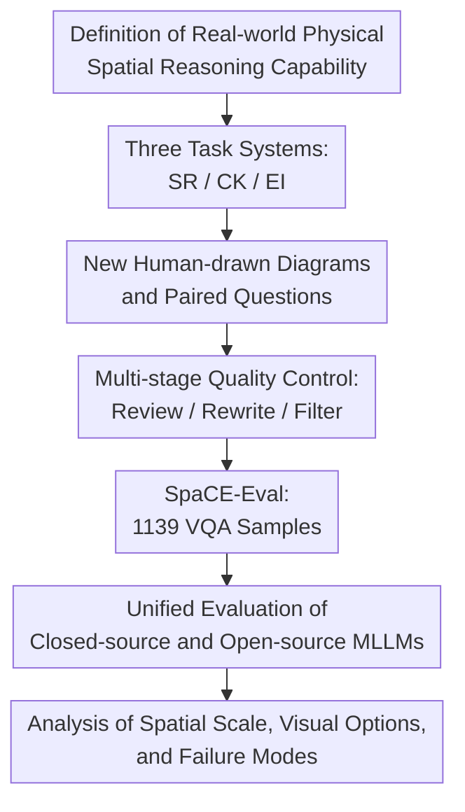

# SpaCE-Eval: A Benchmark for Real-World Multi-Modal Reasoning

**Conference**: ICLR 2026  
**OpenReview**: [https://openreview.net/forum?id=VAEkLS9VBr](https://openreview.net/forum?id=VAEkLS9VBr)  
**Code**: https://github.com/xuyou-yang/SpaCE-Eval  
**Area**: Multimodal Reasoning / VLM Evaluation  
**Keywords**: Real-world reasoning, spatial reasoning, large multimodal models, VQA benchmark, environmental interaction  

## TL;DR
SpaCE-Eval constructs a real-world physical spatial multimodal reasoning VQA benchmark consisting of newly hand-drawn human diagrams. It systematically examines MLLMs using three task categories: spatial reasoning, commonsense knowledge, and environmental interaction. The results demonstrate that current state-of-the-art models remain far below human performance in both overall accuracy and spatial reasoning.

## Background & Motivation
**Background**: Multimodal Large Language Models (MLLMs) have achieved strong performance in tasks such as general VQA, document understanding, chart question-answering, and mathematical visual reasoning. Many models are also being deployed in application scenarios like robotics, navigation, embodied intelligence, and spatial decision-making. For these applications, models must not only identify objects in a frame but also understand spatial relationships, physical constraints, cultural/material commonsense, and determine the next steps for environmental interaction.

**Limitations of Prior Work**: Existing evaluations often compress "visual reasoning" into small-scale problems, such as object counting, basic directions (left/right/up/down), distances, or grid/maze navigation. While valuable, these tasks maintain a significant gap from real spatial environments. Real-world settings extend from desktop objects to rooms, buildings, blocks, and cities; relationships involve perspective switching, plan-elevation-section associations, visibility analysis, structural stability, traffic movement, and spatial choices under climatic conditions.

**Key Challenge**: Current MLLMs appear capable of "reasoning" on many benchmarks, but this ability may rely on linguistic cues, common image patterns, or question types seen during training. Once tasks require abstract spatial simulation in newly drawn diagrams, it becomes uncertain whether models truly understand the physical world. The evaluation gap lies not in a lack of VQA data, but in a lack of real-world reasoning data that integrates spatial scales, commonsense backgrounds, and environmental actions.

**Goal**: The authors aim to answer three specific questions: First, can MLLMs complete cross-scale spatial reasoning in complex real-world spaces? Second, can models combine commonsense regarding materials, structures, construction, and regional culture with visual context? Third, can models compare options, predict affordance, and make decisions for environmental interaction like a spatial user or decision-maker?

**Key Insight**: Instead of sampling existing images from the internet, contributors with design and architectural backgrounds were tasked with redrawing infographic diagrams for each subcategory and writing corresponding multiple-choice VQA questions. This choice is critical: it reduces the risk of data contamination while shifting the task focus from natural image recognition to "interpreting abstract but realistically interpretable spatial expressions."

**Core Idea**: Construct a benchmark specifically designed to measure MLLM shortfalls in real-world multimodal reasoning using newly hand-drawn multi-scale spatial diagrams and strictly quality-controlled VQA problems.

## Method

### Overall Architecture
SpaCE-Eval is not a new model but a benchmark design and evaluation pipeline. It first defines three categories of capabilities required for real-world multimodal reasoning, then commissions design-background contributors to draw new diagrams and write questions. These undergo peer feedback, external review, adversarial rewriting, and author filtering, resulting in a dataset of 701 diagrams and 1139 single-choice VQA questions. During the evaluation phase, the same set of questions is administered to various closed-source and open-source MLLMs, with analyses of model shortcomings across categories, spatial scales, option modalities, and failure cases.

The focus of this process is linking "what to measure" with "how to ensure the questions actually measure it." The three task systems define the capability boundaries; the new diagrams and quality control reduce leakage and linguistic shortcuts; the large-scale model evaluation demonstrates whether the benchmark can truly expose current weaknesses in real-world physical reasoning.

### Key Designs

**1. Three Task Systems: Deconstructing Real-World Reasoning into Spatial, Commonsense, and Interaction Lines**

The first design of SpaCE-Eval is the capability partitioning. The authors do not categorize all questions under "spatial reasoning" but split them into three main categories: Spatial Reasoning (SR), Commonsense Knowledge (CK), and Environment Interaction (EI), each further divided into four subcategories. Spatial Reasoning focuses on whether a model can interpret multi-scale spatial configurations, including viewpoint/perspective interpretation, association between floor plans and elevations/sections, visibility analysis in complex scenes, and morphological transformations under explicit or implicit rules. This examines spatial imagination frequently used by humans in architecture and urban environments rather than simple relative positions.

Commonsense Knowledge examines spatial-related background knowledge, including materials and structures, construction and fabrication, local lifestyles, and cultural contexts. It fills a gap in pure spatial benchmarks: real-world diagrams are often not purely geometric. Judging structural stability, construction rationality, or the cultural background corresponding to a living arrangement requires combining visual information with world knowledge. Environment Interaction pushes the problem to the action level, requiring models to compare solutions from a user or decision-maker perspective, such as selecting spaces based on weather, arranging environments for design goals, planning movement paths for different entities, or understanding sustainable environment strategies. Together, these three categories align more closely with multimodal reasoning requirements in embodied intelligence and real-world spatial applications.

**2. New Human-drawn Diagrams: Reducing Data Contamination and Forcing Multi-modal Interpretation**

The second design concerns data source. Fifty-one undergraduate students with design or architecture backgrounds from various countries, cultures, and traditions contributed the diagrams. Each diagram is a zero-shot info-graphic drawn around subcategories rather than scraped from the web. The direct benefit is the reduction of benchmark memorization risk during pre-training.

Furthermore, these diagrams are not ordinary photographs but spatial info-graphics with abstract expressions. Models must understand visual symbols such as plans, perspectives, sections, material structures, paths, and local-to-global relationships, rather than relying solely on textures and object categories in natural images. Contributors were required to follow professional standards while retaining individual styles, ensuring both high readability and visual diversity. For MLLMs, these diagrams force a shift from "seeing objects" to "interpreting spatial expressions."

**3. Multi-stage Quality Control: Filtering Ambiguity, Shortcuts, and Unanswerable Questions**

The third key design is quality control. The raw data included 742 diagrams and 1484 questions, but only 701 diagrams and 1139 questions remained after multiple screening rounds. During creation, contributors met weekly with meta-annotators to calibrate rubrics. Subsequently, volunteers from different backgrounds reviewed all samples to identify logical errors or unanswerable questions. External reviewers provided an independent perspective to detect hidden biases.

The final rounds were completed by meta-annotators and authors, focusing on ensuring that each question requires visual input, has a unique and clear answer, is relevant to the category, and avoids linguistic or positional shortcuts. Approximately 50 questions were controversially rewritten (e.g., modifying options that seemed correct due to length or phrasing), and 41 diagrams and 345 questions were removed. This process ensures that SpaCE-Eval tests visual-spatial-commonsense reasoning rather than test-taking tricks.

**4. Diagnostic Evaluation Dimensions: Locating Model Failures**

The evaluation design does not merely report mean accuracy. Performance is analyzed by main category, subcategory, spatial scale, option modality, and the presence of image input. Spatial scales are grouped into object, room space, building space, spatial structure, urban space, and abstract geometry to observe degradation as scale increases. Options are divided into text-based and pure visual options to check whether models rely more on language than visual understanding.

These diagnostic dimensions make the benchmark conclusions more interpretable. For instance, models performing relatively highly in Commonsense Knowledge but significantly lower in Spatial Reasoning suggest they may have memorized knowledge but cannot perform stable spatial simulations. Lower performance on visual options compared to text options indicates weaknesses in comparing visual candidates and interpreting abstract graphics.

### An Integration Example
Consider a Spatial Reasoning / Space Association question: the diagram provides a building floor plan or a village map with a marked observation point and orientation; the four options are images of different local perspectives. A model that only recognizes elements (e.g., "door, window, road, tree") might pick the most similar-looking option. However, a correct answer requires locating the observation point in the global map, performing a perspective simulation along the arrow direction, determining which objects should be on the left/right/front or occluded, and comparing this mental image against the four visual options.

Such questions correspond to the global-to-local and local-to-global failure modes mentioned in the paper. Humans can typically link plan positions, orientations, and local views even if the diagram is abstract, whereas current MLLMs tend to get stuck on local visual similarity.

### Loss & Training
Ours does not propose a model training method; thus, there is no loss function or training strategy. During evaluation, all questions are single-choice VQA with four options. To reduce positional bias, the distribution of correct answers across A/B/C/D is randomized to approximately 25.46%, 25.37%, 25.46%, and 23.71%.

The evaluation covers both closed-source and open-source MLLMs. Most models are called via the OpenRouter API. For models not supported by OpenRouter, VLLM deployment is used with default inference hyperparameters. When the model output is not a precise A/B/C/D but a natural language response semantically identical to an option, GPT-4o-mini is employed to judge the prediction.

## Key Experimental Results

### Main Results
The main results of SpaCE-Eval are straightforward: the strongest model, GPT-5, achieves an overall score of only 56.37%, with a mean in spatial reasoning of only 42.25%. In contrast, the human average is 79.00% overall and 84.18% for spatial reasoning. This suggests models have accumulated knowledge for commonsense questions but face a massive gap in real spatial simulation and cross-scale reasoning.

| Model | Overall Mean | Spatial Reasoning | Commonsense Knowledge | Environment Interaction |
|------|--------------|-------------------|------------------------|--------------------------|
| Human Avg. | 79.00 | 84.18 | 71.83 | 81.34 |
| GPT-5 | 56.37 | 42.25 | 66.08 | 61.63 |
| GPT-5-mini | 52.15 | 37.00 | 61.27 | 59.30 |
| claude-sonnet-4 | 48.64 | 31.75 | 59.24 | 56.10 |
| gemini-2.5-flash | 47.50 | 28.50 | 57.72 | 57.85 |
| Llama-4-Maverick | 45.92 | 27.75 | 55.19 | 56.40 |
| llava-onevision-7b | 42.41 | 31.00 | 49.62 | 47.38 |
| Qwen2.5-VL-72B | 37.84 | 25.75 | 45.57 | 43.02 |

A notable contrast is that humans perform better in Spatial Reasoning and Environment Interaction than in Commonsense Knowledge, whereas models show the opposite trend: they are closer to humans in knowledge-dense CK but lag significantly in reasoning-intensive SR.

| Comparison Dimension | Observed Phenomenon | Implications |
|----------|--------------|----------------|
| Main Category Difference | Best model achieves 66.08% in CK vs 42.25% in SR | Knowledge recall is stronger than spatial reasoning |
| Human-Model Gap | Humans reach 84.18% in SR vs model 42.25% | Real-world spatial reasoning is far from human-level |
| Model Scale | Larger models in Gemma/Qwen series outperform smaller ones | Parameter scale helps but doesn't solve fundamental gaps |
| Text vs. Visual Options | Performance on visual options is significantly lower | Models are better at verbalizing options than visual comparison |
| Spatial Scale | Performance drops from object to urban/abstract scales | Large-scale and abstract spatial simulation are key difficulties |

### Ablation Study
As this is a benchmark paper, there is no model module ablation; instead, "analytical experiments" serve as data and dimension ablations.

| Analysis Setting | Key Trend | Explanation |
|----------|----------------|------|
| With Image Input | Models perform significantly better in standard VQA | Validates that questions depend on visual information |
| No Image Input | Accuracy drops significantly | Excludes the possibility of guessing via text-only commonsense |
| Text Options | Overall accuracy is higher | Linguistic options are easier for LLM semantic capabilities |
| Visual-only Options | Performance significantly lower across categories | Exposes weaknesses in visual comparison and simulation |
| Small-scale Space | Object / spatial structure is relatively easier | Closer to object-level patterns in existing datasets |
| Large/Abstract Space | Room, building, urban, abstract geometry are harder | Requires cross-scale and local-to-global reasoning |

### Key Findings
- The strongest closed-source models have not solved spatial reasoning. GPT-5's 42.25% in SR vs human 84.18% represents a massive "half-benchmark" gap.
- Models have an advantage in commonsense questions. GPT-5 reaches 66.08% in CK, exceeding human averages in the Cultural Context subcategory, but this does not translate into spatial simulation capability.
- Visual understanding lags behind textual reasoning. Performance on pure visual options is much lower, suggesting models convert visual content into coarse language descriptions rather than comparing abstract diagrams directly.
- Performance drops as spatial scale increases. Models are relatively better at the object scale but fail more often in architectural, urban, and abstract geometric scales.
- Failure modes are consistent. Models prefer surface pixel distance, visual similarity, or option phrasing over abstract spatial relationships expressed by dashed lines, scales, perspectives, and paths.

## Highlights & Insights
- The design highlight is "new diagrams + real-world spatial tasks," which simultaneously lowers data contamination and memory-based answering issues.
- The task categorization is highly insightful. SR, CK, and EI correspond to "understanding space," "knowing how the world works," and "deciding how to act," providing a better framework for evaluating future embodied intelligence.
- The most valuable finding is the inverted capability curves between humans and models. Models' knowledge-dense lead over their reasoning-dense performance suggests the bottleneck lies in dynamic spatial representation rather than knowledge base size.
- Pure visual option design forces models to compare candidate diagrams directly, a concept transferable to UI operations, navigation, or satellite change detection tasks.
- The quality control pipeline (weekly calibration, external review, adversarial rewriting) is a model for benchmark production, especially for scenarios prone to linguistic shortcuts.

## Limitations & Future Work
- The data scale remains relatively small. While 1139 questions suffice for diagnosis, larger scales are needed to generalize across more cultures and building types.
- Professional bias in data sourcing. Contributors were primarily from design/architecture backgrounds, which ensures diagram quality but might bias questions toward architectural expression.
- The evaluation format is still limited to four-choice VQA. Real interaction requires continuous planning and open-ended execution, which single-round questions cannot fully capture.
- Automating scoring via GPT-4o-mini may introduce minor biases in borderline semantic cases.
- Diagrams are static and cannot evaluate temporal changes or real physical interaction.

## Related Work & Insights
- **vs SpatialVQA / SpatialRGPT / SpatialEval**: These focus on relative object positions/distances. SpaCE-Eval extends the scope to building/urban/abstract scales and emphasizes perspective simulation.
- **vs PIQA / GRASP / VisualCOMET / CulturalVQA**: These cover physical or cultural commonsense but often lack spatial grounding. SpaCE-Eval places commonsense within specific spatial diagrams.
- **vs CLEVRER**: CLEVRER focuses on trajectory and collision in synthetic environments. SpaCE-Eval aligns more with human abstract diagrammatic reasoning in daily architectural and urban spaces.
- **vs Embodied-agent Benchmarks**: Unlike ALFRED or MineDojo which focus on execution, SpaCE-Eval diagnoses the spatial understanding and decision-making precursors required for interaction via a controlled VQA format.

## Rating
- Novelty: ⭐⭐⭐⭐☆ Combines real-world space, multi-modal commonsense, and interaction into a highly recognizable original benchmark.
- Experimental Thoroughness: ⭐⭐⭐⭐☆ Covers a wide range of models with detailed diagnostic analyses; slightly limited by its static VQA nature.
- Writing Quality: ⭐⭐⭐⭐☆ Clear structure and logical flow in defining construction and failure modes.
- Value: ⭐⭐⭐⭐⭐ Vital for diagnosing the gap between MLLMs and true physical-world reasoning for navigation and spatial intelligence.

<!-- RELATED:START -->

## Related Papers

- [\[ICLR 2026\] Reasoning in Space via Grounding in the World](reasoning_in_space_via_grounding_in_the_world.md)
- [\[ICLR 2026\] LLMs as Rules Oracles: Exploring Real-World Multimodal Reasoning in Tabletop Strategy Game Environments](llms_as_rules_oracles_exploring_real-world_multimodal_reasoning_in_tabletop_stra.md)
- [\[ICLR 2026\] MMR-Life: Piecing Together Real-life Scenes for Multimodal Multi-image Reasoning](mmr-life_piecing_together_real-life_scenes_for_multimodal_multi-image_reasoning.md)
- [\[ICLR 2026\] Reasoning-Aligned Perception Decoupling for Scalable Multi-modal Reasoning](reasoning-aligned_perception_decoupling_for_scalable_multi-modal_reasoning.md)
- [\[ICLR 2026\] OmniSpatial: Towards Comprehensive Spatial Reasoning Benchmark for Vision Language Models](omnispatial_towards_comprehensive_spatial_reasoning_benchmark_for_vision_languag.md)

<!-- RELATED:END -->
