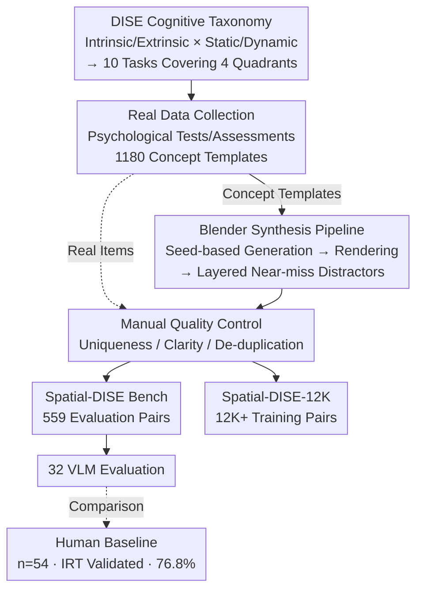

# Spatial-DISE: A Unified Benchmark for Evaluating Spatial Reasoning in Vision-Language Models

**Conference**: ICLR 2026  
**arXiv**: [2510.13394](https://arxiv.org/abs/2510.13394)  
**Code**: [https://github.com/Spatial-DISE](https://github.com/Spatial-DISE)  
**Area**: Multimodal VLM  
**Keywords**: spatial reasoning, VLM benchmark, cognitive taxonomy, DISE framework, mental transformation

## TL;DR
This paper proposes Spatial-DISE, a unified spatial reasoning benchmark based on a 2×2 cognitive science taxonomy (Intrinsic/Extrinsic × Static/Dynamic). It includes 559 evaluation VQA pairs and 12K+ training data. Evaluations across 32 SOTA VLMs reveal a significant gap between models and humans in dynamic spatial reasoning, particularly in mental rotation and folding.

## Background & Motivation

**Background**: Spatial reasoning capabilities are critical for applications such as robotics, augmented reality, and autonomous driving. Recenlty, numerous VLM spatial reasoning benchmarks have emerged, including SpatialRGPT, VSR, CV-Bench, and BLINK. These benchmarks primarily evaluate Extrinsic-Static (E-S) capabilities, which involve understanding spatial relationships between objects in fixed scenes. Table 1 compares 18 existing benchmarks regarding their coverage of the DISE quadrants, showing that most cover only 1-2 quadrants.

**Limitations of Prior Work**: Existing benchmarks suffer from three major limitations: (1) Lack of a systematic cognitive framework to categorize and evaluate different types of spatial reasoning, resulting in fragmented and imbalanced assessments; (2) Excessive focus on static spatial problems while neglecting tasks requiring multi-step dynamic reasoning (e.g., mental rotation and folding); (3) Small scale of the few benchmarks that do involve dynamic tasks (e.g., SAT, SPACE), making it difficult to reliably evaluate model capabilities or support training.

**Key Challenge**: Human spatial cognition involves rich dynamic mental simulation capabilities (e.g., imagining an object's appearance after rotation or its shape after folding). However, existing benchmarks rarely systematically evaluate this "Intrinsic-Dynamic" (I-D) capability. Models may perform well on static judgments but fail completely in scenarios requiring mental simulation—which is precisely the most critical capability in practical applications.

**Goal**: (1) Establish a unified, cognitive science-oriented classification framework covering all spatial reasoning types; (2) Scale the generation of verifiable dynamic spatial reasoning data to address data scarcity; (3) Identify the capability boundaries and failure modes of current VLMs across different spatial reasoning dimensions; (4) Determine if supplementary training data effectively improves spatial reasoning.

**Key Insight**: Drawing from Uttal et al.'s spatial capability classification system in cognitive science, this work organizes spatial reasoning along two dimensions—"Intrinsic vs. Extrinsic" and "Static vs. Dynamic"—into the DISE quadrants. It designs 10 cognitive tasks covering all quadrants and utilizes the Blender engine to construct an extensible synthetic data generation pipeline to solve the data scarcity issue in dynamic tasks.

**Core Idea**: Use the 2×2 DISE taxonomy from cognitive science to unify spatial reasoning evaluation, specifically filling the void in the Intrinsic-Dynamic dimension left by existing benchmarks.

## Method

### Overall Architecture
Spatial-DISE is not a new model but a spatial reasoning benchmark integrating "Cognitive Taxonomy + Data Construction Pipeline + Evaluation." It first uses the DISE taxonomy to partition spatial reasoning into four quadrants across two orthogonal dimensions, laying out 10 cognitive tasks. Then, a three-stage curation pipeline (Real Data Collection → Blender Synthesis → Manual Quality Control) is used to produce verifiable VQA data at scale, resulting in the 559-pair evaluation set Spatial-DISE Bench and the 12K+ training set Spatial-DISE-12K. Finally, 32 SOTA VLMs are evaluated using an IRT-validated human baseline as a benchmark to quantify the gap between models and humans.

The 10 tasks are mapped to classic psychological tests: Intrinsic-Static (I-S) uses 2D/3D shape finding for part-whole relationships; Intrinsic-Dynamic (I-D) involves 2D/3D rotation, 2D/3D folding, and Fold & Punch for pure mental simulation; Extrinsic-Static (E-S) uses 3D projection for spatial relations from fixed viewpoints; and Extrinsic-Dynamic (E-D) uses 2D/3D composition for multi-part dynamic assembly. Real-world data (1,180 conceptual templates collected from psychological tests) both contributes directly to items and provides templates for Blender synthesis.

### Key Designs

**1. DISE Cognitive Taxonomy: Dividing spatial reasoning into four quadrants to address the weak Intrinsic-Dynamic dimension**
To address fragmented evaluations in existing benchmarks, DISE organizes tasks along two orthogonal dimensions: Intrinsic (focusing on internal structure and part relationships) vs. Extrinsic (focusing on spatial relations between objects) and Static (fixed information) vs. Dynamic (requiring mental transformation). These intersect into four quadrants: I-S (e.g., shape finding), I-D (e.g., rotation/folding), E-S (e.g., 3D projection), and E-D (e.g., multi-object assembly). This grid ensures coverage of the scarce I-D mental simulation tasks.

**2. Blender Scalable Synthesis Pipeline: Transforming scarce dynamic spatial data into large-scale, auto-verifiable synthetic data**
The pipeline follows five steps: (1) Use question_id hashing for reproducible random seeds; (2) Generate core 3D objects (e.g., irregular shapes, textured cubes); (3) Render question and answer images from optimal viewpoints; (4) Systematically generate layered near-miss distractors; (5) Render standard VQA pairs in a controlled environment. Distractors are diagnostic, using four categories of confusion: geometric variants, pattern/orientation errors, incorrect viewpoints, and component substitutions. Correct answers are verified by scene parameters, eliminating manual labeling.

**3. Manual Quality Control: Filtering instances via uniqueness, clarity, and redundancy checks**
To ensure high quality, every instance passes through three gates: (1) Answer Uniqueness—ensuring exactly one correct answer; (2) Accuracy and Clarity—checking for rendering artifacts and clear phrasing; (3) Redundancy Elimination—removing logic or visual duplicates. Failed instances are discarded, ensuring the 559 evaluation pairs are clean.

**4. Human Baseline Establishment: Matrix sampling + IRT cross-validation for a reliable upper bound**
A benchmark requires a reliable human upper bound. 54 participants (ages 15-55) provided 1,679 valid responses. Using a matrix sampling design, each item was answered by an average of 3 participants. The final average accuracy (76.8%) was cross-validated using Item Response Theory (IRT) to ensure psychometric reliability. This quantifies the gap between VLM performance (avg. 28.4%) and human capability.

## Key Experimental Results

### Main Results

| Model Type | Representative Model | Overall Acc | I-D (Intr. Dyn.) | E-D (Extr. Dyn.) | I-S (Intr. Stat.) |
|:---|:---|:---|:---|:---|:---|
| Best Closed-source | Doubao1.5VL-thinking | 42.0% | 40.9% | 61.9% | 35.6% |
| Avg. Closed-source | — | 31.9% | 35.2% | 26.0% | 27.7% |
| Best Open-source | Qwen2.5-VL-7B-sft | 47.0% | 43.1% | 66.7% | 51.7% |
| Avg. Open-source | — | 26.2% | 29.1% | 23.2% | 19.3% |
| **Human Baseline** | — | **76.8%** | **80.2%** | **61.1%** | **76.8%** |
| Random Guessing | — | 24.8% | 24.3% | 25.4% | 24.7% |

### Ablation Study (Fine-tuning with Spatial-DISE-12K)

| Model | Spatial-DISE | CVBench | SAT | SPACE | OmniSpatial |
|:---|:---|:---|:---|:---|:---|
| Qwen2.5-VL-7B (Base) | 26.1% | — | — | — | — |
| Qwen2.5-VL-7B (SFT) | 47.0% (+20.9pp) | — | — | — | — |
| SpaceOm (Base) | 25.9% | 68.8% | 46.67% | 27.22% | 27.91% |
| SpaceOm (SFT) | 41.3% (+15.4pp) | 70.33% | 49.33% | — | — |

### Key Findings
- The average accuracy of all 32 models is only 28.4%, slightly above random guessing (25%) and far below humans (76.8%), highlighting spatial reasoning as a systemic weakness in VLMs.
- In the Fold & Punch task (requiring three simulation steps), the best model achieved only 30.8%, revealing a failure in "spatial working memory"—models cannot maintain mental states across multi-step transformations.
- Static capability is not a prerequisite for dynamic reasoning: some models (e.g., Gemini-2.0-Flash) performed better on dynamic tasks (38.3%) than static ones (23.6%), suggesting fragmented strategies rather than systematic cognition.
- Doubao-1.5-thinking outperformed humans in E-D tasks (61.9% vs. 61.1%) by treating cognitive simulation as a computational problem—comparing geometric features algorithmically.
- Fine-tuning on Spatial-DISE-12K yielded significant gains (Qwen2.5-VL +20.9pp) and showed generalization to external benchmarks like CVBench and SAT.
- Reasoning-enhanced training (e.g., RLHF, GRPO) provides limited and uneven improvements for cognitive spatial reasoning.

## Highlights & Insights
- The DISE taxonomy unifies disparate spatial reasoning research, allowing precise diagnosis of cognitive weaknesses. This framework can be adapted for causal or temporal reasoning.
- The Blender synthesis pipeline is a reusable tool—ensuring verifiability via seeds and diagnostic power via layered distractors.
- The finding that "static capability isn't a prerequisite" challenges the intuition that current spatial "understanding" in VLMs might just be pattern matching.
- Doubao-1.5-thinking's success in E-D suggests a direction for "computational spatial reasoning" for tasks that can be algorithmized.
- A 20pp+ gain from just 12K data points indicates a severe lack of dynamic spatial reasoning training data in current sets.

## Limitations & Future Work
- The VQA multiple-choice format may underestimate open-ended spatial reasoning capabilities (e.g., free descriptions).
- The visual style of synthetic data (solid backgrounds, simple geometry) differs from the real world; transferability to real scenes needs more validation.
- The work focuses on 2D/3D geometric reasoning, excluding semantic (e.g., "kitchen near dining room") or navigational spatial reasoning.
- The human baseline (n=54) is relatively small, with educational backgrounds not fully detailed.
- The Blender pipeline currently covers only 5 types of 3D tasks and could expand to occlusion, perspective, or mirror reasoning.
- Dynamic spatial reasoning under video input remains unexplored, where multi-frame info might assist mental simulation.

## Related Work & Insights
- **vs SPARE3D**: SPARE3D only covers the I-S quadrant; Spatial-DISE covers all four, especially I-D.
- **vs SPACE**: SPACE addresses dynamic reasoning but at a smaller scale (5K) and lacks a unified framework; Spatial-DISE provides a larger training set (12K+).
- **vs OmniSpatial**: OmniSpatial covers four quadrants but is small (1.5K) and uses real-world data, limiting scalability compared to the Blender pipeline.

## Rating
- Novelty: ⭐⭐⭐⭐ The DISE taxonomy has a solid cognitive foundation and fills a gap in systematic Intrinsic-Dynamic evaluation.
- Experimental Thoroughness: ⭐⭐⭐⭐⭐ Comprehensive evaluation of 32 models across four categories, quadrant-based analysis, and generalization tests on five external benchmarks.
- Writing Quality: ⭐⭐⭐⭐ Clear structure with intuitive diagrams, though some tables are dense.
- Value: ⭐⭐⭐⭐ Identifies systemic VLM weaknesses; the pipeline and 12K dataset are valuable contributions to the community.

<!-- END -->

<!-- RELATED:START -->

## Related Papers

- [\[ICLR 2026\] OmniSpatial: Towards Comprehensive Spatial Reasoning Benchmark for Vision Language Models](omnispatial_towards_comprehensive_spatial_reasoning_benchmark_for_vision_languag.md)
- [\[ICLR 2026\] SpatiaLab: Can Vision-Language Models Perform Spatial Reasoning in the Wild?](spatialab_can_vision-language_models_perform_spatial_reasoning_in_the_wild.md)
- [\[CVPR 2026\] SpatiaLQA: A Benchmark for Evaluating Spatial Logical Reasoning in Vision-Language Models](../../CVPR2026/vlm_reasoning/spatialqa_a_benchmark_for_evaluating_spatial_logical_reasoning_in_vision-languag.md)
- [\[ICLR 2026\] Spatial Reasoning with Vision-Language Models in Ego-Centric Multi-View Scenes](spatial_reasoning_with_vision-language_models_in_ego-centric_multi-view_scenes.md)
- [\[ICLR 2026\] SpatialLadder: Building Spatial Reasoning Capabilities for Vision-Language Models via Progressive Training](spatialladder_progressive_training_for_spatial_reasoning_in_vision-language_mode.md)

<!-- RELATED:END -->
