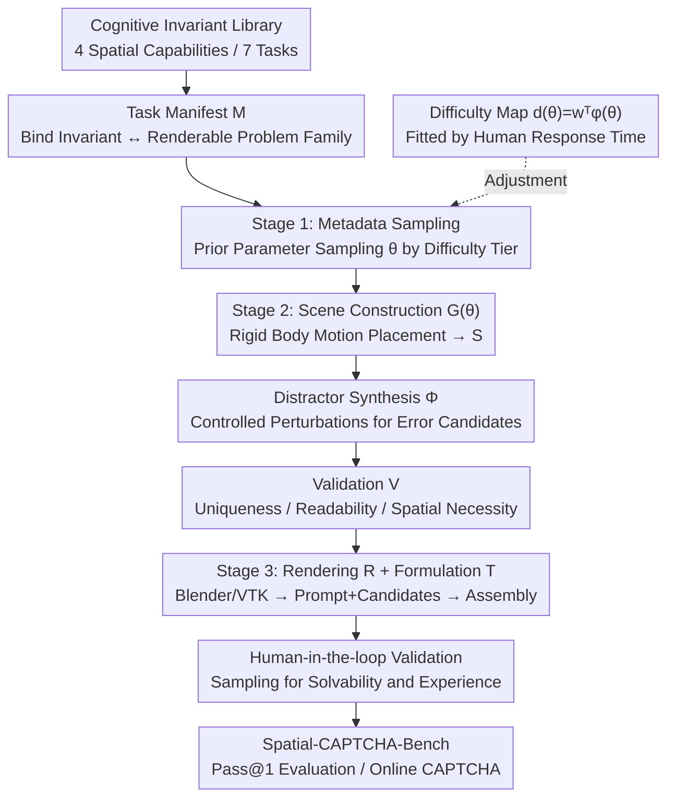

# Spatial CAPTCHA: Generatively Benchmarking Spatial Reasoning for Human-Machine Differentiation

**Conference**: ICLR 2026  
**arXiv**: [2510.03863](https://arxiv.org/abs/2510.03863)  
**Code**: None  
**Area**: Multimodal VLM  
**Keywords**: CAPTCHA, spatial reasoning, multimodal large models, human-machine differentiation, procedural generation

## TL;DR

Spatial CAPTCHA is proposed, a novel human-verification framework based on 3D spatial reasoning. It leverages fundamental capability differences between humans and multimodal large language models (MLLMs) in tasks such as geometric reasoning, perspective transformation, occlusion handling, and mental rotation. The best-performing MLLM achieved only a 31.0% Pass@1 accuracy, significantly lower than human performance.

## Background & Motivation

CAPTCHA (Completely Automated Public Turing test to tell Computers and Humans Apart) serves as the first line of defense for online services against automated attacks. However, with the rapid development of Multimodal Large Language Models (MLLMs), the effectiveness of traditional CAPTCHA designs is being severely eroded:

**Text-based CAPTCHAs are no longer secure**: Modern OCR models and MLLMs easily solve distorted text.

**2D image-based CAPTCHAs face threats**: Tasks like "select all traffic lights" in Google reCAPTCHA can now be completed by MLLMs with high accuracy.

**Key Challenge**: Traditional CAPTCHAs rely on low-level perception tasks, where current AI systems are approaching or exceeding human capabilities.

**Key Insight**: Spatial reasoning remains a cognitive ability with a significant gap between AI systems and humans. Geometric reasoning, perspective understanding, occlusion judgment, and mental rotation are intuitive and natural for humans but remains extremely difficult for state-of-the-art AI. This gap provides a natural foundation for designing a new generation of secure CAPTCHAs.

## Method

### Overall Architecture

The core question Spatial CAPTCHA addresses is: what tasks can differentiate humans from machines when MLLMs can already solve text and 2D image CAPTCHAs? The solution is to build the entire verification workflow upon spatial reasoning, driven fully by procedural generation. The system follows a "theory-first" approach: first, human spatial cognition is decomposed into several basic capabilities, each anchored to a mathematically well-defined invariant. Next, each task type is defined in a machine-verifiable **task manifest**, declaring how the problem family is sampled, generated, and scored. Finally, a three-stage synthesis pipeline instantiates the manifests into specific CAPTCHAs: metadata sampling $\rightarrow$ procedural scene and distractor generation with validation $\rightarrow$ rendering and assembly. Difficulty is continuously controlled by a monotonic function, and generated problems are further verified via human-in-the-loop sampling. The output is the Spatial-CAPTCHA-Bench, evaluated using Pass@1 (passing by solving once), directly corresponding to real-world CAPTCHA logic.

### Key Designs

**1. Mechanism: Anchoring Spatial Cognition to Mathematical Invariants**

Traditional CAPTCHA problems are manually designed, where "difficulty" and "spatial necessity" are purely empirical. If attackers determine the patterns, they can bypass them. Spatial CAPTCHA starts from cognitive science: human spatial cognition is decomposed into four categories—spatial perception and reference frames, spatial orientation and perspective transformation, mental rotation, and multi-step spatial visualization. These are further divided into 7 specific tasks (e.g., net folding, sun orientation, rotational solids, pyramids, polyominoes, etc.). Each capability is formalized as a mathematically well-defined invariant $I$ (topological relationships, rotational equivalence, composition of Euclidean motions). A problem is generated by parameter sampling $x = G(\theta), \theta \sim P_\theta$, where the question $f(x)$ explicitly targets this invariant. Thus, "answering correctly" is equivalent to "identifying the spatial invariant," which cannot be achieved through surface textures or lexical cues. This ensures **spatial necessity** by design.

**2. Task Manifests and Ground-truth Certification: Autonomous Machine Scoring**

To close the loop of "infinite generation + automated scoring," each task is written as a **task manifest** (a machine-verifiable JSON specification) $M = \langle \text{id}, I, (\theta, P_\theta), T, G, \Phi, V, R\rangle$. This binds the invariant $I$ to a family of renderable problems and explicitly declares sampling priors, formulation functions $T$, scene functions $G$, distractor mechanisms $\Phi$, validators $V$, and renderers $R$. The certification rules provide three guarantees: **Reliability** (answer $y$ is computed from scene $S$, independent of rendering), **Uniqueness** (exactly one correct answer in the candidate set under interval constraints), and **Spatial Necessity** (distractors differ from the correct answer only in prohibited spatial relationships). Since labels are computed directly from generation parameters, the system eliminates annotation costs and noise.

**3. Three-Stage Instance Synthesis Pipeline: From Manifest to Online CAPTCHA**

A manifest only declares "what can be generated"; the transformation into a problem occurs via a three-stage pipeline. **Stage 1: Metadata Sampling**: Input parameters $\theta$ (object count, layout, basic geometry) are drawn from the manifest's prior, stratified by difficulty. **Stage 2: Procedural Generation**: The scene function $G(\theta)$ uses rigid body motions to place objects into a candidate world model $S$. The distractor mechanism $\Phi$ applies controlled perturbations to $S$ to create "near-miss" error candidates (e.g., wrong perspective, mismatched rotation). The validator $V$ rejects degenerate samples (intersections, insufficient spacing, non-uniqueness), passing only scenes where $V(S)=1$. **Stage 3: Task Generation**: The renderer $R$ (using Blender for high-fidelity 3D or VTK for lightweight visualization) renders the scene and populates the formulation template $T$ to generate natural language prompts and candidate sets. Rendering is "lazy" relative to the answer—it changes appearance but not the geometric ground truth.

**4. Constrained Difficulty Control and Human-in-the-Loop: Challenging Machines without Excluding Humans**

A good CAPTCHA must challenge machines while remaining easy for humans. Difficulty is implemented as interpretable knobs at the manifest level, mapped to a continuous scale via a monotonic difficulty map $d(\theta) = w^\top \varphi(\theta)$. The weights $w$ are fitted using **human response times** collected from pilot studies via isotonic or quantile regression. Metadata is then sampled using stratified priors into easy, medium, and hard tiers. Difficulty is determined solely by $d(\theta)$ rather than visual clutter, ensuring human solvability. Finally, **human-in-the-loop validation** involves sampling automated problems to remove rare ambiguous cases and polish the user experience.

### Key Experimental Results

Spatial-CAPTCHA-Bench is the first benchmark produced by this framework: covering $K=4$ categories of spatial capabilities, each with $D=3$ difficulty levels, across $T=7$ task types, totaling $N=1050$ questions (including a 70-question Tiny subset for human evaluation). The metric is Pass@1 (accuracy for a single attempt).

## Main Results

Evaluation of 10 SOTA MLLMs and humans on Spatial-CAPTCHA-Bench, measured by Pass@1 (%).

| Model | Pass@1 (%) | Notes |
|------|-----------|------|
| Human (Simple) | **89.5** | Stable around 90, consistent with other CAPTCHAs |
| o4-mini | **31.0** | Best model, Rank 1 |
| gemini-2.5-pro | 29.0 | Rank 2 |
| chatgpt-4o-latest | 26.1 | |
| qwen2.5-vl-72b-instruct | 24.0 | Strongest open-source model |
| gemini-2.5-flash | 21.6 | |
| claude-sonnet-4 | 21.4 | |
| claude-opus-4 | 7.1 | Weakest |
| Random Baseline | 21.4 | Random guessing for multiple choice |

The best model's 31.0% is only slightly higher than the random baseline of 21.4%, and far below the human 89.5%—highlighting a clear human-machine gap.

**Comparison with Google reCAPTCHA**: The same models scored significantly higher on reCAPTCHA, emphasizing the unique difficulty of spatial reasoning tasks (Pass@1 %).

| Model | Spatial-CAPTCHA | reCAPTCHA |
|------|----------------|-----------|
| gemini-2.5-pro | 29.0 | **55.3** |
| chatgpt-4o-latest | 26.1 | **52.7** |
| o4-mini | 31.0 | 36.7 |

## Ablation Study

Breakdown of Pass@1 by spatial capability (using the best model, o4-mini):

| Spatial Capability | o4-mini Pass@1 (%) | Human (%) |
|---------|-------------------|---------|
| Spatial Perception (SP) | 60.0 | 96.7 |
| Spatial Orientation (SO) | 35.7 | 95.6 |
| Mental Rotation (MOR) | 31.6 | 89.6 |
| Spatial Visualization (SV) | 25.3 | 83.3 |

Capabilities requiring internal simulation of transformations (Mental Rotation, Multi-step Visualization) show the weakest model performance and the largest gap compared to humans. Pure spatial perception (SP) is the strongest for models but still lags over 30 percentage points behind humans.

## Key Findings

1. **Spatial reasoning is AI's Achilles' heel**: Even the strongest model, o4-mini, reaches only 31.0% Pass@1, far below the human 89.5%.
2. **Abstraction leads to weakness**: Mental rotation (31.6%) and multi-step spatial visualization (25.3%) are the primary bottlenecks, as both require internal 3D transformation simulation.
3. **Difficulty confirmed by human-machine differentiation**: The same models achieve 50%+ on reCAPTCHA but drop to ~30% on Spatial-CAPTCHA, proving the drop originates from spatial reasoning rather than general task difficulty.
4. **Procedural generation ensures security**: Every verification instance is unique, fundamentally preventing attacks based on database leakage or template matching.
5. **CAPTCHA as an AI diagnostic tool**: This benchmark serves not only as a security mechanism but also as a diagnostic for measuring MLLM spatial reasoning capabilities.

## Highlights & Insights

1. **Clever Task Selection**: In the era of MLLM dominance, choosing spatial reasoning—a known AI weakness—as the basis for next-generation CAPTCHAs is both novel and secure.
2. **Scalable Procedural Pipeline**: The ability to infinitely generate new scenes makes the system theoretically unbreakable by memorization.
3. **Cross-domain Contribution**: The work contributes simultaneously to AI security (CAPTCHA) and AI evaluation (spatial reasoning benchmarks).
4. **Controllable Difficulty**: Continuously adjustable difficulty parameters allow the system to balance security and user experience flexibly.
5. **Direct Comparisons**: Comparative experiments with reCAPTCHA provide strong evidence of the limitations of current solutions.

## Limitations & Future Work

1. **Time-sensitivity risks**: As MLLM spatial reasoning improves (e.g., future GPT-5), the effectiveness of Spatial CAPTCHA may erode, requiring more complex task tiers.
2. **User Experience Challenges**: Spatial reasoning tasks (especially mental rotation) may be difficult for certain user segments, potentially lowering human pass rates.
3. **Accessibility Issues**: Visually impaired users cannot complete visual-spatial tasks; alternative verification methods must be integrated.
4. **3D Rendering Quality**: Procedural 3D scenes might look artificial compared to real photos, potentially allowing attackers to narrow the search space via style detection.
5. **Evaluation Breadth**: Testing more specialized models optimized for spatial reasoning would further validate the robustness of the conclusions.
6. **Adversarial Attacks**: Specific attacks against the procedural generation pipeline (e.g., reverse-engineering rendering parameters) require further analysis.

## Related Work & Insights

- **CAPTCHA Evolution**: From distorted text (reCAPTCHA v1) to image classification (reCAPTCHA v2) and behavioral analysis (reCAPTCHA v3); Spatial CAPTCHA represents the next generation based on cognitive capability gaps.
- **Spatial Reasoning Benchmarks**: Existing benchmarks like SpartQA, ScanQA, and 3D-LLM evaluate AI spatial reasoning but do not apply it to the CAPTCHA security context.
- **Procedural Content Generation**: PCG techniques from gaming and synthetic data find a new application in security.
- **Novelty**: This work suggests that **asymmetric AI capability development can be transformed into a security resource**.

## Rating

- Novelty: ⭐⭐⭐⭐⭐ — The idea of converting human-machine cognitive gaps in spatial reasoning into CAPTCHAs is deeply innovative.
- Experimental Thoroughness: ⭐⭐⭐⭐ — 10 MLLMs plus human comparisons and reCAPTCHA baselines provide solid coverage.
- Writing Quality: ⭐⭐⭐⭐ — Motivation is clear, and system design is well-articulated.
- Value: ⭐⭐⭐⭐⭐ — Significant academic value for AI evaluation and practical value for next-gen security.

<!-- RELATED:START -->

## Related Papers

- [\[CVPR 2026\] InfiniBench: Infinite Benchmarking for Visual Spatial Reasoning with Customizable Scene Complexity](../../CVPR2026/vlm_reasoning/infinibench_infinite_benchmarking_for_visual_spatial_reasoning_with_customizable.md)
- [\[ICLR 2026\] Pursuing Minimal Sufficiency in Spatial Reasoning](pursuing_minimal_sufficiency_in_spatial_reasoning.md)
- [\[ICLR 2026\] SpinBench: Perspective and Rotation as a Lens on Spatial Reasoning in VLMs](spinbench_perspective_and_rotation_as_a_lens_on_spatial_reasoning_in_vlms.md)
- [\[ICLR 2026\] Spatial-DISE: A Unified Benchmark for Evaluating Spatial Reasoning in Vision-Language Models](spatial-dise_a_unified_benchmark_for_evaluating_spatial_reasoning_in_vision-lang.md)
- [\[ICLR 2026\] OmniSpatial: Towards Comprehensive Spatial Reasoning Benchmark for Vision Language Models](omnispatial_towards_comprehensive_spatial_reasoning_benchmark_for_vision_languag.md)

<!-- RELATED:END -->
