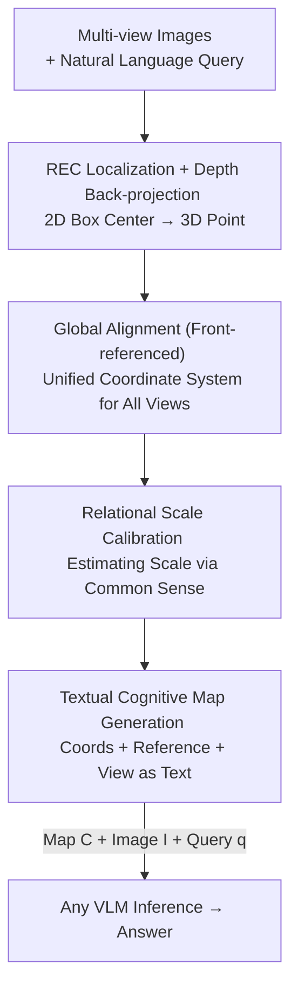

# Spatial Reasoning with Vision-Language Models in Ego-Centric Multi-View Scenes

**Conference**: ICLR 2026  
**OpenReview**: [https://openreview.net/forum?id=fqehqG4WvL](https://openreview.net/forum?id=fqehqG4WvL)  
**Code**: Available (Project page / Supplementary materials)  
**Area**: Multimodal VLM / Spatial Reasoning / Embodied AI  
**Keywords**: Ego-centric Multi-view, 3D Spatial Reasoning, Cognitive Map, Training-free, VLM benchmark

## TL;DR
Addressing ego-centric multi-view scenarios (e.g., autonomous driving/robotics) where cameras simultaneously cover front, rear, left, and right views, this paper establishes the first outdoor 3D spatial reasoning benchmark, Ego3D-Bench (8.6K QA). It proposes **Ego3D-VLM**, a **training-free, plug-and-play** framework that localizes queried objects in 3D global coordinates to generate a compact "textual cognitive map." Feeding this map into any VLM improves MCQA accuracy by an average of 12% and reduces absolute distance RMSE by an average of 56%.

## Background & Motivation

**Background**: Enabling VLMs to understand 3D spatial relationships is a core capability for embodied intelligence. Existing spatial reasoning benchmarks generally fall into two categories: those based on **single images** (SpatialVLM, SpatialRGPT, etc.) or those based on **indoor static videos** (VSI-Bench, where a single camera moves through a room to capture spatial relations).

**Limitations of Prior Work**: Real embodied agents (autonomous vehicles, mobile robots) rely on **ego-centric multi-view** observations—multiple cameras capturing front, side, and rear views simultaneously. These views are not interchangeable visual inputs; they carry **directional semantics** linked to the agent's reference frame: "left" and "right" are fixed directions relative to the vehicle and must maintain temporal consistency in dynamic scenes. Existing indoor video benchmarks lack this structured, directional, and time-evolving multi-view nature, nor do they evaluate VLM reasoning capabilities across these spatially anchored perspectives.

**Key Challenge**: To incorporate 3D information, prior methods either reconstructed **point clouds** or rendered **Bird's Eye Views (BEV)**. While information-rich, these representations are difficult to reconstruct in dynamic scenes, fragile under sparse multi-view input, and increase inference time by over 10x—directly conflicting with the real-time requirements of embodied agents.

**Goal**: The objective is twofold: (1) construct a benchmark specifically for ego-centric multi-view outdoor scenarios; (2) design a lightweight method to enhance the 3D spatial reasoning of any VLM without requiring training or introducing heavy representations like point clouds or BEVs.

**Key Insight**: The authors hypothesize that the key bottleneck for VLMs in multi-view scenarios is the **inability to integrate multiple views into a coherent world model**. Humans naturally fuse left, right, and front views into a unified spatial representation for real-time reasoning and navigation.

**Core Idea**: Replace point clouds/BEV with a "textual cognitive map" that **focuses only on queried objects**. It records the 3D global coordinates and source view of each referenced object as compact text, consuming minimal tokens and allowing it to be integrated into prompts for any off-the-shelf VLM.

## Method

### Overall Architecture
Ego3D-VLM is a training-free inference-time framework. The input consists of a set of multi-view images $I=\{I^{(v)}\}_v$ and a natural language query $q$; the output is the answer $a$ provided by the VLM. It does not update VLM weights but inserts a textual cognitive map $C$ into the prompt as a structured spatial anchor.

The pipeline is as follows: first, a Referring Expression Comprehension (REC) model identifies objects mentioned in the prompt within each view to obtain 2D box centers. Then, a metric depth estimator assigns depth values to each center point, back-projecting 2D pixels into 3D points in the camera coordinate system. These points are unified into a global reference frame using the **front-view camera coordinate system as the global anchor** (simulating human perception centered on the forward direction). Next, "Relational Scale Calibration" scales the coordinates to physically plausible real-world metrics. Finally, the cognitive map generation function $F_{cog}$ organizes the "3D global coordinates + referring expression + source view" of all objects into a textual map $C$, which is sent to the VLM along with the original multi-view images and the query. The textual map provides 3D anchoring while the original images provide appearance, color, and fine-grained cues.

### Key Designs

**1. REC + Metric Depth → Front-referenced Global 3D Alignment: Fusing Multi-view Pixels into a Unified World**

This step addresses the bottleneck where VLMs fail to fuse multiple views. For each view $v$, the REC model (Grounding-DINO) returns a 2D box $b_i^{(v)}$ and the matching expression $c_i^{(v)}$ for objects in the prompt, taking the center pixel $u_i^{(v)}=(x_i,y_i)$. A metric depth estimator (Depth-Anything-V2-Metric) predicts a dense depth map $D^{(v)}$, and the center depth $d_i^{(v)}=D^{(v)}(x_i,y_i)$ is extracted. Using camera intrinsics $K^{(v)}$, the pixel is back-projected to the camera coordinate system:

$$p_{cam,i}^{(v)} = d_i^{(v)} \cdot \big(K^{(v)}\big)^{-1}\begin{bmatrix}x_i\\ y_i\\ 1\end{bmatrix}$$

Then, rotation $R^{(v)}$ and translation $T^{(v)}$ are used to unify the 3D points from all views into the **front camera coordinate system**:

$$p_{global,i}^{(v)} = \begin{bmatrix}R^{(v)} & T^{(v)}\\ 0 & 1\end{bmatrix}\cdot \begin{bmatrix}p_{cam,i}^{(v)}\\ 1\end{bmatrix}$$

Using the "front view as reference" deliberately mimics the human perceptual mechanism of building a 3D world relative to the forward direction. This resulting representation consists of global coordinates for a few key objects rather than a heavy point cloud, avoiding reconstruction difficulties in dynamic sparse scenes.

**2. Relational Scale Calibration: Grounding Coordinates in Physical Scale via Common Sense**

Scales derived from monocular depth estimation are often inaccurate, causing distorted 3D coordinates. The authors draw inspiration from how humans use anchors (e.g., knowing an adult is ~1.7m tall to infer the size of adjacent objects). Familiar categories (cars, pedestrians, bicycles) are identified in representative frames to calculate an estimated average height $h_{est}$. Using a common-sense standard height $h_{cs}$ (e.g., 1.7m for humans), a scaling factor $s = h_{cs}/h_{est}$ is computed. All 3D points are scaled as $p_{scaled,i}^{(v)} = s\cdot p_{global,i}^{(v)}$. This allows for physically reasonable scales **without ground truth depth**—a step that reduced RMSE by 2.5 meters in ablation studies (v3→v4).

**3. Textual Cognitive Map Generation: Sparse, Efficient, and Plugin-ready**

This is the core design addressing the "heavy and slow" nature of point clouds/BEVs. The function $F_{cog}$ outputs a textual map based on the 3D global coordinates and referring expressions of detected objects:

$$C = F_{cog}\Big(\big\{p_{scaled,i}^{(v)},\, c_i^{(v)}\big\}_{i,v}\Big)$$

$F_{cog}$ builds an agent-centric world model, linking each referred object to its spatial position and source view in a compact, human-readable format. Unlike point clouds, it **only focuses on objects mentioned in the prompt**, leading to minimal token consumption. The final VLM answer is $a = \mathcal{V}(C, I, q)$. A notable finding is that feeding the map to a text-only LLM (Blind LLM) performs worse than the VLM, as the VLM uses images to filter false positives and compensate for false negatives in the map.

## Key Experimental Results

### Main Results
The Ego3D-Bench includes 8.6K QA pairs across 5 task categories (Absolute Distance, Relative Distance, Localization, Motion Reasoning, Travel Time), built from nuScenes, Waymo, and Argoverse 1. It features both ego-centric and object-centric perspectives. Multiple-choice questions are evaluated by accuracy; absolute distance tasks use RMSE (meters). 16 SOTA VLMs were tested.

| Model | Avg. MCQA Acc↑ | Avg. Abs. Dist. RMSE↓ |
|------|------|------|
| Human Level | 85.3 | — |
| GPT-4o | 56.7 | 19.2 |
| **Ours + GPT-4o** | **73.2** | **7.4** |
| Gemini-1.5-Pro | 57.5 | 19.6 |
| **Ours + Gemini-1.5-Pro** | **73.1** | **7.2** |
| InternVL3-78B | 59.9 | 13.8 |
| **Ours + InternVL3-78B** | **71.8** | **7.4** |
| Qwen2.5-72B | 58.0 | 16.2 |
| **Ours + Qwen2.5-72B** | **69.5** | **7.5** |

Overall: Small models (3B/8B) perform near random, indicating weak multi-view 3D reasoning. While large models exceed random performance, they still lag behind humans. Aggregating Ego3D-VLM leads to universal gains across all sizes and tasks (RMSE reduction of 56%, Acc gain of 12%). On object-centric absolute distance tasks, VLMs with Ego3D-VLM even **outperform humans**, as humans struggle to estimate distances between object centers without explicit 3D information.

### Ablation Study
Incremental components added to InternVL3-8B:

| Configuration | MCQA Acc↑ | Abs. Dist. RMSE↓ | Description |
|------|------|------|------|
| v0 Baseline | 43.1 | 27.2 | Original VLM |
| v1 + Cog. Map (Est. R,T,K) | 56.0 | 10.8 | Significant gain using estimated camera params |
| v2 + GT K | 56.3 | 10.1 | Using Ground Truth Intrinsics |
| v3 + GT R,T | 58.4 | 10.4 | Using Ground Truth Extrinsics |
| v4 + Scale Calib. | 60.1 | 8.0 | Full Ego3D-VLM; RMSE drops by 2.5m |
| v5 + Object Name List | 61.8 | 6.5 | Feeding object names to REC (Oracle probe) |
| v6 GT Cog. Map | 79.4 | 1.3 | Using GT 3D coords; ~5% from Human performance |

### Key Findings
- **Cognitive Map is the primary contributor**: The transition from v0 to v1 (introducing the textual map with estimated parameters) jumped accuracy from 43.1 to 56.0 and slashed RMSE from 27.2 to 10.8.
- **Effectiveness with estimated parameters**: Performance with GT extrinsics (v3) was only slightly higher than estimated parameters (v1), showing the method's robustness for deployment where GT extrinsics are unavailable.
- **VLM error tolerance**: Blind LLMs fail when the map contains detection errors, whereas VLMs use original images to filter map hallucination and compensate for missed objects.
- **Cross-benchmark generalization**: Ego3D-VLM consistently outperforms baselines on All-Angle-Bench and VSI-Bench, despite they not being purely ego-centric.

## Highlights & Insights
- **Replacing Point Clouds/BEV with "Textual Maps"** is a brilliant strategy: reducing expensive 3D representations to a few lines of text provides 3D anchoring with minimal tokens and no model retraining—a classic "light representation for heavy reasoning" approach.
- **Query-focused sparsity**: By only mapping objects mentioned in the prompt, the method avoids the reconstruction fragility of point clouds in sparse, dynamic scenes.
- **Relational Scale Calibration** resolves scale ambiguity using common-sense anchors, a cost-effective trick for obtaining physical metrics from monocular depth.

## Limitations & Future Work
- **Dependency on upstream REC and Depth components**: False positives/negatives and depth errors propagate into the map; the gap between the oracle (v5/v6) and current performance suggests room for improvement in these modules.
- **Localization remains difficult**: Even with the map, VLMs struggle with tasks requiring complex mental map re-orientation (e.g., inferring Object A's position from Object B's perspective).
- **Domain limitation**: Evaluated primarily on outdoor driving datasets; applicability to indoor multi-view scenarios requires more validation.

## Related Work & Insights
- **vs. Point Cloud / BEV 3D-VLMs (e.g., GPT4Scene, 3D-LLM)**: These models reconstruct full scenes, which is slow (>10x) and difficult in dynamic settings. Ours uses sparse textual maps that are training-free and efficient.
- **vs. Spatial Preference Training (e.g., SpatialVLM)**: Those methods require massive synthetic data to **train** specialized VLMs. Ours is a plug-and-play framework for any existing VLM and shows stronger performance in multi-view reasoning.

## Rating
- Novelty: ⭐⭐⭐⭐⭐ 
- Experimental Thoroughness: ⭐⭐⭐⭐⭐ 
- Writing Quality: ⭐⭐⭐⭐ 
- Value: ⭐⭐⭐⭐⭐ 

<!-- RELATED:START -->

<!-- RELATED:END -->

## Related Papers

- [\[ICLR 2026\] Seeing Across Views: Benchmarking Spatial Reasoning of Vision-Language Models in Robotic Scenes](seeing_across_views_benchmarking_spatial_reasoning_of_vision-language_models_in_.md)
- [\[ICLR 2026\] Spatial-DISE: A Unified Benchmark for Evaluating Spatial Reasoning in Vision-Language Models](spatial-dise_a_unified_benchmark_for_evaluating_spatial_reasoning_in_vision-lang.md)
- [\[ICLR 2026\] OmniSpatial: Towards Comprehensive Spatial Reasoning Benchmark for Vision Language Models](omnispatial_towards_comprehensive_spatial_reasoning_benchmark_for_vision_languag.md)
- [\[ICLR 2026\] MMR-Life: Piecing Together Real-life Scenes for Multimodal Multi-image Reasoning](mmr-life_piecing_together_real-life_scenes_for_multimodal_multi-image_reasoning.md)
- [\[ICLR 2026\] SpatiaLab: Can Vision-Language Models Perform Spatial Reasoning in the Wild?](spatialab_can_vision-language_models_perform_spatial_reasoning_in_the_wild.md)

<!-- RELATED:END -->
