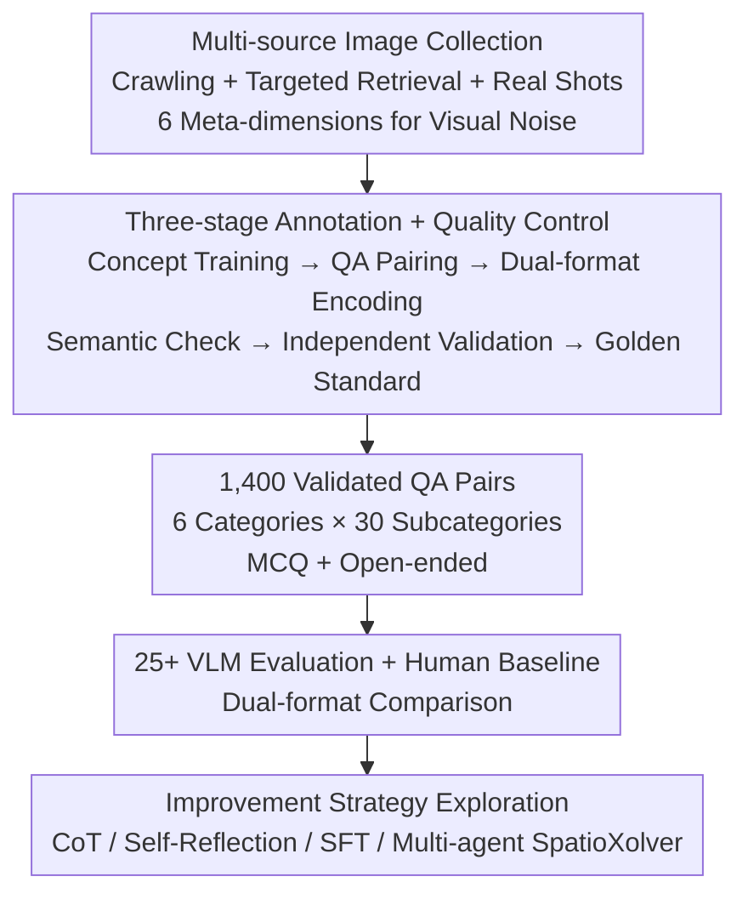

# SpatiaLab: Can Vision-Language Models Perform Spatial Reasoning in the Wild?

**Conference**: ICLR 2026  
**arXiv**: [2602.03916](https://arxiv.org/abs/2602.03916)  
**Code**: [spatialab-reasoning.github.io](https://spatialab-reasoning.github.io/)  
**Area**: Multimodal VLM  
**Keywords**: Spatial Reasoning, VLM Benchmark, MCQ Evaluation, Open-ended Evaluation, Real-world Scenarios

## TL;DR
SpatiaLab is introduced as a real-world spatial reasoning benchmark containing 1,400 vision-QA pairs across 6 major categories and 30 subcategories. Supporting both MCQ and open-ended evaluations, it reveals a significant spatial reasoning gap between the strongest current VLM (InternVL3.5-72B at 54.93% MCQ) and humans (87.57%), with the disparity widening in open-ended settings.

## Background & Motivation

**Background**: Spatial reasoning is a fundamental human cognitive ability, critical for robotics, autonomous driving, and AR/VR. While VLMs have advanced in multimodal representation and language grounding, spatial judgments in real-world environments remain fragile.

**Limitations of Prior Work**:
   - Existing spatial reasoning benchmarks are overly simplified, focusing mostly on binary spatial relations, low-resolution depth classification, or synthetic/puzzle-like scenes.
   - Controlled environments reduce perception and reasoning difficulty, leading to superficial saturation that masks failures under distribution shifts.
   - Key challenges such as occlusion reasoning, cross-view scale consistency, and path planning under partial observability are severely undersampled.
   - Models performing well on synthetic benchmarks like ScanQA or BLINK often fail in real-world scenarios.

**Key Challenge**: Humans seamlessly integrate multi-dimensional spatial information involving relative position, depth, orientation, scale, navigation, and 3D geometry. VLMs significantly underperform humans in any single dimension, let alone joint multi-dimensional reasoning.

**Goal**:
   - Construct a real-world benchmark covering all core axes of spatial reasoning.
   - Employ both MCQ and open-ended formats to avoid format bias.
   - Evaluate over 25 VLMs and establish human baselines.
   - Analyze failure modes to provide actionable improvement directions.

**Key Insight**: Grounded in the spatial cognition taxonomy of cognitive psychology, spatial reasoning is systematically decomposed into 6×5=30 fine-grained task types using real photographs instead of synthetic data.

**Core Idea**: SpatiaLab systematically exposes fundamental VLM deficiencies in depth perception, occlusion reasoning, navigation planning, and 3D geometry through dual-format evaluations of 30 real-world spatial reasoning tasks.

## Method

### Overall Architecture
SpatiaLab aims to determine if VLMs can perform spatial reasoning when confronted with cluttered real-world photographs. It decomposes spatial cognition into 6 major categories—Relative Positioning, Depth & Occlusion, Orientation, Size & Scale, Spatial Navigation, and 3D Geometry—each divided into 5 subcategories for a total of 30 task types. The pipeline involves multi-source image collection covering visual noise across 6 meta-dimensions, followed by a three-stage human annotation process with quality control to produce QA pairs in both MCQ (4-choice) and open-ended formats. The resulting benchmark contains 1,400 validated QA pairs (≥25 per subcategory). The study then evaluates models and explores improvement strategies.

### Key Designs

**1. Multi-source Image Collection: Reflecting Real-world Visual Noise**

Unlike benchmarks using synthetic or puzzle scenes, SpatiaLab uses three complementary sources for visual diversity: automated web crawling, targeted online searches for specific spatial relations, and manual indoor/outdoor photography. Collection is gridded across 6 meta-dimensions—lighting, texture complexity, edge complexity, spatial relations, material types, and gravity constraints. The resulting library is highly complex: averaging 21.48 objects per image, 11.88 partially visible objects, 3.23 depth layers, and requiring 2.07 spatial reasoning steps to solve.

**2. Three-stage Annotation + Triple Quality Control: Ensuring Reliability**

To prevent errors in complex scenes, Phase 1 trains annotators on spatial concept standards. Phase 2 generates spatial QA pairs for each image. Phase 3 encodes each pair into MCQ and open-ended formats. Triple review follows: semantic validation of the question, independent answer verification, and final golden standard establishment. This ensures 1:1 correspondence between MCQ and open-ended answers.

**3. Improvement Strategy Exploration: Systematic Probing of Solutions**

The study evaluates several enhancement methods: intrinsic model reasoning, CoT prompting, CoT with self-reflection, SFT (fine-tuning Qwen-VL2.5-3B-Instruct on 40% of the data), and the multi-agent system SpatioXolver. Findings indicate no "silver bullet"—SFT benefits navigation and orientation, while multi-agent reasoning helps with orientation but stagnates or degrades in occlusion and scale categories.

### Loss & Training
The benchmark itself requires no training loss. SFT experiments for improvement strategies utilized standard supervised loss to fine-tune Qwen-VL2.5-3B-Instruct (40% train / 60% eval).

## Key Experimental Results

### Main Results (MCQ Format, 25+ Models)

| Model | 3D Geometry | Depth & Occlusion | Orientation | Relative Position | Scale | Navigation | Overall |
|------|-------|---------|------|---------|------|------|------|
| Human Baseline | 93.70 | 74.13 | 91.58 | 91.51 | 88.89 | 87.76 | **87.57** |
| InternVL3.5-72B | 50.00 | 57.14 | 53.47 | 66.04 | 49.21 | 54.85 | 54.93 |
| GPT-5-mini | 48.74 | 54.83 | 60.40 | 62.74 | 44.84 | 56.54 | 54.29 |
| o4-mini-medium | 51.26 | 58.30 | 54.95 | 64.15 | 40.87 | 51.48 | 53.21 |
| Spatial-specific Models | ~42 | ~38 | ~48 | ~38 | ~43 | ~39 | ~41 |
| Random Choice | 25.00 | 25.00 | 25.00 | 25.00 | 25.00 | 25.00 | 25.00 |

### Open-ended Format Comparison

| Model | Overall MCQ | Overall Open-ended | Gain (Drop) |
|------|--------|----------|---------|
| GPT-5-mini | 54.29 | **40.93** | -13.36 |
| o4-mini-medium | 53.21 | 37.86 | -15.35 |
| InternVL3.5-72B | 54.93 | 23.36 | **-31.57** |
| Human Baseline | 87.57 | 64.93 | -22.64 |
| Avg. MCQ→Open gap | - | - | **-23.0%** |

### Key Findings
- **Strongest models reach only 55% (MCQ) / 41% (Open-ended)**: A vast gap remains compared to humans (88%/65%). Spatial-specific models performed worse (~41%), suggesting current specialization methods are ineffective.
- **Open-ended evaluation reveals true capability**: The average performance drop from MCQ to Open-ended is 23%, with spatial-specific models dropping most (~27%), indicating MCQ overestimates actual reasoning.
- **Three hardest categories**: Size & Scale, Depth & Occlusion, and Spatial Navigation are consistent bottlenecks, with most models scoring below 50%/30%.
- **Model scale $\neq$ spatial reasoning**: Llama-3.2-11B scored only 30.5%, worse than several 4B models, indicating spatial reasoning requires specific capabilities beyond pure scaling.
- **Limited effect of reasoning enhancements**: CoT helps with orientation; SFT improves navigation (+7.69%), but multi-agent systems degrade in occlusion/scale tasks.
- **Systematic failure modes**: Tasks involving object rotation (2%), reflective surfaces (<20%), and tool handedness (<30%) saw near-total failure across models.

## Highlights & Insights
- **Sophisticated Real-world + Dual-format Design**: 1,400 tasks covering 30 types represent the most fine-grained classification in spatial reasoning. The MCQ+Open-ended dual format eliminates format bias, a critical issue ignored by previous benchmarks.
- **Counter-intuitive Finding on Specialized Models**: SpaceOm, SpaceThinker, and SpaceQwen lag behind general models like InternVL3.5-72B in real scenarios, suggesting that spatial capabilities trained on synthetic data do not generalize.
- **Diagnostic Value of Error Analysis**: Clustering analysis reveals failures are concentrated in spatial mislocalization, perspective/scale errors, and occlusion ordering failures, directly linked to a lack of geometric supervision in VLMs.
- **Necessity of Open-ended Evaluation**: The drop in performance is most significant in navigation (requiring multi-step reasoning), showing that current VLMs rely on elimination strategies rather than true understanding.

## Limitations & Future Work
- While high quality, the volume of 1,400 questions (25+ per subcategory) might be limited for perfectly stable evaluation.
- Open-ended evaluation relies on an LLM judge (Gemini-2.5-Flash); despite a Cohen's kappa of 0.738, the judgement is not infallible.
- Temporal-spatial reasoning in video scenes is not covered.
- **Future Directions**: Developing spatial reasoning pre-training data based on physics engines or introducing explicit geometric encoding modules in VLMs to bridge the gap.

## Related Work & Insights
- **vs BLINK-Spatial (2024)**: 14 tasks/3.8K questions but mixes synthetic and real data; best score 59%. SpatiaLab is more fine-grained and challenging.
- **vs OmniSpatial (2025)**: 50 categories but only 1.5K questions in puzzle settings; best score 56%. SpatiaLab emphasizes realistic cluttered scenes.
- **vs VSI-Bench (2025)**: An indoor video benchmark with 8 categories, best score 45%. SpatiaLab covers broader scene types and image modalities.

## Rating
- Novelty: ⭐⭐⭐⭐ 30 task types + dual-format design is novel, though the core methodology of benchmark construction is established.
- Experimental Thoroughness: ⭐⭐⭐⭐⭐ 25+ models, human baselines, improvement strategies, and comprehensive error analysis.
- Writing Quality: ⭐⭐⭐⭐ Clear structure and deep analysis, despite length.
- Value: ⭐⭐⭐⭐⭐ Fills the gap in real-world spatial reasoning evaluation and provides clear guidance for the VLM community.

<!-- RELATED:START -->

## Related Papers

- [\[ICLR 2026\] Spatial-DISE: A Unified Benchmark for Evaluating Spatial Reasoning in Vision-Language Models](spatial-dise_a_unified_benchmark_for_evaluating_spatial_reasoning_in_vision-lang.md)
- [\[ICLR 2026\] OmniSpatial: Towards Comprehensive Spatial Reasoning Benchmark for Vision Language Models](omnispatial_towards_comprehensive_spatial_reasoning_benchmark_for_vision_languag.md)
- [\[ICLR 2026\] VideoReasonBench: Can MLLMs Perform Vision-Centric Complex Video Reasoning?](videoreasonbench_can_mllms_perform_vision-centric_complex_video_reasoning.md)
- [\[ICLR 2026\] SpatialLadder: Building Spatial Reasoning Capabilities for Vision-Language Models via Progressive Training](spatialladder_progressive_training_for_spatial_reasoning_in_vision-language_mode.md)
- [\[ICLR 2026\] Spatial Reasoning with Vision-Language Models in Ego-Centric Multi-View Scenes](spatial_reasoning_with_vision-language_models_in_ego-centric_multi-view_scenes.md)

<!-- RELATED:END -->
