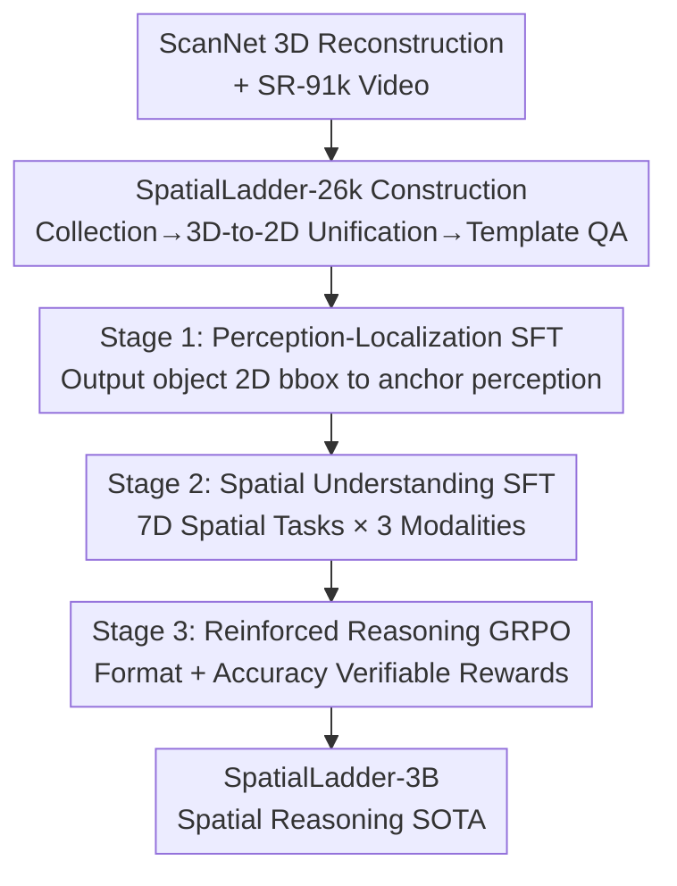

# SpatialLadder: Building Spatial Reasoning Capabilities for Vision-Language Models via Progressive Training

**Conference**: ICLR 2026  
**OpenReview**: [https://openreview.net/forum?id=KtrFXlvgrK](https://openreview.net/forum?id=KtrFXlvgrK)  
**Code**: https://github.com/ZJU-REAL/SpatialLadder  
**Area**: Multimodal VLM / LLM Reasoning  
**Keywords**: Spatial Reasoning, Progressive Training, GRPO, Curriculum Learning, VLM

## TL;DR
This paper proposes SpatialLadder, which first constructs a 26k spatial dataset covering localization, single-image, multi-view, and video using ScanNet reconstruction. It then employs a three-stage progressive training strategy: "Perception-Localization → Spatial Understanding → Reinforced Reasoning." This approach trains a 3B Qwen2.5-VL to reach spatial reasoning SOTA, achieving a 23.4% overall improvement over the base model and surpassing GPT-4o by 20.8%.

## Background & Motivation
**Background**: VLMs have become highly proficient in conventional visual tasks, but "spatial reasoning"—judging relative positions, distances, orientations, and cross-view correspondences of objects—remains a significant challenge. Current mainstream approaches either apply reinforcement learning directly to question-answering pairs (e.g., R1-Zero-VSI, SpaceR) or incorporate external 3D representations (e.g., Spatial-MLLM) to provide models with spatial knowledge.

**Limitations of Prior Work**: The authors point out two fundamental issues. First, existing spatial datasets are fragmented and narrow in scope, focusing either on 2D images or 3D scenes, and lack systematic cross-modal coverage and standardized annotation processes, leading to incomplete training signals. Second, existing methods treat spatial reasoning as a "monolithic capability," attempting to learn it end-to-end from QA pairs. This skips the natural hierarchical path of "seeing objects → understanding spatial relations → logical inference," resulting in models that merely memorize answer patterns and fail to generalize to new spatial configurations.

**Key Challenge**: The authors conducted a crucial controlled experiment to locate the bottleneck: by gradually adding perceptual prompts to 200 spatial orientation questions, the model's accuracy increased by 5.0% with location prompts (bounding boxes) and another 4.5% with orientation cues, totaling a 9.5% improvement. This indicates that the model **possesses latent reasoning capabilities but lacks the perceptual anchors to activate them**. The bottleneck lies not in reasoning capacity but in the connection between perception and reasoning.

**Goal**: Instead of directly optimizing reasoning output, the goal is to build spatial intelligence hierarchically by layering "Perception → Understanding → Reasoning" stage by stage.

**Core Idea**: Use a unified, standardized multimodal dataset combined with a three-stage progressive training framework—"Perception-Localization for Foundation → Multi-dimensional Spatial Understanding for Framework → Verifiable Reward RL for Enhanced Reasoning"—to let spatial capabilities grow step-by-step like climbing a ladder.

## Method

### Overall Architecture
SpatialLadder consists of two components: the **SpatialLadder-26k** dataset and a **three-stage progressive training framework**. The dataset provides a complete "learning curriculum" from basic perception to complex reasoning, while the training framework ensures the model absorbs this curriculum hierarchically. The input is a standard Qwen2.5-VL-3B base model, and the output is a model of the same size that achieves SOTA in spatial reasoning—without architectural changes or external 3D encoders, relying solely on data organization and training sequence.

On the data side, the authors use ScanNet 3D reconstructions as the base, producing four complementary task types (object localization, single-image, multi-view, and video) through a "Collection → 3D-to-2D Unification → Template-based QA Generation" pipeline. On the training side, three stages are executed serially: Stage 1 establishes the perceptual foundation with localization tasks, Stage 2 develops spatial understanding with multimodal multi-dimensional tasks, and Stage 3 enhances chain-of-thought reasoning using GRPO. Each stage is built upon the foundation of the previous one.

### Key Designs

**1. SpatialLadder-26k: A curriculum from perception to reasoning via standardized pipeline**

To address "fragmented data and lack of systematic cross-modal coverage," the authors built a standardized pipeline based on ScanNet 3D reconstructions to ensure consistent annotation across four modalities. The pipeline involves three steps: collecting ScanNet scenes and sampling 9,000 videos from SR-91k; performing 3D-to-2D transformation and unification to export 3D/2D bounding boxes, 3D absolute positions, camera-relative 2D positions, visibility ratios, and object sizes; and generating QA pairs using templates adapted from VSI-Bench. This resulted in 26,610 samples: 5,929 for object localization, 5,929 for single-image, 5,752 for multi-view, and 9,000 for video, spanning seven dimensions: relative direction, relative distance, absolute distance, object size, counting, room size, and order of appearance. The key is "hierarchical progression"—localization builds the perceptual base, single-image provides the entry for static reasoning, multi-view requires cross-view integration for implicit 3D understanding, and video (1–4 mins, 24fps) adds temporal dynamics.

**2. Three-stage Progressive Training: Seeing, Understanding, then Reasoning**

This design directly addresses the "poor generalization caused by treating spatial reasoning as a monolithic capability." The three stages correspond to the layers of spatial intelligence. Stage 1 (Perception-Localization SFT): SFT on ~6k localization samples teaches the model to link visual inputs with spatial queries, outputting JSON with object identity and 2D bboxes. This cultivates the ability to distinguish spatial objects from backgrounds, perform robust detection, and map language to visual regions. Stage 2 (Spatial Understanding SFT): Comprehensive tasks across seven dimensions and three modalities are introduced—single-image for basic relations, multi-view for cross-view integration/implicit 3D, and video for temporal/motion tracking. The model switches between multiple-choice (discrete concepts) and numerical tasks (precise measurement). Stage 3 (Reinforcement Learning): The understanding from the previous stages is converted into explicit chain-of-thought reasoning. Each stage strictly builds upon the previous one, which is the essential difference from the "direct end-to-end" approach.

**3. Task-specific Verifiable Rewards + GRPO: Preventing "hallucinated" reasoning chains**

Stage 3 reward design addresses the issue where optimizing only for answer accuracy leads to "plausible but incorrect" reasoning. The authors use a dual-component reward $R(o, y) = r_{\text{format}}(o) + r_{\text{accuracy}}(o, y)$. The format reward checks for the correct use of `<think>` and `<answer>` tags to enforce explicit reasoning. The accuracy reward is task-specific: binary (0 or 1) for multiple-choice questions and a progressive reward based on relative error thresholds for numerical questions: $r_{\text{accuracy}} = \frac{1}{|\mathcal{T}|}\sum_{\tau\in\mathcal{T}} \mathbb{I}\!\left(\frac{|\hat{y}-y|}{y} < \tau\right)$, where closer values yield higher scores. GRPO is used for optimization: for each question $q$, a group of candidates $\{o_1,...,o_G\}$ is sampled from the old policy, and the advantage $A_i = \frac{r_i - \text{mean}(r)}{\text{std}(r)}$ is calculated via group-relative normalization. The policy is updated using a clipped objective with KL regularization:

$$J_{\text{GRPO}}(\theta) = \mathbb{E}_{q,o_i}\!\left[\frac{1}{G}\sum_{i=1}^{G}\min\!\left(\frac{\pi_\theta(o_i|q)}{\pi_{\theta_{old}}(o_i|q)}A_i,\ \text{clip}\!\left(\frac{\pi_\theta(o_i|q)}{\pi_{\theta_{old}}(o_i|q)}, 1\pm\varepsilon\right)A_i\right) - \beta\,\text{KL}[\pi_\theta\|\pi_{ref}]\right]$$

The group-relative normalization avoids the need for a separate value network, and the dual rewards stabilize training while constraining both reasoning quality and answer correctness.

### Loss & Training
The base model is Qwen2.5-VL-3B. Stages 1 and 2 utilize Supervised Fine-Tuning (SFT), while Stage 3 uses GRPO reinforcement learning. The training follows a progressive schedule with stage-specific hyperparameters.

## Key Experimental Results

### Main Results

In-domain (Overall across six metrics, unit %):

| Model | VSI-Bench | SPBench-SI | SPBench-MV | Overall |
|------|-----------|------------|------------|---------|
| GPT-4o | 34.0 | 42.4 | 48.2 | 41.5 |
| Gemini-2.0-Flash | 45.4 | 54.7 | 51.4 | 50.5 |
| Spatial-MLLM-4B | **47.3** | 43.7 | 61.8 | 50.9 |
| Qwen2.5-VL-3B (base) | 29.4 | 40.3 | 36.6 | 35.4 |
| **SpatialLadder-3B** | 45.7 | **70.2** | **70.9** | **62.3** |
| Improvement vs base | +16.3 | +29.9 | +34.3 | **+23.4** |

The 3B SpatialLadder achieves an overall 62.3%, surpassing both open-source and closed-source baselines, including larger models like the 7B SpaceR (50.8) and VILASR (51.1). Notably, while Spatial-MLLM relies on a dedicated 3D encoder to achieve 47.3% on VSI-Bench, SpatialLadder reaches a comparable 45.7% using a standard VLM architecture, proving that **progressive training can substitute for architectural modifications**.

Out-of-domain Generalization (Overall):

| Model | CV-Bench | SPAR | ViewSpatial | MMSI | MindCube | Overall |
|------|----------|------|-------------|------|----------|---------|
| GPT-4o | 75.4 | 36.4 | 32.6 | 30.3 | 38.8 | 42.7 |
| Qwen2.5-VL-3B (base) | 70.6 | 24.6 | 35.6 | 26.5 | 33.2 | 38.1 |
| **SpatialLadder-3B** | 73.7 | 34.4 | 44.2 | 29.2 | 43.4 | **45.0** |
| Improvement | +3.1 | +9.8 | +8.6 | +2.7 | +10.2 | +6.9 |

Ours achieves 45.0% OOD overall, exceeding GPT-4o (42.7%) and gaining 6.9% over the base. The largest gains are in ViewSpatial (+8.6, viewpoint-dependent understanding) and MindCube (+10.2, spatial theory of mind), indicating the learning of transferable spatial intelligence rather than overfitting.

### Ablation Study

| Configuration | Drop | Description |
|------|------|------|
| Full model | — | Complete three-stage training |
| w/o Stage 2 | -9.4% | Spatial understanding SFT, the most critical foundation |
| w/o Stage 3 | -2.1% | Removal of RL reasoning enhancement |
| w/o Stage 1 | -1.8% | Removal of perception-localization |
| w/o Single+Multi-view data | -16.4% | Largest drop, also affecting VSI-Bench |
| w/o Chain-of-Thought (CoT) | -0.8% | CoT consistently provides positive gains |

### Key Findings
- **Stage 2 (Spatial Understanding) is the cornerstone**: Its removal causes a 9.4% drop, significantly more than Stage 1 (-1.8) or Stage 3 (-2.1), showing explicit spatial cognition is central.
- **Multimodal diversity is indispensable**: Removing single-image and multi-view data results in the largest drop (-16.4%) and harms video-based VSI-Bench scores, confirming cross-modal diversity is essential for robust reasoning.
- **Emergence of semantic consistency in RL**: Quantified by semantic entropy, uncertainty rises from 1.24 to 1.47 during Stages 1-2 (capacity expansion) and only converges after Stage 3 RL optimization.
- CoT reasoning provides a stable +0.8% and leads to lower reward variance and smoother convergence.

## Highlights & Insights
- **Pinpointing the bottleneck via controlled experiments**: The experiment adding perceptual prompts (+5.0% location, +4.5% orientation) clearly proves the bottleneck is the perception-reasoning link, providing a strong justification for the method.
- **Progressive training as a substitute for architectural change**: A standard 3B VLM achieves parity with models using specialized 3D encoders solely through training sequence. This suggests many "architecting" needs might be addressed via curriculum design.
- **Leveraging 3D reconstruction for data pipelines**: Exporting multiple annotations (3D/2D bbox, visibility, size) from ScanNet ensures consistent labels across modalities, a strategy applicable to any task requiring spatial ground truth.

## Limitations & Future Work
- Heavy reliance on indoor ScanNet scenes; the transferability to outdoor/open-world scenarios (e.g., autonomous driving, large-scale navigation) is unverified.
- Scalability to larger models (beyond 3B) was not analyzed to see if benefits would be diluted by native capabilities of larger base models.
- Serial training and manual hyperparameter tuning for each stage introduce implicit costs and potential sensitivity to switching points/data ratios.
- Performance on VSI-Bench is still slightly below Spatial-MLLM (45.7 vs 47.3), suggesting architecture-agnostic routes may have limits in high-precision geometric tasks.

## Related Work & Insights
- **vs SpaceR / R1-Zero-VSI**: These optimize spatial reasoning directly with RL. Ours argues this skips the perceptual foundation and instead uses a three-stage curriculum (SFT for perception/understanding, then RL).
- **vs Spatial-MLLM**: It uses specialized 3D representations. Ours achieves comparable results with a standard VLM via progressive training, proving curriculum can substitute for architecture.
- **vs Video-R1 / VideoChat-R1**: These apply RL to VLMs but focus on temporal understanding/video grounding. Ours specifically designs 7D tasks and verifiable rewards for spatial reasoning.

## Rating
- Novelty: ⭐⭐⭐⭐ Progressive "Perception→Understanding→Reasoning" curriculum + standardized multimodal data; clear logic even if GRPO/SFT components are standard.
- Experimental Thoroughness: ⭐⭐⭐⭐⭐ Six in-domain/OOD benchmarks + component/data ablations + semantic entropy analysis.
- Writing Quality: ⭐⭐⭐⭐ Motivates the approach with elegant controlled experiments; logical and clear.
- Value: ⭐⭐⭐⭐⭐ 3B model outperforming GPT-4o and proving training curricula can replace 3D architecture modifications is highly insightful.

<!-- RELATED:START -->

## Related Papers

- [\[ICLR 2026\] More Thought, Less Accuracy? On the Dual Nature of Reasoning in Vision-Language Models](more_thought_less_accuracy_on_the_dual_nature_of_reasoning_in_vision-language_mo.md)
- [\[ICLR 2026\] Game-RL: Synthesizing Multimodal Verifiable Game Data to Boost VLMs' General Reasoning](game-rl_synthesizing_multimodal_verifiable_game_data_to_boost_vlms_general_reaso.md)
- [\[ICLR 2026\] MetaSpatial: Reinforcing 3D Spatial Reasoning in VLMs for the Metaverse](metaspatial_reinforcing_3d_spatial_reasoning_in_vlms_for_the_metaverse.md)
- [\[ICLR 2026\] Reasoning-Driven Multimodal LLM for Domain Generalization](reasoning-driven_multimodal_llm_for_domain_generalization.md)
- [\[ICLR 2026\] We-Math 2.0: A Versatile MathBook System for Incentivizing Visual Mathematical Reasoning](we-math_20_a_versatile_mathbook_system_for_incentivizing_visual_mathematical_rea.md)

<!-- RELATED:END -->
