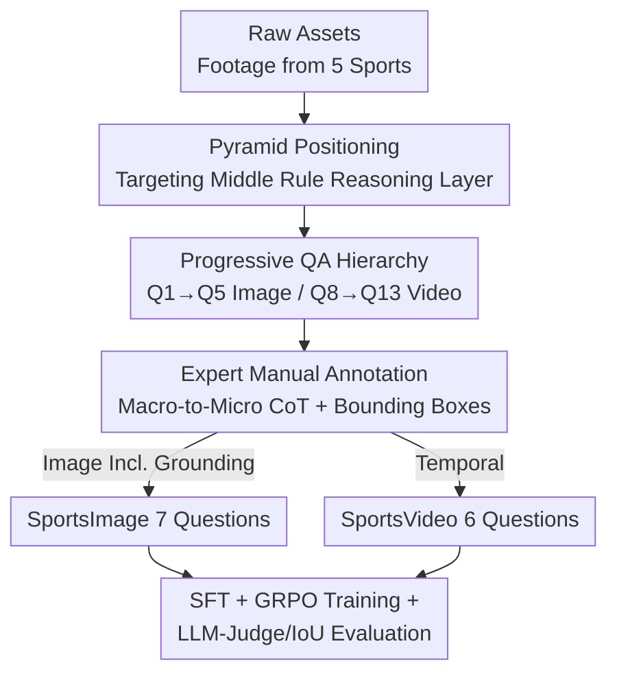

# SportR: A Benchmark for Multimodal Large Language Model Reasoning in Sports

**Conference**: ICLR 2026  
**OpenReview**: [https://openreview.net/forum?id=cPCGB402ff](https://openreview.net/forum?id=cPCGB402ff)  
**Code**: https://github.com/chili-lab/SportR  
**Area**: Multimodal VLM / LLM Reasoning / Benchmarking  
**Keywords**: Sports Understanding, Rule Reasoning, Visual Grounding, Chain-of-Thought Annotation, Cross-modal Generalization

## TL;DR
SportR is the first large-scale multimodal benchmark for "sports rule reasoning" across multiple sports. It comprises 4,789 images and 2,052 videos covering 50 types of fouls and 12 types of tactics across 5 ball games. The dataset includes 6,841 **purely human-written** Chain-of-Thought (CoT) trajectories and precise bounding box annotations. MLLMs are evaluated through a progressive QA hierarchy—ranging from foul identification to penalty prediction and evidence localization. Results indicate that even GPT-5 achieves low scores, with visual grounding $IoU$ generally $<7\%$.

## Background & Motivation

**Background**: Sports analysis is evolving from early stages of action recognition and score prediction toward utilizing MLLMs to understand "why the game unfolds this way." Applications such as automated officiating and tactical analysis require models to combine **fine-grained visual perception** with **abstract rule knowledge** for judgment. To make a correct decision, a model must not only perceive interactions between players but also pinpoint the exact moment of illegal contact and link this visual evidence to specific rule clauses.

**Limitations of Prior Work**: Existing sports benchmarks either focus on a single sport or lack two essential elements for reasoning evaluation. One category consists of multi-sport benchmarks (e.g., SPORTU), which provide explanatory text but lack fine-grained CoT trajectories suitable for training, primarily relying on multiple-choice questions and slow-motion replays that fail to reflect true reasoning capabilities. The second category includes single-sport benchmarks (e.g., SoccerNet-XFoul for soccer, FSBench for figure skating), which offer depth but cannot assess cross-modal generalization. Crucially, these works generally **lack precise visual localization annotations**, making it impossible to verify if a model's judgment is grounded in correct visual evidence or merely a "lucky guess."

**Key Challenge**: The true bottleneck in sports intelligence lies in mapping "perceived visuals" to "abstract rules." Research has shown that models achieve near-perfect scores on basic perception tasks (e.g., identifying the sport) but suffer significant performance drops when actual rule understanding is required. However, existing data lacks both the supervision signals to teach step-by-step reasoning and the means to verify if reasoning is grounded in evidence.

**Goal**: The authors abstract sports understanding into a pyramid: perception at the bottom (largely solved), elite-level difficult cases at the top (currently beyond reach in terms of capability and annotation), and **basic fouls and tactics** in the middle layer, which any experienced participant should master. SportR targets this middle layer, aiming to provide resources that can both **train** reasoning and **evaluate** whether that reasoning is tied to correct visual evidence.

**Core Idea**: By employing a "progressive QA difficulty hierarchy + 100% manual CoT + explicit bounding box localization tasks," a multi-sport, trainable, and evidence-verifiable benchmark is constructed to expose the real gap in current MLLM sports rule reasoning.

## Method

### Overall Architecture

SportR is not a single model but a **benchmark construction and evaluation protocol**. It first defines the evaluation scope using a "Sports Understanding Pyramid" (focusing on the middle reasoning layer) and then decomposes this layer into a hierarchy of 13 questions across two complementary components: **SportsImage** (4,789 static images, Q1–Q7, including explicit bounding box localization) and **SportsVideo** (2,052 videos, Q8–Q13, extending reasoning to the temporal domain). The core of each sample is a CoT reasoning chain **purely hand-written** by 16 sports experts, serving as both the "gold standard reasoning path" for penalty prediction and tactical recognition, and the ground truth for open-ended explanation. Ultimately, 20,000+ structured QA pairs are derived from 6,841 CoT trajectories. Evaluation utilizes $IoU$ for localization and an "average of three closed-source models" (LLM-as-Judge) for text-based questions. SFT + GRPO reinforcement learning is applied to Qwen-2.5VL-7B to verify that this data can indeed train stronger reasoning capabilities.

### Key Designs

**1. Progressive QA Difficulty Pyramid: Decomposing "Sports Understanding" into 13 Diagnostic Questions**

The authors define the "ambition boundary" using a three-layer pyramid: the bottom layer (perception of players, actions, sports) is largely solved; the top layer (elite disputed rules, complex tactical combinations) exceeds current capabilities. SportR anchors on the middle layer of **basic foul and tactical understanding**. Within this scope, 13 questions are instantiated with increasing difficulty: from "Is there a violation?" (Q1/Q8) $\rightarrow$ "What is the specific foul?" (Q2/Q9) $\rightarrow$ "What is the penalty?" (Q3/Q10, requiring multi-step reasoning) $\rightarrow$ "Explain why it is a violation" (Q4/Q11) $\rightarrow$ offensive/defensive tactical recognition (Q6-Q7/Q12-Q13). The image group includes an additional explicit localization task (Q5). This hierarchy allows evaluation to pinpoint precisely where the "perception-classification-penalty-explanation-localization" chain breaks.

**2. 100% Manual Macro-to-Micro CoT Annotation: Providing Trainable Gold Standard Paths**

To address the lack of reasoning processes in existing benchmarks, SportR **discards model-assisted generation**, with 16 sports experts (including 2 NCAA Division I athletes with 12+ years of experience) manually writing 6,841 CoT chains. To ensure consistency, annotations follow a "macro-to-micro" logic flow: (1) Locate the specific area and parties involved; (2) Describe action details and dynamic processes leading to the event; (3) Precisely lock onto the contact point or key visual evidence. A single CoT serves multiple roles: the gold reasoning path for penalty prediction (Q3), the explanation basis for tactics (Q6/Q7), and the standard answer for free-form explanations (Q4). Double-blind verification is used; any sample where experts disagree is discarded to minimize mislabeling risks.

**3. Explicit Visual Grounding Task: Forcing Reasoning to Ground on Evidence via $IoU$**

This is SportR's most unique design, addressing the "right answer for the wrong reason" blind spot. In Q5 (Image group), the model must output **precise bounding box coordinates** for the violation (e.g., the point of illegal contact between two arms). $IoU$ measures the overlap between predicted boxes and the tightest expert-drawn ground truth. This coordinate-level evaluation is restricted to static images because fouls are often defined by discrete, local events (physical contact points) that can be unambiguously annotated in a single frame. This represents the **first** explicit localization task in sports understanding, turning "abstract rule knowledge grounding" into a quantifiable metric.

**4. SFT + GRPO Training & Cross-modal Generalization: Proving Data Utility for Teaching Reasoning**

To prove the efficacy of manual CoT as a training resource, the authors performed a two-stage training on the open-source Qwen-2.5VL-7B: supervised fine-tuning (SFT) followed by Group Relative Policy Optimization (GRPO), **trained only on SportsImage data**. Results showed significant improvements in image tasks (Q2 foul classification rose from 14.4% to 50.7%) and an emergent phenomenon: the model, despite never seeing video during training, saw its video violation recognition (Q8) jump from 25.49% to 59.52%, surpassing all models including GPT-5. This suggests that fine-grained rule reasoning learned on images can **transfer across modalities** to video.

## Key Experimental Results

### Main Results

Evaluation includes closed-source models like GPT-5, Claude 4 Sonnet, and Gemini 2.5 Pro, alongside open-source models like Qwen-VL and LLaVA (Zero-shot, temperature=0.7). Textual assessment used an average of three LLM judges (Pearson $r>0.65$ with humans).

SportsImage Performance (%, Q5 is $IoU$):

| Model | Q1 Violation | Q2 Classification | Q3 Penalty | Q4 Explanation | Q5 Grounding (IoU) | Q6 Offense | Q7 Defense |
|------|------|------|------|------|------|------|------|
| GPT-5 | 69.19 | 44.21 | 44.49 | 41.34 | 5.70 | 65.75 | 58.82 |
| Gemini 2.5 Pro | 58.79 | 17.54 | 19.54 | 35.16 | 3.67 | 21.12 | 45.23 |
| Qwen-2.5VL-72B | 49.97 | 22.92 | 32.61 | 14.64 | 6.93 | 18.83 | 66.96 |
| Qwen-VL-7B (Base) | 48.29 | 14.43 | 21.69 | 12.32 | 4.61 | 24.66 | 21.81 |
| Qwen-VL-7B (SFT) | 69.82 | 50.71 | 33.13 | 32.94 | 2.88 | 55.08 | 76.56 |
| **Qwen-VL-7B (SFT+RL)** | **84.19** | **51.54** | **52.34** | 27.44 | **9.94** | 60.89 | **87.07** |

After SFT+RL, the 7B model achieved the highest scores in 5 out of 7 categories, with $IoU$ doubling to 9.94% (though still very low).

### Cross-modal Generalization (SportsVideo, Trained on Images Only)

| Model | Q8 Video Violation | Q9 Classification | Q10 Penalty | Q11 Explanation | Q12 Offense | Q13 Defense |
|------|------|------|------|------|------|------|
| GPT-5 | 59.17 | 34.39 | 41.83 | 24.02 | 60.82 | 8.42 |
| Gemini 2.5 Pro | 64.93 | 25.69 | 26.71 | 17.81 | 44.18 | 17.87 |
| Qwen2.5-VL-7B (Base) | 25.49 | 15.06 | 11.63 | 8.27 | 33.41 | 3.64 |
| **Ours (SFT+RL)** | **59.52** | 17.53 | 19.71 | 14.89 | 9.37 | 12.88 |

A Gain of ~34% was observed in Q8 on unseen video data after image-only training, outperforming GPT-5.

### Error Analysis (1,500 samples, 6 models)

Errors were categorized into: Visual Hallucination, Domain Knowledge Gap, Reasoning Error, Format Violation, and Visual Perception Error.

- **Video Tasks**: Visual perception errors and hallucinations accounted for 60-70%, indicating that temporal parsing is the primary hurdle for video.
- **Image Tasks**: After removing temporal ambiguity, the **domain knowledge gap increased significantly** (e.g., from 20% to 36% for GPT-5). This reveals that even when the evidence is clear, models struggle to map it to abstract rules.

## Highlights & Insights
- **Versatility of CoT**: Expert-written trajectories are used for training prompt, standard answers, and reasoning paths—maximizing the value of expensive annotations.
- **Evidence as a Hard Metric**: Using bounding boxes and $IoU$ to quantify if the "model is looking at the right spot" exposes the gap between correct answers and correct grounding.
- **Image-to-Video Generalization**: Fine-grained rule reasoning appears to be somewhat modality-agnostic; learning on clean static images and transferring to noisy temporal scenes may be a cost-effective training path.
- **Flipped Error Distribution**: Image tasks reveal "knowledge/reasoning gaps," while video tasks reveal "perception/hallucination gaps," necessitating a dual-modality evaluation.

## Limitations & Future Work
- **Lack of Video Grounding**: Annotating consistent spatio-temporal coordinates in videos is challenging, so SportsVideo lacks grounding tasks.
- **Limited Sport Coverage**: Focuses on 5 ball/racket sports and basic rules; does not cover elite-level disputed cases.
- **Single Model Training**: SFT+GRPO was only conducted on a 7B model; the ceiling for larger models or multi-modality RL remains unexplored.
- **Grounding Ceiling**: The $IoU$ of 9.94% indicates that MLLM spatial evidence grounding is far from practical application.

## Related Work & Insights
- **vs. SPORTU**: SPORTU provides explanations but not fine-grained trainable CoT, uses MCQs, and lacks grounding. SportR uses manual CoT + generative QA + bounding boxes for "reasoning + evidence" evaluation.
- **vs. SoccerNet-XFoul / FSBench**: These focus deeply on single sports (soccer penalties, skating scores) but lack multi-sport generalization testing.
- **Transition from Perception**: Whereas early sports QA focused on action recognition (ActionAtlas), SportR shifts the focus to "why" and "rule adjudication."

## Rating
- Novelty: ⭐⭐⭐⭐ First multi-sport rule reasoning benchmark + first explicit visual grounding task in sports.
- Experimental Thoroughness: ⭐⭐⭐⭐ Covers closed/open models, SFT+RL training, cross-modal generalization, and massive error analysis.
- Writing Quality: ⭐⭐⭐⭐ Clear pyramid framework and 13-question hierarchy.
- Value: ⭐⭐⭐⭐ Provides scarce resources for training and verifying evidence-based reasoning in MLLMs.

<!-- RELATED:START -->

## Related Papers

- [\[ICLR 2026\] VisuLogic: A Benchmark for Evaluating Visual Reasoning Capabilities of Multimodal Large Models](visulogic_a_benchmark_for_evaluating_visual_reasoning_in_multi-modal_large_langu.md)
- [\[CVPR 2026\] PointThinker: Point-Incentivized Parallel Thinking for Multimodal Large Language Model](../../CVPR2026/vlm_reasoning/pointthinker_point-incentivized_parallel_thinking_for_multimodal_large_language_.md)
- [\[ICLR 2026\] LENS: Multi-level Evaluation of Multimodal Reasoning with Large Language Models](lens_multi-level_evaluation_of_multimodal_reasoning_with_large_language_models.md)
- [\[CVPR 2025\] SeqAfford: Sequential 3D Affordance Reasoning via Multimodal Large Language Model](../../CVPR2025/vlm_reasoning/seqafford_sequential_3d_affordance_reasoning_via_multimodal_large_language_model.md)
- [\[ICML 2026\] Vision-aligned Latent Reasoning for Multi-modal Large Language Model](../../ICML2026/vlm_reasoning/vision-aligned_latent_reasoning_for_multi-modal_large_language_model.md)

<!-- RELATED:END -->
