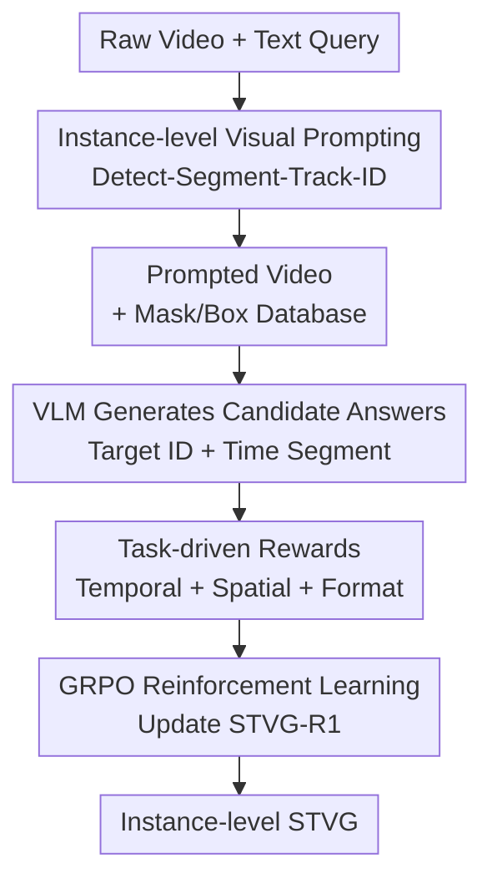

# STVG-R1: Incentivizing Instance-Level Reasoning and Grounding in Videos via Reinforcement Learning

**Conference**: ICLR2026  
**OpenReview**: [https://openreview.net/forum?id=zuPxAZgT9F](https://openreview.net/forum?id=zuPxAZgT9F)  
**Paper**: [Project Page](https://stvg-r1.github.io/)  
**Code**: Not disclosed  
**Area**: Multimodal VLM / Spatial-Temporal Video Grounding / Reinforcement Learning  
**Keywords**: Spatial-Temporal Video Grounding, Instance-level Reasoning, Visual Prompting, GRPO, Video Object Grounding

## TL;DR

STVG-R1 reformulates the difficult frame-by-frame coordinate regression in spatial-temporal video grounding into an instance identification problem—"viewing numbered videos and answering target IDs + time segments." By training the VLM with GRPO and task-specific rewards, the model significantly improves spatial consistency and cross-task generalization on multiple benchmarks like HCSTVG, ST-Align, and MeViS.

## Background & Motivation

**Background**: Spatial-Temporal Video Grounding (STVG) requires a model to simultaneously localize the time segment of an event and the spatial position of the corresponding target based on a text description. Traditional approaches rely on encoders like CLIP/I3D/InternVideo with task-specific fusion modules. Recent VLM-based routes attempt to directly output timestamps, frame-by-frame coordinates, or segmentation tokens for an external decoder.

**Limitations of Prior Work**: Directly outputting coordinates is unnatural for VLMs. Numerical coordinates in text tokens differ fundamentally from actual image positions, leading to hallucinations like out-of-bounds timestamps, meaningless boxes, or frame-to-frame inconsistencies. While decoder-based methods bypass coordinate generation, they require new trainable decoders or tokens, incurring high training costs and unstable generalization to multi-object scenarios.

**Key Challenge**: STVG evaluation fundamentally cares about "whether it is the same object within the correct time segment," rather than requiring the VLM to produce a continuous stream of coordinates. Existing methods package this discriminative problem as dense coordinate generation, forcing the model to learn vision-text alignment, coordinate formatting, and temporal consistency simultaneously, which artificially inflates the difficulty.

**Goal**: This work aims to shift spatial prediction from a continuous coordinate space to a discrete symbolic space where VLMs excel. By overlaying time-consistent numeric IDs on instances in the video, the model answers with target IDs and time ranges. Consequently, spatial grounding is transformed from "generating boxes" to "selecting instances in labeled videos."

**Key Insight**: Visual prompting has proven valuable in image and multi-view scene understanding. Simple markers (red circles, numbers, letters) allow VLMs to refer to visual entities via language. This paper extends this idea to video and utilizes reinforcement learning to directly optimize the temporal IoU, spatial ID accuracy, and output format.

**Core Idea**: Replace frame-by-frame coordinates with time-consistent instance IDs, converting video grounding into a verifiable instance-level reasoning task, and use GRPO to teach the VLM joint temporal-spatial decision-making.

## Method

### Overall Architecture

STVG-R1 consists of two layers: a training-free object-centric visual prompting pipeline that converts raw video into a prompted video with red numeric IDs (while maintaining a mask/box database); and a VLM policy trained via RL. The VLM receives the prompted video and text query, then outputs a `<think>` process followed by the target ID and time segment in `<answer>`. Crucially, the VLM selects an interpretable, trackable instance ID instead of predicting box coordinates.

Formally, given a video $V=\{I_1,\ldots,I_T\}$, each frame is overlaid with visual prompts $P_t=\{p_t^1,\ldots,p_t^{K_t}\}$ to obtain $\tilde I_t = I_t \oplus P_t$, with the prompted video denoted as $\tilde V$. The policy $\pi_\theta$ receives $\tilde V$ and query $q$ to output a predicted time segment $[t_s,t_e]$ and target instance ID $\hat{i}$. To manage memory, videos are sampled at 2 FPS with total pixels constrained to roughly $R=1.6\times 10^6$.

### Key Designs

**1. Instance-level Visual Prompting: Shifting from Regression to Discrete Choice**

The core design transforms the spatial output from continuous coordinates to instance IDs. First, a detector like YOLOv12-x identifies candidates in the first frame; these are used as prompts for SAM2 to generate masks and track them. Red numbers are overlaid at the center of each instance, maintaining temporal consistency. The VLM thus sees an "instance dial" it can reference: the target is no longer "a box at $[x_1, y_1, x_2, y_2]$" but "ID 2." This bypasses VLM coordinate alignment weaknesses.

**2. Prompted Video Construction: Resisting Missed Detections and ID Switches**

To handle objects appearing mid-video or ID fragmentation due to occlusion, the authors employ periodic re-detection. New boxes are compared with existing tracks via IoU; if geometric overlap remains low, they are treated as new instances. SAM2 then propagates masks bi-directionally (forward and backward) to recover full trajectories. Training labels are reconstructed by assigning the most consistent ID (via majority voting) to the ground-truth segment.

**3. Task-driven Rewards: Temporal, Spatial, and Format Signals**

Instead of relying solely on token-level SFT, the model is trained with verifiable rewards. The temporal reward $r_t(o)$ is the IoU between predicted $[t_s,t_e]$ and ground-truth $[t'_s,t'_e]$. The spatial reward $r_s(o)$ is a sparse 0/1 signal: 1 if the predicted ID matches the ground-truth ID within the segment, otherwise 0. The format reward $r_f(o)$ ensures the presence of `<think>` and `<answer>` tags. This separation provides continuous feedback for timing while aligning spatial choice with the discrete decision variable.

**4. GRPO Training: Strengthening Reasoning Chains**

During training, $n=8$ candidate answers are sampled per prompted video-query pair. Relative advantages are calculated within the group: $A_i=\frac{R(o_i)-\mathrm{mean}(\{R(o_j)\}_{j=1}^n)}{\mathrm{std}(\{R(o_j)\}_{j=1}^n)}$. Updates use the GRPO clipped objective with a KL divergence constraint to prevent the policy from deviating too far from the reference. The reasoning chain enables the model to identify entities and map them to IDs before deciding on the time boundaries.

### A Full Example

Take the query "The curly-haired man in the light grey suit walks toward the man in the red suit and puts his left hand on the other's left shoulder." Traditionally, the model would need to output coordinates for both interacting people frame-by-frame. In STVG-R1, the video is pre-labeled with IDs (e.g., ID 2 for the grey suit). The model reasons that "ID 2 moves towards ID 3 and touches the shoulder." The final answer is simply `Target ID: 2, Time range: 5.00 to 11.00`. The system then retrieves the trajectory of ID 2 from the database for final localization.

### Loss & Training

Initialized from Qwen2.5-VL-7B, STVG-R1 uses AdamW with a learning rate of $1.0\times10^{-6}$, batch size 1 per device, and 8 A100 GPUs for 1 epoch. Data includes HCSTVG and VidSTG. The detector is YOLOv12-x, and the segmentation model is SAM2.1-large. Re-detection occurs every 15 frames.

The GRPO objective is defined as:

$$
J_{GRPO}(\theta)=\mathbb{E}\left[\frac{1}{n}\sum_{i=1}^{n}\left(\min\left(\frac{\pi_\theta(o_i|q)}{\pi_{\theta old}(o_i|q)}A_i,\mathrm{clip}\left(\frac{\pi_\theta(o_i|q)}{\pi_{\theta old}(o_i|q)},1-\epsilon,1+\epsilon\right)A_i\right)-\beta D_{KL}(\pi_\theta\|\pi_{ref})\right)\right].
$$

An ID-repair mechanism is used during inference to fix minor track breaks by checking historical correction sets or nearby frames.

## Key Experimental Results

### Main Results

| Dataset / Task | Metric | STVG-R1 | Prev. SOTA | Gain |
|--------|------|------|----------|------|
| HCSTVG-v1 STVG | m vIoU / vIoU@0.3 / vIoU@0.5 | 39.1 / 66.7 / 38.6 | SpaceVLLM-7B: 39.3 / 66.6 / 36.9 | vIoU@0.5 +1.7 |
| HCSTVG-v2 STVG | m tIoU / m vIoU / vIoU@0.3 / vIoU@0.5 | 61.3 / 40.8 / 67.9 / 38.8 | SpaceVLLM-7B: 58.0 / 34.0 / 56.9 / 24.7 | +3.3 / +6.8 / +11.0 / +14.1 |
| ST-Align STVG | tIoU@0.5 / m tIoU / vIoU@0.5 / m vIoU | 43.6 / 45.1 / 25.9 / 23.4 | LLaVA-ST-7B: 44.6 / 43.8 / 21.1 / 22.8 | Spatial +4.8 / +0.6 |
| ST-Align Spatial Grounding | vIoU@0.3 / vIoU@0.5 / m vIoU | 60.3 / 53.9 / 48.6 | LLaVA-ST-7B: 47.2 / 30.9 / 32.5 | +13.1 / +23.0 / +16.1 |
| MeViS Multi-obj RVOS | J / F / J&F | 44.7 / 50.0 / 47.3 | VideoGLaMM: 42.1 / 48.2 / 45.2 | J&F +2.1 |
| Charades-STA Zero-shot VTG | tIoU@0.3 / tIoU@0.5 | 73.2 / 52.5 | LLaVA-ST: 63.1 / 44.8 | +10.1 / +7.7 |

Zero-shot results show that visual prompts alone significantly improve spatial performance for general VLMs. Adding GRPO further boosts temporal accuracy and reasoning.

### Ablation Study

| Configuration | Key Metrics | Finding |
|------|---------|------|
| Red numeric prompts, size 20 | HCSTVG-v1 m vIoU 24.9 | Balanced spatial visibility and occlusion. |
| Mixed numbers + letters | m vIoU 15.7 | Inconsistent encoding significantly harms recognition. |
| w/o re-detection | m vIoU 27.8 | Failure to detect late-appearing objects drops performance. |
| Full pipeline | m vIoU 39.1 | Re-detection + bi-tracking + repair provides stability. |
| Continuous spatial reward | HCSTVG-v1 m vIoU 38.6 | Inferior to sparse ID-based rewards. |

### Key Findings

- Visual prompts excel at spatial consistency: They move the VLM from "hallucinating coordinates" to "selecting labels."
- GRPO's primary value lies in temporal precision and reasoning: It allows the model to correctly identify time boundaries based on verbalized logic.
- Simple, consistent ID encoding (just numbers) is superior to complex mixed encodings.
- Zero-shot migration to multi-object RVOS (MeViS) demonstrates that instance ID representations are more generalizable than task-specific decoders.

## Highlights & Insights

- The decomposition of spatial grounding into "external tracking" and "VLM matching" is clever. It doesn't dodge the spatial problem but reformulates it into a format VLMs can actually verify and reason about.
- The RL rewards are restrained. Using sparse rewards for spatial IDs aligns better with the discrete action space of the VLM than dense IoU rewards.
- Robustness check: Numeric prompts have negligible impact on VideoOCR tasks, suggesting they don't catastrophically disrupt the VLM's perception of fine-grained text.

## Limitations & Future Work

- Reliance on detectors/SAM2: While failure rates are low in natural domains, reliability might drop in medical or industrial videos.
- Occlusion: Large IDs might block small objects. Adaptive prompt positioning or transparency could be explored.
- Reward sparsity: While effective for instance selection, it might struggle with non-rigid regions or part-level grounding.
- Pre-processing cost: The computational burden is shifted to the vision pipeline; future work could explore semi-end-to-end optimization of ID generation.

## Related Work & Insights

- **vs LLaVA-ST / SpaceVLLM**: These models force VLM coordinate alignment. STVG-R1 is more lightweight and generalizes better by discretizing the output.
- **vs SA2VA / VideoGLaMM**: These require specialized decoders. STVG-R1 uses a standard text interface, making it easier to adapt across tasks.
- **vs Time-R1**: Time-R1 focuses on temporal grounding; STVG-R1 extends the R1/GRPO paradigm to joint spatial-temporal reasoning via instance IDs.

## Rating

- Novelty: ⭐⭐⭐⭐⭐ Problem reformulation into ID selection is highly effective.
- Experimental Thoroughness: ⭐⭐⭐⭐⭐ Comprehensive benchmarks and ablation studies.
- Writing Quality: ⭐⭐⭐⭐☆ Clear logic, though Appendix details are dense.
- Value: ⭐⭐⭐⭐⭐ Directly applicable to any VLM task requiring verifiable entity reference.

<!-- RELATED:START -->

## Related Papers

- [\[ICLR 2026\] DeepEyes: Incentivizing "Thinking with Images" via Reinforcement Learning](deepeyes_incentivizing_thinking_with_images_via_reinforcement_learning.md)
- [\[ICLR 2026\] ReVisual-R1: Advancing Multimodal Reasoning from Optimized Cold Start to Staged Reinforcement Learning](revisual-r1_advancing_multimodal_reasoning_from_optimized_cold_start_to_staged_r.md)
- [\[CVPR 2026\] Incentivizing Versatile Video Reasoning in MLLMs via Data-Efficient Reinforcement Learning](../../CVPR2026/vlm_reasoning/incentivizing_versatile_video_reasoning_in_mllms_via_data-efficient_reinforcemen.md)
- [\[ICLR 2026\] VTool-R1: VLMs Learn to Think with Images via Reinforcement Learning on Multimodal Tool Use](vtool-r1_vlms_learn_to_think_with_images_via_reinforcement_learning_on_multimoda.md)
- [\[CVPR 2026\] Thinking With Videos: Multimodal Tool-Augmented Reinforcement Learning for Long Video Reasoning](../../CVPR2026/vlm_reasoning/thinking_with_videos_multimodal_tool-augmented_reinforcement_learning_for_long_v.md)

<!-- RELATED:END -->
