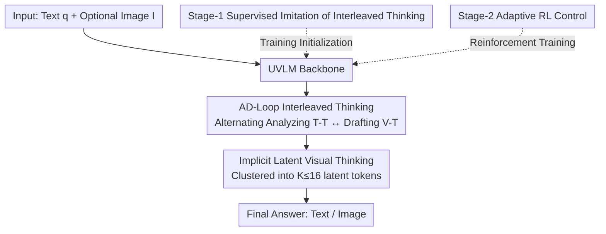

# Synergizing Understanding and Generation with Interleaved Analyzing-Drafting Thinking

**Conference**: ICLR 2026  
**OpenReview**: [https://openreview.net/forum?id=GtqmPJf00A](https://openreview.net/forum?id=GtqmPJf00A)  
**Code**: Project Page AD-Loop.io  
**Area**: Multimodal VLM / LLM Reasoning  
**Keywords**: Unified Vision-Language Models, Understanding-Generation Synergy, Interleaved Thinking, Latent Visual Thinking, Reinforcement Learning

## TL;DR
To address the issue where Unified Vision-Language Models (UVLMs) treat "understanding" and "generation" as two parallel skills that do not interact during problem-solving, this paper proposes **AD-Loop**. This method allows models to interleave "textual thinking (Analyzing)" and "latent visual thinking (Drafting)" during the reasoning process. Through a two-stage training of SFT + Adaptive RL, the model learns to switch between these two capabilities as needed, achieving a +2.3% average improvement in understanding and a GenEval total score of 86%.

## Background & Motivation

**Background**: Unified Vision-Language Models (UVLM) aim to support both multimodal understanding (image-to-text) and generation (text-to-image) within a single framework. Mainstream approaches include: treating both as autoregressive next-token prediction, using decoupled encoders with multi-head outputs to reduce representation conflict, and hybrid AR-diffusion architectures to balance efficiency and fidelity.

**Limitations of Prior Work**: These works focus almost entirely on the "architectural level"—how to fit both capabilities into a single network. However, they overlook a crucial fact: during the actual reasoning process for problem-solving, there is **almost no explicit interaction** between the understanding and generation modules. Models treat understanding and generation as two independently callable skills placed side-by-side, neither assisting the other.

**Key Challenge**: Understanding and generation should be complementary—robust understanding provides the semantic foundation for faithful generation, while successful generation results serve as powerful evidence of "having understood." Yet, existing models only achieve "co-location" rather than "mutual reinforcement." For instance, when an instruction is ambiguous, the understanding module could propose candidate answers, then call the generation module to draw sketches to "verify" these candidates; conversely, after generating a draft, it could ask the understanding module for high-level guidance on attributes or spatial layout for refinement. Current models cannot perform this back-and-forth interaction.

**Goal**: To stop treating understanding and generation as "co-existing skills" and instead **weave them into a problem-solving loop**, allowing the model to dynamically alternate between analysis and drafting.

**Key Insight**: The authors draw from cognitive science findings that "internal representations are schematic rather than pixel-perfect" (Shepard & Metzler). When the human brain performs reasoning, the "mental images" are rough outlines, not high-definition pictures. Therefore, the thinking phase does not require rendering a full image, but only a compact set of "latent visual thoughts" to carry the visual cues needed for reasoning.

**Core Idea**: Replace the parallel invocation of "separate understanding and generation" with an interleaved **A**nalyzing (producing textual thinking T-T) - **D**rafting (producing latent visual thinking V-T) problem-solving loop (**AD-Loop**). This allows the model to repeatedly switch between and iteratively refine two modes within a `<think>` Chain-of-Thought, truly unifying understanding and generation into a synergy.

## Method

### Overall Architecture

Given an input $x=(q, I)$ (where $q$ is text and $I=\{I_m\}_{m=1}^{M}$ is an optional set of images, $M\geq 1$), the model processes it via a vision encoder and LLM backbone to output a thinking trajectory wrapped in `<think></think>`, followed by the final answer:

$$\texttt{<think>}\ [\text{T-T}]\ [\text{V-T}]\ [\text{T-T}]\ [\text{V-T}]\ \dots\ \texttt{</think>}\ [\text{Answer}]$$

Here, `[T-T]` represents textual thinking (semantic abstraction, reasoning) and `[V-T]` represents visual thinking (sketches, spatial layouts), marked by two special tokens. `[Answer]` is the final text or image. Critically, visual thinking in the thinking phase **does not render a whole image**, but a compact set of latent visual thinking tokens $\{v_j\}_{j=1}^{K}$, where $K$ is much smaller than the tokens required for full rendering (in implementation, $K\leq 16$).

The method consists of "one reasoning paradigm + two-stage training." During inference, the model alternates between analysis and drafting in the AD-Loop. For training, it first uses SFT to **learn** the interleaved thinking format, then uses adaptive RL for the model to **learn to judge** when to use AD-Loop and when textual thinking alone is sufficient. This framework is architecture-agnostic and can be applied to both continuous embedding routes (BAGEL) or discrete token routes (Janus-Pro).

### Key Designs

**1. AD-Loop: Weaving Understanding and Generation into an Interleaved Problem-Solving Loop**

This addresses the pain point of zero interaction between modules in existing UVLMs. AD-Loop expands problem-solving into a `<think>` chain, letting the model dynamically switch between two types of "thoughts": Textual Thinking (T-T) handles analysis (semantic abstraction, logical reasoning, proposing hypotheses), and Visual Thinking (V-T) handles drafting (mental sketches, spatial layout, visualizing hypotheses). For example, to "identify the functional relationship between a kettle, stove, and cup," the model first uses text to list two candidate relationships, then uses visual thinking to visualize Draft A and Draft B respectively, then returns to text to verify which aligns better with common sense. This alternation is not a simple "understand then generate" sequence, but treats generation results as intermediate evidence that can be further scrutinized by the understanding module, allowing the two capabilities to cross-calibrate and iteratively converge.

**2. Implicit Latent Visual Thinking: Compressing Full Images into Sparse Latent Tokens via Clustering**

If every "draft" in the thinking phase required outputting a full image (hundreds of codebook tokens or dozens of diffusion steps), latency would be extremely high, and reasoning would be entangled with decision-irrelevant pixel details. Consequently, Ours replaces visual thoughts during thinking with a small set of latent tokens $\{v_j\}_{j=1}^{K}$ ($K\ll N$, where $N$ is the number of tokens in the latent grid). The construction process involves reusing the generation-side encoder to encode images into a latent grid $\{z_i\}_{i=1}^{N}$, then using **density peaks clustering** to group these tokens by semantic proximity into $K$ clusters. The mean of each cluster is taken as the representative token $v_j=\frac{1}{|C_j|}\sum_{i\in C_j} z_i$, arranged in a sequence based on cluster center coordinates. Compared to naive spatial pooling, clustering yields more stable, semantically-aggregated targets that preserve rough outlines while filtering pixel noise. An interesting observation (RQ-2) is that visual thoughts must originate from the **generation encoder** rather than the understanding encoder—the generation encoder is better pre-trained to carry both semantic and pixel information, leading to faster convergence and better performance.

**3. Stage-1 Supervised Imitation: Teaching the "How" of Interleaved Thinking**

Cold-starting RL for reasoning is unstable, so the first stage uses SFT for strong initialization. The difficulty lies in the fact that existing datasets (multimodal CoT, GoT, etc., totaling 20K understanding and 22K generation samples) provide **explicit pixel images** as visual thoughts, while Ours requires **latent** visual thoughts. This is solved by using the frozen generation encoder + clustering from Design 2 to convert every explicit visual thought into a gold latent token sequence $V^\star$. The training objective is a sum of three terms:

$$\mathcal{L}_{S1}=\mathcal{L}_{CE}(\hat{T}, T^\star)+\alpha\,\mathcal{L}_{vis}(\hat{V}, V^\star)+\mathcal{L}_{out}(\hat{o}, o^\star)$$

Where textual thoughts are supervised by cross-entropy $\mathcal{L}_{CE}$, latent visual thoughts $\mathcal{L}_{vis}$ use Mean Squared Error (MSE), and $\mathcal{L}_{out}$ is the original task loss. This guides the model to learn the rhythm of when to insert text and when to insert a set of latent tokens.

**4. Stage-2 Adaptive RL: Teaching the Model "When" AD-Loop is Needed**

After SFT, the model knows *how* to interleave thoughts, but some problems can be solved confidently with a single capability (just understanding or just generation). Forced AD-Loop becomes redundant. The second stage uses GRPO-style RL to make the strategy adaptive: for each query $q$, two sets of trajectories are sampled—$\{o_i^{+}\}$ with AD-Loop enabled and $\{o_i^{-}\}$ without, totaling $G$ trajectories. The reward consists of format and content items $r_{base}(o)=r_{format}+r_{content}$. To encourage AD-Loop **only when truly useful**, a margin addition is applied to $V^{+}$: bonuses are given only if it is correct, successfully utilizes AD-Loop, and exceeds the strongest $V^{-}$ candidate by at least $\delta$:

$$r(o_i^{+})=r_{base}(o_i^{+})+\lambda\,\mathbb{1}(\text{AD-Loop}\mid a)\max\big(0,\ r_{base}(o_i^{+})-\max_j r_{base}-\delta\big)$$

The margin $\delta$ filters out accidental "false wins," favoring the simpler text-only mode when there is no substantial gain. During optimization, intra-group advantage $A_{intra}$ and inter-group advantage $A_{inter}$ (indicating which mode is optimal) are combined as $A_i=A_{intra}+\gamma A_{inter}$ with KL regularization and clipping. The final model learns a "frugal" strategy: it actively invokes AD-Loop for spatial/mechanical reasoning but sticks to pure text chains for table/sequence/symbolic reasoning.

### Mechanism: A Complete Example

Example process for "identify the functional relationship between a kettle, stove, and cup": 
1. **T-T**: Initial analysis—"The kettle is metal, the cup is ceramic and empty; two possible relationships exist."
2. **T-T**: Propose candidates—Relation A: Kettle on stove to boil water; Relation B: Cup directly on stove to heat liquid.
3. **V-T**: Visualize Draft A and Draft B hypotheses.
4. **T-T**: Validation analysis—"Draft A matches common usage; Draft B is irrational as ceramic cups are rarely placed directly on stoves."
5. **Answer**: "The kettle heats on the stove, then hot water is poured into the cup." 
The alternating analysis and drafting allow the generated sketch to become "evidence" for the understanding module, manifesting true synergy.

## Key Experimental Results

Backbone is BAGEL-7B (SigLIP2-so400m/14 for understanding, FLUX pre-trained VAE for generation). Stage-1: global batch 256, initial LR $1\times10^{-5}$, max $K=16$. Stage-2: VERL framework for RL, AdamW, LR $2\times10^{-6}$, 8 rollouts per prompt, KL weight 0.01.

### Main Results

Understanding (Multimodal understanding benchmarks):

| Model | #Params | POPE↑ | MME-P↑ | MMB↑ | SEED↑ | GQA↑ | MMMU↑ | MM-Vet↑ |
|------|---------|-------|--------|------|-------|------|-------|---------|
| Janus-Pro | 7B | 87.4 | 1567.1 | 79.2 | 72.1 | 62.0 | 41.0 | 50.0 |
| BAGEL | 7B | – | 1687.0 | 85.0 | – | – | 55.3 | 67.2 |
| **AD-Loop (Ours)** | 7B | **90.1** | **1696.0** | **87.6** | **74.4** | **63.8** | **57.3** | **69.7** |

Generation (GenEval):

| Model | Single↑ | Two↑ | Counting↑ | Colors↑ | Position↑ | Attri.↑ | Overall↑ |
|------|---------|------|-----------|---------|-----------|---------|----------|
| Janus-Pro | 0.99 | 0.89 | 0.59 | 0.90 | 0.79 | 0.66 | 0.80 |
| BAGEL | 0.99 | 0.94 | 0.81 | 0.88 | 0.64 | 0.63 | 0.82 |
| MindOmni (Text-only think) | 0.99 | 0.94 | 0.71 | 0.90 | 0.71 | 0.71 | 0.83 |
| **AD-Loop (Ours)** | 0.98 | 0.94 | **0.83** | 0.90 | **0.80** | **0.74** | **0.86** |

Understanding improved by +2.3% on average, with a GenEval total score of 86%. Gains are most significant in fine-grained items like Position and Attribute—dimensions precisely requiring "reasoning." Compared to MindOmni (text-only thinking), the addition of visual thoughts yields stable gains.

### Ablation Study

Comparison of different thinking strategies (T: analysis only; T+I: explicit interleaved; T+eI: implicit interleaved; T / T+eI: adaptive):

| Strategy | MathVista↑ | LogicVista↑ | SAT↑ | WISE-Cultural↑ | WISE-Space↑ | WISE-Biology↑ |
|----------|-----------|-------------|------|----------------|-------------|----------------|
| Isolated | 61.5 | 40.2 | 0.63 | 0.44 | 0.68 | 0.44 |
| T (Text-only) | 68.3 | 44.1 | 0.74 | 0.67 | 0.69 | 0.56 |
| T + I (Explicit) | 72.9 | 46.6 | 0.81 | 0.73 | 0.74 | 0.64 |
| T + eI (Implicit) | 73.6 | 47.2 | 0.84 | 0.75 | 0.77 | 0.65 |
| T / T + eI (Adaptive) | **75.8** | **49.5** | **0.89** | **0.79** | **0.78** | **0.68** |

Visual Thinking source comparison (RQ-2):

| Source | MMStar | MathVista | LogicVista | GenEval | WISE-Cultural | WISE-Biology |
|--------------|--------|-----------|------------|---------|---------------|--------------|
| Gen. Encoder | **54.9** | **75.8** | **47.5** | **0.86** | **0.79** | **0.68** |
| Und. Encoder | 51.6 | 70.9 | 44.3 | 0.84 | 0.71 | 0.61 |

### Key Findings
- **Performance increases step-by-step**: "No thinking → Text thinking → Interleaved thinking → Adaptive." Adding text thinking significantly outperforms isolated reasoning; adding visual thinking further improves results; adaptive strategy is the best—proving visual cues supplement fine-grained info that text cannot describe, and on-demand invocation is superior to a one-size-fits-all approach.
- **The gap between explicit and implicit visual thinking is small**, but implicit (latent tokens) is more efficient and filters pixel noise; a hybrid of both is complementary.
- **Visual thoughts should come from the generation encoder**: It is better pre-trained to contain both semantic and pixel information, leading to faster convergence and higher metrics across the board.
- **Architecture-agnostic and transferable** (RQ-1): Improvements were seen when applied to both Janus-Pro (discrete) and BAGEL (continuous), e.g., +9.4 on MM-Vet for Janus-Pro and +1.5 for BAGEL.
- **On-demand activation of visual thinking** (RQ-4): Tasks involving rotation, complex OCR, or 3D perception show high activation and large gains; tables, sequences, and symbolic reasoning favor pure text chains.

## Highlights & Insights
- **Treating "Generation" as intermediate evidence for reasoning**: The most notable insight is letting the model generate sketches to verify its own hypothetical candidates, then using understanding to judge—generation is no longer just the end product, but an examinable step in the reasoning chain.
- **The cleverness of latent visual thinking**: Borrowing the cognitive intuition that "mental images are schematic," replacing expensive full-image rendering with $K\leq 16$ clustered latent tokens preserves reasoning-sufficient visual cues while cutting latency and pixel noise.
- **Margin-based rewards are a reusable RL trick**: Giving bonuses only when a specific capability significantly outperforms the strongest baseline without that capability effectively prevents the strategy from abusing expensive features, applicable to any "optional but costly reasoning action."

## Limitations & Future Work
- Visual thoughts are designed as "schematic" compact latents ($K\leq 16$), which may be insufficient for tasks requiring precise pixel-level evidence (e.g., dense OCR, exact counting).
- Strong dependence on a high-quality reward model for content scoring; reward noise directly impacts Stage-2 adaptive strategy learning.
- Interleaved thinking introduces extra visual tokens and multiple rounds of analysis/drafting. While cheaper than full rendering, it still adds overhead compared to pure textual thinking; systemic comparison of cost/latency is missing.
- Exploring "when to insert visual thoughts and how many" as a learnable dynamic budget rather than a fixed $K=16$.

## Related Work & Insights
- **vs. Autoregressive Unified / AR-Diffusion Hybrid (Janus-Pro, BAGEL, Show-o, etc.)**: These unify at the architecture level, but modules remain parallel during problem-solving; Ours changes the "reasoning paradigm" without changing the architecture, and is architecture-agnostic.
- **vs. Text-only Multimodal Reasoning (MindOmni, CoT-based)**: These use only textual rationales; Ours interleaves latent visual thoughts, proving they provide cues that text cannot capture.
- **vs. Tool-augmented / Explicit Interleaved Reasoning**: Compared to calling external tools or rendering full images, Ours uses clustered implicit latent visual thoughts—more efficient, stable, and avoids pixel noise entanglement.

## Rating
- Novelty: ⭐⭐⭐⭐⭐ Redefining understanding-generation synergy from "architectural unification" to "interleaved problem-solving cycle."
- Experimental Thoroughness: ⭐⭐⭐⭐ Broad benchmarks and ablations provided; missing systematic cost comparison.
- Writing Quality: ⭐⭐⭐⭐ Clear motivation and intuitive diagrams.
- Value: ⭐⭐⭐⭐⭐ Architecture-agnostic and plug-and-play, providing a universal synergy mechanism.

<!-- RELATED:START -->

## Related Papers

- [\[CVPR 2026\] Thinking with Drafts: Speculative Temporal Reasoning for Efficient Long Video Understanding](../../CVPR2026/vlm_reasoning/thinking_with_drafts_speculative_temporal_reasoning_for_efficient_long_video_und.md)
- [\[ICLR 2026\] ThinkMorph: Emergent Properties in Multimodal Interleaved Chain-of-Thought Reasoning](thinkmorph_emergent_properties_in_multimodal_interleaved_chain-of-thought_reason.md)
- [\[ICLR 2026\] DeepEyes: Incentivizing "Thinking with Images" via Reinforcement Learning](deepeyes_incentivizing_thinking_with_images_via_reinforcement_learning.md)
- [\[ICLR 2026\] Medical Thinking with Multiple Images](medical_thinking_with_multiple_images.md)
- [\[CVPR 2026\] Thinking with Programming Vision: Towards a Unified View for Thinking with Images](../../CVPR2026/vlm_reasoning/thinking_with_programming_vision_towards_a_unified_view_for_thinking_with_images.md)

<!-- RELATED:END -->
