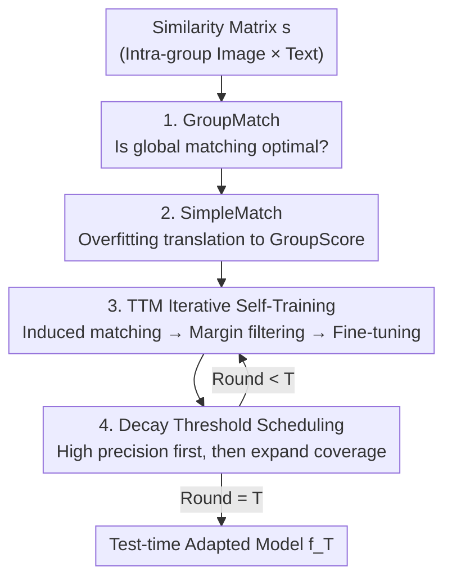

# Test-Time Matching: Unlocking Compositional Reasoning in Multimodal Models

**Conference**: ICLR 2026  
**OpenReview**: [https://openreview.net/forum?id=wWxdT6LB2D](https://openreview.net/forum?id=wWxdT6LB2D)  
**Code**: https://github.com/yinglunz/test-time-matching (Available)  
**Area**: Multimodal VLM / Compositional Reasoning / Test-time self-training  
**Keywords**: Compositional Reasoning, Evaluation metric correction, Test-time matching, Pseudo-label self-training, GroupMatch

## TL;DR
This paper points out that the "near-random guessing" performance of multimodal models on compositional reasoning benchmarks is largely an illusion created by **artificially depressed evaluation metrics**. It proposes a more faithful GroupMatch metric along with SimpleMatch to translate results back to standard metrics. Furthermore, it introduces Test-Time Matching (TTM), an iterative self-training algorithm without external supervision, which allows SigLIP-B16 to outperform GPT-4.1 on MMVP-VLM and enables GPT-4.1 to exceed estimated human performance on Winoground for the first time.

## Background & Motivation
**Background**: Compositional reasoning (systematically combining basic elements like objects, attributes, and relations to understand new configurations) is considered a rigorous benchmark for cutting-edge AI models. Leading benchmarks (Winoground, MMVP-VLM, ColorSwap, SugarCrepe, WhatsUp, etc.) organize samples into groups: each group contains $k$ images and $k$ captions that differ only in subtle, systematic ways (e.g., in Winoground, two captions use exactly the same words but in different orders). Models must correctly align the images and captions within the group.

**Limitations of Prior Work**: On these benchmarks, both contrastive vision-language models (CLIP, SigLIP) and multimodal large language models (GPT-4 series) have been repeatedly reported to perform "at or below random guessing." The estimated human performance on Winoground is 85.5, while the previous SOTA was only 58.75 (achieved via scaffolding + prompt tuning GPT-4V). This severely contradicts the strong real-world performance of modern multimodal systems.

**Key Challenge**: The authors suspect the problem lies not with the models, but with the **evaluation metrics themselves**. The widely used GroupScore requires each diagonal similarity $s_{ii}$ to be the maximum in both its row and column—this translates to $2k^2-2k$ constraints for a $k\times k$ group, which is extremely harsh. Under random guessing, $P(\text{GroupScore}=1)=\frac{(k-1)!}{(2k-1)!}$, which is only $1/6$ when $k=2$, causing models with "correct matching judgment" to be misclassified as incorrect.

**Goal**: (1) Design a metric that faithfully reflects model capability without introducing unnecessary constraints; (2) Further extract the latent capability on the test set without external supervision.

**Key Insight**: Evaluating compositional reasoning is essentially a "global image-text matching" problem rather than a "pairwise isolated comparison." As long as the **global matching** (a bijection) provided by the model maximizes the total similarity of the ground-truth pairs, the model should be considered successful.

**Core Idea**: Replace "pairwise dominance" (GroupScore) with "global matching optimality" (GroupMatch) to measure capability; then use the model's self-induced matching as pseudo-labels for iterative self-training during test time to further amplify hidden capabilities.

## Method

### Overall Architecture
The method consists of two layers. **The first layer is evaluation correction**: for each image-text group, the model calculates a similarity matrix $s$. GroupMatch (checking if the global matching is optimal) replaces GroupScore to reveal capabilities obscured by the old metric. SimpleMatch then uses a small "overfitting" step to equivalently translate GroupMatch correctness back to the standard GroupScore, allowing direct comparison with historical SOTA. **The second layer is test-time self-improvement (TTM)**: the optimal matching induced by the model in each group is used as a pseudo-label. After filtering by confidence (margin), the model is fine-tuned iteratively for $T$ rounds using a **decaying threshold schedule** to dynamically balance precision and coverage. TTM does not require any external labels and can be generalized to global matching settings without group structures.

### Key Designs

**1. GroupMatch: Global Optimal Matching Instead of Pairwise Dominance**

The harshness of GroupScore stems from requiring diagonal elements to be the largest in both rows and columns, imposing $2k^2-2k$ constraints. This suppresses the random baseline to values like $\frac{(k-1)!}{(2k-1)!}$, systematically underestimating models. GroupMatch takes a different perspective: it considers all bijections $\pi$ from images to text and checks if the total similarity of the ground-truth matching $\pi^\star:i\mapsto i$ is strictly maximal:

$$\text{GroupMatch}(s)=\mathbb{1}\Big[\sum_{i=1}^{k}s_{i,\pi^\star(i)}>\sum_{i=1}^{k}s_{i,\pi(i)},\ \forall\pi\neq\pi^\star\Big]$$

For $k=2$, this simplifies to the intuitive condition $s_{11}+s_{22}>s_{12}+s_{21}$. Since any of the $k!$ matchings is equally likely to be optimal under random guessing, the random baseline becomes $P(\text{GroupMatch}=1)=1/k!$, which is strictly higher than GroupScore for all $k>1$ ($1/2$ instead of $1/6$ for $k=2$). This indicates that GroupMatch removes unnecessary constraints while retaining the core alignment task. It naturally extends to $m\times k$ rectangular groups (using injective matching) and overlaps perfectly with GroupScore for $1\times k$ groups—crucially, this means TTM's gains on $1\times k$ are due to improved capability rather than metric changes.

**2. SimpleMatch: One-Step Overfitting to Translate GroupMatch back to Standard Metrics**

While GroupMatch is more faithful, it remains incomparable to historical results reported using GroupScore. The authors observe an equivalence: if a model selects the correct matching $\pi^\star$ under GroupMatch, **overfitting the model to this matching at test time** guarantees a perfect GroupScore. Thus, "GroupMatch correctness" can be losslessly converted to "GroupScore correctness." SimpleMatch involves two steps: (i) selecting the most likely matching via GroupMatch, and (ii) overfitting to that matching to realize the gain. Without additional data, it unlocks significant latent capability: SigLIP-B16 on Winoground goes from 10.25→67, MMVP-VLM from 22.96→81.48, and ColorSwap from 30.33→88. GPT-4.1 on Winoground increases from 69.75→91.38, **exceeding the human estimated level of 85.5 for the first time**. This step proves that previous "below random" conclusions were largely illusions created by the metric.

**3. TTM: Iterative Self-Training Using Self-Induced Matching as Pseudo-Labels**

SimpleMatch reveals hidden capabilities, but the model weights themselves do not improve. TTM (Algorithm 1) further enhances the model during test time via iterative self-improvement with zero external supervision. In round $t$, the current model $f_{t-1}$ induces an optimal matching for each group $G$ as a pseudo-label: $\pi_{f_{t-1}}(G)=\arg\max_\pi s(\pi;G,f_{t-1})$. For 2×2 groups, this compares $s_{11}+s_{22}$ against $s_{12}+s_{21}$. Instead of trusting all pseudo-labels, it uses a **matching margin** to measure confidence—the difference between the total score of the optimal matching and the second-best:

$$\Delta(G;f_{t-1})=s(\pi_{f_{t-1}}(G);G,f_{t-1})-\max_{\pi\neq\pi_{f_{t-1}}(G)}s(\pi;G,f_{t-1})$$

Only groups with $\Delta\geq\tau_t$ enter the pseudo-label set $S_t$. The model is then fine-tuned on $S_t$ to obtain $f_t$ over $T$ rounds. This allows the model to progressively self-strengthen, extracting remaining capabilities beyond SimpleMatch: SigLIP-B16 eventually surpasses GPT-4.1 to set a new SOTA on MMVP-VLM. This logic generalizes to non-grouped data by treating the entire dataset as a global matching problem solved via the Hungarian algorithm, adjusting the threshold from "group-level margin" to "pairwise similarity quantiles."

**4. Decay Threshold Scheduling: Precision First, Coverage Later**

Any pseudo-labeling method must balance two types of errors: low thresholds lead to more labels but more false positives (poor precision), while high thresholds are cleaner but lead to false negatives (low coverage/early saturation). The key empirical finding for TTM is the **decay schedule** $\tau_{t+1}<\tau_t$: start with a high threshold to collect high-confidence, near-perfect pseudo-labels, then gradually lower the threshold to expand coverage as the model improves. The authors compared three schedules: Rising (introduces false positives early, leading to zero gain), Constant (avoids early false positives but plateaus due to false negatives), and Decay (optimal). The practical recipe uses an initial $\tau_1$ that covers 15%–30% of groups, with the final $\tau_T$ covering >90%; both cosine and linear decay are effective. The computational overhead is $O(T\cdot C_{f_t})$, where small iterations like $T=3$ or $10$ yield significant improvements, comparable to standard test-time training.

### Loss & Training
TTM fine-tuning utilizes the model's native alignment objective: contrastive models (CLIP/SigLIP) are fine-tuned on the pseudo-labeled image-text pairs. Generative MLLMs (like SmolVLM-256M) use VQAScore (with prompts like "`<image> Does this image show "<text>"? answer Yes/No`") to compute similarity. Pseudo-labels include both "Yes" (matching pairs) and "No" (hard negatives formed by mismatching images and text within the same group), requiring no extra data. Key hyperparameters include the number of iterations $T$ (3 or 10) and the decay threshold schedule $\{\tau_t\}$.

## Key Experimental Results

### Main Results
Across 16 dataset variants (2×2, 1×k, and global structures), all results are the mean of 4 random runs. Results for three major 2×2 benchmarks (SigLIP-B16, GroupScore→SimpleMatch→TTM):

| Dataset / Model | Raw | SimpleMatch | TTM | Gain (TTM vs SimpleMatch) |
|--------------|-----|-------------|-----|--------------------|
| Winoground / GPT-4.1 | 69.75 | 91.38 | — | Exceeds human (85.5) |
| Winoground / SigLIP-B16 | 10.25 | 67.00 | 72.50 | +5.5 (Error ↓16.7%) |
| MMVP-VLM / GPT-4.1 | 68.15 | 88.52 | — | — |
| MMVP-VLM / SigLIP-B16 | 22.96 | 81.48 | 89.44 | +8.0 (Error ↓43.0%), beats GPT-4.1 |
| ColorSwap / SigLIP-B16 | 30.33 | 88.00 | 94.25 | +6.3 (Error ↓52.1%) |
| ColorSwap / SigLIP-L16 | 37.00 | 91.33 | 96.08 | +4.8 (Error ↓54.8%), matches GPT-4.1 |

Prev. SOTA: Winoground 58.75, MMVP 70.7 (GPT-4o multi-agent+tools), ColorSwap 87.33 (zero-shot). SimpleMatch alone pushes SigLIP-B16 past all previous SOTA.

For 1×k benchmarks (no metric bonus as GroupScore = GroupMatch): SugarCrepe (1×2) showed improvements across all subtests (e.g., Replace Relation 70.5→76.2, Add Attr 83.7→89.0). WhatsUp (1×4) saw relative gains of up to **+85.7%** (CLIP-B32 on WhatsUp A 30.6→56.8).

### Ablation Study

| Configuration | Key Finding | Description |
|------|---------|------|
| Decay Threshold (Ours) | Winoground 67.0→72.5 (Best) | Precision first, then coverage |
| Constant (Fixed τ=2.0) | 67.0→70.1 | No early false positives, but late false negatives cause early plateau |
| Ascend (0→2.0) | 67.0→67.0 (No gain) | Overfitting to all pseudo-labels in round 1; misled by false positives |
| Baseline (No TTM) | 67.0 | GroupMatch starting point |

For the generative model SmolVLM-256M, TTM still provided significant gains over SimpleMatch on MMVP-VLM (76.30→81.67) and ColorSwap (80.00→85.17), proving the method is not limited to contrastive models. In cases without grouping (SigLIP-B16), global TTM using Hungarian matching outperformed the raw GroupScore significantly (e.g., ColorSwap 30.33→92.00).

### Key Findings
- **Metrics are the primary source of the "illusion"**: Changing the metric for the same model and dataset yields vastly different results—GroupScore systematically suppresses compositional reasoning to near-random, while GroupMatch reveals latent capabilities.
- **Threshold scheduling direction is critical**: The decay schedule is vital; the ascending schedule fails due to early false positives.
- **TTM gains represent genuine capability**: Improvements of up to 85.7% in 1×k settings (where there's no metric bonus) and successful application to generative models prove TTM improves the model weights.
- **Absolute gains are significant**: TTM's +5.5 gain over SimpleMatch on Winoground far exceeds the +1.25 gain from historical GPT-4V scaffolding.

## Highlights & Insights
- **"Models aren't that bad; the ruler is just broken"**: Re-attributing a long-standing "model deficiency" to over-constrained evaluation metrics provides a provable random baseline comparison ($\frac{(k-1)!}{(2k-1)!}$ vs $1/k!$).
- **Metric Translatability**: GroupMatch results can be losslessly translated back to GroupScore via a single overfitting step, making the new metric faithful yet comparable.
- **Margin-based Pseudo-labeling + Decay Schedule**: This recipe is transferable—any task where a model can induce structured predictions with quantifiable confidence can adopt this "precision-first, then coverage" self-training paradigm.
- **Hard Negative Mining**: Using mismatched pairs within the same group as hard negatives for generative models is a highly effective, zero-cost strategy.

## Limitations & Future Work
- **Transductive Nature**: TTM adapts to the test distribution. The paper does not fully explore generalization to entirely new distributions or whether it overfits specific test set statistics.
- **Reliance on Unique 1-to-1 Mapping**: The global variant assumes $|S_I|\leq|S_C|$ with one-to-one correspondence, which may not hold in open retrieval.
- **Boundaries of Correction**: GroupMatch provides no "metric bonus" on 1×k tasks; for truly difficult samples where global matching is also wrong, correction is impossible, and one must rely on self-training like TTM.
- **Empirical Thresholds**: The initial coverage (15%–30%) was determined experimentally; theoretical guidance for automatically selecting threshold schedules is lacking.

## Related Work & Insights
- **vs. GroupScore (Thrush et al. 2022)**: The old metric imposes $2k^2-2k$ constraints, resulting in a very low random baseline. GroupMatch focuses on global optimality and removes redundant constraints while remaining convertible.
- **vs. Scaffolding / Prompt Tuning (Wu et al.; Vaishnav & Tammet)**: Previous works improved Winoground from 50.75 to 52 (+1.25) via prompt engineering. SimpleMatch pushes GPT-4.1 to 91.38, exceeding humans without extra data.
- **vs. Standard Test-Time Training (Sun et al. 2020)**: While related to test-time adaptation, TTM's innovation lies in using "matching-induced" pseudo-labels rather than auxiliary self-supervised tasks, controlled by margin and decay.

## Rating
- Novelty: ⭐⭐⭐⭐⭐ Re-attributing failures to metrics and providing provable, translatable corrections + test-time self-training is a highly original perspective.
- Experimental Thoroughness: ⭐⭐⭐⭐⭐ Covers 16 dataset variants, two model types, threshold ablations, and global variants with multiple random seeds.
- Writing Quality: ⭐⭐⭐⭐⭐ Clear derivation of propositions and random baselines, intuitive figures, and a logical progression through GroupMatch, SimpleMatch, and TTM.
- Value: ⭐⭐⭐⭐⭐ Not only breaks multiple SOTAs and exceeds human performance, but also provides a transferable paradigm for evaluation and test-time improvement.

<!-- RELATED:START -->

## Related Papers

- [\[ICLR 2026\] ProxyThinker: Test-Time Guidance Through Small Visual Reasoners](proxythinker_test-time_guidance_through_small_visual_reasoners.md)
- [\[ICLR 2026\] Unleashing Perception-Time Scaling to Multimodal Reasoning Models](unleashing_perception-time_scaling_to_multimodal_reasoning_models.md)
- [\[CVPR 2026\] UniT: Unified Multimodal Chain-of-Thought Test-time Scaling](../../CVPR2026/vlm_reasoning/unit_unified_multimodal_chain-of-thought_test-time_scaling.md)
- [\[ICLR 2026\] CompoDistill: Attention Distillation for Compositional Reasoning in Multimodal LLMs](compodistill_attention_distillation_for_compositional_reasoning_in_multimodal_ll.md)
- [\[CVPR 2026\] Scaling Test-Time Robustness of Vision-Language Models via Self-Critical Inference Framework](../../CVPR2026/vlm_reasoning/scaling_test-time_robustness_of_vision-language_models_via_self-critical_inferen.md)

<!-- RELATED:END -->
