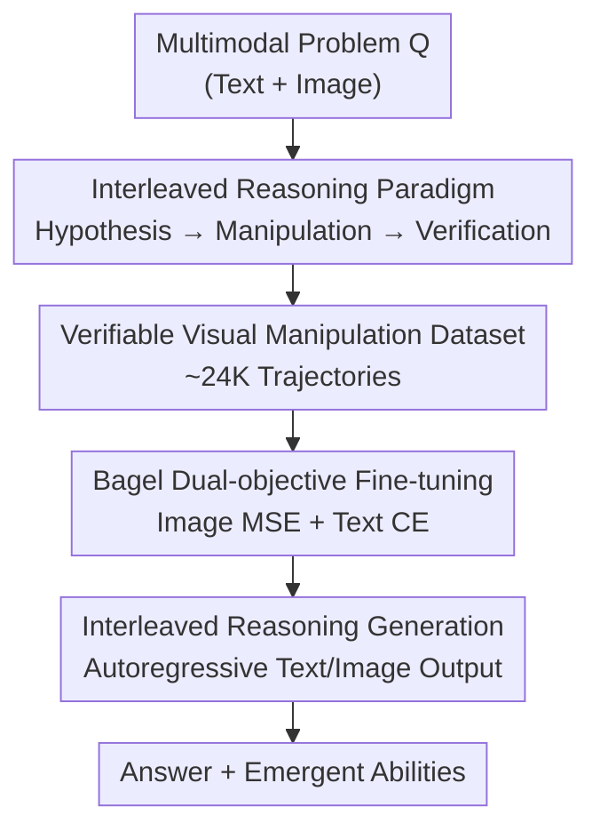

# ThinkMorph: Emergent Properties in Multimodal Interleaved Chain-of-Thought Reasoning

**Conference**: ICLR 2026  
**OpenReview**: [https://openreview.net/forum?id=mB3vxfrQZM](https://openreview.net/forum?id=mB3vxfrQZM)  
**Code**: https://github.com/ThinkMorph/ThinkMorph  
**Project Page**: https://thinkmorph.github.io  
**Area**: Multimodal VLM / LLM Reasoning  
**Keywords**: Interleaved Chain-of-Thought, Multimodal Reasoning, Unified Model, Visual Manipulation, Emergent Abilities

## TL;DR
ThinkMorph proposes the principle that "text and images should be complementary rather than isomorphic reasoning modalities." By fine-tuning a unified multimodal model (Bagel-7B) on approximately 24K carefully constructed interleaved reasoning trajectories, the model learns an interleaved reasoning process of "Textual Hypothesis → Visual Manipulation → Textual Verification." It achieves an average performance gain of 34.7% over the base model on vision-intensive tasks and exhibits high-order intelligence such as emergent visual manipulations unseen during training, autonomous switching of reasoning modes, and superior test-time scaling.

## Background & Motivation

**Background**: Multimodal reasoning is not a one-time perception task but an iterative process requiring continuous synergy between language and vision. While pure text Chain-of-Thought (text CoT) has advanced linguistic reasoning, it offers little help for tasks requiring "physical manipulation of visual content" (e.g., spatial reasoning, puzzles, fine-grained recognition)—where models typically only describe images rather than "sketching ideas in the mind."

**Limitations of Prior Work**: Existing efforts to simulate human "think-and-sketch" abilities are suboptimal. One category is **tool-augmentation**, which calls external cropping tools or specialized sketch models; this makes the reasoning process indirect, fragile, and dependent on module integration. Another category involves **unified models** generating visual thoughts internally, but a general recipe for "mutual reinforcement" between text and image reasoning is lacking. A typical counterexample is MVoT, which introduces interleaved action representations for maze tasks, but the textual parts are merely simple action labels **isomorphic** to the generated images, failing to generalize across domains.

**Key Challenge**: The definition of "meaningful interleaved CoT" remains unclear. If text and images are merely equivalent expressions of the same information (isomorphic), interleaving is redundant. Interleaving truly advances reasoning only when each modality provides cues the other cannot.

**Goal**: To construct an interleaved reasoning paradigm where text and images are **complementary**, allowing the model to maintain coherent linguistic logic while concretely manipulating visual content and generalizing beyond training domains.

**Key Insight**: The authors hypothesize that textual and visual thinking should divide labor like humans solving problems—text handles abstract hypotheses and verification, while images "sketch" the hypothesis to provide overall spatial context. Data is designed around this principle rather than sheer volume.

**Core Idea**: Construct ~24K interleaved trajectories (Text Hypothesis → Visual Manipulation → Text Verification) based on the "complementary, not isomorphic" principle. Use dual-objective fine-tuning on a unified model to tie textual reasoning and visual manipulation into a "hand-in-hand" problem-solving process.

## Method

### Overall Architecture

ThinkMorph employs a unified multimodal model $P_\theta$ for interleaved reasoning. Given a multimodal problem $Q=(Q_\text{text}, Q_\text{img})$, the model generates a sequence of interleaved thought tokens $T=(\hat{m}_1, \hat{m}_2, \dots, \hat{m}_n)$, where each $\hat{m}_i \in \{\hat{t}_i, \hat{v}_i\}$ is either a text or image token. Modality switching is controlled by delimiter tokens (`<image_start>` / `<image_end>`). Unlike standard CoT, ThinkMorph can generate image tokens mid-reasoning to "draw" intermediate states.

The pipeline comprises three steps: defining the trajectory structure based on the "complementary" paradigm; constructing a high-quality dataset of ~24K trajectories across four task types; and performing dual-objective fine-tuning on Bagel-7B. During inference, the model autoregressively generates interleaved text/image thoughts to arrive at an answer.

### Key Designs

**1. Interleaved Reasoning Paradigm: Text and Images as Complementary, Not Isomorphic**

Addressing the lack of meaningful interleaving, the authors fix each trajectory into a three-stage division of labor: **Textual Hypothesis → Visual Manipulation → Textual Verification**. For example, in Jigsaw Assembly, initial $\hat{t}$ tokens describe pieces, subsequent $\hat{v}$ tokens **draw** the reassembled pieces to provide spatial context, and final $\hat{t}$ tokens verify consistency. The key is that image tokens handle what text cannot (e.g., exposing misalignments, verifying paths with arrows). Experiments show that when text alone suffices (e.g., ChartQA), visual manipulation is optional; when text lacks spatial cues (e.g., MMVP), it becomes essential.

**2. Verifiable Visual Manipulation Dataset: Grounding "Visual Thinking" in Concrete Operations**

To solve the scalability issue of "internal" visual thoughts, the authors select four task types that support **concrete, verifiable intermediate visual manipulations**: Jigsaw Assembly (visualizing reordered pieces), Spatial Navigation (overlaying paths with lines/arrows), Visual Search (bounding box highlights), and Chart Refocus (highlighting relevant data). They constructed 24,990 trajectories. Quality control was aggressive—in Visual Search, after finding that existing datasets (GQA, VSR) contained errors or irrelevant highlights, they constrained the target bounding box to 1%–30% of the image area, filtering 144K samples down to 6,990 high-quality ones.

**3. Bagel Dual-objective Fine-tuning: Optimizing Text and Image Tokens Simultaneously**

To enable coherent text and meaningful image generation, different supervisions are used. Using Bagel as the base, the model optimizes a **dual-objective**: image tokens use Mean Squared Error $L_\text{img}$ (MSE), and text tokens use Cross-Entropy $L_\text{text}$ (CE). This joint gradient shaping allows the model to align textual logic with visual manipulation. Notably, the authors use only 24K samples for lightweight fine-tuning, as the "raw capacity" for visual manipulation originates from Bagel's large-scale pre-training; interleaved fine-tuning serves to **align** and activate these capabilities into structured steps.

### Example: Chart Refocus

Question: "What is the difference between the highest and second highest bars?"
1. **Textual Hypothesis**: Identify countries and values (e.g., Austria: 24,770.5, Norway: 24,688.3).
2. **Visual Manipulation**: Generate an image highlighting these two bars with red bounding boxes to anchor attention.
3. **Textual Verification**: Re-verify values from the highlighted image and compute $24770.5 - 24688.3 = 82.2$. This "front-loaded visual engagement" demonstrates how vision complements text.

## Key Experimental Results

### Main Results: Generalization to Vision-Centric Tasks

After fine-tuning on 24K interleaved samples, ThinkMorph-7B was compared against ten mainstream models. Relative to the Bagel-7B base, it achieved an average improvement of 20.74% across nine tasks:

| Benchmark | Bagel-7B | ThinkMorph-7B | Δ vs Bagel | Comparison |
|------|----------|---------------|-----------|------|
| VSP | 0.83 | 75.83 | +75.00 | Base nearly fails |
| VisPuzzle | 35.00 | 79.00 | +44.00 | In-domain |
| ChartQA | 61.82 | 78.10 | +16.28 | — |
| VStar ★ | 55.49 | 67.02 | +11.53 | Out-of-domain |
| BLINK-J ★ | 67.33 | 72.00 | +4.67 | Out-of-domain |
| MMVP ★ | 70.33 | 80.33 | +10.00 | Match Gemini 1.5 Flash |
| SAT ★ | 44.67 | 52.67 | +8.00 | Beats InternVL2-26B/InternVL3.5-38B |
| BLINK ★ | 47.66 | 60.07 | +12.41 | — |
| CV-Bench ★ | 76.03 | 80.82 | +4.79 | — |

With only 7B parameters and 24K samples, ThinkMorph outperforms InternVL3.5-38B on SAT spatial reasoning and matches Gemini 1.5 Flash on MMVP.

### Main Results: Interleaved vs. Text-only vs. Vision-only

Comparing three modes on the same base (★ denotes out-of-domain):

| Mode | VSP | VStar★ | VisPuzzle | BLINK-J★ | ChartQA | MMVP★ |
|------|-----|--------|-----------|----------|---------|-------|
| Bagel-7B (Base) | 0.83 | 55.49 | 35.00 | 67.33 | 62.05 | 70.33 |
| Text-only | 49.17 | 56.02 | 63.50 | 68.67 | **81.66** | 76.33 |
| Vision-only | 85.50 | 58.63 | 61.25 | 47.33 | 73.08 | 73.00 |
| Interleaved (Ours) | **86.67** | **63.87** | **73.75** | **73.33** | 79.78 | **82.66** |

Interleaved reasoning leads in nearly all vision-centric tasks, with an average 34.74% gain over the base.

### Key Findings

- **Emergent Ability 1—Unseen Visual Manipulations**: The model spontaneously generates operations not in the training set (e.g., zoom-in, inpainting, motion prediction). Zoom-in is used to identify subtle colors. Textual cues like "examine closely" reliably trigger these operations.
- **Emergent Ability 2—Autonomous Mode Switching**: In ~5.3% of test samples, the model autonomously switches back to pure text reasoning. These samples achieve 81.25% accuracy (vs. 73.96% if forced to interleave) and save ~75% tokens.
- **Emergent Ability 3—Superior Test-time Scaling**: Under Best-of-N sampling, interleaved reasoning scales more robustly due to higher trajectory diversity, especially on difficult benchmarks like BLINK-J (+8.0% gain compared to minimal gains for text/vision only).

## Highlights & Insights
- **The "Complementary" Principle is Actionable**: It dictates trajectory design and explains why isomorphic labels fail to generalize.
- **Small Data Activates Latent Skills**: 24K samples activate "dormant" pre-trained capabilities, guiding them into structured steps.
- **Mode Switching for Efficiency and Accuracy**: The model's ability to skip interleaving when redundant suggests a learned meta-ability to judge modality utility.
- **Verifiable Constraints for Quality**: Aggressive filtering based on verifiable visual outputs is a key trick for high-quality data.

## Limitations & Future Work
- **Vision-Centric Focus**: Performance on purely abstract reasoning (math/logic) without clear visual operations remains unverified.
- **Redundancy in Simple Tasks**: In tasks like ChartQA, pure text can outperform interleaving, indicating that interleaving is not always necessary.
- **Dependency on Generation**: Results depend heavily on the base model's inherent image token generation quality.
- **Emergent Controllability**: While effective, the emergent manipulations are spontaneous and lack explicit control or reliability guarantees.

## Related Work & Insights
- **vs. MVoT**: MVoT uses isomorphic labels; ThinkMorph uses complementary modalities, enabling much wider generalization.
- **vs. Tool-Augmentation**: ThinkMorph generates visual thoughts end-to-end within a single model, avoiding fragile external dependencies.
- **vs. Text CoT**: Text CoT fails to manipulate visual content; ThinkMorph fills the gap for spatial and fine-grained recognition tasks.

## Rating
- Novelty: ⭐⭐⭐⭐⭐ 
- Experimental Thoroughness: ⭐⭐⭐⭐ 
- Writing Quality: ⭐⭐⭐⭐⭐ 
- Value: ⭐⭐⭐⭐⭐ 

<!-- RELATED:START -->

## Related Papers

- [\[ICLR 2026\] Rex-Thinker: Grounded Object Referring via Chain-of-Thought Reasoning](rex-thinker_grounded_object_referring_via_chain-of-thought_reasoning.md)
- [\[CVPR 2026\] Grounded Chain-of-Thought for Multimodal Large Language Models](../../CVPR2026/vlm_reasoning/grounded_chain-of-thought_for_multimodal_large_language_models.md)
- [\[ICLR 2026\] CoPRS: Learning Positional Prior from Chain-of-Thought for Reasoning Segmentation](coprs_learning_positional_prior_from_chain-of-thought_for_reasoning_segmentation.md)
- [\[CVPR 2026\] UniT: Unified Multimodal Chain-of-Thought Test-time Scaling](../../CVPR2026/vlm_reasoning/unit_unified_multimodal_chain-of-thought_test-time_scaling.md)
- [\[CVPR 2026\] Reinforcing Structured Chain-of-Thought for Video Understanding](../../CVPR2026/vlm_reasoning/reinforcing_structured_chain-of-thought_for_video_understanding.md)

<!-- RELATED:END -->
