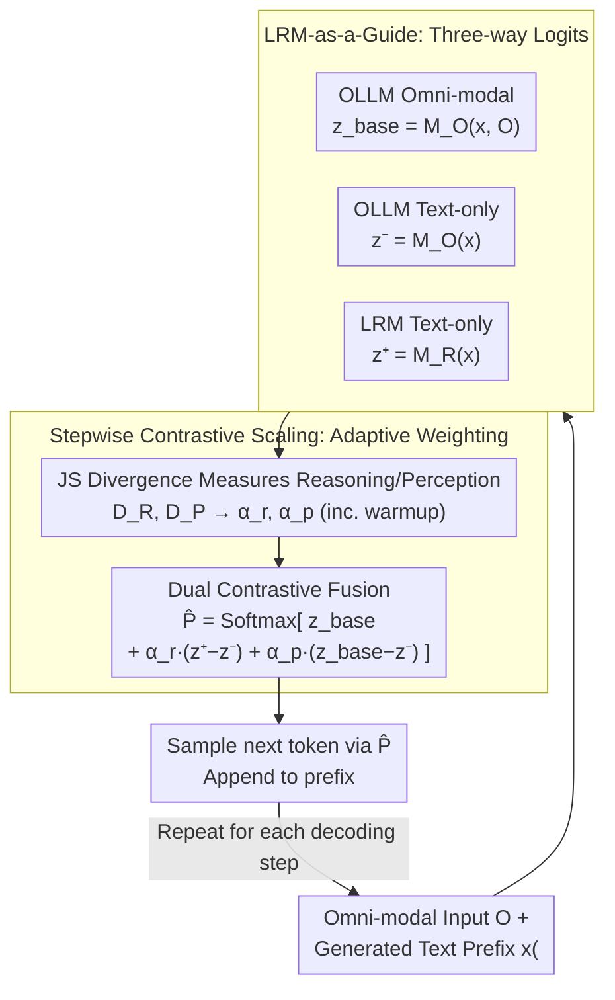

# ThinkOmni: Lifting Textual Reasoning to Omni-modal Scenarios via Guidance Decoding

**Conference**: ICLR 2026  
**arXiv**: [2602.23306](https://arxiv.org/abs/2602.23306)  
**Code**: [https://1ranguan.github.io/thinkomni](https://1ranguan.github.io/thinkomni)  
**Area**: Multi-modal VLM  
**Keywords**: Omni-modal Reasoning, Guidance Decoding, LRM, Training-free, Contrastive Scaling

## TL;DR
The ThinkOmni training-free framework is proposed, which utilizes Large Reasoning Models (LRM) to guide Omni-modal LLMs (OLLM) during decoding. By employing Stepwise Contrastive Scaling to adaptively balance perception and reasoning signals, it achieves 70.2% on MathVista and 75.5% on MMAU, matching or surpassing reinforcement fine-tuning (RFT) methods.

## Background & Motivation

**Background**: Large Reasoning Models (LRM) such as DeepSeek-R1 and o1 demonstrate exceptional performance in textual reasoning tasks but only process text inputs. Omni-modal LLMs (OLLM) like Qwen2.5-Omni can handle text, audio, images, and video, yet they still fall short in complex reasoning tasks.

**Limitations of Prior Work**: Existing paths to enhance OLLM reasoning capabilities face multiple challenges:
   - **Data Scarcity**: SFT requires large volumes of high-quality multi-modal reasoning samples, which are costly to acquire.
   - **Expensive Training**: RFT (Reinforcement Fine-Tuning) requires significant GPU resources (e.g., 8×40G for 7B models, 16×80G for 32B models).
   - **Task Specialization**: Current enhancement schemes (e.g., Omni-R1, HumanOmniV2) are limited to specific downstream tasks and lack generalization.
   - **Modality Limitation**: Most works focus on a single modality (image or audio) and do not achieve true cross-modal reasoning.

**Key Challenge**: LRMs possess strong reasoning capabilities but cannot process non-text inputs; OLLMs can process multi-modal inputs but have insufficient reasoning capabilities. Their strengths are complementary, but fusing them at inference time without training remains a critical challenge.

**Goal**: To "lift" the textual reasoning capabilities of LRMs to omni-modal scenarios without relying on additional training data or fine-tuning.

**Key Insight**: Approaching the problem via inference-time guidance decoding, using the LRM as a "consultant" for the OLLM during decoding to fuse signals from both at the logits level.

**Core Idea**: Use pure-text reasoning signals generated by the LRM to guide the omni-modal decoding of the OLLM at the logits layer, adaptively regulating the perception-reasoning balance via Stepwise Contrastive Scaling.

## Method

### Overall Architecture
ThinkOmni treats a pure-text Large Reasoning Model (LRM) $M_R$ as a decoding-time "consultant" for an Omni-modal Model (OLLM) $M_O$. For every token generated, the OLLM's omni-modal perception signals and the LRM's textual reasoning signals are fused at the logits layer into an enhanced distribution. The next token is sampled based on this distribution and appended to the prefix. This process involves no parameter updates and relies on two components: **LRM-as-a-Guide**, which "grafts" the reasoning model's textual reasoning increments into omni-modal decoding, and **Stepwise Contrastive Scaling**, which automatically determines the weight of perception versus reasoning at each step, allowing adaptation to various tasks like mathematics or audio without manual parameter tuning.

### Key Designs

**1. LRM-as-a-Guide: Enabling Reasoning Signals from Vision-Blind Models**

The difficulty lies in how a model that cannot perceive multi-modal inputs can guide multi-modal decoding. ThinkOmni extracts three sets of logits at each step: the OLLM base term $z^{base}=M_O(x_{<t},O)$ with multi-modal input, the OLLM negative term $z^{-}=M_O(x_{<t})$ without multi-modal input, and the LRM positive term $z^{+}=M_R(x_{<t})$ based only on the textual prefix. The initial fusion follows $\hat{P}=\mathrm{Softmax}[z^{base}+\alpha\cdot(z^{+}-z^{-})]$. The contrastive term $z^{+}-z^{-}$ acts like a differential amplifier, magnifying the LRM's reasoning preference relative to the OLLM's pure-text mode while canceling shared linguistic noise. Although the LRM does not see the original images/audio, it provides effective guidance as the generated text prefix implicitly contains multi-modal information written by the OLLM.

**2. Stepwise Contrastive Scaling: Adaptive Weighting by Task and Decoding Step**

A fixed guidance weight $\alpha$ cannot adapt to all scenarios—math problems require stronger reasoning, while audio tasks require stronger perception. If $\alpha$ is too large, the lack of multi-modal content in $z^{+}/z^{-}$ induces hallucinations; if too small, guidance is weakened. ThinkOmni online measures the relative contributions using Jensen-Shannon divergence: reasoning term $D_R=\mathrm{JS}(P_R\,\|\,P)$ and perception term $D_P=\mathrm{JS}(P_O\,\|\,P)$, where $P_O, P_R, P$ are the softmax distributions of $M_O(x_{<t},O)$, $M_R(x_{<t})$, and $M_O(x_{<t})$. The distribution with the larger deviation is deemed more trustworthy at that moment. The single contrastive item is expanded into two independent signals:

$$\hat{P}=\mathrm{Softmax}\big[M_O(x_{<t},O)+\alpha^{r}_{t}\cdot(M_R(x_{<t})-M_O(x_{<t}))+\alpha^{p}_{t}\cdot(M_O(x_{<t},O)-M_O(x_{<t}))\big]$$

The first term injects reasoning increments controlled by $\alpha^{r}_{t}$; the second is an aggressive visual contrastive decoding term that reinforces perception via "multi-modal input minus no multi-modal input," controlled by $\alpha^{p}_{t}$. Weights are allocated based on $D_R, D_P$ and normalized such that $\alpha^{r}_{t}+\alpha^{p}_{t}=1$. Furthermore, a warmup phase for $\alpha^{r}_{t}$ suppresses LRM dominance when the prefix is too short.

### Loss & Training
Completely training-free, requiring no extra data or fine-tuning. The sole constraint is that the OLLM and LRM must share the same vocabulary (e.g., both from the Qwen family) for logits alignment. The trade-off is 3× forward passes per decoding step, resulting in roughly 2.88× inference overhead compared to the base model.

## Key Experimental Results

### Main Results

| Model | MathVista | MathVision | MathVerse | MMAU | DailyOmni | OmniBench |
|------|-----------|------------|-----------|------|-----------|-----------|
| GPT-4o | 63.8 | 30.4 | 50.8 | 62.5 | 56.5 | - |
| Gemini-2.0-Flash | 73.1 | 41.3 | 59.3 | 70.5 | 67.8 | - |
| Qwen2.5-Omni-7B | 66.8 | 25.0 | 40.2 | 71.5 | 57.9 | 42.1 |
| +DeepSeek Guide | 68.8(+2.0) | 28.2(+3.2) | 42.0(+1.8) | 73.8(+2.3) | 59.8(+1.9) | 43.2(+1.1) |
| **+Qwen3 Guide** | **70.2(+3.4)** | **32.9(+7.9)** | **45.1(+4.9)** | **75.5(+4.0)** | **59.5(+1.6)** | **43.6(+1.5)** |
| Omni-R1 (RFT) | 64.7 | 25.4 | 39.8 | 70.5 | 59.6 | 43.0 |
| +Qwen3 Guide | **71.3(+6.6)** | **31.5(+6.1)** | **45.2(+5.4)** | **75.4(+4.9)** | 59.8(+0.2) | 43.4(+0.4) |

### Ablation Study - Comparison with other training-free methods (based on Qwen2.5-Omni-7B)

| Method | MathVista | MMAU | OmniBench |
|------|-----------|------|-----------|
| Base Model | 66.8 | 71.5 | 42.1 |
| Average Logits Fusion | 55.0(-11.8) | 55.7(-15.8) | 36.1(-6.0) |
| Caption-then-Answer | 61.0(-5.8) | 59.7(-11.8) | 32.3(-9.8) |
| VCD | 66.5(-0.3) | 72.2(+0.7) | 43.1(+1.0) |
| **ThinkOmni** | **68.8(+2.0)** | **73.8(+2.3)** | **43.2(+1.1)** |

### Key Findings
- Applying ThinkOmni to Omni-R1 (already processed by RFT) still yielded significant gains (MathVista +6.6), indicating the method is complementary to RFT.
- Stronger LRMs (Qwen3 > DeepSeek-R1-Distill) lead to greater improvements, validating that guidance quality determines the magnitude of the gain.
- Improvements are most significant in math/science tasks (MathVision +7.9) and smaller in audio/general tasks, aligning with the LRM's training bias.
- Simple average fusion of logits severely degrades performance (-11.8), highlighting the necessity of contrastive fusion.
- Efficiency: In a 7B+7B configuration, generate latency is 2.88×, while prefill latency is only 1.38× (as the LRM only processes text).

## Highlights & Insights
- **Training-free framework surpasses trained methods**: Based on Qwen2.5-Omni-7B + Qwen3, it matches or exceeds Omni-R1 and HumanOmniV2 across multiple benchmarks without RFT.
- **Elegant and Practical Stepwise Contrastive Scaling**: Automatically estimates reasoning/perception needs via JS divergence, avoiding manual parameter tuning.
- **Plug-and-play + Scalability**: ThinkOmni automatically benefits as stronger LRMs emerge (LRM development is typically faster than multi-modal variants).
- **Rich Qualitative Analysis**: Token-level visualization shows that logical connectors and key terms are primarily guided by the LRM, while content words are contributed by the OLLM.

## Limitations & Future Work
- Requires OLLM and LRM to share a vocabulary, limiting flexibility in model combinations (e.g., LLaMA-based LRMs cannot guide Qwen-based OLLMs).
- 3× forward passes per step result in ~2.88× overhead, challenging for latency-sensitive deployment.
- Limited improvement on audio and general omni-modal tasks (DailyOmni only +1.6), indicating less help for perception-intensive tasks.
- LRMs may provide incorrect guidance if multi-modal inputs contain contradictory information (e.g., a label contradicting visual content).

## Related Work & Insights
- Key difference from ProxyTuning: ThinkOmni achieves cross-modal guidance where the LRM does not need to perceive multi-modal inputs.
- Complementary to VCD (Visual Contrastive Decoding): VCD enhances perception while ThinkOmni enhances reasoning.
- Provides a new paradigm for "reasoning capability transfer": grafting capabilities via logit fusion at inference time rather than fine-tuning.

## Rating
- Novelty: ⭐⭐⭐⭐ The cross-modal guidance decoding concept is novel, and Stepwise Contrastive Scaling is elegantly designed.
- Experimental Thoroughness: ⭐⭐⭐⭐⭐ 6 benchmarks, 3 OLLMs, various LRMs, full ablation, and efficiency analysis.
- Writing Quality: ⭐⭐⭐⭐ Clear structure, thorough theoretical analysis, and rich visualization cases.
- Value: ⭐⭐⭐⭐⭐ Surpasses RFT methods without training; high practicality and paradigm innovation offer significant inspiration to the community.

<!-- RELATED:START -->

## Related Papers

- [\[ICML 2026\] Native Active Perception as Reasoning for Omni-Modal Understanding](../../ICML2026/vlm_reasoning/native_active_perception_as_reasoning_for_omni-modal_understanding.md)
- [\[ACL 2026\] OMHBench: Benchmarking Balanced and Grounded Omni-Modal Multi-Hop Reasoning](../../ACL2026/vlm_reasoning/omhbench_benchmarking_balanced_and_grounded_omni-modal_multi-hop_reasoning.md)
- [\[ICLR 2026\] ProxyThinker: Test-Time Guidance Through Small Visual Reasoners](proxythinker_test-time_guidance_through_small_visual_reasoners.md)
- [\[ICLR 2026\] MMReD: A Cross-Modal Benchmark for Dense Context Reasoning](mmred_a_cross-modal_benchmark_for_dense_context_reasoning.md)
- [\[ICLR 2026\] Reasoning-Aligned Perception Decoupling for Scalable Multi-modal Reasoning](reasoning-aligned_perception_decoupling_for_scalable_multi-modal_reasoning.md)

<!-- RELATED:END -->
