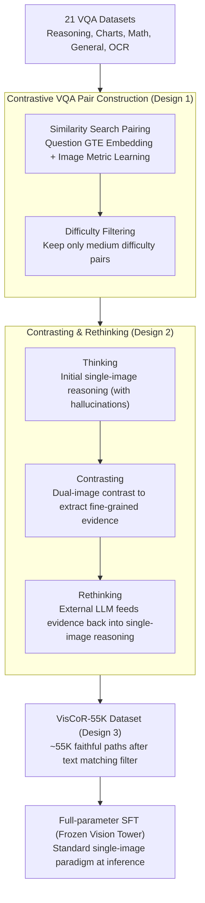

# Through the Lens of Contrast: Self-Improving Visual Reasoning in VLMs

**Conference**: ICLR 2026 Oral  
**arXiv**: [2603.02556](https://arxiv.org/abs/2603.02556)  
**Code**: [https://github.com/zhiyupan42/VC-STaR](https://github.com/zhiyupan42/VC-STaR)  
**Area**: Multimodal VLM / Visual Reasoning  
**Keywords**: visual reasoning, self-improving, visual contrast, hallucination mitigation, contrastive VQA pairs

## TL;DR
The authors propose VC-STaR (Visual Contrastive Self-Taught Reasoner). Based on the observation that "VLMs see more accurately when contrasting two similar images," they design a contrastive self-improving framework: by constructing contrastive VQA pairs, the model generates more faithful visual analysis during comparison. An LLM then integrates this contrastive analysis into the reasoning path to produce the high-quality visual reasoning dataset VisCoR-55K. After fine-tuning, performance improves by 5.7% on MMVP and 3.2% on Hallusion.

## Background & Motivation

**Background**: Visual Language Models (VLMs), as extensions of Large Language Models, have demonstrated strong multimodal reasoning capabilities. In the text-only domain, self-improvement methods (e.g., STaR, Self-Refine) have proven to be effective and scalable paradigms for reasoning enhancement by having models improve their own reasoning paths to obtain high-quality training data.

**Limitations of Prior Work**: Directly migrating text-based self-improvement methods to VLMs faces a fundamental challenge: visual hallucination. Reasoning paths generated by VLMs often contain hallucinations (describing non-existent content or misinterpreting visual information). Existing text-centric self-improvement frameworks focus only on textual coherence and final answer correctness, failing to verify or correct visual hallucinations in the reasoning process. Worse, these methods can fall into "speculative reasoning"—letting text priors override actual visual evidence.

**Key Challenge**: Self-improvement requires high-quality reasoning paths as training data, but the reasoning paths generated by the VLMs themselves are contaminated by visual hallucinations, creating a "garbage in, garbage out" vicious cycle. The core problem is: how to correct visual hallucinations in VLM reasoning paths to enable high-quality visual reasoning data generation?

**Goal**: (1) Design a reliable visual hallucination correction mechanism to make VLM self-improvement possible; (2) Build a large-scale, high-quality visual reasoning dataset; (3) Significantly enhance VLM visual reasoning capabilities through fine-tuning.

**Key Insight**: The authors discovered an interesting phenomenon—*VLMs see more accurately when contrasting*. When presented with a pair of contrastive VQA samples (two visually similar images with different answers + semantically similar questions), VLMs can more precisely capture fine-grained visual cues, thereby correcting original hallucinations. Statistical analysis shows that the contrastive setting not only corrects more errors but also avoids introducing new ones.

**Core Idea**: Leverage the inherent contrastive capability of VLMs to correct visual hallucinations in their own reasoning paths, achieving self-bootstrapped improvement in visual reasoning.

## Method

### Overall Architecture
The goal of VC-STaR is to generate a batch of "hallucination-free" reasoning paths to fine-tune the VLM. The difficulty lies in the fact that VLM-generated reasoning is inherently hallucinated and cannot be used directly as training data. The breakthrough is the key observation—while a VLM might misinterpret a single image, it identifies details more accurately when presented with two similar images for comparison. Thus, the entire pipeline revolves around "contrast": first, each VQA sample is paired with a visually similar contrastive sample with semantically close questions (Contrastive VQA Pair Construction). Then, the model follows a three-step process: "Single-image Reasoning → Dual-image Contrasting → Rewriting Single-image Reasoning with Contrastive Conclusions." This feeds fine-grained visual evidence found during comparison back into the single-image reasoning path. All rewritten paths form the VisCoR-55K dataset for supervised fine-tuning. Note that contrast only occurs during the data construction phase; **during inference, the model reverts to the standard single-image VLM paradigm without needing any contrastive samples**.

### Key Designs

**1. Contrastive VQA Pair Construction: Providing a control group to "force the model's eyes open"**

Directly letting a VLM improve itself gets stuck on hallucinations, which are most easily exposed when there is a control. The first step is to select appropriate contrastive samples for each sample. The authors collected samples from 21 VQA datasets covering reasoning, charts, math, general, and OCR to ensure diversity. They used GTE text embeddings for question similarity and an ID-based visual metric learning model for image similarity. A sample $j$ is selected as a contrastive sample for sample $i$ when the cosine distances simultaneously satisfy $\gamma(e_i^v, e_j^v) < \phi_v$ and $\gamma(e_i^q, e_j^q) < \phi_q$. This filtering ensures that contrastive pairs satisfy three attributes: semantically similar questions (providing a semantic anchor), visually similar but non-trivial images (forcing fine-grained discrimination), and questions requiring reasoning (rather than simple factoid retrieval).

After finding pairs, they filter by difficulty. Samples are categorized as easy (VLM gets it right directly), medium (initial error but corrected under contrast+prompt), and hard (not even contrast can save it). **Only medium difficulty samples are kept**. This two-sided trimming is deliberate: easy samples don't require reasoning and might teach the model "overthinking"; hard samples cannot be corrected reliably, and their path quality is not guaranteed. Only the medium difficulty category generates valuable reasoning signals and can be reliably corrected by the contrastive mechanism.

**2. Contrasting & Rethinking: Feeding dual-image visual evidence back into single-image reasoning**

With medium-difficulty pairs ready, this step rewrites a hallucinated reasoning path into a faithful version via three stages. **Thinking**: Given the target sample $(v_i, q_i, a_i)$ and using the correct answer as a prompt, the VLM generates an initial reasoning path $r_i = f(v_i, q_i, a_i \mid \theta, \delta^t)$, which may contain hallucinations. **Contrasting**: The VLM views both target and contrastive samples $(\hat{v_i}, \hat{q_i}, \hat{a_i})$ and outputs a contrastive analysis $c_i$. If the answers are the same, it summarizes common patterns; if different, it analyzes fine-grained differences, which is where the model "sees more accurately." **Rethinking**: An external LLM $\psi$ (Qwen2.5-72B) uses the contrastive analysis $c_i$ to correct the initial reasoning $r_i$, resulting in a more faithful $\tilde{r_i} = f(r_i, c_i \mid \psi, \delta^r)$. Finally, paths where the answer remains incorrect are filtered out using text matching.

For example: If the target image has a cat sitting on a keyboard, the VLM might hallucinate that "the cat is typing" during the Thinking stage due to text priors. In the Contrasting stage, when paired with a similar image of a "dog lying next to a keyboard," the model is forced to distinguish differences and notices that the cat is just sitting there without its paws on the keys. Rethinking then uses this contrastive observation to rewrite "typing" as "sitting on the keyboard." An external LLM performs the final step because the fine-grained visual evidence extracted from dual images needs to be translated back into a reasoning path that **describes only the single image**—allowing the fine-tuned model to inherit this precision during inference even with only one image.

**3. VisCoR-55K Dataset Construction: Aggregating rewritten paths into a trainable corpus**

After running the above three steps on all medium-difficulty contrastive pairs and filtering via text matching, approximately 55K high-quality visual reasoning samples were obtained. These cover five major domains: general VQA, reasoning, math, charts/graphs, and OCR. Multi-domain data ensures generalization, while quality filtering ensures reliable training signals. The dataset is used for full-parameter SFT via the LLaMA-factory framework for 3 epochs, with a learning rate of $1e-5$, batch size of 256, and frozen vision tower parameters to maximize the language side's absorption of reasoning knowledge.

### Loss & Training
The standard Supervised Fine-Tuning (SFT) loss is employed. Training is conducted on VisCoR-55K for 3 epochs with a learning rate of $1e-5$ and batch size of 256, with the vision tower frozen. Inference does not follow the contrastive process and adheres to the standard VLM single-image reasoning paradigm.

## Key Experimental Results

### Main Results

The base model is Qwen2.5VL-7B, compared against self-improvement baselines and models trained on off-the-shelf visual reasoning datasets:

| Method | MMVP | Hallusion | MathVista | MathVision | MMStar | MME-RW | Avg. |
|------|------|-----------|-----------|------------|--------|--------|------|
| Base Model | 70.0 | 53.1 | 68.4 | 24.0 | 61.8 | 55.9 | 55.5 |
| STaR (Self-Improv) | 73.0(+3.0) | 55.9(+2.8) | 66.9(-1.5) | 19.8(-4.2) | 58.9(-2.9) | 58.1(+2.2) | 55.4 |
| Feedback (Self-Improv) | 75.0(+5.0) | 53.4(+0.3) | 68.8(+0.4) | 22.1(-1.9) | 63.2(+1.4) | 56.0(+0.1) | 56.4 |
| LLaVA-CoT (Dataset) | 71.7(+1.7) | 50.3(-2.8) | 68.4(+0.0) | 24.4(+0.4) | 63.1(+1.3) | 59.3(+3.4) | 56.2 |
| R1-Onevision (Dataset) | 68.0(-2.0) | 55.8(+2.7) | 68.2(-0.2) | 25.4(+1.4) | 53.2(-8.6) | 46.3(-9.6) | 52.8 |
| LPT (Dataset) | 74.0(+4.0) | 53.4(+0.3) | 69.2(+0.8) | 24.2(+0.2) | 64.3(+2.5) | 56.1(+0.2) | 56.9 |
| **VC-STaR (Ours)** | **75.7(+5.7)** | **56.3(+3.2)** | **69.7(+1.3)** | **25.3(+1.3)** | 62.4(+0.6) | **59.3(+3.4)** | **58.1** |

### Ablation Study

| Configuration | Key Metric | Description |
|---------|---------|------|
| Positive Pairs Only (Same Ans) | GQA Total: 50.6(+5.2) | Positive contrast is effective but insufficient |
| Negative Pairs Only (Diff Ans) | GQA Total: 53.7(+8.3) | Negative contrast is more effective |
| Pos + Neg Pairs | GQA Total: **54.7(+9.3)** | Complementary; combination is optimal |
| +20K Simple Samples | Hallusion: 52.2(-4.1) | Simple samples are harmful (overthinking) |
| +40K Simple Samples | Hallusion: 55.7(-0.6), MMStar: 59.5(-2.9) | More simple samples lead to more decay |
| Qwen2.5VL-33B + VC-STaR | Hallusion: 53.2(+6.3), MathVision: 21.9(+3.5) | Larger models also benefit |
| InternVL2.5-8B + VC-STaR | Hallusion: 55.4(+7.2), MathVision: 23.4(+2.1) | Cross-model generalization |

### Key Findings
- **VC-STaR is the only method with positive gains across all benchmarks**: While other self-improvement methods (STaR, Feedback) improve hallucination benchmarks at the cost of math abilities, VC-STaR improves across hallucination, math, and general benchmarks, with an average gain of 2.6%.
- **Pure-text reasoning paths are ineffective**: Using Virgo's pure-text reasoning paths for fine-tuning leads to severe degradation (MME-RW -26.5%), proving that the visual modality is indispensable in visual reasoning.
- **Negative contrastive samples are more effective than positive ones**: Negative pairs (different answers) improved GQA by 8.3%, significantly higher than the 5.2% from positive pairs, as differing answers generate stronger semantic contrast.
- **Simple samples are harmful**: Including simple samples leads to performance drops, likely because simple questions do not require deep reasoning, causing the model to learn undesirable "overthinking" patterns.
- **Model-Agnosticism**: The method is equally effective on Qwen2.5VL-33B and InternVL2.5-8B, with Hallusion gains of 6.3% and 7.2%, respectively.

## Highlights & Insights
- **The insight that "contrast makes VLMs see more accurately" is very clever**: This discovery reveals an overlooked capability of VLMs—while they hallucinate when viewing one image, they perform precise visual perception when comparing two. This essentially uses the model's comparative reasoning to correct its direct reasoning flaws.
- **The three-step pipeline is tightly coupled**: The Thinking → Contrasting → Rethinking design ensures that fine-grained visual information obtained from contrast is elegantly transformed into single-image reasoning capabilities—inference requires no contrast, yet reasoning quality is boosted by it.
- **Philosophy of Difficulty Sampling**: The strategy of selecting only "medium difficulty" samples is instructive—easy ones aren't worth the reasoning time (overthinking), and hard ones cannot be rescued by contrast (uncontrolled quality). The "just right" difficulty produces the most valuable training signals.

## Limitations & Future Work
- **High computational cost for pair construction**: Requires computing embeddings and searching for contrastive samples across large datasets; the data construction pipeline is not lightweight.
- **Rethinking depends on external LLM**: Using Qwen2.5-72B for reasoning correction increases resource requirements and dependency.
- **Comprehensive evaluation limited to 7B-class models**: While preliminary validation was done on 33B and 8B models, it did not cover larger scales or more diverse model types.
- **Potential domain bias in VisCoR-55K**: Dataset composition might be biased toward certain task types, affecting generalization.
- Future work could explore online self-improvement without explicit contrastive pairs or more efficient construction processes.

## Related Work & Insights
- **vs. STaR**: STaR regenerates paths via answer prompts but cannot fix visual hallucinations. VC-STaR's contrastive mechanism directly addresses hallucinations, outperforming STaR on Hallusion (3.2% vs. 2.8%).
- **vs. LLaVA-CoT**: LLaVA-CoT uses GPT-4o to fill manual templates, but template-based methods struggle to generalize. VC-STaR does not rely on manual templates and automatically generates more diverse reasoning paths via contrast.
- **vs. R1-Onevision**: R1-OV generates reasoning paths based on image descriptions via DeepSeek-R1, but text descriptions lose visual information. VC-STaR's "vision-native" approach operates directly on images, preserving full visual information.

## Rating
- Novelty: ⭐⭐⭐⭐⭐ The insight is novel, and the contrastive self-improvement paradigm opens new directions.
- Experimental Thoroughness: ⭐⭐⭐⭐⭐ 6 benchmarks cover hallucination/math/general abilities; ablation studies are comprehensive.
- Writing Quality: ⭐⭐⭐⭐ Clear structure and good diagrams, though some technical details are dense.
- Value: ⭐⭐⭐⭐⭐ Proposes an effective self-improvement paradigm for visual reasoning; both dataset and method are highly impactful.

<!-- RELATED:START -->

## Related Papers

- [\[ICLR 2026\] SpinBench: Perspective and Rotation as a Lens on Spatial Reasoning in VLMs](spinbench_perspective_and_rotation_as_a_lens_on_spatial_reasoning_in_vlms.md)
- [\[ICML 2026\] Learn to Think: Improving Multimodal Reasoning through Vision-Aware Self-Improvement Training](../../ICML2026/vlm_reasoning/learn_to_think_improving_multimodal_reasoning_through_vision-aware_self-improvem.md)
- [\[ICLR 2026\] ProxyThinker: Test-Time Guidance Through Small Visual Reasoners](proxythinker_test-time_guidance_through_small_visual_reasoners.md)
- [\[CVPR 2026\] Consensus Entropy: Harnessing Multi-VLM Agreement for Self-Verifying and Self-Improving OCR](../../CVPR2026/vlm_reasoning/consensus_entropy_harnessing_multi-vlm_agreement_for_self-verifying_and_self-imp.md)
- [\[CVPR 2026\] VisRes Bench: On Evaluating the Visual Reasoning Capabilities of VLMs](../../CVPR2026/vlm_reasoning/visres_bench_on_evaluating_the_visual_reasoning_capabilities_of_vlms.md)

<!-- RELATED:END -->
