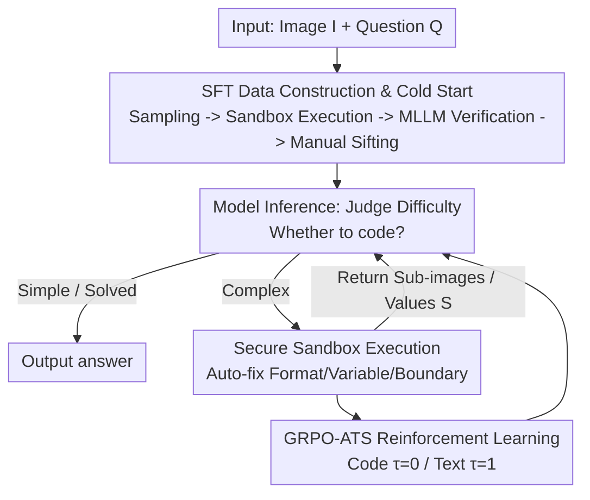

# Thyme: Think Beyond Images

**Conference**: ICLR 2026  
**OpenReview**: [https://openreview.net/forum?id=gCWLkqK45O](https://openreview.net/forum?id=gCWLkqK45O)  
**Area**: Multimodal VLM / LLM Reasoning  
**Keywords**: Visual Thinking, Code Execution, Image Manipulation, Reinforcement Learning, Adaptive Temperature Sampling  

## TL;DR
Thyme enables Multimodal Large Language Models (MLLMs) to autonomously **generate and execute code** during reasoning for image operations (e.g., cropping, rotation, contrast enhancement) and mathematical calculations. This capability is activated through a two-stage training process: a "500k SFT cold start" followed by "GRPO-ATS reinforcement learning," consistently outperforming Qwen2.5-VL baselines across nearly 20 benchmarks, particularly in high-resolution perception and complex reasoning.

## Background & Motivation

**Background**: Following OpenAI's proposal of "thinking with images," integrating visual information into the MLLM reasoning process has become a research focus. Existing open-source solutions generally fall into two categories: **thinking with generated images** (generating auxiliary figures like guide lines before reasoning) and **thinking with cropping** (training models to output bounding boxes for key regions, which are then cropped externally and fed back).

**Limitations of Prior Work**: Methods involving image generation are limited by generation quality, struggle to preserve fine-grained details, provide limited help for core perception tasks, and incur high generation overhead and inference latency. Cropping-based methods are overly simplistic, restricted to "output box → crop" workflows; they cannot handle rotation, contrast enhancement, or code-based calculations, lacking the versatility of "unconstrained image manipulation and arithmetic code execution" seen in models like OpenAI o3.

**Key Challenge**: The open-source community lacks a paradigm that is both **feature-rich** (multiple image operations + math) and **highly autonomous** (model decides whether to operate, which operation to use, and parameter values). Inserting "code for image manipulation" directly into training faces two practical hurdles: code is extremely sensitive to sampling randomness (e.g., a single space in a variable name causes execution failure), and the dominance of image manipulation data over math data often causes models to fail in learning arithmetic code.

**Goal**: To enable MLLMs to **autonomously generate executable code on demand** for image manipulation and calculation through low-cost end-to-end training, while ensuring high code executability during the RL stage to prevent the model from regressing to "avoiding code entirely."

**Core Idea**: Upgrade "thinking with images" to "**think beyond images**"—moving beyond simple cropping to allow the model to write arbitrary image processing or mathematical operations as Python code, execute it in a secure sandbox, and use the results for further reasoning. A unique sampling strategy is implemented for code generation (temperature $\tau=0$), reserving exploration for natural language reasoning (temperature $\tau=1$).

## Method

### Overall Architecture

The Thyme runtime consists of two components: the **model** and a **sandbox**. Given an image $I$ and a question $Q$, the model first produces reasoning $T$ and autonomously judges whether code is needed based on task type and difficulty. Simple questions (or those resolved by previous code rounds) lead directly to an `<answer>`. Complex problems trigger a `<code>` block, which can perform multiple operations (cropping, scaling, contrast enhancement) simultaneously, with all parameters (coordinates, ratios, coefficients) determined by the model. The code is sent to an external **secure sandbox**, which executes within strict time limits and uses Python modules like `ast` and `autopep8` for automatic format correction, variable attribute adjustment, and boundary condition handling—**fixing trivial details without altering semantics** to reduce the model's "coding burden." The sandbox returns results $S$ (sub-images or numerical values), and the model proceeds to the next round until a final answer $a$ is produced. A training sample is represented as $X=\{(I,Q);([T_0,C_0,S_0], \dots, [T_t,a])\}$.

Capabilities are acquired through two-stage training: **SFT Cold Start** using ~500k samples teaches the model "how to write code for operations" (activated in ~200 GPU hours), followed by **GRPO-ATS Reinforcement Learning** to refine precision in "when to code and how to code accurately."

### Key Designs

**1. SFT Data Construction & Training: 500k Cold Start Samples via Executability & Consistency Filtering**

The limited functionality of cropping methods stems from training data that only teaches "box output." To enable arbitrary operations, Thyme constructs ~500k high-quality samples covering six scenarios from 4M raw data points: (a) image operations/math without code, (b) cropping for complex/high-res images, (c) large-angle rotation correction, (d) low-contrast enhancement, (e) complex operations requiring code aid, and (f) multi-round interactions (e.g., iterative zooming). The pipeline follows "Sampling → Functional Prompting → MLLM Thought/Code Generation → Sandbox Execution Filtering → MLLM Consistency Verification → Manual Review," ensuring clean cold-start data.

Training addresses several practical pitfalls. First, to handle cases where models correct initial errors in later rounds, **Train on the Last Round Only** is used: for multi-round samples, all content before the final `<sandbox_output>` is masked. Second, **Sandbox Content Exclusion** is applied: all $S_{i=1\dots t}$ and `<sandbox_output>` tokens are masked during all training phases to prevent the model from "memorizing" sandbox outputs. Third, to address data imbalance, **Math Data Annealing** is employed: the model is first trained on image data, then annealed on math data with a lower learning rate (using joint learning across all rounds for math).

**2. RL Data Construction: 30k Hand-annotated Ultra-High-Res Difficult Images**

Public datasets often have low resolution and perceptual complexity, which fails to trigger Thyme's "zoom-in" capabilities during RL. Authors filtered perceptual+reasoning data from sources like V*, arXivQA, and ThinkLite-VL, and **manually collected 30k high-resolution images** (exceeding 2048px). A team of 15 annotators designed questions targeting **small, illegible objects (≤5% of image area)**, forcing the model to learn image manipulation to successfully answer.

**3. GRPO-ATS: Heterogeneous Sampling Temperatures for Code and Text**

The core RL innovation, GRPO-ATS (Group Relative Policy Optimization with Adaptive Temperature Sampling), addresses code's sensitivity to sampling noise. Small perturbations often lead to execution failure, whereas text reasoning benefits from higher temperatures for exploration. GRPO-ATS is a **context-aware temperature switch**: it fixes $\tau=0$ within `<code>` blocks for determinism and uses $\tau=1$ for text segments. This yields two benefits: **improved sample efficiency** by rescuing rollouts that would otherwise fail due to malformed code, and **prevention of model collapse** into a state of "code avoidance" caused by low success rates.

The underlying RL uses the on-policy GRPO algorithm: for each $(I,Q)$, a group of trajectories $\{\tau_1,\dots,\tau_G\}$ is sampled, and the policy is updated via:

$$J_{\text{GRPO}}(\theta)=\mathbb{E}\!\left[\frac{1}{\sum_i|\tau_i|}\sum_{i=1}^{G}\sum_{j=1}^{|\tau_i|}\big(A_{i,j}-\beta D_{\text{KL}}[\pi_\theta\|\pi_{\text{ref}}]\big)\right]$$

where advantages $A_{i,j}$ are normalized within the group. Trajectory length $|\tau_i|$ and token sums **exclude sandbox content** $S_{i,k}$.

**4. Secure Sandbox & Reward Design: Reducing Code Burden and Preventing "Cheating" via Multiplicative Rewards**

The sandbox serves as an active buffer, automatically fixing formats and variable attributes within strict limits to reduce the model's coding overhead. It includes an **early-stopping mechanism** using Rabin-Karp rolling hashes to detect repetitive outputs ("looping").

Rewards consist of three parts: **Formatting Reward**, **Result Reward** (rule-based followed by Qwen-2.5-VL-72B semantic verification), and **Consistency Reward**. To prevent the model from prioritizing internal consistency over correctness, a multiplicative gating design is used:

$$r = \text{Result}\times\big(1+0.5\times\text{Consistency}\big)+0.5\times\text{Formatting}$$

This ensures the consistency reward only triggers if the **Result is correct** (non-zero), preventing "consistent but wrong" behavior.

## Key Experimental Results

### Main Results

Thyme-7B consistently outperforms the Qwen2.5-VL-7B baseline across ~20 benchmarks and even beats the 32B version in perception tasks. This demonstrates that "test-time image manipulation via code" is more effective than simple parameter scaling for perception. Results on MME-Realworld:

| Task (MME-Realworld) | Metric | Qwen2.5-VL-7B | Thyme-VL-7B | Gain |
|--------|------|------|------|------|
| Perception-Monitoring | Acc | 38.75 | 49.27 | +27.14% |
| Perception-Autonomous Driving | Acc | 22.70 | 37.46 | +64.99% |
| Perception-Remote Sensing | Acc | 45.40 | 53.93 | +18.80% |
| Perception-Overall | Acc | 60.94 | 67.10 | +10.10% |
| Reasoning-Monitoring | Acc | 26.10 | 47.39 | +81.57% |
| Reasoning-Autonomous Driving | Acc | 24.25 | 32.29 | +33.16% |
| Reasoning-Overall | Acc | 38.59 | 48.38 | +25.37% |

Ours shows gains of >25% in challenging perception tasks (Monitoring, Auto-driving) where baselines are weak, while improvements on saturated tasks (OCR, Tables) are more modest.

### Ablation Study

| Configuration | Conclusion |
|------|------|
| SFT Strategy | Masking sandbox content, learning last round, and math annealing are all effective. |
| RL Reward | Consistency reward using multiplicative gating provides the largest benefit. |
| vs Deepeyes-7B | Significantly outperforms concurrent RL-based "thinking with images" work. |

### Key Findings
- **Hard tasks are the primary arena**: Improvements are concentrated in high-res perception (monitoring/driving) where details are initially illegible.
- **Code temperature must be 0**: Without this, the model fails to produce valid code rollouts and eventually stops attempting code-based reasoning.
- **Math requires separate annealing**: Due to data imbalance, math-specific code is only successfully learned through targeted fine-tuning.
- **Consistency rewards must be gated**: Simple additive rewards allow the model to gain points for being consistent even when wrong.

## Highlights & Insights
- **Code as a First-Class Visual Interface**: Unlike bounding box methods, Thyme treats executable code as a unified interface for cropping, rotating, scaling, and calculating, approaching the flexibility of closed-source systems like O3.
- **Portability of GRPO-ATS**: The "divide-and-conquer sampling" (switching temperature by token type) is a zero-parameter trick applicable to any RL task requiring both structured output (code/JSON) and creative text.
- **Sandbox Error Mitigation**: Automating format and boundary fixes acts as a "safety net," lowering the barrier for the model to use tools successfully.
- **Multiplicative Reward Gating**: A clever design in reward engineering that ensures auxiliary objectives do not overshadow the primary task of correctness.

## Limitations & Future Work
- **Dependency on Base Model**: Performance is capped by the base model's inherent localization and coding abilities.
- **Evaluation Gaps**: Current benchmarks lack specific tests for advanced operations like rotation correction or contrast enhancement.
- **Overhead**: The training pipeline is heavy (500k SFT samples + 30k manual annotations). Multi-round interaction during inference also increases latency compared to single-pass models.

## Related Work & Insights
- **vs Thinking with Generated Images**: Thyme maintains higher fidelity by operating on the original pixels rather than error-prone generated auxiliaries.
- **vs Thinking with Cropping**: Thyme expands the limited "crop-only" paradigm to a versatile toolset (rotation, contrast, math) via code.
- **vs DeepEyes / Direct RL**: Thyme achieves superior performance through GRPO-ATS and specialized high-difficulty annotated data.

## Rating
- Novelty: ⭐⭐⭐⭐ (Expands visual thinking to arbitrary code-driven operations; GRPO-ATS is a practical RL innovation.)
- Experimental Thoroughness: ⭐⭐⭐⭐ (Extensive benchmarks, but core ablations are partially relegated to the appendix.)
- Writing Quality: ⭐⭐⭐⭐ (Clear motivation and detailed explanation of training challenges.)
- Value: ⭐⭐⭐⭐ (Provides a feature-rich paradigm for code-driven visual reasoning.)

<!-- RELATED:START -->

## Related Papers

- [\[ICLR 2026\] VTool-R1: VLMs Learn to Think with Images via Reinforcement Learning on Multimodal Tool Use](vtool-r1_vlms_learn_to_think_with_images_via_reinforcement_learning_on_multimoda.md)
- [\[ICLR 2026\] DeepEyes: Incentivizing "Thinking with Images" via Reinforcement Learning](deepeyes_incentivizing_thinking_with_images_via_reinforcement_learning.md)
- [\[ICLR 2026\] Medical Thinking with Multiple Images](medical_thinking_with_multiple_images.md)
- [\[ICLR 2026\] GIR-Bench: Versatile Benchmark for Generating Images with Reasoning](gir-bench_versatile_benchmark_for_generating_images_with_reasoning.md)
- [\[CVPR 2026\] Fast Reasoning Segmentation for Images and Videos](../../CVPR2026/vlm_reasoning/fast_reasoning_segmentation_for_images_and_videos.md)

<!-- RELATED:END -->
