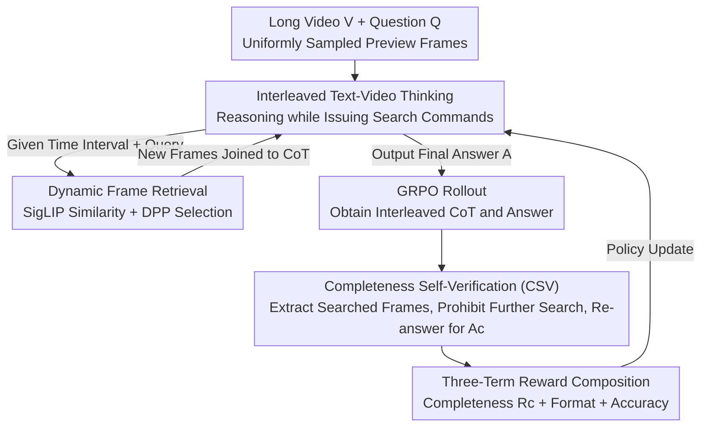

# TimeSearch-R: Adaptive Temporal Search for Long-Form Video Understanding via Self-Verification Reinforcement Learning

**Conference**: ICLR 2026  
**OpenReview**: [https://openreview.net/forum?id=gqb1hvuGcj](https://openreview.net/forum?id=gqb1hvuGcj)  
**Code**: https://github.com/Time-Search/TimeSearch-R  
**Area**: Multimodal VLM / Video Understanding / LLM Reasoning  
**Keywords**: Temporal Search, Long Video Understanding, Reinforcement Learning, Self-Verification, Interleaved Text-Video Reasoning

## TL;DR
TimeSearch-R reformulates "temporal search" in long videos as a multi-turn reasoning process where text reasoning and video retrieval are interleaved. It utilizes GRPO with "Completeness Self-Verification" (GRPO-CSV) for reinforcement learning, enabling the model to autonomously learn which frames to inspect and when search is sufficient. It consistently outperforms hand-crafted search workflows and pure text-based reasoning models across temporal search, long video understanding, and complex video reasoning benchmarks.

## Background & Motivation

**Background**: Understanding long videos requires identifying a few relevant keyframes from tens of thousands of frames, a task known as "temporal search." This is fundamental for accurate long video question answering (QA). Current mainstream Large Video Language Models (LVLMs) either use static uniform sampling or "agent workflows" (e.g., VideoAgent, T*)—where an LLM extracts target objects, calls CLIP for retrieval or YOLO for detection, generates frame descriptions, and finally feeds retrieved frames to a model for answering.

**Limitations of Prior Work**: These agent-based search processes are **hand-crafted workflows**. The sequence of tool calls and retrieval strategies are heuristic rules defined by engineers without end-to-end optimization, leading to suboptimal search strategies. Crucially, visible frames are fixed before reasoning begins. Humans understand long videos by "scanning first, then looking back upon finding clues"; this capability to dynamically adjust attention based on intermediate findings is impossible with static sampling.

**Key Challenge**: Video reasoning is inherently a dynamic process; temporal search should be interleaved with reasoning (searching while thinking). However, existing methods lock the set of visible frames from the start, causing a fundamental conflict that hinders reasoning performance.

**Goal**: To enable models to learn optimal temporal search strategies directly from data rather than relying on human-written rules, while addressing two failure modes exposed when applying reinforcement learning directly to video reasoning.

**Key Insight**: The authors reformulate temporal search as "interleaved text–video thinking." The model outputs textual reasoning while issuing search instructions to fetch new frames, which are then integrated back into the Chain-of-Thought (CoT) for further reasoning. This concept, *Thinking with Videos*, extends *Thinking with Images* to the long video domain. However, direct training with GRPO is problematic: GRPO only rewards the final answer and ignores intermediate search decisions, leading to (1) **insufficient temporal exploration** (model guesses via language bias or partial evidence) and (2) **inconsistent reasoning logic** (intermediate reasoning contradicts the final answer).

**Core Idea**: Use the model itself as a judge. All frames retrieved during reasoning are extracted, and the model is prohibited from further searching. The same policy model must then re-answer the question using only these frames. Whether this "re-answer" is correct serves as a supervision signal for whether the intermediate search was sufficient and the reasoning self-consistent, thus densifying sparse outcome rewards.

## Method

### Overall Architecture
TimeSearch-R aims to let the model learn which parts of a long video to search and when the collected information is sufficient. **At inference time**, the model operates in a loop within an interleaved text-video CoT: it starts with uniformly sampled preview frames, outputs text reasoning, and if it decides to search, provides a time interval and text query. The video environment returns new frames to be appended to the CoT until an answer is reached. **At training time**, GRPO-CSV is employed in two stages (SFT cold start + RL post-training). During the RL stage, a "self-verification rollout" follows the standard GRPO rollout. The model must re-answer solely based on the searched frames to calculate a completeness reward, which is combined with format and accuracy rewards to update the policy.

### Key Designs

**1. Interleaved Text-Video Thinking: Integrating Temporal Search into the Reasoning Chain**

To address the pain point of hand-crafted workflows and fixed frame sets, this work integrates temporal search as an internal action within the reasoning chain. Given video $V$ and question $Q$, a preview $\tilde{V}$ is sampled. At step $k$, the policy model $\pi_\theta$ generates textual reasoning $T_k$. If $T_k$ contains a search command, the environment retrieves segment $V_k$ and appends it to the CoT. The interleaved CoT at step $k$ is $C_k \triangleq \{(T_1,V_1),\dots,(T_k,V_k)\}$, continuing until answer $A$ is reached or the budget is exhausted. The chain is decomposed as:

$$P_\theta(A, C \mid \tilde{V}, Q) = \underbrace{P_\theta(C \mid \tilde{V}, Q)}_{\text{Temporal Search}} \cdot \underbrace{P_\theta(A \mid C, \tilde{V}, Q)}_{\text{Answer Prediction}}$$

Thus, interval $[t_s^k, t_e^k]$ and text query $q_k$ become model outputs, allowing the search strategy to be optimized end-to-end via RL—the fundamental difference from VideoAgent/T*.

**2. Mechanism: Dynamic Frame Retrieval via SigLIP Similarity + DPP**

When a model issues a search command, an efficient interface is needed. A small VLM (e.g., SigLIP) calculates inter-frame similarity and frame-query relevance within $[t_s^k, t_e^k]$. A Deterministic Point Process (DPP) then samples $F$ frames $V_k = \text{search}(V; t_s^k, t_e^k, q_k, F)$. DPP naturally balances "relevance" and "diversity," preventing the selection of redundant near-identical frames and improving search efficiency.

**3. Design Motivation: GRPO-CSV Completeness Self-Verification**

Standard GRPO rewards only the final answer, allowing models to guess based on language bias (under-exploration) or experience reasoning-answer disconnect (logical inconsistency). CSV addresses this: after the GRPO rollout yields CoT $C$ and answer $A$, the retrieved frames $V_c$ are extracted for a "CSV rollout." The model must re-answer as $A_c$ without further searching. We expect $P_\theta(A_c \mid V_c, Q) \approx P_\theta(A \mid C, \tilde{V}, Q)$. The completeness reward is:

$$R_c = \mathbb{1}[\text{Acc}(A, A^*) > 0.5] \cdot \text{Acc}(A_c, A^*)$$

$R_c$ rewards the correctness of $A_c$ only if the original answer $A$ was correct. This supervises whether the retrieved frames provided sufficient evidence and whether the reasoning is self-consistent. Information-theoretically, while outcome rewards maximize $I(A;Q)$, $R_c$ enforces high $I(A;V_c)$, forcing the model to actually explore the video.

**4. Mechanism: Two-Stage Data Filtering + SFT Cold Start**

RL for long videos is challenged by samples solvable via language bias or those unsolvable even with ideal search. A two-stage filter is used: first, removing samples solvable with only 4 uniform frames; second, removing samples unsolvable despite multiple searches. Diverse data from Haystack-Ego4D, VideoMarathon, and CinePile are included. Training involves SFT cold-starting (masking video tokens of returned frames to force the model to learn to output meaningful windows/queries) followed by GRPO-CSV RL.

### Key Experimental Results

### Main Results

In temporal search (Haystack-LVBench / Haystack-Ego4D), with an 8-frame budget, temporal similarity F1 is more than triple that of previous SOTA:

| Method | Base | Temporal F1 | Visual F1 | LVBench QA | Ego4D QA |
|------|------|---------|---------|------------|----------|
| Uniform | GPT-4o (32 frames) | 2.7 | 67.3 | 50.5 | 45.5 |
| VideoAgent | GPT-4 | 2.1 | 64.7 | – | – |
| T* | GPT-4o (32 frames) | 3.1 | 67.8 | 53.1 | 46.5 |
| **Ours** | Qwen2.5-VL-7B (7.8f†) | **8.4** | 69.0 | 52.4 | **53.3** |
| **Ours** | Qwen2.5-VL-7B (30.7f†) | 7.0 | **71.2**| – | – |

In complex video reasoning (Video-Holmes), TimeSearch-R outperforms the Qwen2.5-VL base by ~11.8 points (43.9 vs 32.1 at 768 frames), exceeding GPT-4o (42.0) and Gemini-2.0-Flash-Thinking (43.1).

### Ablation Study

Ablation of GRPO-CSV components (Comp.=Completeness, Cons.=Consistency, Acc.=Accuracy):

| Configuration | Temporal F1 | Comp. | Cons. | Acc. |
|------|---------|-------|-------|------|
| Qwen2.5-VL w/ search | 0.0 | 44.2 | 59.4 | 51.8 |
| + SFT Cold Start | 7.8 | 60.5 | 69.2 | 59.2 |
| + GRPO (Before Collapse) | 7.4 | 57.2 | 69.3 | 65.1 |
| + GRPO-CSV w/o Acc. Reward | 8.2 | 61.2 | 75.3 | 64.8 |
| + GRPO-CSV w/ Acc. Reward | 8.1 | 60.2 | 71.8 | **66.6** |

### Key Findings
- **SFT Unlocks Search**: Zero-shot CoT fails to search (F1=0.0). SFT establishes the search format, raising F1 to 7.8.
- **RL Improves Understanding over Precision**: RL primarily improves reasoning consistency (+2.6%), leading to a QA accuracy jump from 59.2% to 66.6%.
- **CSV Prevents Collapse**: Without CSV, the model learns a shortcut to "guess correctly without searching," causing search calls to drop to zero during training.
- **Strategy Transferability**: Feeding frames searched by TimeSearch-R to GPT-4o yields a VideoMME score of 73.1, proving the model learns a general "what to watch" strategy.

## Highlights & Insights
- **Self-Verification as Supervision**: CSV bypasses the need for expensive frame-level labels by checking if retrieved frames enable re-answering. This "self-verification as intermediate supervision" is applicable to any interleaved retrieval-reasoning task.
- **Conditional Reward Design**: Defining $R_c$ only when the original answer is correct ensures rewards are targeted at promising reasoning paths.
- **Information-Theoretic Perspective**: Outcome rewards maximize $I(A;Q)$, encouraging language shortcuts. CSV enforces high $I(A;V_c)$, grounding the answer in video content.
- **Emergent Search Patterns**: The model spontaneously learns human-like "broad scan → targeted inspection" behaviors through end-to-end learning.

## Limitations & Future Work
- **Dependency on Retrieval Quality**: If the small SigLIP VLM misjudges relevance, the policy model cannot retrieve the correct frames.
- **Computational Cost**: CSV requires an additional rollout per trajectory, doubling RL training costs.
- **Conditional Trigger**: $R_c$ depends on initial correctness, potentially missing valuable search behaviors in trajectories that are almost correct.
- **Low Absolute F1**: A temporal F1 of 8.4 indicates that "precise frame hits" remain challenging; success currently relies on "searching the correct region."

## Related Work & Insights
- **vs VideoAgent/T***: These use hand-crafted heuristic workflows. TimeSearch-R learns the search strategy end-to-end via RL, improving Temporal F1 from ~3.1 to 8.4.
- **vs Video-R1**: Video-R1 performs pure text reasoning on fixed frames. TimeSearch-R allows dynamic frame expansion, proving "thinking while searching" is superior for long videos.
- **vs Thinking with Images**: This work extends the "thinking with images" concept to temporal search in videos, adding CSV to punish under-exploration.

## Rating
- Novelty: ⭐⭐⭐⭐⭐ 
- Experimental Thoroughness: ⭐⭐⭐⭐⭐ 
- Writing Quality: ⭐⭐⭐⭐ 
- Value: ⭐⭐⭐⭐⭐

## Related Papers

- [\[ICLR 2026\] VideoZoomer: Reinforcement-Learned Temporal Focusing for Long Video Reasoning](videozoomer_reinforcement-learned_temporal_focusing_for_long_video_reasoning.md)
- [\[CVPR 2026\] REVISOR: Beyond Textual Reflection, Towards Multimodal Introspective Reasoning in Long-Form Video Understanding](../../CVPR2026/vlm_reasoning/revisor_beyond_textual_reflection_towards_multimodal_introspective_reasoning_in_.md)
- [\[CVPR 2026\] Thinking with Drafts: Speculative Temporal Reasoning for Efficient Long Video Understanding](../../CVPR2026/vlm_reasoning/thinking_with_drafts_speculative_temporal_reasoning_for_efficient_long_video_und.md)
- [\[CVPR 2026\] VideoARM: Agentic Reasoning over Hierarchical Memory for Long-Form Video Understanding](../../CVPR2026/vlm_reasoning/videoarm_agentic_reasoning_over_hierarchical_memory_for_long-form_video_understa.md)
- [\[ICLR 2026\] DeepEyes: Incentivizing "Thinking with Images" via Reinforcement Learning](deepeyes_incentivizing_thinking_with_images_via_reinforcement_learning.md)

<!-- RELATED:END -->

<!-- RELATED:START -->

## Related Papers

- [\[ICLR 2026\] ARES: Multimodal Adaptive Reasoning via Difficulty-Aware Token-Level Entropy Shaping](ares_multimodal_adaptive_reasoning_via_difficulty-aware_token-level_entropy_shap.md)
- [\[ICLR 2026\] Synergizing Understanding and Generation with Interleaved Analyzing-Drafting Thinking](synergizing_understanding_and_generation_with_interleaved_analyzing-drafting_thi.md)
- [\[ICLR 2026\] Play to Generalize: Learning to Reason Through Game Play](play_to_generalize_learning_to_reason_through_game_play.md)
- [\[ICLR 2026\] VideoZoomer: Reinforcement-Learned Temporal Focusing for Long Video Reasoning](videozoomer_reinforcement-learned_temporal_focusing_for_long_video_reasoning.md)
- [\[ICLR 2026\] DeepEyes: Incentivizing "Thinking with Images" via Reinforcement Learning](deepeyes_incentivizing_thinking_with_images_via_reinforcement_learning.md)

<!-- RELATED:END -->
